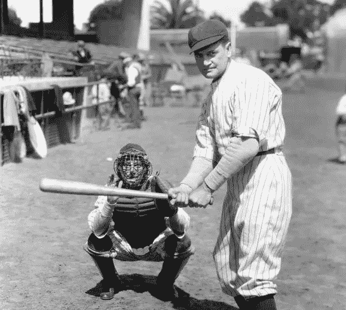
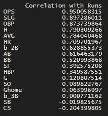
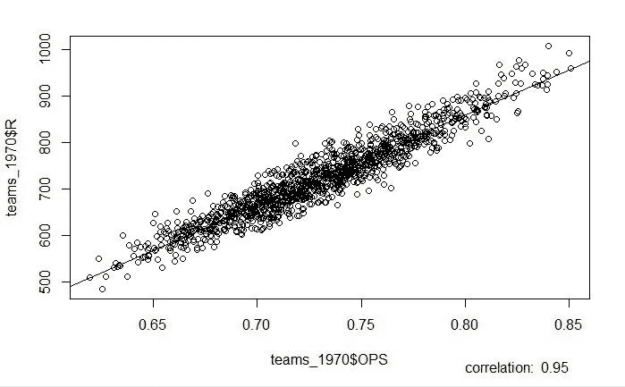
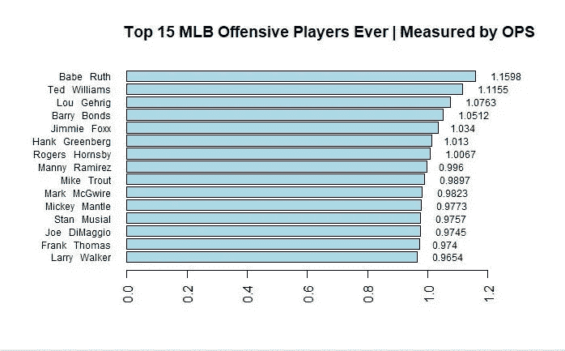
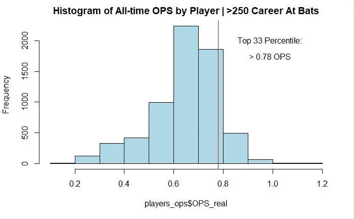

# 棒球迷的统计数据:进攻的唯一指标是 OPS。

> 原文：<https://towardsdatascience.com/stats-for-baseball-fans-the-single-metric-for-offense-is-ops-fc568af5e87b?source=collection_archive---------19----------------------->

## 今年夏天，我爱上了棒球，因为我把我喜欢的东西(统计学)和我不太感兴趣的东西(芝加哥小熊队和箭牌棒球场)结合了起来。)

现在，我如何找到小熊队的故事可以成为自己的博客帖子——它充满了浪漫，从南方搬到亚特兰大勇士队，一份新工作，住在离箭牌球场几步之遥的地方……有一天我会写这本书。

但是…今天的博客是关于用统计数据来证明你只需要关注一个数据就能了解你的球队中最好的进攻球员，从而成为我所能做到的最有见识的球迷。这个数据就是 OPS(上垒率加上击球率。)

TLDR:你最喜欢的球队中 OPS 数据最高的球员很可能是他们整体进攻最好的球员。当他们来到本垒时，大声欢呼。

## 数字，数字，无处不在…

你去过 MLB 棒球场，注意到记分牌是数字的海洋吗？AVG、OBP、SLG、OPS，这些指标在棒球卡上、报纸上和电视分析师那里都有报道。它们有什么意义吗？

事实证明确实如此。每个人都试图测量表面上看起来很重要的击球方面。SLG 是一个用来了解玩家实力的指标；OBP 是一个衡量一个球员有多擅长跑垒的标准。

作为一名分析师和数据科学家，这些指标让我着迷。作为一个只想享受比赛的球迷，他们可能会感到困惑。**当我想了解我支持的球队中最好的击球手时，肯定有一个指标是我应该注意的。**

我喜欢简单的运动——它让啤酒、饼干和热狗味道更好。

现在我意识到有时候很容易理解你最好的击球手。尤其是，当你的球队中有一个像迈克·特劳特这样的强力击球手或者每个人都喜欢的球员——芝加哥小熊队的贾维·贝兹。从粉丝反应就能看出来。这很好，但我如何才能穿过噪音，只关注那些为球队得分的球员呢？

这就是我们求助于统计数据的地方。

## 理解棒球数据的问题是:球员也是人。

用球员的个人表现来理解统计数据的价值有一个很大的问题。不幸的是，球员生病，有孩子，休息几天，被送到小联盟，玩疯了或者只是过了糟糕的一天。

换句话说，玩家也是人。

为了消除我们数据库中讨厌的人类特征，我们做了一点小技巧来消除玩家噪音。**不分析球员，我们来分析球队**。球队不休假，通常一年打 162 场比赛(当我们除去像 1994 年 MLB 罢工这样的离群值时。)平均来说，每支球队都应该有相似的击球次数和均等的得分机会。因为它不太人性化和规范化，所以团队级别的数据是理解棒球统计重要性的门票。

*   *查德威克棒球数据库(见此* [*帖子*](https://www.courtneyperigo.com/post/in-the-works-baseball-stats-project) *了解更多信息)。)*

从球员分析过渡到球队分析使我们的数据正常化；让统计学家更容易完成这个项目。

## 进攻=跑垒。

Dictionary.com 是这样定义棒球的:

> *(棒球)两个九人队之间的一种球类运动，通常在一个场地上打九局，该场地的焦点是一个菱形内场，该内场有一个本垒板和三个相距 90 英尺(27 米)的其他垒，形成一个必须由跑垒者完成才能得分的回路，中心进攻动作包括用木制或金属球棒击打投球并跑垒，* ***获胜者是得分最多的队*** *。*

我们关心跑垒，因为这是进攻球员唯一最重要的目标——打击跑者或通过到达本垒使自己跑起来。该分析需要运行目标函数(y)。分析的目标是找到与跑垒最相关的击球统计数据。我们的假设是，一个球员让自己得一分(r)和一分(rbi)的能力将会是一个强有力的进攻球员的信号。我们如何在单一指标中捕捉到这一点？

## OPS 与跑步最相关。

我们通过计算一些你会发现投射在整个 MLB 体育馆的记分牌上的统计数据来开始这项分析。潜在的指标包括击球率(AVG)、击球率(SLG)、上垒率(OBP)、上垒率加击球率(OPS)以及其他常见的击球指标(AB、H、2B、3B、HR 等)。)

我们不得不从头开始创建一些指标，它们的定义如下所示:

SLG =(安打+双打+(三双*2) +(小时*3)) /在击球时

AVG =击球数

OBP =(安打+保送+投球命中)/(击球+保送+投球命中+牺牲苍蝇)

OPS = OBP + SLG

早些时候，我提到过我们通过使用团队赛季总数而不是个人球员总数来标准化我们的数据。我通过去除一些异常的季节进一步规范化。以下是我的团队剔除异常值的全部细节:

*   **删除 1970 年之前的球队**:1970 年赛季之前没有跟踪几个关键指标(包括牺牲苍蝇、被投球击中和其他)。)
*   **删除了比赛场次低于 156 场的赛季**:这将删除因罢工和其他日程怪事而缩短的赛季。(再见 1994 赛季。)
*   **删除了不参加国家或美国联赛的球队**:我们不关心这个分析中的小联盟或春训联盟。

一旦我们有了干净的数据，我们就可以运行将常见命中指标与运行相关联的分析。分析结果表明，OPS 是唯一最重要的指标，相关系数为 0.95(与运行高度相关。)

## 有史以来最好的玩家(在随机森林的帮助下)

现在我们知道我们应该最关注运营，我想问的下一个问题是，根据这个标准，谁是最好的玩家？答案很容易计算…

事实上，他们不是。

在这篇文章的早些时候，我提到在某些棒球时代，球员的统计数据并没有保持干净。1954 年，形成我们今天看到的牺牲飞统计的规则被创造。在 1954 年之前，MLB 对 SF 有不同的定义或者根本没有跟踪。

那么，我们要如何为 1954 年之前的玩家定义 OPS 呢？

我使用随机森林算法根据 MLB 收集的数据来预测玩家丢失的数据。然后我用预测的数据来估算 1954 年之前玩家的 OPS。我不打算用这个博客来展示随机森林方法，但是我会展示一些输出，这样你就知道是我做的。

**随机森林模型**

我选择的包是 R 图书馆，randomForest。下面是调整后的射频算法和输出预测牺牲苍蝇的球员的统计数据保存:

你会看到随机森林在模拟牺牲苍蝇方面非常有效，92.4%的方差可以用已知的命中变量来解释。我超级自信我的 OPS 对于 1954 年之前的玩家来说是合理的。

**不再赘述，以下是 OPS 评选出的前 15 名史上最伟大球员名单；在我看来是有史以来最伟大的进攻球员。**

根据行动计划，我儿时的偶像弗兰克·托马斯晋级了。迈克·特劳特是前 15 名中唯一活跃的选手；而贝比鲁斯是进攻之王……愿他统治长久。

## 最后

OPS 是一个可靠的指标，它包含了棒球进攻策略的两个关键组成部分。

1.  OBP:球员将自己置于得分位置的能力。
2.  玩家的力量和他们创造打击的能力，这种能力可以让玩家在垒周围移动(包括他们自己)。)

我的建议是小心那些拥有极高 OPS 数据的玩家。他们通常会是你最兴奋的击球手。根据数据，0.8 的 OPS 是例外的；我以此为标准来评估今天的球员。

