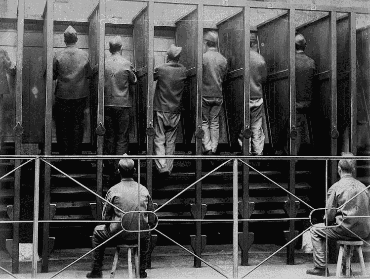

# 站在数据科学的前沿

> 原文：<https://towardsdatascience.com/staying-on-top-of-data-science-baeff05ca59f?source=collection_archive---------25----------------------->

Data Scientists trying to stay on top of technological developments in the 1880s.

在最近的一条推文中，一位 DS 招聘经理报告说，他问了一位候选人一个具体的框架，当候选人承认他们没有听说过这个框架时，他给出了否定的回答。在为自己的立场辩护时，招聘经理表示，负面分数的原因是不了解框架会让候选人看起来跟不上新的发展。

数据科学家需要做出特殊努力来跟上新发展的想法非常普遍。数据科学被认为是一个不断出现新发展的前沿领域。然而，数据科学课程反映了相反的情况——新的数据科学家被教授用 SQL、Python 和 R 编写代码——年龄分别为 40 岁、25 岁和 26 岁。

另一方面，机器学习算法和统计技术往往更古老——逻辑回归通常被认为是在 1944-75 年前开发的；C&RT 发明了将近 40 年。神经网络是在 20 世纪 60 年代发明的。

深度学习可以说是最引人注目的例外。尽管它的根源在于从 20 世纪 80 年代到 21 世纪初的一系列发展，但最常被引用的“突破时刻”发生在 2012 年。针对不同应用使用不同的架构吸引了新的发展，深度学习的相对年轻也是如此。

然而，每周新的深度学习架构或新的 R 包的存在并不意味着数据科学家应该感到必须学习它们。需要有一个理由来解释为什么这些新的发展会增加你的技能。

困难在于，虽然学习一个新的框架或库可能会略微提高您的生产率，但随着大多数数据科学领域达到的成熟水平，生产率的差异将是微不足道的。在很大程度上，通过学习每一个额外的新工具，你将看到的收益会比以前的框架小一些。

与此同时，提高你作为数据科学家的效率的最佳方式不是学习一种新技术来帮助你更快地训练一种算法，或者甚至更快或更好地准备数据。而是花更多的时间去了解你工作的领域，花更多的时间去了解你的客户想要从数据科学中得到什么。

对新技术的不懈追求将会偏离这一目标；花在阅读 R 包文档上的时间通常是你没有花在更好地了解你的用户上的时间，或者至少(假设你的用户没有无限的时间和你在一起)你没有花在训练自己更好地理解你的客户对你说的话上的时间。

数据科学已经存在了大约 50 年。直觉上，一年的创新价值不到 2%的额外知识。统计创新没有摩尔定律。

与此同时，大多数完成了基本培训和几年工作的数据科学家在技术上并不弱。更有可能的是技术是他们的优势。成为更好的数据科学家的最有效的方法不是学习更多的技术，而是找到一个较弱的领域并努力改进。最有可能的是，薄弱环节将是沟通技巧、销售技巧或最有效的与用户产生共鸣的方式。

*罗伯特·德格拉夫的书* [*管理你的数据科学项目*](https://www.amazon.com/Managing-Your-Data-Science-Projects/dp/1484249062/ref=pd_rhf_ee_p_img_1?_encoding=UTF8&psc=1&refRID=4X4S14FQEBKHZSDYYMZY) *，已经通过出版社出版。*

[*在 Twitter 上关注罗伯特*](https://twitter.com/RobertdeGraaf2)