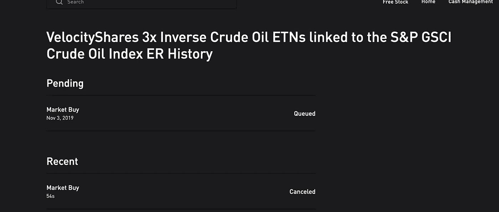
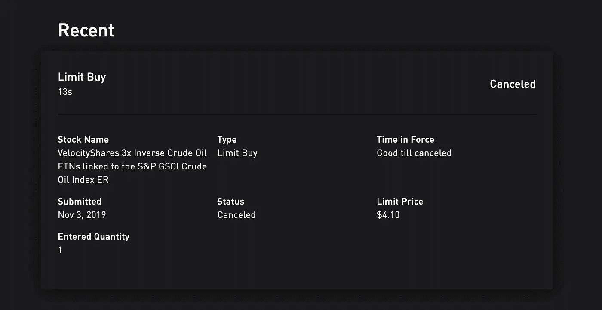

# 一步一步:在罗宾汉建立自动交易系统

> 原文：<https://towardsdatascience.com/step-by-step-building-an-automated-trading-system-in-robinhood-807d6d929cf3?source=collection_archive---------0----------------------->

Photo by [Maxim Hopman](https://unsplash.com/@nampoh?utm_source=medium&utm_medium=referral) on [Unsplash](https://unsplash.com?utm_source=medium&utm_medium=referral)

在这篇文章中，我将探索通过 Python 代码与 Robinhood API 集成的用法。

想法是用 Robinhood 做交易平台。Robinhood API 对市场数据的访问非常有限。不建议将他们的 API 用于数据目的。

# 什么是罗宾汉？

Robinhood 提供了一种允许客户买卖股票和交易所交易基金(ETF)而无需支付佣金的方式。它是一个交易平台，还没有提供官方的 API。

***注来自《走向数据科学》的编辑:*** *虽然我们允许独立作者根据我们的* [*规则和指导方针*](/questions-96667b06af5) *发表文章，但我们不认可每个作者的贡献。你不应该在没有寻求专业建议的情况下依赖一个作者的作品。详见我们的* [*读者术语*](/readers-terms-b5d780a700a4) *。*

# 开始吧

如果你搜索`Robinhood API python`，有大量的 Github 链接或者文档。但是大部分都不支持最新的 API。还有一些项目很久没更新了，见 [sanko 的罗宾汉](https://github.com/sanko/Robinhood)。

这里我用的是 [Robinhood](https://github.com/LichAmnesia/Robinhood) (一个 python 框架)，它最初来自 [Jamonek 的 Robinhood 框架](https://github.com/Jamonek/Robinhood)。自从 Robinhood 实施强制 MFA 以来，我做了一些改变以确保它的工作。

在控制台中找到您想要下载的位置，然后简单地运行:

> git 克隆[https://github.com/LichAmnesia/Robinhood](https://github.com/LichAmnesia/Robinhood)CD 罗宾汉
> sudo python3 setup.py install

那你就可以走了！

# 注册

默认方式需要你手持手机输入验证码。

这样，您需要每 24 小时登录一次，因为您的身份验证令牌将过期。

使用类似这样的内容登录:

如果不想启用 2FA，可以跳过这一部分。启用 2FA 后，每次登录罗宾汉网站时都需要输入验证码。

若要启用 2FA，请转到您的 Robinhood Web 应用程序。进入设置，打开 2FA，选择“认证 App”，点击“扫描不了？”，并复制 16 个字符的二维码。

使用类似这样的内容登录:

# 访问市场数据

数据是任何策略的支柱，但 Robinhood API 只返回股票非常基本的信息。

如果您需要历史价格数据:

目前，API 仅支持 5 分钟| 10 分钟| 30 分钟|天|周的时间间隔。日期范围为日|周|年| 5 年|全部。

# 从 API 交易

Robinhood 需要你有 25k 以上才能做日内交易。否则 5 天只能做 4 天的交易。参见[罗宾汉模式日交易](https://robinhood.com/support/articles/360001227026/pattern-day-trading/)。

由于 Robinhood 没有任何纸质账户，因此从 API 执行的所有订单都与在 App 中执行的订单相同。

这里我用`DWT`举例，每股 5 美元。

现在我提交一份市价单:

此处`GFD`表示当天有效，如果今天未满将被取消。此外，您可以设置`GTC`,这意味着直到取消良好。

做市价单截图:

我可以看到一个市场买入订单在排队，一个市场卖出订单错过了。

在这里我收到了`400 Client Error: Bad Request for url: https://api.robinhood.com/orders/`。因为如果你没有足够的库存，罗宾汉不允许你发出卖出指令。

记得平仓你的`DWT`。

现在我试着做限价单并取消它:

限价单制作和取消截图:

所有支持的订单功能:

> place _ market _ buy _ order
> place _ market _ sell _ order
> place _ limit _ buy _ order
> place _ limit _ sell _ order
> place _ stop _ loss _ sell _ order
> place _ stop _ limit _ sell _ order

# 账户管理

如果您想查看您的当前头寸和当前市值:

# 然后

学习和建立一个自动交易系统并不容易。有了正确的工具，你现在可以开始制作你的第一个交易算法。接下来，我打算谈谈如何在 Robinhood 中建立一个基本的交易策略。如果你有任何问题，请在下面提问。