# 从头开始构建自己的神经网络的分步指南

> 原文：<https://towardsdatascience.com/step-by-step-guide-to-building-your-own-neural-network-from-scratch-df64b1c5ab6e?source=collection_archive---------2----------------------->

## 学习深度学习的基础知识，并为图像分类建立自己的神经网络

Photo by [Aron Visuals](https://unsplash.com/@aronvisuals?utm_source=medium&utm_medium=referral) on [Unsplash](https://unsplash.com?utm_source=medium&utm_medium=referral)

> 关于机器学习、深度学习和人工智能的实践视频教程，请查看我的 [YouTube 频道](https://www.youtube.com/channel/UC-0lpiwlftqwC7znCcF83qg?view_as=subscriber)。

# “什么”和“为什么”

## 什么是深度学习

我们之前都听说过*深度学习*。由于计算能力、数据可用性和算法方面的最新进展，它在数据科学从业者中非常受欢迎，现在被用于各种环境中。

但是深度学习到底是什么*？*

简单来说，深度学习就是指训练一个**神经网络**。

现在，什么是神经网络？

嗯，它只是一个适合某些数据的函数。最简单的形式是用一个函数来拟合一些数据，如下所示。这种结构被称为**神经元**。

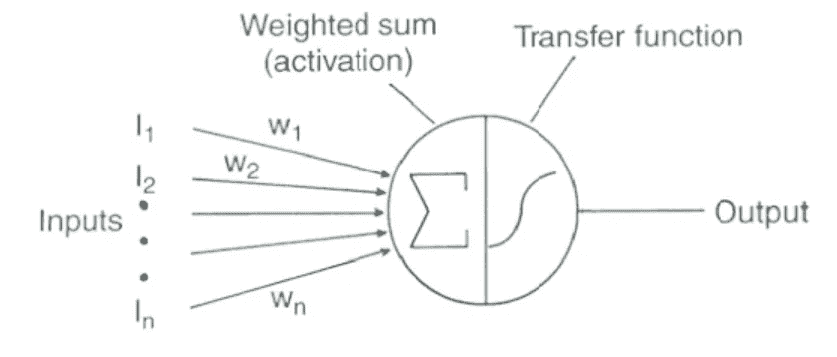

Schematic of a neuron

函数可以是任何东西:线性函数或 sigmoid 函数。当然，单个神经元并没有优于传统机器学习算法的优势。

所以一个神经网络结合了**多个**神经元。将神经元视为神经网络的构建模块。通过堆叠它们，可以构建如下所示的神经网络:

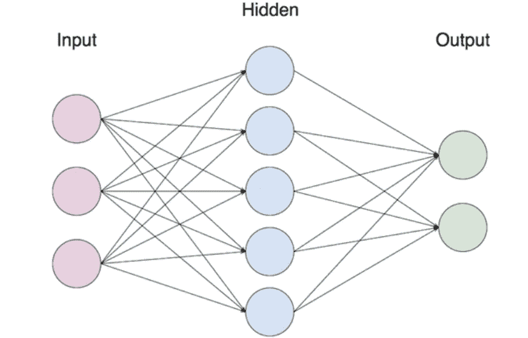

Schematic of a neural network

注意上面每个输入是如何输入到每个神经元的。神经网络会自己计算出哪个函数最符合数据。你需要提供的只是输入和输出。

## 为什么要用深度学习？

深度学习已经成功应用于许多监督学习设置中。传统的神经网络应用于在线广告目的。卷积神经网络( **CNN** )非常适合照片标记，递归神经网络( **RNN** )用于语音识别或机器翻译。

近年来，我们的数字活动显著增加，产生了非常大量的数据。虽然传统机器学习方法的性能将随着更多数据的使用而趋于平稳，但足够大的神经网络将随着更多数据的可用而提高性能。近年来，数据存储变得非常便宜，计算能力允许训练这种大型神经网络。

这就是为什么深度学习现在如此令人兴奋。我们可以访问大量的数据，我们有计算能力来快速测试、构思和重复实验，以提出强大的神经网络！

现在我们知道了什么是深度学习，以及它为什么如此棒，让我们编码我们的第一个用于图像分类的神经网络！点燃你的 Jupyter 笔记本！

Yes, our neural network will recognize cats. Classic, but it’s a good way to learn the basics!

# 你的第一个神经网络

目标是建立一个神经网络，该网络将图像作为输入和输出，不管它是不是猫的图片。

在此随意获取整个笔记本和数据集[。它还包含一些用于导入数据集的实用工具。](https://github.com/marcopeix/Deep_Learning_AI/tree/master/1.Neural%20Networks%20and%20Deep%20Learning/2.Neural%20Networks%20Basics)

## 导入数据

和往常一样，我们首先导入相关的包来使我们的代码工作:

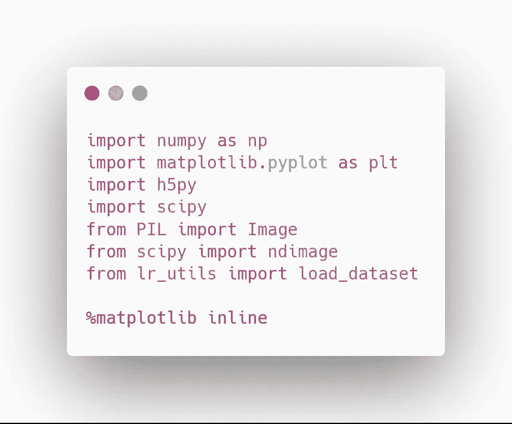

然后，我们加载数据，看看图片是什么样的:

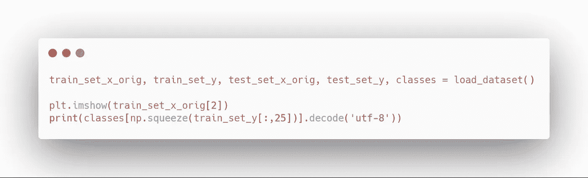

您应该会看到以下内容:

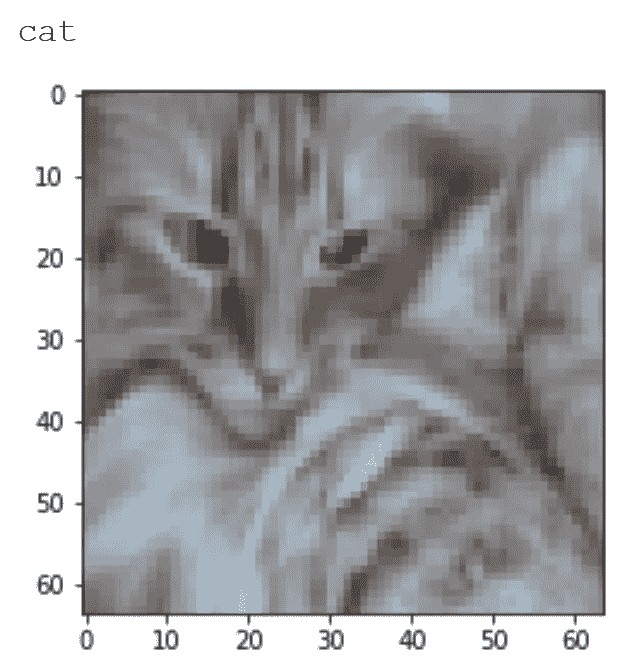

Example of a cat image in the dataset

然后，让我们打印出关于数据集的更多信息:

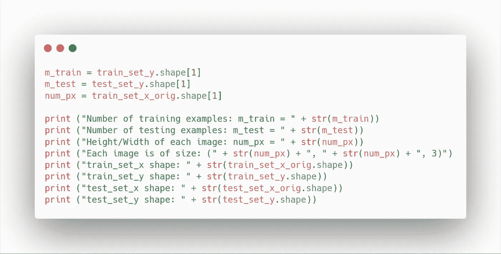

您应该会看到:

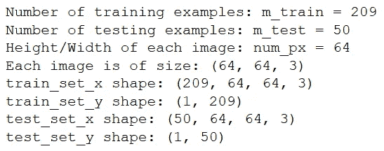

General information about the dataset

如你所见，我们在训练集中有 209 幅图像，我们有 50 幅图像用于训练。每个图像是一个 64px 宽和高的正方形。此外，您会注意到图像的第三维是 3。这是因为图像由三层组成:红色层、蓝色层和绿色层(RGB)。

A picture is composed of three layers

每层中的每个值都在 0 到 255 之间，它代表该像素的*红色*，或*蓝色*，或*绿色*，为每种组合生成一种独特的颜色。

现在，我们需要在将图像输入到我们的神经网络之前将它们展平:

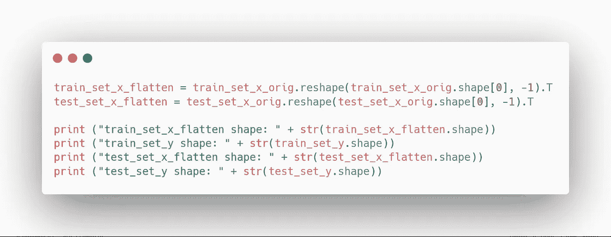

太好了！您现在应该看到训练集的大小为(12288，209)。这意味着我们的图像被成功地展平了

12288 = 64 x 64 x 3。

最后，我们将数据集标准化:

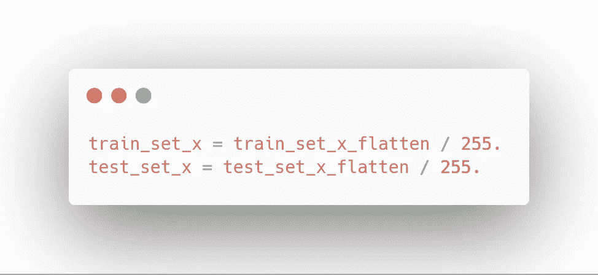

## 选择激活功能

建立神经网络的第一步是找到合适的激活函数。在我们的例子中，我们希望预测一张图片是否有猫。因此，这可以被框定为一个二元分类问题。理想情况下，我们应该有一个为猫图片输出 1 的函数，否则输出 0。

你可能已经知道，sigmoid 函数在这里是有意义的。我假设你知道 sigmoid 函数的大部分性质。不然可以在这里了解更多[。](https://becominghuman.ai/classification-part-1-intro-to-logistic-regression-f6258791d309)

数学上，sigmoid 函数表示为:

Sigmoid function

因此，让我们定义 sigmoid 函数，因为稍后它会变得很方便:

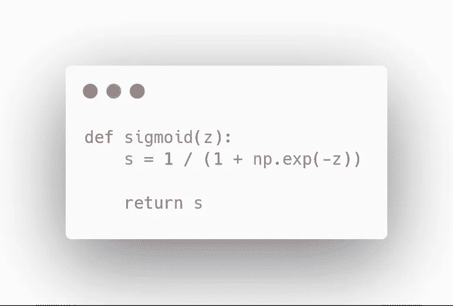

太好了，但是什么是 *z* ？它是加权输入，表示为:

Weighted input

其中 *w* 为**权重**矩阵， *b* 为**偏差**。现在，我们需要初始化**权重**和**偏差**。

将权重视为一个特性的重要性。通常我们将其初始化为**非零随机值**。

偏差是我们添加的常数，就像线性方程的截距。这为神经网络提供了一个额外的参数来调整，以提高拟合度。偏置可以初始化为 0。

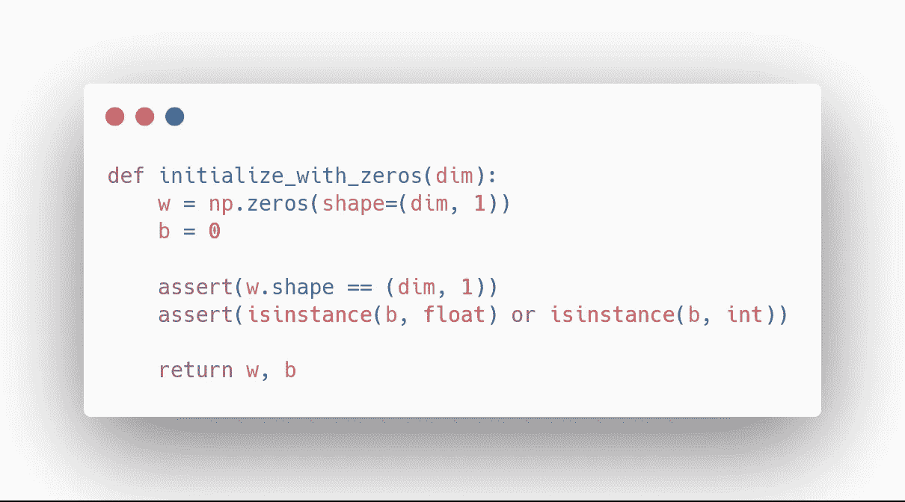

现在，我们需要为**正向传播**和**反向传播**定义一个函数。

在前向传播期间，执行一系列计算以生成预测并计算**成本**。成本是我们希望最小化的函数。在我们的例子中，成本函数将是:

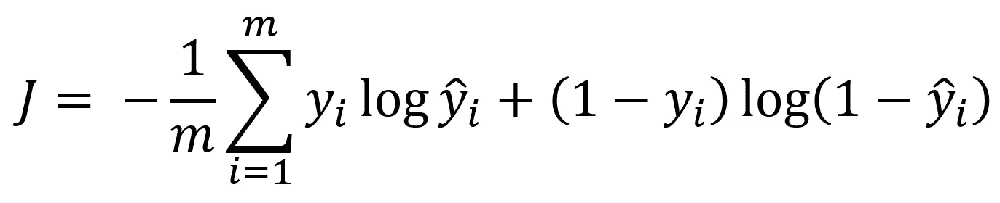

Cost function

其中 *y* 是观察值，而 *y_hat* 是预测值。

然后，反向传播计算梯度或导数。这在优化阶段将是有用的，因为当导数接近或等于 0 时，这意味着我们的参数被优化以最小化成本函数。

因此，我们编写以下函数:

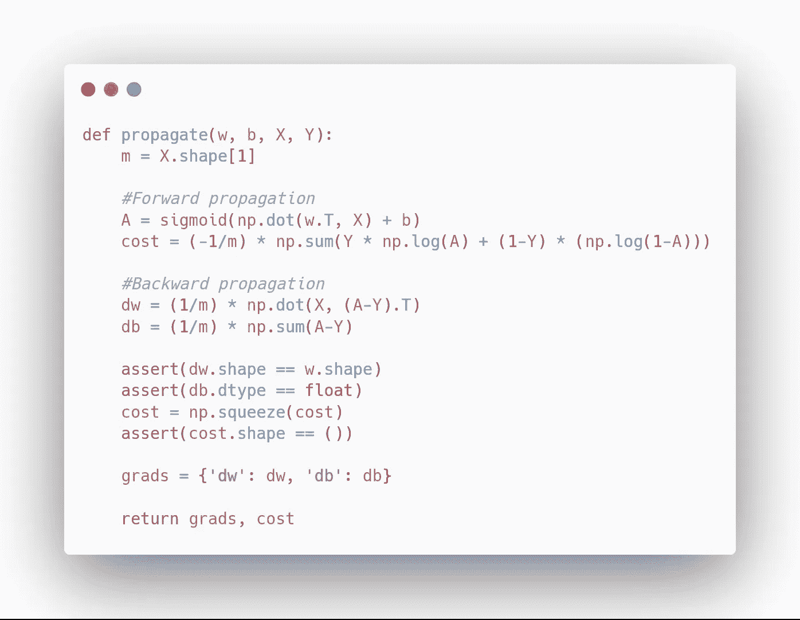

太好了！如上所述，我们需要重复正向传播和反向传播来更新参数，以便最小化成本函数。这是使用**梯度下降**完成的。为此，我们设置了一个**学习率**，它是一个小的正值，控制每次运行时参数的变化幅度。

为学习率 a 选择一个合适的值很重要，如下所示:

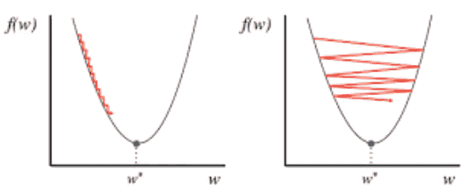

Pot of the cost as a function of the weights. Left: small learning rate. Right: large learning rate.

如果太小，就需要更长的时间来训练你的神经网络，如左图所示。如果它太大，你可能永远不会达到全局最小值，梯度下降将永远振荡。

在我们的例子中，我们将像这样更新参数:

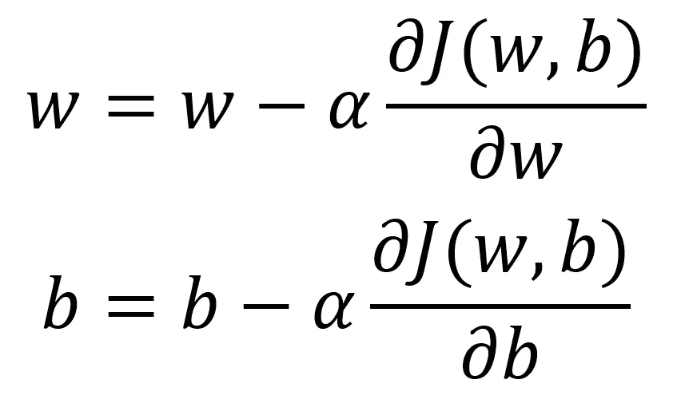

Gradient descent

其中 *alpha* 是学习率。在代码中，我们写道:

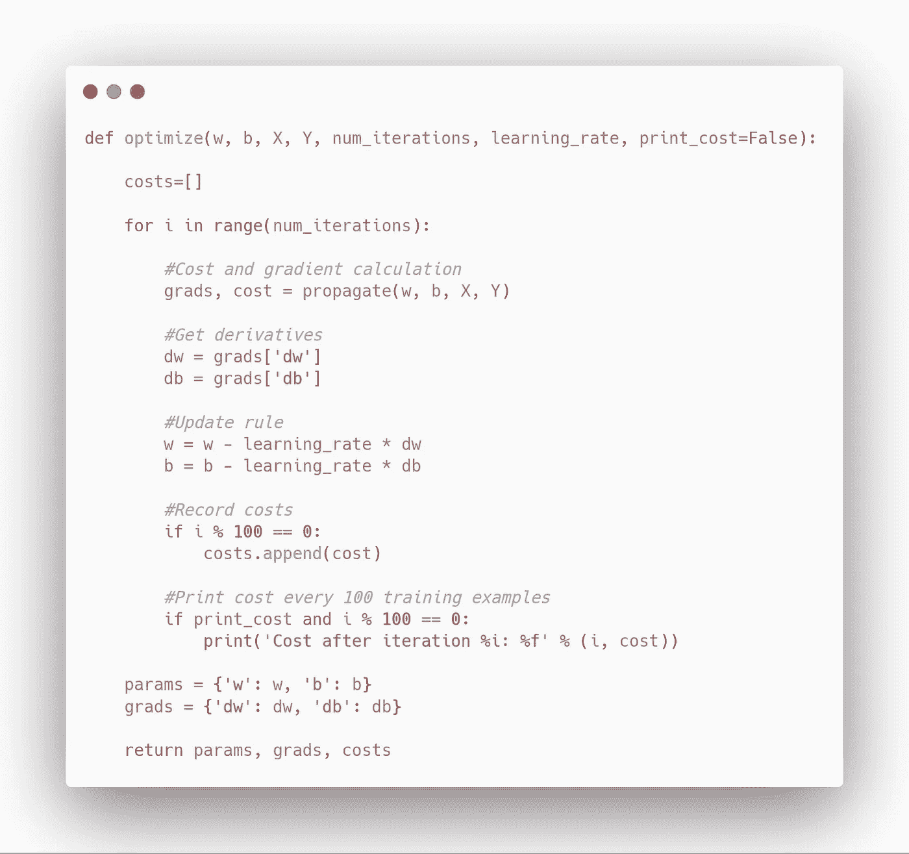

太棒了，我们快完成了！我们需要做的就是计算一个预测。知道 sigmoid 函数输出一个 0 到 1 之间的值，我们就确定如果值大于 0.5，我们就预测一个正例(是猫)。否则，我们将预测一个错误的例子(不是猫)。

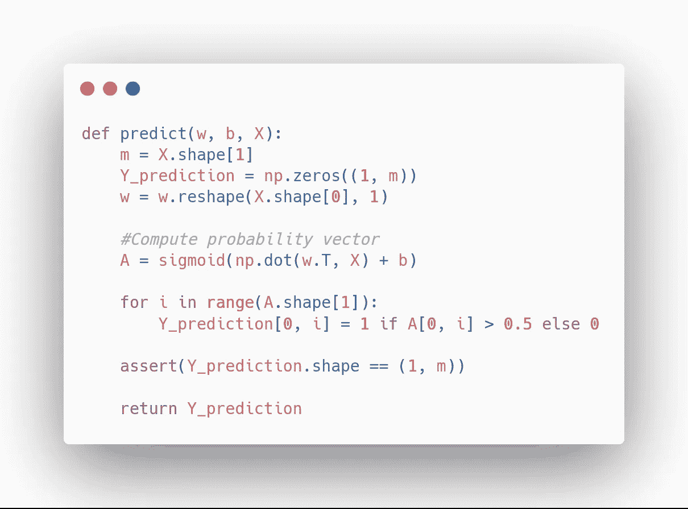

太神奇了！将我们所有的功能组合成一个单一的模型应该是这样的:

现在，我们可以训练我们的模型并进行预测了！

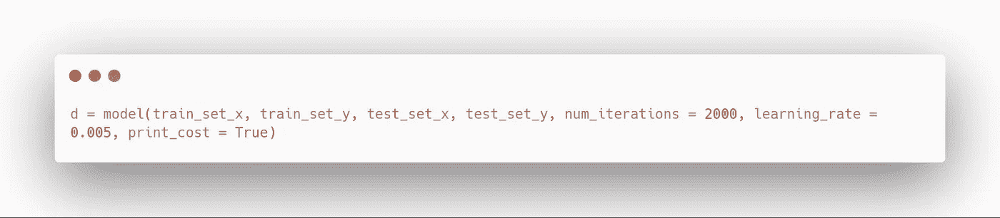

运行上面的代码单元后，您应该看到在测试集上获得了 99%的训练准确率和 70%的准确率。对于一个简单的神经网络来说还不错！

您甚至可以将成本绘制为迭代次数的函数:

您应该会看到:

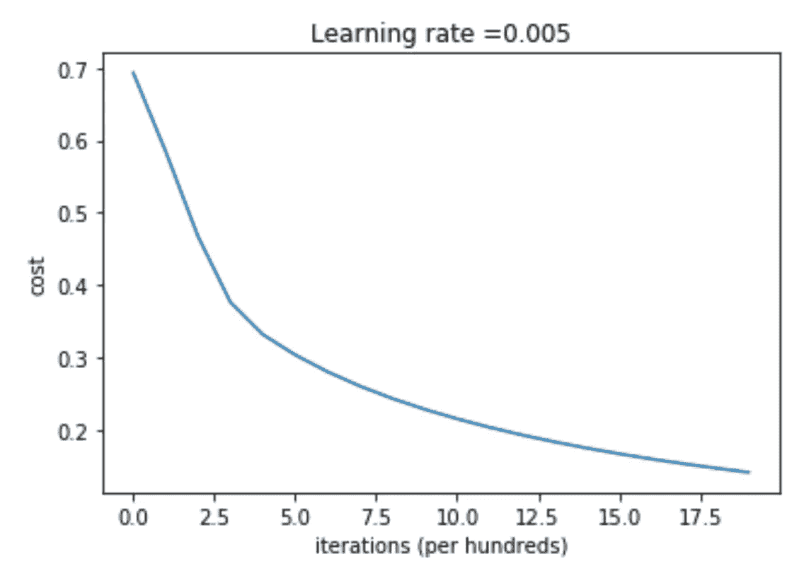

Cost function going down as more iterations are performed

你会看到每次迭代后成本确实在下降，这正是我们想要的。

随意试验不同的学习速率和迭代次数，看看它如何影响训练时间和模型的准确性！

恭喜你！您学习了深度学习的基础知识，并建立了您的第一个用于图像分类的神经网络！这篇文章中解释的概念是理解更复杂和更高级的神经网络结构的基础。

在[未来的](/how-to-build-a-deep-neural-network-without-a-framework-5d46067754d5)中，我们将通过建立一个具有更多层的*更深*神经网络，将我们的图像分类器带到下一个级别，并看看它是否能提高性能。

敬请关注，继续学习！

*来源:* [*深度学习 AI*](https://www.deeplearning.ai/)