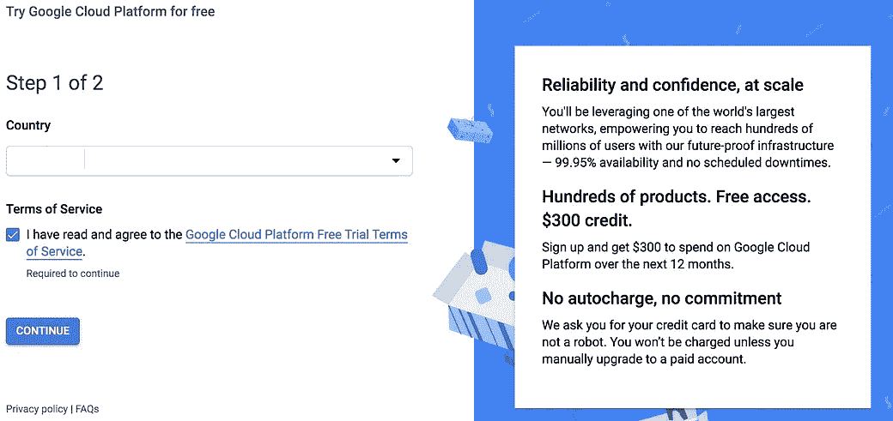
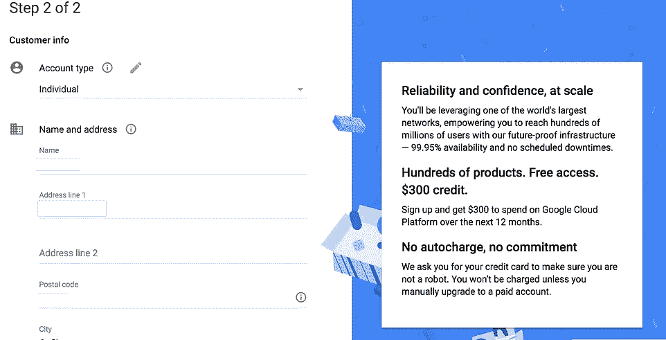
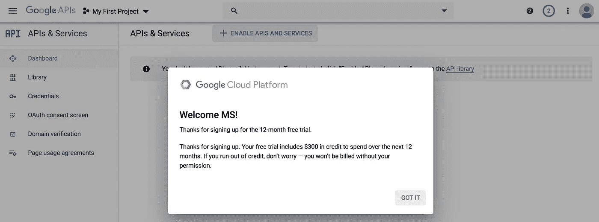
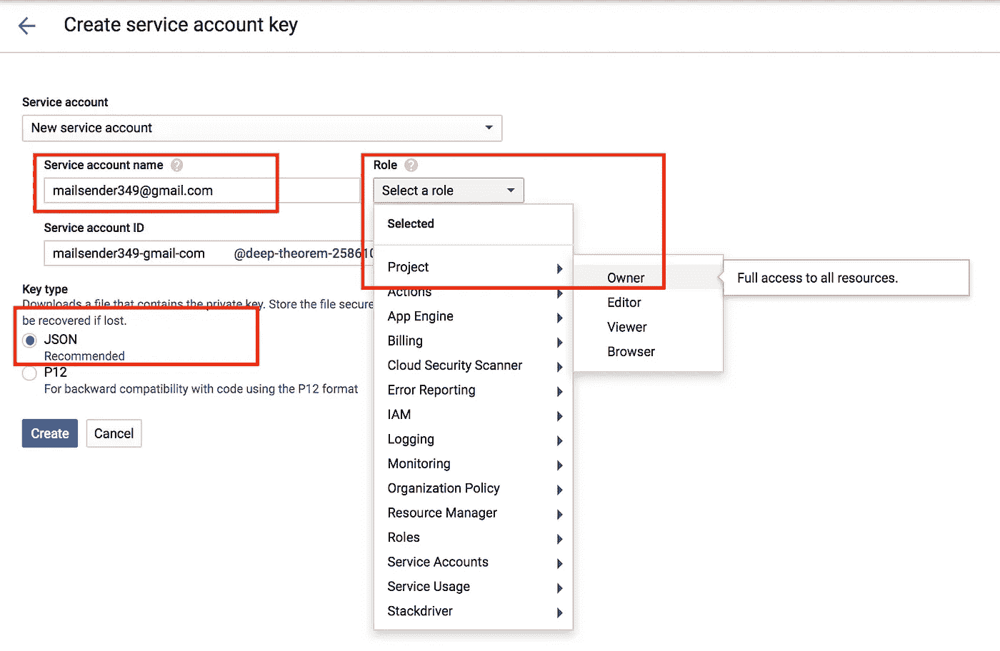
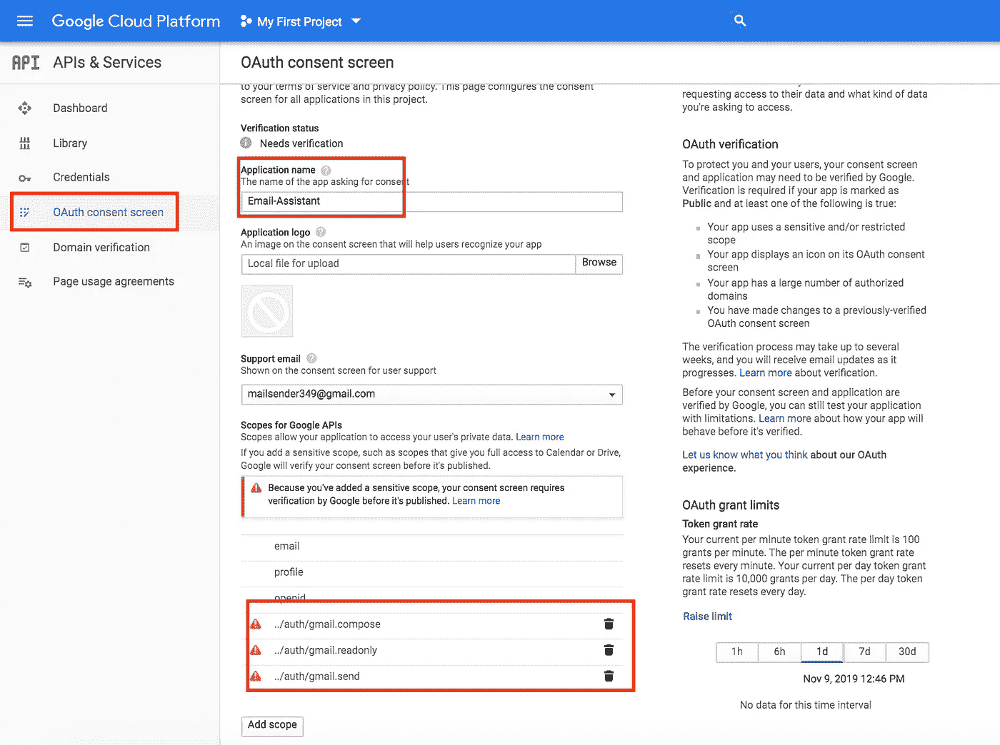
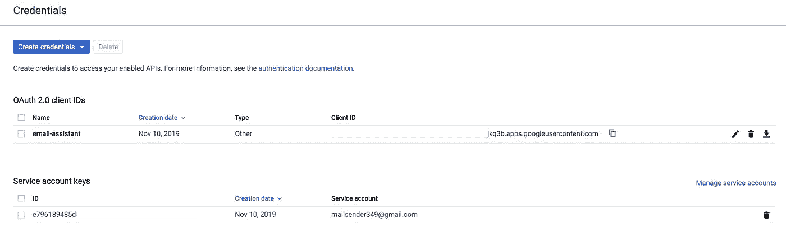
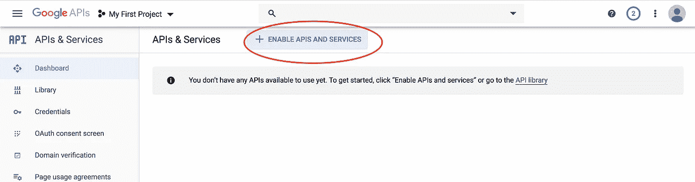
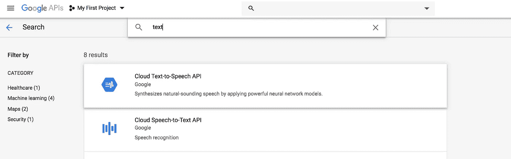
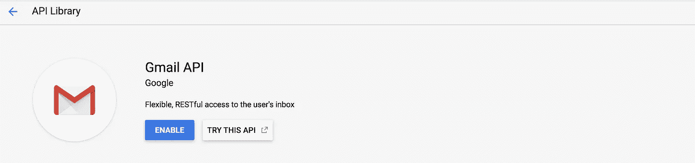

# 创建文本到语音到文本电子邮件助手的分步指南

> 原文：<https://towardsdatascience.com/step-by-step-guide-to-creating-a-text-to-voice-to-text-email-assistant-ca62eaf96437?source=collection_archive---------28----------------------->


Photo by [Charles 🇵🇭](https://unsplash.com/@charlesdeluvio?utm_source=unsplash&utm_medium=referral&utm_content=creditCopyText) on [Unsplash](https://unsplash.com/s/photos/email-assistant?utm_source=unsplash&utm_medium=referral&utm_content=creditCopyText)

在这篇文章中，我将描述如何创建您的个人电子邮件秘书。

这个电子邮件秘书是一个电子邮件应用程序，它使用 Gmail API 读取您的电子邮件，使用 Google 文本到语音 API 和“playsound”API 读出您的电子邮件，使用“py audio”API 听到您的响应，使用 Google 语音到文本 API 将音频响应转换为文本，最后使用 Gmail API 再次发送响应。

要查看这个电子邮件助手的运行情况，请观看视频

我相信你一定很想知道它是如何创建的，以及所有的步骤都需要什么。所以让我们开始吧。我将详细列出所有应该易于遵循和实施的步骤

# 步骤 1:创建虚拟环境并安装 Python 库

整个程序是在 mac-book-pro 上编写的，但它是独立于平台的，可以在 windows pc/laptop 上遵循相同的步骤。除此之外，我使用 [anaconda](https://docs.anaconda.com/anaconda/install/mac-os/) python 安装和 [pycharm 社区版](https://www.jetbrains.com/pycharm/download/#section=mac)作为编程编辑器。如果您熟悉创建虚拟环境和安装 python 库，请直接跳到下一节。

在虚拟环境中工作总是安全的，以防止应用程序之间的库冲突

> 1a。创建虚拟环境

在 mac 终端窗口创建您的虚拟环境，并安装 playsound 和 pyaudio 库

```
*#conda create — name p36
#conda activate p36
#pip install playsound
#pip install pyaudio*
```

# 第二步:配置谷歌云平台

在这一步中，我们需要转到 google cloud 开发者平台，创建服务密钥、凭证并激活相关的 API 来使用它们。谷歌。

> 2a。激活环境

在激活时，谷歌会要求你提供信用卡，并承诺在年底不会拖欠你的费用。如果提供 300 美元的 1 年免费信贷，则使用 API

链接激活您的账户【https://console.developers.google.com/ 



Google Cloud Platform Activation Steps



Google Cloud Platform Activation Success

不幸的是，随后启用 API、创建服务密钥和凭证的后续步骤相当复杂，但请继续

> 2b。创建服务帐户密钥



Create Service Account Key — Input

完成这一步后，会创建一个扩展名为. json 的密钥文件。下载此服务帐户密钥。此密钥是根据您的程序的身份验证要求提供的

> 2c。创建 OAuth2.0 凭据

这一步是为了让您的应用程序能够访问 GMAIL。我们将申请'撰写'和'发送'电子邮件，以便能够适时运行我们的原型



在此步骤之后，凭证页面将如下所示，即带有服务帐户密钥和 OAuth 客户端 id。



Final Credentials Page

**下载**相关凭证到您计算机上存储 python 脚本的文件夹中(任何地方都可以，只要您提供应用程序的正确路径)

> 2d。激活文本到语音、语音到文本和 Gmail APIs

最后，我们激活文本到语音 API、语音到文本 API 和 Gmail API。在仪表板上，您会看到“启用 API 和服务”选项。



Enable APIS on the dashboard

从过多的 API 和服务中启用的最简单的方法是通过搜索(常见的是 Google，你还能在那里做什么)。请参见下面的搜索文本到语音和语音到文本 API 的示例。



Searching for APIS to enable

找到 API 后，只需点击启用(下面是 Gmail 的示例)



Enable Gmail API

最后，我们准备研究程序本身。

# 步骤 3:运行应用程序

现在是比较容易的部分。这很简单，因为大多数代码示例都可以在 GCP 教程网站上找到，可以选择复制，还有很多解释。另一方面，这些链接有很多深层链接，为用户提供了所有的 API 选项。这导致新用户容易迷路。

在这里，我向您描述了启动和运行原型的相关部分。之后，根据 GCP 站点上的文档，按照您的特定需求进行配置就容易多了。我提供了每个特定部分的 GCP 教程的链接

运行原型的步骤是

*   从 [github](https://github.com/alsm6169/Google-TtS-StT-Gmail) 下载代码到特定文件夹
*   将凭据(服务帐户密钥和 OAuth 密钥)复制到与代码相同的文件夹中
*   在 Main.py 中替换要导出的 GOOGLE_APPLICATION_CREDENTIALS 的路径

```
#Replace this with the correct file path of the service account key
os.environ[**'GOOGLE_APPLICATION_CREDENTIALS'**] = \
    **"/Users/name/Documents/GitHub/Python-Exercises/googleSpeechToText/GMAIL_gTtS_gStT_ServiceAccountKey.json"**
```

*   在 RaSmails.py 中替换 OAuth2.0 文件的名称

```
#Replace this with correct file path of credentials .json
flow = InstalledAppFlow.from_client_secrets_file(
    **'oath2_credentials_mailreceiver349.json'**, SCOPES)
```

*   在终端窗口中激活虚拟环境(#conda activate — name p36)
*   以#python Main.py 的身份运行代码

代码流程的简要概述如下:

> 获取 Gmail 服务实例>获取最新 5 封电子邮件的片段>将最新片段转换为音频>播放音频文件(最新电子邮件) >录制回复电子邮件>将音频转换为文本>发送回复电子邮件

以下链接详细描述了正在使用的 API

*   [阅读邮件](https://developers.google.com/gmail/api/v1/reference/users/messages/get)，
*   [将文本转换为语音](https://cloud.google.com/text-to-speech/docs/reference/libraries#client-libraries-install-python)，
*   [将语音转换为文本](https://github.com/GoogleCloudPlatform/python-docs-samples/tree/master/speech/cloud-client)最后
*   [发送邮件](https://developers.google.com/gmail/api/v1/reference/users/messages/send)。

我希望你喜欢这个原型。乐意回答任何问题。让我知道你的想法