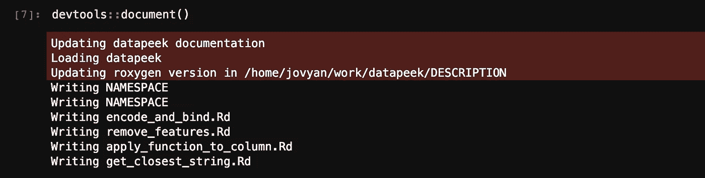
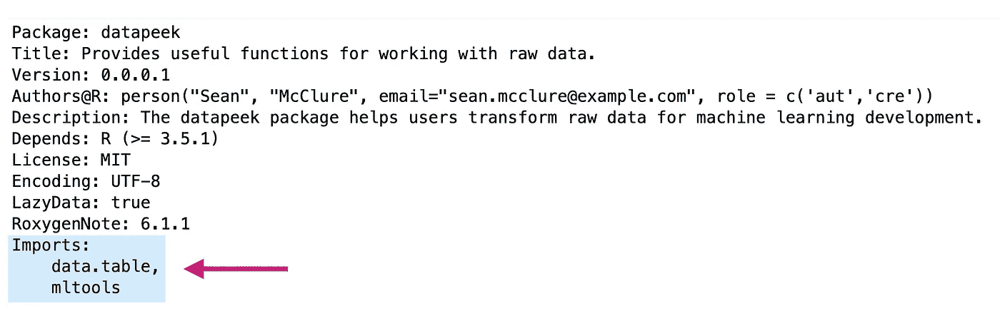
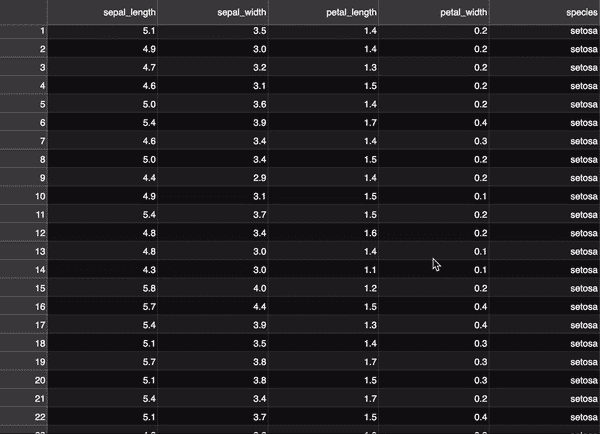

# 创建 R 和 Python 库的分步指南(在 JupyterLab 中)

> 原文：<https://towardsdatascience.com/step-by-step-guide-to-creating-r-and-python-libraries-e81bbea87911?source=collection_archive---------3----------------------->


r 和 Python 是当今机器学习语言的面包和黄油。r 提供了强大的统计和快速的可视化，而 Python 提供了直观的语法和丰富的支持，是当今主流 AI 框架的首选接口。

在本文中，我们将看看用 R 和 Python 创建库的步骤。这是每个机器学习从业者都应该拥有的技能。库帮助我们组织代码并与他人共享，为数据社区提供打包的功能。

> **注意**:在本文中，我交替使用了术语“*库”*和“*包”*。虽然有些人区分这些词，但我不认为这种区分有用，而且很少在实践中看到这样做。我们可以把一个**库**(或者**包**)想象成一个包含函数的脚本目录。这些功能组合在一起，帮助工程师和科学家解决挑战。

## 创建图书馆的重要性

如果不广泛使用库，构建今天的软件是不可能的。库极大地减少了团队将工作投入生产所需的时间和精力。通过利用开源社区，工程师和科学家可以将他们独特的贡献推向更多的受众，并有效地提高他们代码的质量。各种规模的公司都使用这些库来将他们的工作置于现有功能之上，从而使产品开发更加高效和集中。

但是创建库不仅仅是为了生产软件。库对于快速原型化想法至关重要，可以帮助团队快速验证假设和制作实验软件。虽然流行的图书馆享有大量的社区支持和一套最佳实践，但较小的项目可以在一夜之间转化为图书馆。

通过学习创建轻量级的库，我们养成了维护代码和共享工作的习惯。我们自己的开发速度大大加快，我们将编码工作锚定在一个有形的工作单元上，我们可以随着时间的推移而改进。

## 文章范围

在本文中，我们将重点关注用 R 和 Python 创建库，以及在 GitHub 上托管和安装它们。这意味着我们不会关注流行的托管站点，比如 R 的 **CRAN** 和 Python 的 **PyPI** 。这些额外的步骤超出了本文的范围。


只关注 GitHub 有助于鼓励从业者更频繁地开发和共享库。CRAN 和 PyPI 有许多必须满足的标准(它们经常变化)，这会减慢我们发布工作的过程。请放心，其他人从 GitHub 安装我们的库也一样容易。此外，CRAN 和 PyPI 的步骤可以在以后添加，如果你觉得你的库可以从托管站点中受益的话。

我们将使用相同的环境(JupyterLab)构建 R 和 Python 库，对这两种语言使用相同的高级步骤。这应该有助于您建立将代码打包成库所需的核心步骤的工作知识。

让我们开始吧。

# 设置

我们将用 R 和 Python 创建一个名为 **datapeek** 的库。datapeek 库是一个简单的包，提供了一些处理原始数据的有用函数。这些功能是:

`encode_and_bind`

`remove_features`

`apply_function_to_column`

`get_closest_string`

我们将在后面研究这些函数。现在，我们需要设置一个 R 和 Python 环境来创建 datapeek，以及一些支持打包代码的库。我们将在一个 **Docker** 容器中使用 **JupyterLab** ，以及一个我们需要的“Docker 栈”。

## 安装并运行 Docker


我们将使用的 [Docker 栈](https://jupyter-docker-stacks.readthedocs.io/en/latest/using/selecting.html#core-stacks)被称为[**jupyter/data science-notebook**](https://hub.docker.com/r/jupyter/datascience-notebook/)。该图包含 R 和 Python 环境，以及许多通常在机器学习中使用的包。

因为这些都是在 Docker 里面运行的，所以你必须在你的机器上安装 Docker。所以 [**安装 Docker**](https://docs.docker.com/install/) 如果你还没有的话，一旦安装好，在**终端**中运行以下命令*拉*data science-notebook:

```
docker pull jupyter/datascience-notebook
```

这将提取 Docker Hub 上托管的最新图像。

> ***注意* :** 任何时候你从 Docker Hub 拉一个项目，你都会得到最新的版本。如果距离上次拉动已经过了一段时间，请再次拉动以更新您的图像。

运行上述命令后，您应该立即看到以下内容:


一旦所有东西都被取出，我们就可以通过运行以下命令来确认我们的新映像存在:

```
docker images
```

…显示类似如下的内容:


现在我们有了 Docker 堆栈，让我们来设置 JupyterLab。

## JupyterLab


我们将在一个 **JupyterLab** 环境中创建我们的库。JupyterLab 是一个基于 web 的编程用户界面。有了 JupyterLab，我们在浏览器中有了一个轻量级的 IDE，方便了构建快速应用程序。JupyterLab 提供了用 R 和 Python 创建库所需的一切，包括:

*   一个**终端**环境，用于运行 shell 命令和下载/安装库；
*   一个 R 和 Python **控制台**，用于与这些语言交互工作；
*   一个简单的**文本编辑器**，用于创建各种扩展名的文件；
*   Jupyter **笔记本**用于 ML 工作的原型制作。

我们刚刚获取的 datascience-notebook 包含 JupyterLab 的安装，因此我们不需要单独安装它。在运行我们的 Docker 映像之前，我们需要**挂载一个卷**来确保我们的工作**保存在容器**之外。

首先，**在你的桌面上创建一个名为 datapeek** 的文件夹(或者任何你想创建的地方),然后进入这个目录。我们需要**用 JupyterLab** ，运行 Docker 容器，因此我们的完整命令应该如下所示:

```
docker run -it -v `pwd`:/home/jovyan/work -p 8888:8888 jupyter/datascience-notebook start.sh jupyter lab
```

你可以在这里了解更多关于 Docker 命令的信息。重要的是，上面的命令公开了我们在端口 8888 上的环境，这意味着我们可以通过浏览器访问我们的容器。

运行以上命令后，您应该会在最后看到以下输出:


这告诉我们将提供的 URL 复制并粘贴到浏览器中。打开浏览器，在地址栏中添加链接，然后按 enter 键(您的令牌会有所不同):

```
**localhost**:8888/?token=11e5027e9f7cacebac465d79c9548978b03aaf53131ce5fd
```

这将在您的浏览器中自动打开 JupyterLab 作为一个新标签:


我们现在准备开始建造图书馆。

我们从 **R** 开始这篇文章，然后看看 **Python** 。

# 在 R 中创建库


r 是机器学习的“两大”语言之一。在撰写本文时，它已经拥有超过 10，000 个图书馆。转到[*按发布日期*](https://cran.r-project.org/web/packages/available_packages_by_date.html) 和运行日期列出的可用起重机包…

```
document.getElementsByTagName('tr').length
```

…在浏览器控制台中显示 13858。减去标题和最后一行，得到 **13856** 个包装。不用说，R 不需要变化。凭借强大的社区支持和简洁(如果不是直观的话)的语言，R 轻松地位居值得学习的统计语言之首。

关于创建 R 包最著名的论文是哈德利·威卡姆的书 [R 包](http://r-pkgs.had.co.nz)。它的内容可以在网上免费获得。如果想更深入地了解这个话题，我建议去那里看看。

我们将使用 Hadley 的 **devtools** 包来抽象出创建包所涉及的繁琐任务。dev tools*已经安装*在我们的 Docker Stacks 环境中。我们还需要 **roxygen2** 包，它帮助我们记录我们的函数。因为它没有预装我们的映像，所以让我们现在安装它。

> **注意**:从现在开始我们将**使用 JupyterLab** 中的终端，以便于在浏览器中保存我们的工作。

打开 JupyterLab 发射器内的终端:


> **注意**:如果您想将 JupyterLab 更改为**黑暗主题**，点击顶部的*设置*，点击 *JupyterLab 主题*，然后点击 *JupyterLab 黑暗*:


在控制台内键入 R，然后…

```
install.packages("roxygen2")
library(roxygen2)
```

安装好必要的软件包后，我们就可以开始每一步了。

# 步骤 1:创建包框架

我们需要为我们的包创建一个目录。我们可以使用 devtools **create** 函数，在一行代码中做到这一点。在终端运行中:

```
devtools::create("datapeek")
```

这将自动创建定义我们的 R 包所需的基本文件和目录。在 JupyterLab 中，你会在左侧看到一组新创建的文件夹和文件。

> **注意**:你还会看到你的新目录结构在你的桌面上(或者你选择创建它的任何地方)被创建，因为我们**在设置期间挂载了一个卷**到我们的容器中。

如果我们在 JupyterLab 检查我们的包装，我们现在看到:

```
**datapeek**
├── **R**
├── datapeek.Rproj
├── DESCRIPTION
├── NAMESPACE
```

**R** 文件夹最终会包含我们的 *R 代码*。**我的包。Rproj** 文件是特定于 *RStudio* IDE 的，所以我们可以忽略它。**描述**文件夹存放我们包的*元数据*(关于的详细讨论可以在[这里](http://r-pkgs.had.co.nz/description.html)找到)。最后， **NAMSPACE** 是一个确保我们的库[与其他库](http://r-pkgs.had.co.nz/namespace.html)很好地配合的文件，并且更多的是一个 CRAN 需求。

## 命名规格

命名 R 包时，我们必须遵循这些**规则**:

*   在**曲柄**上必须是唯一的(你可以在这里查看所有当前的 R 库[)；](https://cran.r-project.org/web/packages/available_packages_by_name.html)
*   *是否只能由**字母**、**数字**和**句点**组成*；
*   *不能包含**下划线**或**连字符**；***
*   **必须以**字母**开始*；*
*   *不能在**周期**内*结束*；*

*你可以在这里阅读更多关于命名包[的内容。我们的包名“datapeek”通过了上述标准。让我们转向](http://r-pkgs.had.co.nz/package.html)[曲柄](https://cran.r-project.org/web/packages/available_packages_by_date.html)并执行*命令+F* 搜索“数据检查”以确保它没有被占用:*

**

*Command + F search on CRAN to check for **package name uniqueness**.*

*…看起来我们很好。*

# *步骤 2:填写描述细节*

*文件的工作是存储关于我们包的重要元数据。这些数据包括运行我们的库所需的**其他包**，我们的**许可证**，以及我们的**联系人**信息。从技术上来说，R 中的包的定义是包含一个`DESCRIPTION`文件的任何目录，所以总是要确保它存在。*

*C **点击 JupyterLab 目录列表中描述文件**上的 **。您将看到我们运行`devtools::create(“datapeek”)`时自动创建的基本细节:***

**

*让我们添加我们的具体细节，以便我们的包包含必要的元数据。只需在 JupyterLab 中编辑这个文件。以下是我补充的细节:*

*   ***包装** : `datapeek`*
*   ***标题** : `Provides useful functions for working with raw data.`*
*   ***版本** : `0.0.0.1`*
*   ***作者@R** : `person(“Sean”, “McClure”, email=”sean.mcclure@example.com”, role=c('aut','cre'))`*
*   ***描述**:data peek 包帮助用户转换用于机器学习开发的原始数据。*
*   ***取决于** : `R (≥ 3.5.1)`*
*   ***执照** : `MIT`*
*   ***编码** : `UTF-8`*
*   ***LazyData** : `true`*

*当然你应该用你自己的细节填写这些部分。你可以在哈德利关于元数据的章节中读到更多关于这些的定义。作为一个简单的概述…这些`package`、`title`和`version`部分是不言自明的，只要确保*将* `title` *保持在一行*。`Authors@R`必须遵循你上面看到的格式，因为它包含可执行的 R 代码。注意**角色**参数，它允许我们列出本库的主要贡献者。常见的有:*

*`aut` : *作者**

*`cre` : *创建者或维护者**

*`ctb` : *投稿人**

*`cph` : *版权所有者**

*还有更多的选项，完整列表见[此处](http://www.loc.gov/marc/relators/relaterm.html)。*

*您可以通过将多个作者列为一个向量来添加他们:*

```
*Authors@R: as.person(c(
    "Sean McClure <sean.mcclure@example.com> [aut, cre]", 
    "Rick Deckard <rick.deckard@example.com> [aut]",
    "RachaelTyrell <rachel.tyrell@example.com> [ctb]"
))*
```

> ***注意**:如果你计划在 CRAN 上托管你的图书馆，确保你的电子邮件地址是正确的，因为 CRAN 会用这个联系你。*

*`description`可以是多行，限 1 段。我们使用`depends`来指定我们的包所依赖的 R 的最低版本。您应该使用与您用来构建库的版本相同或更高的 R 版本。今天大多数人把他们的`License`设置为 MIT，它允许任何人“使用、复制、修改、合并、出版、分发、再许可和/或出售软件的拷贝”,只要你的版权包括在内。你可以在这里了解更多关于麻省理工学院许可证[的信息。`Encoding`确保我们的库可以使用现代解析器打开、读取和保存，而`LazyData`指的是如何加载我们包中的数据。因为我们将我们的设置为 true，这意味着我们的数据在被使用之前不会占用内存。](https://opensource.org/licenses/MIT)*

# *步骤 3:添加函数*

## *3A:向 R 文件夹添加功能*

*我们的图书馆没有功能就没什么用。让我们添加本文开头提到的 4 个函数。下面的[要点](https://help.github.com/en/articles/about-gists)显示了我们在 R 中的 datapeek 函数:*

*我们必须将我们的函数添加到 **R 文件夹**，因为这是 R 在库中查找函数的地方。*

```
***datapeek**
├── **R**
├── datapeek.Rproj
├── DESCRIPTION
├── NAMESPACE*
```

*由于我们的库只包含 4 个函数，我们将把它们放入一个名为 **utilities 的文件中。R** ，这个文件位于 R 文件夹中。*

*进入 JupyterLab 中的**目录**，打开 R 文件夹。**点击启动器中的*文本文件*** 并粘贴到我们的 [4 R 函数](https://gist.github.com/sean-mcclure/34c87f68c2bfdccdec27799a946c4445)中。右击该文件并**重命名**为 utilities.R。*

**

## *3B:导出我们的函数*

*仅仅将 R 函数放在我们的文件中是不够的。每个函数都必须*导出*才能向我们库的用户公开。这是通过在每个函数上方添加 **@export 标签**来实现的。*

*导出语法来自 [*Roxygen*](https://cran.r-project.org/web/packages/roxygen2/vignettes/roxygen2.html) ，并确保我们的函数被添加到名称空间中。让我们将@export 标签添加到我们的第一个函数中:*

*对其余的函数也这样做。*

> ****注意*** :在更大的库中，我们只导出需要在我们的包之外可用的函数。这有助于减少与另一个库冲突的机会。*

## *3C:记录我们的功能*

*记录我们的功能很重要。文档功能为用户提供信息，这样当他们输入`?datapeek`时，他们就可以获得关于我们的包的细节。文档还支持使用[小插图](http://r-pkgs.had.co.nz/vignettes.html)，这是一种长格式的文档。你可以在这里阅读更多关于记录函数[的信息。](http://r-pkgs.had.co.nz/man.html)*

*我们将采取 **2 个子步骤**:*

*   ***添加**文档注释*
*   ***运行***

***—添加文档注释***

*文档被添加到我们的功能之上**，直接在我们的`#’ @export` 行之上。下面是我们第一个函数的例子:***

*为了可读性，我们将这些行隔开，添加了标题、描述和函数使用的任何参数。让我们为我们的[剩余功能](https://gist.github.com/sean-mcclure/f4955b10dbe582d02460a7a74c20ea4a)这样做:*

***—运行** `devtools::document()`*

*将文档添加到我们的函数中，然后**在根目录外的终端**、中运行以下内容:*

```
*devtools::document()*
```

> ***注意**:确保你在 datapeek 目录之外的一级。*

*您可能会得到**错误**:*

```
*Error: ‘roxygen2’ >= 5.0.0 must be installed for this functionality.*
```

*在这种情况下**打开 JupyterLab** 中的 **端子并**安装 roxygen2** 。您还应该安装 data.table 和 mltools，因为我们的第一个函数使用这些工具:***

```
*install.packages('roxygen2')
install.packages('data.table')
install.packages('mltools')*
```

*再次运行`devtools::document()`。您应该看到以下内容:*

**

*这会生成**。Rd 文件**里面有一个新的**人文件夹**。你会注意到。Rd 文件是为我们包中的每个函数*创建的。**

*如果您查看您的描述文件，它现在会在底部显示一个新行:*

**

*这也将生成一个名称空间文件:*

**

*我们可以看到我们的 4 个功能已经暴露。现在让我们继续确保在我们的库中指定依赖关系。*

# *步骤 4:列出外部依赖关系*

*我们的函数经常需要其他库中的函数。我们必须做两件事来确保外部功能对我们库的功能可用:*

1.  ***在我们的函数中使用** **双冒号**来指定我们所依赖的库；*
2.  ***将** **导入**添加到我们的描述文件中。*

*你会注意到，在上面的要点中，我们只是将我们的库列在了顶部。虽然这在独立的 R 脚本中工作得很好，但这不是在 R 包中使用依赖关系的方式。当创建 R 包时，我们必须使用" ***双冒号方法*** "来确保正确的函数被读取。这与 R 包中的“顶层代码”(不像函数那样是对象的代码)如何只在编译包时执行，而不是在加载包时执行有关。*

*例如:*

```
***library(mltools)**do_something_cool_with_mltools <- function() {
    auc_roc(preds, actuals)
}*
```

*…不起作用，因为`auc_roc`将不可用(运行库(datapeek)不重新执行库(mltools))。这个*将*工作:*

```
*do_something_cool_with_mltools <- function() {
    **mltools::**auc_roc(preds, actuals)
}*
```

*我们的 datapeek 包中唯一需要额外包的函数是我们的第一个函数:*

*Using the **double-colon approach** to specify dependent packages in R.*

*注意**每次**我们调用一个外部函数时，我们都会在它前面加上外部库和双冒号。*

*我们还必须在我们的`DESCRIPTION`文件中列出外部依赖项，这样它们才能被正确处理。让我们**将** **我们的导入添加到描述文件**:*

**

*确保导入的库用逗号分隔。注意，我们没有为外部依赖项指定任何**版本**。如果我们需要指定版本，我们可以在包名后面使用括号:*

```
*Imports:
    data.table (>= 1.12.0)*
```

*由于我们的`encode_and_bind`函数没有利用任何最新的更新，我们将不对它指定任何版本。*

# *步骤 5:添加数据*

*有时在我们的库中包含数据是有意义的。包数据可以让我们的用户练习我们的库的功能，也有助于*测试*，因为机器学习包总是包含摄取和转换数据的功能。将*外部数据*添加到 R 包的 4 个选项是:*

1.  ***二进制**数据*
2.  ***解析的**数据*
3.  ***原始**数据*
4.  ***序列化**数据*

*你可以在这里了解更多关于这些不同方法的信息[。对于本文，我们将坚持使用最常见的方法，即**将外部数据添加到 R 文件夹**。](http://r-pkgs.had.co.nz/data.html)*

*让我们将[虹膜数据集](https://gist.githubusercontent.com/curran/a08a1080b88344b0c8a7/raw/d546eaee765268bf2f487608c537c05e22e4b221/iris.csv)添加到我们的库中，以便为用户提供一种快速测试我们功能的方法。数据必须在**中。rda 格式**，使用 R 的`**save()**`函数创建，并具有与文件**相同的名称**。我们可以通过使用 devtools 的`use_data`函数来确保满足这些标准:*

```
*x <- read.csv("[http://bit.ly/2HuTS0Z](http://bit.ly/2HuTS0Z')")
devtools::use_data(x, iris)*
```

*在上面，我从 Iris 数据集的 URL 中读取它，并将数据帧传递给`devtools::use_data()`。*

*在 JupyterLab 中，我们看到创建了一个新的数据文件夹，以及我们的 iris.rda 数据集:*

```
***datapeek**
├── **data** └── iris.rda
├── **man**
├── **R** ├── datapeek.Rproj
├── DESCRIPTION
├── NAMESPACE*
```

*在接下来的部分中，我们将使用我们添加的数据集来运行测试。*

# *步骤 6:添加测试*

*测试是软件开发的一个重要部分。测试有助于确保我们的代码按预期工作，并使调试代码成为一个更快、更有效的过程。点击了解更多关于测试 R 包[的信息。](http://r-pkgs.had.co.nz/tests.html)*

*测试中的一个常见挑战是知道我们应该测试什么。测试大型库中的每一个功能都很麻烦，而且并不总是需要，而测试不足会使发现和纠正出现的错误变得更加困难。*

*我喜欢马丁·福勒关于何时测试的下面这段话:*

> *每当您想在 print 语句或调试器表达式中键入某些内容时，请将其编写为测试—马丁·福勒*

*如果您定期构建应用程序原型，您会发现自己经常向控制台写东西，看看一段代码是否返回您所期望的结果。在数据科学中，编写交互式代码甚至更常见，因为机器学习工作是高度实验性的。一方面，这提供了充分的机会来思考编写哪些测试。另一方面，机器学习代码的不确定性意味着测试 ML 的某些方面可能不那么简单。作为一般规则，寻找每次都应该返回相同输出的明显确定性代码段。*

*我们在数据科学中做的交互测试是*手动*，但是我们在我们的包中寻找的是**自动测试**。自动化测试意味着我们运行一套预定义的测试，以确保我们的包端到端地工作。*

*虽然在软件中有很多种测试，但这里我们主要讨论“**单元测试**”从单元测试的角度思考迫使我们将代码分解成更多的模块化组件，这是软件设计中的良好实践。*

> ****注意*** :如果你习惯用 Python 这样的语言测试，注意 R 本质上更 **functional** (即方法属于函数而不是类)，所以会有一些区别。*

*我们将采取 2 个子步骤**来测试我们的 R 库:***

***6A** :创建`tests/testthat`文件夹；*

***6B** :写作测试。*

***— 6A:** **创建** `**tests/testthat**` **文件夹***

*正如 R 希望我们的 R 脚本和数据放在特定的文件夹中一样，它也希望我们的测试也是如此。为了创建 tests 文件夹，我们在 JupyterLab 的 R 控制台中运行以下命令:*

```
*devtools::use_testthat()*
```

*您可能会得到以下错误:*

```
*Error: ‘testthat’ >= 1.0.2 must be installed for this functionality.*
```

*如果是这样的话，使用上面相同的方法在 Jupyter 的终端中安装 roxygen2。*

```
*install.packages('testthat')*
```

*运行`devtools::use_testthat()`将产生以下输出:*

```
** Adding testthat to Suggests
* Creating `tests/testthat`.
* Creating `tests/testthat.R` from template.*
```

*现在我们的主目录中会有一个新的**测试文件夹**:*

```
***datapeek**
├── **data** ├── **man**
├── **R** ├── **tests** └── testthat.R├── datapeek.Rproj
├── DESCRIPTION
├── NAMESPACE*
```

*上面的命令还在 tests 文件夹中创建了一个名为`testthat.R`的文件。当`R CMD check`运行时，它会运行所有的测试(我们很快就会看到)。您还会注意到***test 在我们的`DESCRIPTION`文件中的**建议**下添加了*:***

******

*****— 6B:写作测试*****

***test 这是 R 最流行的单元测试包，至少有 2600 个 CRAN 包使用，更不用说 Github 上的库了。你可以在 Tidyverse 页面[这里](https://www.tidyverse.org/articles/2017/12/testthat-2-0-0/)查看关于 testthat 的最新消息。也可以查看它的[文档](https://cran.r-project.org/web/packages/testthat/testthat.pdf)。***

***我们需要考虑 3 个级别的测试:***

*   *****期望(断言):**一次计算的预期结果；***
*   *****测试:**将单个功能的多个期望，或者跨多个功能的相关功能组合在一起；***
*   *****文件:**将多个相关测试组合在一起。文件被赋予一个人类可读的名称`context().`***

******

## ***断言***

****断言*是我们选择的测试库中包含的函数。我们使用断言来检查我们自己的函数是否返回预期的输出。断言有多种风格，这取决于被检查的内容。在接下来的部分，我将介绍 R 编程中使用的主要测试，展示每一个失败的测试，这样你就可以理解它是如何工作的。***

*****相等**断言**断言*****

*   ***`expect_equal()`***
*   ***`expect_identical()`***
*   ***`expect_equivalent`***

```
***# **test for** **equality**
a <- 10
expect_equal(a, 14)> Error: `a` not equal to 14.# **test for identical** 
expect_identical(42, 2)> Error: 42 not identical to 2.# **test for equivalence** 
expect_equivalent(10, 12)> Error: 10 not equivalent to 12.***
```

***上面的例子之间有细微的差别。例如，`expect_equal`用于检查*在数值公差*内是否相等，而`expect_identical`用于测试*是否完全相等。以下是一些例子:****

```
***expect_equal(10, 10 + 1e-7) # true
expect_identical(10, 10 + 1e-7) # false***
```

***随着你写更多的测试，你会明白什么时候使用每一个。当然，如有疑问，请参考上述文件。***

***测试**字符串**和**是否匹配*****

*   ***`expect_match()`***

```
***# **test for string matching**
expect_match("Machine Learning is Fun", "But also rewarding.")> Error: "Machine Learning is Fun" does not match "But also rewarding.".***
```

***测试**长度*****

*   ***`expect_length`***

```
***# **test for length** 
vec <- 1:10
expect_length(vec, 12)> Error: `vec` has length 10, not length 12.***
```

*****比较测试*****

*   ***`expect_lt`***
*   ***`expect_gt`***

```
***# **test for less than**
a <- 11
expect_lt(a, 10)> Error: `a` is not strictly less than 10\. Difference: 1# **test for greater than**
a <- 11
expect_gt(a, 12)> Error: `a` is not strictly more than 12\. Difference: -1***
```

***测试**逻辑*****

*   ***`expect_true`***
*   ***`expect_false`***

```
***# **test for** **truth** 
expect_true(5 == 2)> Error: 5 == 2 isn't true.# **test for** **false** 
expect_false(2 == 2)> Error: 2 == 2 isn't false.***
```

***测试**输出*****

*   ***`expect_output`***
*   ***`expect_message`***

```
***# **testing for outputs** 
expect_output(str(mtcars), "31 obs")> Error: `str\(mtcars\)` does not match "31 obs".# **test for warning** 
f <-function(x) {
  if(x < 0) {
    message("*x* is already negative")
  }
}expect_message(f(1))> Error: `f(1)` did not produce any messages.***
```

***testthat 库中包含了更多。如果你是测试新手，开始写一些简单的来适应这个过程。随着时间的推移，你会对测试什么和何时测试有一个直觉。***

## ***写作测试***

***一个**测试**是一组*断言*。我们在 tests 中编写如下测试:***

```
*****test_that**("this functionality does what it should", {
    // group of assertions here
})***
```

***我们可以看到我们既有**描述**(*测试名称*)又有**代码**(包含断言)。描述完成了句子，“测试那个…”***

***上面，我们说“*测试*这个功能做了它应该做的事情。”***

***断言是我们想要测试的输出。例如:***

```
*****test_that**("trigonometric functions match identities", {
      expect_equal(sin(pi / 4), 1 / sqrt(2))
      expect_equal(cos(pi / 4), 1 / sqrt(10))
      expect_equal(tan(pi / 4), 1)
    })> Error: Test failed: 'trigonometric functions match identities'***
```

> ******注*** :结合我们的测试文件，需要考虑[内聚](https://en.wikipedia.org/wiki/Cohesion_(computer_science))和[耦合](https://en.wikipedia.org/wiki/Coupling_(computer_programming))之间的平衡。正如 Hadley 在书中所说，“这两个极端显然是不好的(所有测试在一个文件中，每个测试一个文件)。你需要找到一个适合你的快乐的媒介。一个好的起点是为每个复杂的功能准备一个测试文件。”***

## ***创建文件***

***我们在测试中做的最后一件事是创建文件。如上所述，测试中的“文件”是一组覆盖相关功能集的测试。我们的测试文件必须位于`tests/testthat/`目录中。下面是 [GitHub](https://github.com/tidyverse/stringr/blob/master/tests/testthat/test-case.R) 上的 *stringr* 包的测试文件示例:***

******

*****Example Test File** from the stringr package on GitHub.***

***这个文件叫做测试用例。r(以“test”开头)位于`tests/testthat/`目录中。顶部的*上下文*只允许我们提供文件内容的简单描述。当我们运行测试时，它会出现在控制台中。***

***让我们**创建我们的测试文件**，它将包含与我们的 4 个函数相关的测试和断言。像往常一样，我们在 Launcher 中使用 JupyterLab 的文本文件来创建和重命名一个新文件:***

******

***Creating a Test File in R***

***现在让我们添加我们的测试:***

***对于第一个函数，我将**确保返回具有正确特征数量的数据帧**:***

***注意我们如何调用我们的`encode_and_bind`函数，然后简单地检查维度和预期输出之间的相等性。我们在任何时候运行我们的自动化测试，以确保我们的测试文件运行，并且我们得到预期的输出。在控制台中运行`devtools::test()`运行我们的测试:***

******

***我们也得到了一个笑脸！***

***由于我们的**第二个函数**删除了一个指定的特征，我将使用与上面相同的测试，检查返回的框架的尺寸。我们的**第三个函数**将指定的函数应用到选择的列，所以我将编写一个测试来检查给定指定函数的结果。最后，我们的**第四个函数**返回最接近的匹配字符串，所以我将简单地检查返回的字符串以获得预期的结果。***

***以下是我们的完整测试文件:***

> ******注意*** :注意测试文件中数据的相对路径。***

## ***测试我们的包***

***如上所述，我们使用以下命令运行测试:***

```
***devtools::test()***
```

***这将运行我们放在 testthat 目录中的任何测试文件中的所有测试。让我们来看看结果:***

******

***我们在 4 个单元测试中有 5 个断言，放在一个测试文件中。看来我们没事了。如果我们的任何测试失败，我们将在上面的打印输出中看到这一点，在这一点上，我们将寻求纠正问题。***

# ***步骤 7:创建文档***

***这通常是通过在 R 中使用“Vignettes”来完成的。你可以在这里了解如何为你的 R 包[创建 R vignettes。就我个人而言，我认为这是一种过时的文档方法。我更喜欢用类似于狮身人面像或者 T21 的东西。文档应该很容易**共享**、**搜索**和**托管**。](http://r-pkgs.had.co.nz/vignettes.html)***

******

***点击 julepcode.com 大学的问号，了解如何使用 Julep。***

******

***我为我们的 R datapeek 库创建并托管了一些简单的文档，你可以在这里找到。***

******

***当然我们也会在 GitHub 上有这个库，我会在下面介绍。***

# ***第八步:共享你的 R 库***

***正如我在引言中提到的，我们应该定期创建库，这样其他人就可以受益于并扩展我们的工作。最好的方法是通过 **GitHub** ，这是开源软件项目分发和协作的标准方式。***

***如果您是 GitHub 的新手，这里有一个快速教程可以帮助您入门，这样我们就可以将我们的 datapeek 项目推到远程 repo。***

***注册/登录 GitHub 并 [**创建一个新的库**](https://github.com/new) 。***

******

***…这将为我们提供通常的屏幕:***

******

***使用我们的远程回购设置，我们可以在我们的机器上初始化我们的**本地回购**，并发送我们的第一个提交。***

*****打开 JupyterLab 中的终端**，进入 datapeek 目录:***

******

*****初始化本地 repo** :***

```
***git init***
```

******

*****添加远程原点**(您的链接会有所不同):***

```
***git remote add origin [https://github.com/sean-mcclure/datapeek.git](https://github.com/sean-mcclure/datapeek.git)***
```

***现在运行`git add .`将当前目录和所有子目录下所有修改的和新的(未跟踪的)文件添加到 **staging** 区域:***

```
***git add .***
```

***不要忘记上面命令中的“点”。现在我们可以**提交**我们的更改，这将任何新代码添加到我们的本地回购中。***

*****但是**，由于我们在 Docker 容器中工作，与我们的本地回购相关联的**用户名**和**电子邮件**不能被自动检测。我们可以通过在终端中运行以下命令来**设置****:*****

```
*****git config --global user.email {emailaddress}
git config --global user.name {name}*****
```

*****使用您用来登录 GitHub 的电子邮件地址和用户名。*****

*****现在我们可以承诺:*****

```
*****git commit -m 'initial commit'*****
```

*****提交新代码后，我们可以进行推送，将最后一次提交转移到我们的 *remote* repo:*****

```
*****git push origin master*****
```

> ********注意*** :因为我们在 Docker 中，你可能会再次被要求**认证**。出现提示时，只需添加您的 GitHub 用户名和密码。然后再次运行上面的命令。*****

*****一些读者会注意到我们没有在目录中放置一个`.gitignore`文件。将所有文件放入较小的 R 库中通常没问题。对于更大的库，或者包含大型数据集的库，你可以使用站点 **gitignore.io** 来看看常见的 gitignore 文件是什么样子的。这里是一个用于 R 的通用 R .gitignore 文件:*****

*******Example .gitignore file** for an R package*****

*****概括地说，git **add** 将当前目录中所有修改过的和新的(未跟踪的)文件添加到 **staging** 区域。**提交**将任何更改添加到我们的*本地*回购，而**推送**将最后的提交转移到我们的*远程*回购。虽然`git add`可能看起来是多余的，但它存在的原因是因为有时我们只想提交某些文件，这样我们可以有选择地存放文件。上面，我们通过在`git add`后使用“点”来暂存*所有的*文件。*****

*****你可能还注意到我们没有包括一个**自述文件**。您确实应该包括这一点，但是为了简洁起见，我省略了这一步。*****

*****现在，**任何人都可以使用我们的库**。👍让我们看看怎么做。*****

# *****步骤 9:安装你的 R 库*****

*****正如在引言中提到的，我不会在本文中讨论 CRAN。坚持使用 GitHub 使得频繁共享我们的代码变得更加容易，并且我们总是可以在以后添加 CRAN 标准。*****

*****要从 GitHub 安装一个库，用户只需在本地机器上运行以下命令:*****

```
*****devtools::install_github("yourusername/mypackage")*****
```

*****因此，我们可以简单地指示希望使用 datapeek 的其他人在他们的本地机器上运行以下命令:*****

```
*****devtools::install_github("sean-mcclure/datapeek")*****
```

*****这是我们将包含在自述文件和/或我们创建的任何其他文档中的内容。这将像我们从 CRAN 获得的任何其他软件包一样安装我们的软件包:*****

**********

*****然后，用户像往常一样加载库，一切就绪:*****

```
*****library(datapeek)*****
```

*****我建议在一个新的 R 环境中尝试上述命令，以确认新库的安装和加载符合预期。*****

# *****用 PYTHON 创建库*****

**********

*****创建 Python 库遵循与我们之前看到的 r 相同的高级步骤。我们需要一个基本的**目录结构**和适当的**命名**约定，**函数**和**描述**，**导入**，指定**依赖关系**，添加**数据集**，**文档**，以及能够**共享**并允许其他人**安装**我们的库*****

*****我们将使用 **JupyterLab** 来构建我们的 Python 库，就像我们对 r。*****

## *****库 vs 包 vs 模块*****

*****在本文的开始，我讨论了“**库”**和“**包”**之间的区别，以及我是如何喜欢交替使用这些术语的。这同样适用于 Python 库。"**模块"**是另一个术语，在 Python 中简单地指任何包含 Python 代码的文件。Python 库显然包含作为脚本的模块。*****

## *****在我们开始之前:*****

*****我在介绍中说过，我们将在 GitHub 上托管和安装我们的库。这鼓励了库的快速创建和共享，而不会因为在流行的 R 和 Python 包托管站点上发布标准而陷入困境。*****

*****Python 最流行的托管站点是 Python 包索引( [PyPI](https://pypi.org/) )。这里是**寻找**、**安装**和**发布** python 库的地方。每当您运行`pip install <package_name>`(或`easy_intall`)时，您都会从 PyPI 获取一个包。*****

**********

*****虽然我们不会讨论在 PyPI 上托管我们的包，但是看看我们的库名是否是唯一的还是一个好主意。这将最大限度地减少与其他流行 Python 库的混淆，并提高我们的库名与众不同的可能性，如果有一天我们决定在 PyPI 上托管它的话。*****

*****首先，我们应该遵循一些 Python 库的命名约定。*****

## *****Python 库命名约定*****

*   *******全部用小写**；*****
*   *****让名字**在 PyPI 上唯一**(在 [PyPI](https://pypi.org/) 上搜索名字)*****
*   *****没有**连字符**(可以用下划线分隔单词)*****

*****我们的库名是 **datapeek** ，所以满足第一个和第三个标准；让我们检查 PyPI 的*唯一性*:*****

**********

*****一切都好。👍*****

*****我们现在已经准备好完成创建 Python 库所需的每个步骤。*****

# *****步骤 1:创建包框架*****

*******JupyterLab** 应按照本文**设置部分**中的说明启动并运行。*****

*****使用 JupyterLab 的**新文件夹**和**文本文件**选项创建以下**目录结构**和**文件**:*****

```
*******datapeek**
├── **datapeek**
    └── __init__.py
    └── utilities.py
├── setup.py*****
```

> ********注*** : **粗体**名称为**文件夹**和**浅色**名称为**文件**。我们将把**内部** datapeek 文件夹称为“模块目录”，把**外部** datapeek 目录称为“根目录”。*****

*****下面的视频展示了我在 JupyterLab 中创建 datapeek 目录的过程:*****

*****有些文件我们不想提交给源代码管理。这些文件是由 Python 构建系统创建的。照此，我们也把加上下面的**。gitignore 文件**到我们的包框架:*****

> ********注*** :在撰写本文时，JupyterLab 缺少在浏览器中切换隐藏文件的前端设置。因此，我们将简单地把我们的文件命名为 gitignore(前面没有点)；在推送到 GitHub 之前，我们会把它改成一个隐藏文件。*****

*******将你的 gitignore 文件**作为一个简单的文本文件添加到**根目录:*******

```
*******datapeek**
├── **datapeek**
    └── __init__.py
    └── utilities.py
├── setup.py
├── gitignore*****
```

**********

# *****步骤 2:填写描述细节*****

*****正如我们对 R 所做的一样，我们应该添加关于我们新库的元数据。我们使用**设置工具**来完成这项工作。Setuptools 是一个 Python 库，旨在方便打包 Python 项目。*****

*******打开 setup.py** 并为我们的库添加以下详细信息:*****

*****当然，您应该将创作更改为您自己的创作。稍后我们将向该文件添加更多的细节。这些关键字是不言自明的。`url`是我们项目在 GitHub 上的 URL，后面会添加；除非您已经创建了 python repo，在这种情况下，现在添加 URL。我们在 R 部分讨论了许可。`zip_safe`简单地说，我们的包可以作为一个 zip 文件安全地运行，这是通常的情况。你可以在这里了解更多关于可以添加到 setup.py 文件[的内容。](https://packaging.python.org/tutorials/packaging-projects/)*****

# *****步骤 3:添加函数*****

*****我们的库显然需要*函数*有用。对于更大的库，我们将组织我们的模块以平衡内聚/耦合，但是因为我们的库很小，我们将简单地把所有的函数放在一个文件中。*****

*****我们将添加与 R 相同的函数，这次是用 Python 编写的:*****

*******将**这些函数添加到`utilities.py`模块，在 datapeek 的模块目录中。*****

# *****步骤 4:列出外部依赖关系*****

*****我们的库经常需要其他包作为依赖关系。当安装我们的库时，我们用户的 Python 环境需要知道这些(所以也可以安装这些其他的包)。 **Setuptools** 提供了`install_requires`关键字来列出我们的库所依赖的任何包。*****

*****我们的 datapeek 库依赖于用于模糊字符串匹配的 **fuzzywuzzy** 包和用于数据结构高性能操作的 **pandas** 包。要指定我们的依赖关系**、**、**，请将以下内容添加到您的 setup.py 文件中:*******

```
*****install_requires=[
    'fuzzywuzzy',
    'pandas'
]*****
```

*****您的 setup.py 文件当前应该如下所示:*****

*****我们可以通过在 JupyterLab 终端会话中运行以下命令来确认一切正常:*****

```
*****python setup.py develop*****
```

> ********注意*** :在 datapeek 的根目录下运行这个。*****

*****运行该命令后，您应该会看到类似这样的内容:*****

**********

*****…结尾写道:*****

*****`Finished processing dependencies for datapeek==0.1`*****

*****如果我们的一个或多个依赖项在 PyPI 上不可用，但在 Github 上可用(例如，*一个尖端的机器学习包只在 GitHub 上可用…或者它是我们团队的另一个库，只托管在 GitHub 上*)，我们可以在设置调用中使用`dependency_links`:*****

```
*****setup(
    ...
    dependency_links=['http://github.com/user/repo/tarball/master#egg=package-1.0'],
    ...
)*****
```

*****如果要添加额外的元数据，比如**状态**、**许可**、**语言**、**版本**等。我们可以这样使用`classifiers`:*****

```
*****setup(
    ...
    classifiers=[
        'Development Status :: 3 - Alpha',
        'License :: OSI Approved :: MIT License',
        'Programming Language :: Python :: 2.7',
        'Topic :: Text Processing :: Linguistic',
      ],
    ...
)*****
```

*****要了解更多关于可以添加到 setup.py 文件中的不同分类器的信息，请参见[这里的](https://pypi.org/pypi?%3Aaction=list_classifiers)。*****

# *****步骤 5:添加数据*****

*****正如我们在 R 中所做的一样，我们可以将数据添加到我们的 Python 库中。在 Python 中，这些文件被称为**非代码文件**，可以包括**图像**、**数据**、**文档**等。*****

*****我们**将数据**添加到我们库的模块目录中，这样任何需要这些数据的代码都可以使用来自消费模块的`__file__`变量的*相对路径*。*****

*****让我们将[虹膜数据集](https://gist.githubusercontent.com/curran/a08a1080b88344b0c8a7/raw/d546eaee765268bf2f487608c537c05e22e4b221/iris.csv)添加到我们的库中，以便为用户提供一种快速测试我们功能的方法。首先，使用 JupyterLab 中的**新建文件夹**按钮**在模块目录下新建一个名为 data** 的文件夹:*****

```
*******datapeek**
├── **datapeek**
    └── __init__.py
    └── utilities.py
    └── **data**
├── setup.py
├── gitignore*****
```

*****…然后**在名为 iris.csv 的数据文件夹中创建一个新的文本文件**，并且**将[中的数据](https://gist.githubusercontent.com/curran/a08a1080b88344b0c8a7/raw/d546eaee765268bf2f487608c537c05e22e4b221/iris.csv)粘贴到新文件中。*******

*****如果您关闭并打开新的 csv 文件，它将在 JupyterLab 中以适当的表格形式呈现:*****

**********

*******CSV file** rendered in JupyterLab as formatted table.*****

*****我们使用一个`MANIFEST.in`文件来指定非代码文件。**创建另一个名为`MANIFEST.in`的文本文件**，将其放入根文件夹:*****

```
*******datapeek**
├── **datapeek**
    └── __init__.py
    └── utilities.py
    └── **data**
├── MANIFEST.in
├── setup.py
├── gitignore*****
```

*****…然后**将这一行**添加到文件中:*****

```
*****include datapeek/data/iris.csv*****
```

> ********注***:manifest . in 通常不需要，但为了完整起见包含在本教程中。更多讨论见[此处](https://stackoverflow.com/questions/24727709/do-python-projects-need-a-manifest-in-and-what-should-be-in-it)。*****

*****我们还需要**在 setup.py 中包含下面一行**:*****

```
*****include_package_data=True*****
```

*****我们的 setup.py 文件现在应该如下所示:*****

# *****步骤 6:添加测试*****

*****与我们的 R 库一样，我们应该添加测试，以便其他人可以扩展我们的库，并确保他们自己的函数不会与现有代码冲突。**添加一个测试文件夹**到我们库的模块目录:*****

```
*******datapeek**
├── **datapeek**
    └── __init__.py
    └── utilities.py
    └── **data** └── **tests**├── MANIFEST.in
├── setup.py
├── gitignore*****
```

*****我们的测试文件夹应该有自己的`__init__.py`文件以及测试文件本身。**创建**那些现在使用 JupyterLab 的文本文件选项:*****

```
*******datapeek**
├── **datapeek**
    └── __init__.py
    └── utilities.py
    └── **data** └── **tests** └──__init__.py
        └──datapeek_tests.py
├── MANIFEST.in
├── setup.py
├── gitignore*****
```

*****我们的 datapeek 目录结构现在被设置为存放测试函数，我们现在将编写这些函数。*****

## *****写作测试*****

*****用 Python 编写测试类似于用 r 编写测试。断言用于检查本库函数产生的预期输出。我们可以使用这些“[单元测试](https://en.wikipedia.org/wiki/Unit_testing)来检查各种期望的输出，这取决于什么可能会失败。例如，我们可能希望确保返回一个数据帧，或者在某种已知的转换后返回正确的列数。*****

*****我将为我们的 4 个函数添加一个简单的测试。请随意添加您自己的测试。思考应该检查什么，并记住马丁·福勒在本文 R 部分引用的话。*****

*****我们将使用 Python 中流行的单元测试框架[](https://docs.python.org/3/library/unittest.html)**。*******

*********将** **单元测试**添加到 datapeek_tests.py 文件中，确保单元测试和 datapeek 库被导入:*******

*****为了运行这些测试，我们可以使用 [**Nose**](https://nose.readthedocs.io/en/latest/) ，它扩展了 unittest，使测试更加容易。**使用 JupyterLab 中的**终端**会话安装** **机头**；*****

```
***$ pip install nose***
```

***我们还需要**向 setup.py 添加**以下几行:***

```
***setup(
    ...
    **test_suite='nose.collector',
    tests_require=['nose'],**
)***
```

***我们的 setup.py 现在应该是这样的:***

***从根目录运行以下命令来运行我们的测试:***

```
***python setup.py test***
```

***如果需要，Setuptools 将负责安装 nose 并运行测试套件。运行上述程序后，您应该会看到以下内容:***

******

***我们所有的测试都通过了！***

***如果任何测试失败，unittest 框架将显示哪些函数没有通过。此时，检查以确保您正确地调用了函数，并且输出确实是您所期望的。故意先写测试失败的代码，然后写你的函数直到它们通过，这也是一个很好的实践。***

# ***步骤 7:创建文档***

***正如我在 R 部分提到的，我使用 [**Julep**](http://julepcode.com) 来快速创建可共享和可搜索的文档。这避免了编写晦涩的注释，并提供了立即托管我们的文档的能力。当然，这并不像其他文档那样附带 IDE 挂钩，但是对于快速交流来说，它是有效的。***

******

***你可以在这里找到我为这个库[创建的文档。](http://julepcode.live/jnt4fl)***

# ***步骤 8:共享你的 Python 库***

***共享 python 库的标准方法是通过 PyPI。正如我们没有介绍 R 中的 CRAN 一样，我们也不会介绍在 PyPI 上托管我们的库。虽然要求比 CRAN 少，但要在 PyPI 上成功托管，仍然需要采取许多步骤。在 GitHub 之外的站点上托管所需的步骤可以在以后添加。***

## ***开源代码库***

***我们在 R 小节中介绍了向 GitHub 添加项目的步骤。同样的步骤也适用于此。***

***我在上面提到需要**重命名我们的 gitignore 文件**使其成为一个隐藏文件。您可以在**终端**中运行以下命令:***

```
***mv gitignore .gitignore***
```

***您会注意到这个文件在我们的 JupyterLab 目录中不再可见(它最终会消失)。由于 JupyterLab 仍然缺乏切换隐藏文件的前端设置，因此只需随时在终端中运行以下命令即可查看隐藏文件:***

```
***ls -a*** 
```

***如果我们需要在 JupyterLab 中查看/编辑该文件，我们可以通过运行以下命令使其再次可见:***

```
***mv .gitignore gitignore***
```

***这里有一个关于将我们的库推送到 GitHub 的快速回顾(将 git URL 改为你自己的):***

*   ***在 GitHub 上创建一个名为 datapeek_py 的新 repo***
*   *****使用`git init`初始化**你的库的目录***
*   *****使用您的 GitGub 电子邮件和用户名(如果使用 Docker)配置您的本地回购:*****

```
***git config --global user.email {emailaddress}
git config --global user.name {name}***
```

*   *****使用 `git remote add origin [https://github.com/sean-mcclure/datapeek_py.git](https://github.com/sean-mcclure/datapeek_py.git)`添加**您的新远程原点***
*   *****阶段**你的图书馆使用`git add .`***
*   *****使用`git commit -m ‘initial commit’`提交**所有文件***
*   *****使用`git push origin master`将**您的库推送到远程 repo(出现提示时进行身份验证)***

***现在，**任何人都可以使用我们的 python 库**。👍让我们看看怎么做。***

# ***步骤 9:安装 Python 库***

***虽然我们通常使用以下命令安装 Python 库:***

```
***pip install <package_name>***
```

***…这需要在 PyPI 上托管我们的库，正如上面解释的，这超出了本文的范围。相反，我们将学习如何从 GitHub 安装我们的 Python 库，就像我们对 r 所做的那样。这种方法仍然需要`pip install`命令，但是使用 GitHub URL 而不是包名。***

## ***从 GitHub 安装我们的 Python 库***

***我们的库托管在 GitHub 上，我们只需使用`pip install git+`，后跟 GitHub repo 上提供的 URL(可通过点击 GitHub 网站上的*克隆或下载*按钮获得):***

```
***pip install git+https://github.com/sean-mcclure/datapeek_py***
```

***现在，我们可以**将我们的库**导入到 Python 环境中。对于单一功能:***

```
***from datapeek.utilities import encode_and_bind***
```

***…对于**所有功能**:***

```
***from datapeek.utilities import ****
```

***让我们在新的 Python 环境中做一个快速检查，以确保我们的函数可用。创建一个新的 Docker 容器，我运行以下代码:***

*****获取数据集**:***

```
***iris = pd.read_csv('[https://raw.githubusercontent.com/uiuc-cse/data-fa14/gh-pages/data/iris.csv'](https://raw.githubusercontent.com/uiuc-cse/data-fa14/gh-pages/data/iris.csv'))***
```

*****检查功能**:***

```
*****encode_and_bind**(iris, 'species')***
```

******

```
*****remove_features**(iris, ['petal_length', 'petal_width'])***
```

******

```
*****apply_function_to_column**(iris, ['sepal_length'], 'times_4', 'x*4')***
```

******

```
*****get_closest_string**(['hey there','we we are','howdy doody'], 'doody')***
```

******

***成功！***

# ***摘要***

***在本文中，我们研究了如何使用运行在 Docker 容器中的 JupyterLab 来创建 R 和 Python 库。Docker 允许我们利用 Docker 栈，这样我们的环境很容易控制，并且可以使用公共包。这也使得使用相同的高级接口通过浏览器为 2 种不同的语言创建库变得容易。因为我们在 Docker 中装入了一个卷，所以所有的文件都被写到我们的本地机器上。***

***创建库对于任何机器学习从业者来说都是一项关键技能，我也鼓励其他人经常这么做。库有助于将我们的工作隔离在有用的抽象中，提高可再现性，使我们的工作可共享，并且是设计更好软件的第一步。使用轻量级的方法确保我们可以快速地构建原型和共享，并根据需要选择添加更详细的实践和发布标准。***

***一如既往，如果你遇到问题，请在评论区提出**问题**。快乐编码。***

*****如果你喜欢这篇文章，你可能也会喜欢:*****

***[](/learn-to-build-machine-learning-services-prototype-real-applications-and-deploy-your-work-to-aa97b2b09e0c) [## 学习建立机器学习服务，原型真实的应用程序，并部署您的工作…

### 在这篇文章中，我将向读者展示如何将他们的机器学习模型公开为 RESTful web 服务，原型真实…

towardsdatascience.com](/learn-to-build-machine-learning-services-prototype-real-applications-and-deploy-your-work-to-aa97b2b09e0c) [](/combining-d3-with-kedion-graduating-from-toy-visuals-to-real-applications-92bf7c3cc713) [## 用 D3.js 从玩具视觉过渡到真实应用

### 我们经常孤立地学习技术和方法，与数据科学的真正目标脱节；至…

towardsdatascience.com](/combining-d3-with-kedion-graduating-from-toy-visuals-to-real-applications-92bf7c3cc713) [](/gui-fying-the-machine-learning-workflow-towards-rapid-discovery-of-viable-pipelines-cab2552c909f) [## 机器学习工作流的 GUI 化:快速发现可行的流水线

### 前言

towardsdatascience.com](/gui-fying-the-machine-learning-workflow-towards-rapid-discovery-of-viable-pipelines-cab2552c909f) 

# 进一步阅读和资源

*   哈雷·威克姆的 R 包
*   哈德利·韦翰的测试
*   Scott Torborg 的 Python 打包
*   [Jupyter 数据科学笔记本](https://hub.docker.com/r/jupyter/datascience-notebook/)
*   [Docker —定位和设置](https://docs.docker.com/get-started/)
*   [JupyterLab 文档](https://jupyterlab.readthedocs.io/en/stable/)
*   [按发布日期列出的可用起重机包](https://cran.r-project.org/web/packages/available_packages_by_date.html)
*   [记录 R 中的功能](http://r-pkgs.had.co.nz/man.html)
*   [七月](https://julepcode.com/)
*   [gitignore.io](https://www.gitignore.io/)
*   [Python 包索引](https://pypi.org/)
*   [设置工具文档](https://setuptools.readthedocs.io/en/latest/)
*   [GitHub 上的虹膜数据集](https://gist.githubusercontent.com/curran/a08a1080b88344b0c8a7/raw/d546eaee765268bf2f487608c537c05e22e4b221/iris.csv)
*   [单元测试—维基百科文章](https://en.wikipedia.org/wiki/Unit_testing)
*   [unitest——一个单元测试框架](https://docs.python.org/3/library/unittest.html)
*   [Nose——Python 更好的测试](https://nose.readthedocs.io/en/latest/)
*   [测试驱动开发—维基百科上的文章](https://en.wikipedia.org/wiki/Test-driven_development)
*   [对接器运行参考](https://docs.docker.com/engine/reference/run/)***