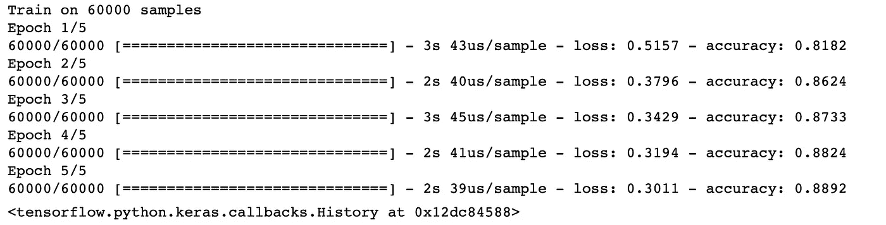
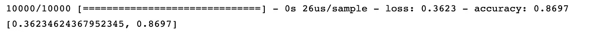

# 安装 Tensorflow 2 的分步指南

> 原文：<https://towardsdatascience.com/step-by-step-guide-to-install-tensorflow-2-0-67bc73e79b82?source=collection_archive---------12----------------------->

## 由于其易用性、效率和交叉兼容性，TensorFlow 2 将改变深度学习的格局。在这里，我们将学习安装和设置它。我们还将使用 TensorFlow 2 实现 MNIST 分类。

<<download the="" free="" book="" class="ae lb" href="https://www.understandingdeeplearning.com" rel="noopener ugc nofollow" target="_blank">了解深度学习，了解更多> ></download>

TensorFlow 2 将改变深度学习的格局。它制造了，

*   模型构建更简单，
*   任何平台上的生产部署都更加健壮，并且
*   支持强大的研究实验。

有了这些，深度学习将在研究和工业的各个领域变得更加主流。

TensorFlow 2 中集成了 Keras API。Keras 是一个极其流行的高级 API，用于构建和训练深度学习模型。在前进之前，重要的是要知道，

*   TensorFlow 1.x 也支持 Keras，但在 2.0 中，Keras 与 TensorFlow 平台的其余部分紧密集成。2.0 正在提供一个**单个**高级 API，以减少混乱并支持高级功能。
*   现在普遍使用的 Keras 是一个独立的开源项目，位于[www . Keras . io](http://www.keras.io)(2019 年 6 月)。然而，Keras 是一个 API 规范，现在在 TensorFlow 中也可以使用(详见[ [1](https://medium.com/tensorflow/standardizing-on-keras-guidance-on-high-level-apis-in-tensorflow-2-0-bad2b04c819a) )。

推荐阅读[ [1](https://medium.com/tensorflow/standardizing-on-keras-guidance-on-high-level-apis-in-tensorflow-2-0-bad2b04c819a) ]和[ [2](https://medium.com/tensorflow/whats-coming-in-tensorflow-2-0-d3663832e9b8) ]了解更多 TensorFlow 2.0 的好处。总之，TF 2.0 带来了易实施性以及巨大的计算效率，并与任何平台兼容，如 Android、iOS 和嵌入式系统，如 Raspberry Pi 和 Edge TPUs。

以前实现这些目标很困难，需要投入时间寻找替代方法。由于 TensorFlow 2 已经带来了所有这些，因此尽快迁移到它是势在必行的。

为此，我们将在这里学习安装和设置 TensorFlow 2.0。

# 先决条件

## 选项 1: Python 3.4+通过 Anaconda

Anaconda with Jupyter 提供了一种更简单的方法来安装和使用 Python。

安装 Anaconda 相对简单。关注最新 Python 3.4+的链接:[https://jupyter.org/install](https://jupyter.org/install)

类似于`pip`，对于 Anaconda，我们有`conda`来创建虚拟环境和安装包。

## 选项 2: Python(没有 Anaconda)

**a .安装 Python 3.4+**

检查您的当前版本。

```
$ python --version
```

或者，

```
$ python3 --version
```

我在 Mac 上有不同的 Python(Python 3.6 在 Anaconda 上)和 Ubuntu (Python 3.7)。我在上面看到的输出是，

```
Python 3.6.8 :: Anaconda custom (x86_64)*# Mac*Python 3.7.1*# Ubuntu*
```

无论是 Anaconda 中的 Python 还是其他都可以。

如果你的版本是**不是** 3.4+，安装如下。

```
$ brew update
$ brew install python *# Installs Python 3*$ sudo apt install python3-dev python3-pip
```

**b .安装 virtualenv**

`virtualenv`需要创建一个虚拟环境。其要求将在下一节中解释。

**Mac OS**

```
$ sudo pip3 install -U virtualenv*# system-wide install*
```

***Ubuntu***

```
$ sudo pip3 install -U virtualenv*# system-wide install*
```

**注** : `pip`(代替`pip3`)有时也会用到。如果两者之间不确定，使用`pip3`。你用`pip3`不会出错。如果您想知道是否可以使用`pip`，请运行以下命令

```
$ pip3 --version
pip 19.1.1 from /Users/inferno/anaconda/lib/python3.6/site-packages/pip (python 3.6)$ pip --version
pip 19.1.1 from /Users/inferno/anaconda/lib/python3.6/site-packages/pip (python 3.6)
```

在我的系统中，`pip`和`pip3`的版本是一样的。因此，我可以使用其中任何一个。

在下文中，我们将研究这两种方法的安装步骤。

# 第一步。用 Python 创建一个虚拟环境。

## 我们为什么想要虚拟环境？

虚拟环境是 Python 项目的隔离环境。在虚拟环境中，我们可以拥有一组完全独立的包(依赖项)和设置，它们不会与其他虚拟环境中的任何东西或默认的本地 Python 环境相冲突。

这意味着我们可以保留同一个包的不同版本，例如，我们可以对一个项目使用 scikit-learn 0.1，而对同一系统上不同虚拟环境中的另一个项目使用 scikit-learn 0.22。

## 实例化虚拟环境

**Ubuntu/Mac(没有 Anaconda 的 Python)**

```
$ virtualenv --system-site-packages -p python3 tf_2
```

上面的命令将创建一个虚拟环境`tf_2`。理解命令，

*   `virtualenv`将创建一个虚拟环境。
*   `--system-site-packages`允许虚拟环境中的项目`tf_2`访问全局站点包。默认设置不允许此访问(`--no-site-packages`以前用于此默认设置，但现在已弃用。)
*   `-p python3`用于设置`tf_2`的 Python 解释器。如果`virtualenv`是和 Python3 一起安装的，这个参数可以跳过。默认情况下，这是虚拟环境的 python 解释器。将 Python3.x 设置为解释器的另一个选项是`$ virtualenv --system-site-packages --python=python3.7 tf_2`。这提供了更多的控制。
*   `tf_2`是我们创建的虚拟环境的名字。这将在虚拟环境的位置创建一个物理目录。这个`/tf_2`目录包含 Python 编译器的副本和我们稍后将安装的所有包。

**Ubuntu/Mac 上的 Conda(来自 Anaconda 的 Python)**

如果您使用 Conda，您可以创建虚拟环境，

```
$ conda create -n tf_2
```

上面的命令也将创建一个虚拟环境`tf_2`。与以前不同，我们不需要安装不同的软件包来创建虚拟环境。内置的`conda`命令提供了这一点。

理解命令，

*   `conda`可用于创建虚拟环境、安装包、列出环境中已安装的包等。简而言之，`conda`执行`pip`和`virtualenv`执行的操作。然而，`conda`并不取代`pip`，因为有些封装在`pip`上可用，而在`conda`上不可用。
*   `create`用于创建虚拟环境。
*   `-n`是专用于`create`的参数。`-n`用于命名虚拟环境。`n`的值，即环境名，这里是`tf_2`。
*   其他有用的论据:类似于`virtualenv`中的`--system-site-packages`，可以使用`--use-local`。

# 第二步。激活虚拟环境。

激活虚拟环境。

**Ubuntu/Mac(没有 Anaconda 的 Python)**

```
$ source tf_2/bin/activate
```

**Ubuntu/Mac 上的 Conda(来自 Anaconda 的 Python)**

```
$ conda activate tf_2
```

激活后，终端将变为此`(tf_2) $`。

# 第三步。安装 TensorFlow 2.0。

以下说明对于这两个 Python 选项是相同的。

在开始 TensorFlow 安装之前，我们将更新`pip`。

```
(tf_2) $ pip install --upgrade pip
```

现在，安装 TensorFlow。

```
(tf_2) $ pip install --upgrade tensorflow==2.0.0-beta1
```

上面的`tensorflow`参数安装了一个 2.0.0-beta1 的纯 CPU 版本。

从 https://www.tensorflow.org/install/pip[选择合适的 TensorFlow 版本。](https://www.tensorflow.org/install/pip)

在写这篇文章的时候，我们有 tensorflow 2.0.0-beta1。这是推荐的。根据我们的要求，我们可以将参数更改为以下之一。

*   `tensorflow==2.0.0-beta1`-仅针对 CPU 的 TF 2.0 Beta 版本预览(*推荐*)。
*   `tensorflow-gpu==2.0.0-beta1`-用 [GPU 支持](https://www.tensorflow.org/install/gpu)预览 TF 2.0 Beta 版本。
*   `tensorflow`-CPU 专用的最新稳定版本*。*
*   `tensorflow-gpu`-支持 [GPU 的最新稳定版本](https://www.tensorflow.org/install/gpu)。
*   `tf-nightly`-仅针对 CPU 预览每夜构建。
*   `tf-nightly-gpu`-借助 [GPU 支持](https://www.tensorflow.org/install/gpu)预览每夜构建。

> **注意:对于 conda，我们也将使用** `**pip install**` **。TensorFlow 不具备** `**conda**` **。**

# 第四步。测试安装。

要通过终端快速测试安装，请使用

```
(tf_2) $ python -c "import tensorflow as tf; x = [[2.]]; print('tensorflow version', tf.__version__); print('hello, {}'.format(tf.matmul(x, x)))"
```

输出将是(忽略系统消息)，

```
tensorflow version 2.0.0-beta1
hello, [[4.]]
```

注意 TensorFlow 版本输出。如果它不是您安装的版本(在本例中是 2.0.0-beta1)，那么一定有问题。最有可能的情况是，之前安装了 TensorFlow 和/或当前安装失败。

## TensorFlow 2.0 示例

我们将使用 MNIST ( **fashion_mnist)** 图像分类示例来测试和学习 TensorFlow 2.0。

```
**import** **matplotlib.pyplot** **as** **plt**

**import** **tensorflow** **as** **tf**
layers = tf.keras.layers

**import** **numpy** **as** **np**

print(tf.__version__)
```

确保`tf.__version__`输出 2.x。如果版本较旧，检查安装或虚拟环境。

从`tf`开放数据集中下载 **fashion_mnist** 数据并进行预处理。

```
mnist = tf.keras.datasets.fashion_mnist(x_train, y_train), (x_test, y_test) = mnist.load_data()
x_train, x_test = x_train / 255.0, x_test / 255.0
```

为了熟悉这些数据，我们将从中绘制几个例子。

```
class_names = ['T-shirt/top', 'Trouser', 'Pullover', 'Dress', 'Coat', 'Sandal', 'Shirt', 'Sneaker', 'Bag', 'Ankle boot']plt.figure(figsize=(10,10))
**for** i **in** range(25):
 plt.subplot(5,5,i+1)
 plt.xticks([])
 plt.yticks([])
 plt.grid(**False**)
 plt.imshow(x_train[i], cmap=plt.cm.binary)
 plt.xlabel(class_names[y_train[i]])
plt.show()
```


现在，我们将逐层构建模型**。**

```
model = tf.keras.Sequential()
model.add(layers.Flatten())
model.add(layers.Dense(64, activation='relu'))
model.add(layers.Dense(64, activation='relu'))
model.add(layers.Dense(10, activation='softmax'))model.compile(optimizer='adam',
 loss='sparse_categorical_crossentropy',
 metrics=['accuracy'])
model.fit(x_train, y_train, epochs=5)
```

****

**请注意，该模型仅用于演示，因此仅在五个时期进行训练。**

**我们现在将根据测试数据测试模型的准确性。**

```
model.evaluate(x_test, y_test)
```

****

**我们将想象其中一个预测。我们将使用[ [3](https://www.tensorflow.org/tutorials/keras/basic_classification) 中的一些 UDF。**

```
**def** plot_image(i, predictions_array, true_label, img):
 predictions_array, true_label, img = predictions_array[i], true_label[i], img[i]
 plt.grid(**False**)
 plt.xticks([])
 plt.yticks([])

 plt.imshow(img, cmap=plt.cm.binary) predicted_label = np.argmax(predictions_array)

 **if** predicted_label == true_label:
 color = 'blue'
 **else**:
 color = 'red'

 plt.xlabel("**{}** **{:2.0f}**% (**{}**)".format(class_names[predicted_label],
 100*np.max(predictions_array),
 class_names[true_label]),
 color=color)**def** plot_value_array(i, predictions_array, true_label):
 predictions_array, true_label = predictions_array[i], true_label[i]
 plt.grid(**False**)
 plt.xticks([])
 plt.yticks([])
 thisplot = plt.bar(range(10), predictions_array, color="#777777")
 plt.ylim([0, 1]) 
 predicted_label = np.argmax(predictions_array)

 thisplot[predicted_label].set_color('red')
 thisplot[true_label].set_color('blue')
```

**我们将为测试图像找到预测，即每个图像属于 10 个类别中的每一个的概率。**

```
predictions = model.predict(x_test)i = 0
plt.figure(figsize=(6,3))
plt.subplot(1,2,1)
plot_image(i, predictions, y_test, x_test)
plt.subplot(1,2,2)
plot_value_array(i, predictions, y_test)
plt.show()
```

****

**正如我们在上面的图中看到的，“踝靴”的预测概率是最高的。为了进一步确认，我们将预测的标签输出为，**

```
predicted_label = class_names[np.argmax(predictions[0])]
print('Actual label:', class_names[y_test[0]]) 
print('Predicted label:', predicted_label)
```

****

# **第五步。停用虚拟环境**

**在关闭之前，我们将停用虚拟环境。**

**供`virtualenv`使用，**

```
(tf_2) $ deactivate
```

**供`conda`使用，**

```
(tf_2) $ conda deactivate
```

**在 TensorFlow 2.0 上有 MNIST 例子的 GitHub 库在这里是。**

# **结论**

*   **TensorFlow 2.0 带来了 keras API 的易用功能，例如逐层建模。**
*   **我们学习了安装 TensorFlow 2.0。**
*   **我们用 TF 2.0 完成了一个真实的 MNIST 数据分类示例。**

# **参考**

1.  **[Keras 标准化:TensorFlow 2.0 中的高级 API 指南](https://medium.com/tensorflow/standardizing-on-keras-guidance-on-high-level-apis-in-tensorflow-2-0-bad2b04c819a)**
2.  **[tensor flow 2.0 中的新功能](https://medium.com/tensorflow/whats-coming-in-tensorflow-2-0-d3663832e9b8)**
3.  **[训练你的第一个神经网络:基本分类](https://www.tensorflow.org/tutorials/keras/basic_classification)**

***本帖原帖发布于 2019 年 6 月 13 日*[*medium.com*](https://medium.com/@cran2367/install-and-setup-tensorflow-2-0-2c4914b9a265?postPublishedType=repub)*。***