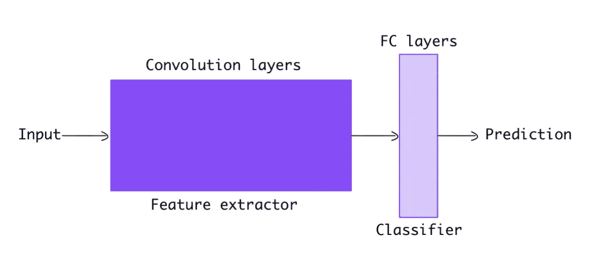
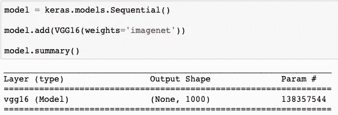
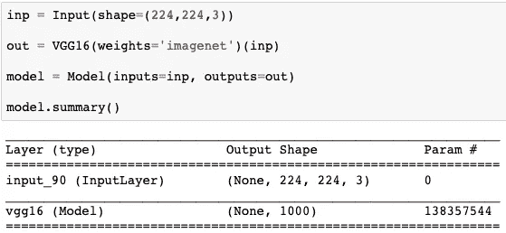
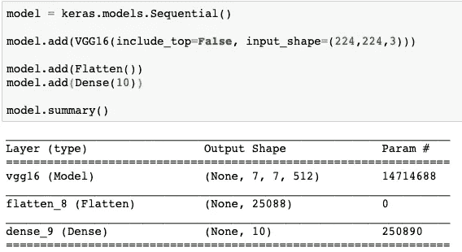
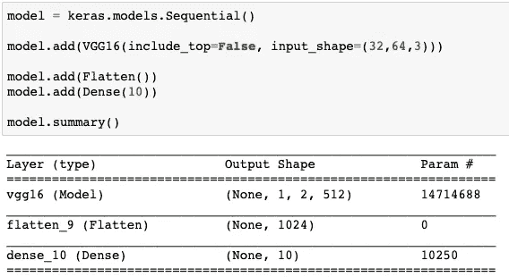
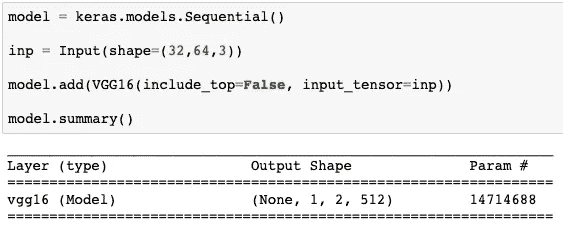
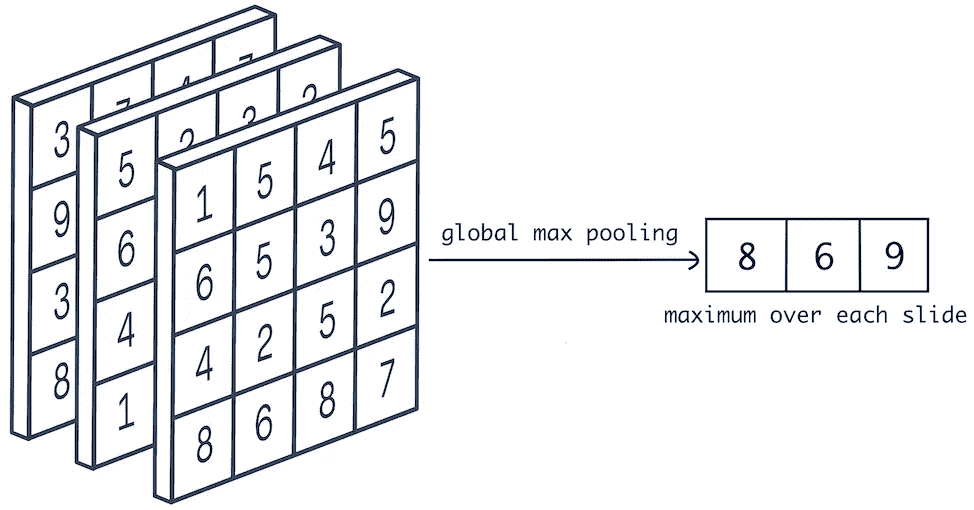
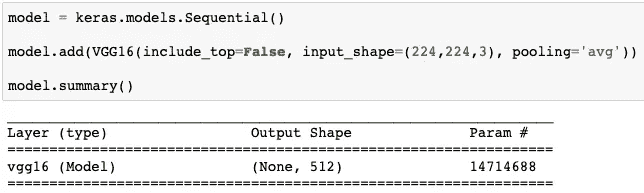
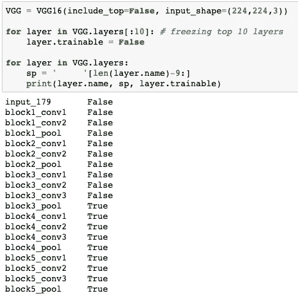
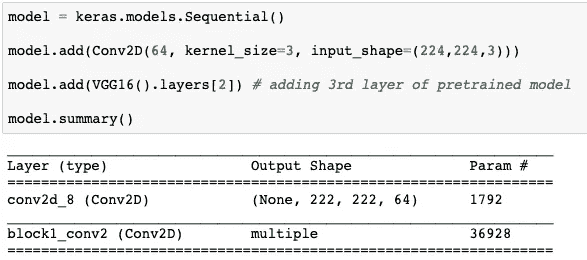

# 使用 Keras 预训练模型的简单指南

> 原文：<https://towardsdatascience.com/step-by-step-guide-to-using-pretrained-models-in-keras-c9097b647b29?source=collection_archive---------5----------------------->


Image by [Wendy](https://www.pexels.com/photo/brown-book-page-1112048/)

Keras 包含 10 个用于图像分类的预训练模型，这些模型是在 [**Imagenet**](http://www.image-net.org/) 数据上训练的。Imagenet 是一个包含 1000 种图像的大型图像数据集合。这些预训练的模型能够对落入这 1000 个图像类别中的任何图像进行分类。

本指南将涵盖以下概念。

*   **图像分类**车型。
*   在 Keras 中使用经过预训练的**型号。**
*   将我们自己的**分类器**附加到预训练的模型上。
*   **预训练模型中的输入形状**。
*   使用**池化**。
*   **冻结预应变模型中的**层。
*   使用**预训练模型的特定**层。

# 图像分类模型

简单来说，图像分类模型如下所示。



Pretrained Model

其包含**卷积**层，随后是**全连接**层。卷积层从图像中提取特征，全连接层使用提取的特征对图像进行分类。

当我们在图像数据上训练一个 **CNN** 时，可以看到网络的顶层学会从图像中提取**一般**特征，如边缘、颜色分布等。随着我们在网络中不断深入，各层往往会提取更多的特定特征。

现在，我们可以使用这些已经知道如何提取特征的预训练模型，避免从头开始训练。这个概念被称为**迁移学习**。

# 使用预训练模型

在 Keras 中有两种创建模型的方法。一个是**顺序**模型，另一个是**功能 API** 。顺序模型是层的线性堆叠。您可以通过调用`add`方法简单地在顺序模型中添加层。另一个是 functional API，它允许您创建可能包含多个输入和输出的更复杂的模型。

在本指南中，我将使用 **VGG16** 预训练模型的例子。我们可以类似地使用其他预训练模型。

Keras 的**应用**模块中提供了所有预训练模型。首先，我们必须导入预训练的模型，如下所示。

```
from keras.applications.vgg16 import VGG16
```

然后我们可以像下面这样添加预训练的模型，或者在**顺序**模型或者**功能 API** 中。



VGG in Sequential Model



VGG in Functional API

要使用预训练的权重，我们必须将参数`weights`设置为`imagenet`。默认值也被设置为`imagenet`。但是如果我们想从头开始训练模型，我们可以将`weights`参数设置为`None`。这将在网络中随机初始化权重。

# 附加我们自己的分类器

我们可以移除默认分类器，并在预训练模型中附加我们自己的分类器。为了排除默认分类器，我们必须将参数`include_top`设置为`false`。

在下面的例子中，我从 VGG 移除默认分类器，然后附加我自己的分类器，这只是一个`dense`层。我们还必须在添加一个`dense`层之前添加一个`flatten`层，将卷积层的 4D 输出转换为 2D，因为`dense`层接受 2D 输入。



Attaching a Classifier

# 输入形状

VGG16 在大小为`(224, 224)`的 RGB 图像上训练，这是网络的默认输入大小。我们也可以输入默认尺寸以外的图像。但是图像的高度和宽度应该超过 32 像素。当我们从网络中排除默认分类器时，我们只能馈送其他大小的图像。以下是显示`(32, 64, 3)`输入尺寸的示例。最后一个维度是 3，表示颜色通道的数量。



Changing input shape

我们也可以通过提供**输入张量**来定义输入形状，如下例所示。



Input Tensor

我们可以注意到，当我们提供有意义的较小尺寸的图像时，输出维度也被压缩。

# 联营

我们可以对卷积层的最终输出应用两种类型的池。**全球平均统筹**和**全球最高统筹**。

在全局最大池中，我们在张量的每张幻灯片上选择一个最大值，如下图所示。



Global Maximum Pooling

假设卷积层的输出张量具有形状`(7, 7, 512)`。如果我们应用全局最大池，我们从每张`(7, 7)`幻灯片中选择一个最大数字，这样我们总共有 512 个数字。平均池做同样的事情，除了取平均值而不是最大值。

为了使用池，我们必须将参数`pooling`设置为`max`或`avg`来使用这 2 个池。在下面的例子中，我使用的是全局平均池。



Global Average Pooling

当我们有一个**可变**大小的输入图像时，全局池是有用的。假设我们从不同大小的图像中得到 2 个不同大小的输出张量。输出张量的形状是`(3, 3, 512)`和`(7, 7, 512)`。在对这些张量中的任何一个应用全局池后，我们将得到一个长度为 512 的固定大小的向量。因此，在应用全局池后，可变大小图像的最终输出仍然是固定大小的向量。

# 冻结层

在训练网络之前，你可能想根据任务冻结一些层。一旦层被冻结，其权重在训练时不会更新。

在下面的例子中，我冻结了网络的前 10 层。我已经打印了网络中的所有层，以及它们是否可训练。我们可以看到只有前 10 层是不可训练的。



Freezing top 10 layers

如果当前数据集与训练这些网络的数据集相似，则最好冻结所有图层，因为两个数据集中的影像具有相似的要素。但是如果数据集不同，那么我们应该只冻结顶层并训练底层，因为顶层提取一般特征。数据集越相似，我们应该冻结的层就越多。

# 使用特定层

在上面的例子中，我们可以看到模型包含的所有层。我们也可以单独选择这些层中的任何一个，并在我们的模型中使用它们。

在下面的例子中，我将第三层预训练模型`(block1_conv2)`添加到顺序模型中。



Adding a specific layer

这几乎涵盖了在 Keras 中使用预训练模型时需要了解的所有用例。谢谢你的时间。