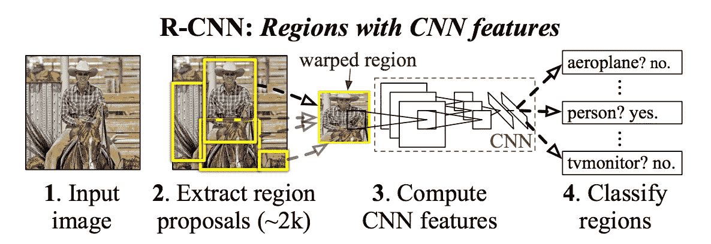
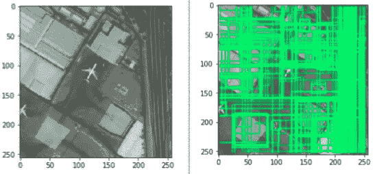
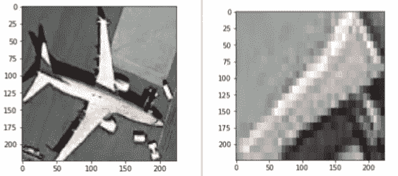
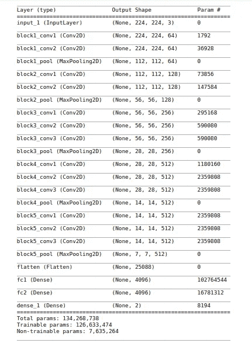
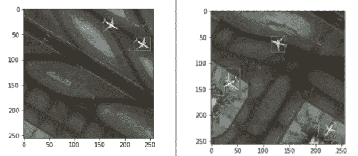

# 用 Python 从头开始一步一步实现 R-CNN

> 原文：<https://towardsdatascience.com/step-by-step-r-cnn-implementation-from-scratch-in-python-e97101ccde55?source=collection_archive---------2----------------------->

分类和目标检测是计算机视觉的主要部分。分类是找到图像中的内容，而对象检测和定位是找到该对象在图像中的位置。检测是一个更复杂的问题，因为我们需要找到对象在图像中的坐标。

为了解决这个问题，2014 年 Ross Girshick、Jeff Donahue、Trevor Darrell 和 Jitendra Malik 引入了 R-CNN。R-CNN 代表有 CNN 的地区。在 R-CNN 中，我们通过选择性搜索传递图像，并从结果中选择第一个 2000 区域建议，并在此基础上运行分类，而不是在大量区域上运行分类。这样，我们只需要对前 2000 个区域进行分类，而不是对大量区域进行分类。这使得该算法比以前的对象检测技术更快。R-CNN 有 4 个步骤。它们如下:

1.  通过选择性搜索图像并生成区域建议。
2.  使用地面真实数据计算建议区域的 IOU(交集/并集),并向建议区域添加标签。
3.  使用带标签的建议区域进行迁移学习。
4.  将测试图像传递给选择性搜索，然后传递来自训练模型的前 2000 个建议区域，并预测这些区域的类别。



R-CNN

我将使用来自[http://www.escience.cn/people/JunweiHan/NWPU-RESISC45.html](http://www.escience.cn/people/JunweiHan/NWPU-RESISC45.html)的飞机数据集在 Keras 从头开始实现完整的 R-CNN。要获得带注释的数据集，你可以从下面的链接下载。实现 RCNN 的代码也可以在下面提到的资源库中找到。

> https://github.com/1297rohit/RCNN.git

下载完数据集后，您可以继续执行下面的步骤。

```
import os,cv2,keras
import pandas as pd
import matplotlib.pyplot as plt
import numpy as np
import tensorflow as tf
```

第一步是导入实现 R-CNN 所需的所有库。我们需要 cv2 对图像进行选择性搜索。要使用选择性搜索，我们需要下载 opencv-contrib-python。要下载刚刚运行的 **pip，请在终端中安装 opencv-contrib-python** ，并从 pypi 安装它。

```
ss = cv2.ximgproc.segmentation.createSelectiveSearchSegmentation()
```

下载 opencv-contrib 后，我们需要初始化选择性搜索。为此，我们增加了上述步骤。

```
def get_iou(bb1, bb2):
    assert bb1['x1'] < bb1['x2']
    assert bb1['y1'] < bb1['y2']
    assert bb2['x1'] < bb2['x2']
    assert bb2['y1'] < bb2['y2'] x_left = max(bb1['x1'], bb2['x1'])
    y_top = max(bb1['y1'], bb2['y1'])
    x_right = min(bb1['x2'], bb2['x2'])
    y_bottom = min(bb1['y2'], bb2['y2']) if x_right < x_left or y_bottom < y_top:
        return 0.0 intersection_area = (x_right - x_left) * (y_bottom - y_top) bb1_area = (bb1['x2'] - bb1['x1']) * (bb1['y2'] - bb1['y1'])
    bb2_area = (bb2['x2'] - bb2['x1']) * (bb2['y2'] - bb2['y1']) iou = intersection_area / float(bb1_area + bb2_area - intersection_area)
    assert iou >= 0.0
    assert iou <= 1.0
    return iou
```

现在，我们正在初始化函数，从通过选择性搜索计算出的盒子中计算出基础真值盒子的 IOU(交集/并集)。要了解更多关于计算欠条，你可以参考下面的链接。

> [https://www . pyimagesearch . com/2016/11/07/intersection-over-union-iou-for-object-detection/](https://www.pyimagesearch.com/2016/11/07/intersection-over-union-iou-for-object-detection/)

```
train_images=[]
train_labels=[]
for e,i in enumerate(os.listdir(annot)):
    try:
        if i.startswith("airplane"):
            filename = i.split(".")[0]+".jpg"
            print(e,filename)
            image = cv2.imread(os.path.join(path,filename))
            df = pd.read_csv(os.path.join(annot,i))
            gtvalues=[]
            for row in df.iterrows():
                x1 = int(row[1][0].split(" ")[0])
                y1 = int(row[1][0].split(" ")[1])
                x2 = int(row[1][0].split(" ")[2])
                y2 = int(row[1][0].split(" ")[3])
                gtvalues.append({"x1":x1,"x2":x2,"y1":y1,"y2":y2})
            ss.setBaseImage(image)
            ss.switchToSelectiveSearchFast()
            ssresults = ss.process()
            imout = image.copy()
            counter = 0
            falsecounter = 0
            flag = 0
            fflag = 0
            bflag = 0
            for e,result in enumerate(ssresults):
                if e < 2000 and flag == 0:
                    for gtval in gtvalues:
                        x,y,w,h = result
                        iou = get_iou(gtval,{"x1":x,"x2":x+w,"y1":y,"y2":y+h})
                        if counter < 30:
                            if iou > 0.70:
                                timage = imout[y:y+h,x:x+w]
                                resized = cv2.resize(timage, (224,224), interpolation = cv2.INTER_AREA)
                                train_images.append(resized)
                                train_labels.append(1)
                                counter += 1
                        else :
                            fflag =1
                        if falsecounter <30:
                            if iou < 0.3:
                                timage = imout[y:y+h,x:x+w]
                                resized = cv2.resize(timage, (224,224), interpolation = cv2.INTER_AREA)
                                train_images.append(resized)
                                train_labels.append(0)
                                falsecounter += 1
                        else :
                            bflag = 1
                    if fflag == 1 and bflag == 1:
                        print("inside")
                        flag = 1
    except Exception as e:
        print(e)
        print("error in "+filename)
        continue
```



Running selective search on an image and getting proposed regions

上面的代码是预处理和创建要传递给模型的数据集。在这种情况下，我们可以有两个类。这些类别是提议的区域可以是前景(即飞机)还是背景。所以我们将前景(即飞机)的标签设为 1，背景的标签设为 0。在上面的代码块中执行以下步骤。

1.  循环浏览图像文件夹，使用代码 **ss.setBaseImage(image)** 将每个图像逐一设置为选择性搜索的基础
2.  使用代码**ss . switchtoselectvesearchfast()**和 **ssresults = ss.process()** 初始化快速选择性搜索并获得建议区域
3.  迭代通过选择性搜索传递的所有前 2000 个结果，并使用上面创建的 **get_iou()** 函数计算建议区域和注释区域的 IOU。
4.  现在，由于一个图像可以有许多负样本(即背景)和一些正样本(即飞机)，所以我们需要确保我们有良好的正样本和负样本的比例来训练我们的模型。因此，我们设定从一幅图像中最多收集 30 个阴性样本(即背景)和阳性样本(即飞机)。

运行上面的代码片段后，我们的训练数据就准备好了。List **train_images=[]** 将包含所有图像，而 **train_labels=[]** 将包含所有标记飞机图像为 1、非飞机图像(即背景图像)为 0 的标签。



Positive sample on right, Negative sample on left

```
X_new = np.array(train_images)
y_new = np.array(train_labels)
```

在完成创建数据集的过程后，我们将把数组转换成 numpy 数组，这样我们就可以轻松地遍历它，并以有效的方式将 datatset 传递给模型。

```
from keras.layers import Dense
from keras import Model
from keras import optimizers
from keras.preprocessing.image import ImageDataGenerator
from keras.optimizers import Adamfrom keras.applications.vgg16 import VGG16
vggmodel = VGG16(weights='imagenet', include_top=True)
```

现在，我们将对 imagenet 权重进行迁移学习。我们将导入 VGG16 模型，并将图像净重放入模型中。要了解更多关于迁移学习的内容，你可以参考下面链接上的文章。

> [https://medium . com/@ 1297 rohit/transfer-learning-from-scratch-using-keras-339834 b 153 b 9](https://medium.com/@1297rohit/transfer-learning-from-scratch-using-keras-339834b153b9)

```
for layers in (vggmodel.layers)[:15]:
    print(layers)
    layers.trainable = FalseX= vggmodel.layers[-2].output
predictions = Dense(2, activation="softmax")(X)
model_final = Model(input = vggmodel.input, output = predictions)
opt = Adam(lr=0.0001)
model_final.compile(loss = keras.losses.categorical_crossentropy, optimizer = opt, metrics=["accuracy"])
model_final.summary()
```

在循环的这一部分，我们冻结了模型的前 15 层。之后，我们取出模型的倒数第二层，然后添加一个 **2 单位的 softmax 密集层**，因为我们只有 2 个类要预测，即前景或背景。之后，我们使用 **Adam 优化器编译模型，学习率为 0.001** 。我们使用**分类交叉熵**作为损失，因为模型的输出是分类的。最后，将使用 model_final.summary()打印模型摘要。下面附上总结的图片。



Model Summary

```
from sklearn.model_selection import train_test_split
from sklearn.preprocessing import LabelBinarizerclass MyLabelBinarizer(LabelBinarizer):
    def transform(self, y):
        Y = super().transform(y)
        if self.y_type_ == 'binary':
            return np.hstack((Y, 1-Y))
        else:
            return Y
    def inverse_transform(self, Y, threshold=None):
        if self.y_type_ == 'binary':
            return super().inverse_transform(Y[:, 0], threshold)
        else:
            return super().inverse_transform(Y, threshold)lenc = MyLabelBinarizer()
Y =  lenc.fit_transform(y_new)X_train, X_test , y_train, y_test = train_test_split(X_new,Y,test_size=0.10)
```

创建模型后，现在我们需要将数据集分为训练集和测试集。在此之前，我们需要一次性编码标签。为此，我们使用了 **MyLabelBinarizer()** 并对数据集进行编码。然后我们使用 sklearn 的 **train_test_split** 来拆分数据集。我们保留 10%的数据集作为测试集，90%作为训练集。

```
trdata = ImageDataGenerator(horizontal_flip=True, vertical_flip=True, rotation_range=90)
traindata = trdata.flow(x=X_train, y=y_train)
tsdata = ImageDataGenerator(horizontal_flip=True, vertical_flip=True, rotation_range=90)
testdata = tsdata.flow(x=X_test, y=y_test)
```

现在我们将使用 Keras **ImageDataGenerator** 将数据集传递给模型。我们将对数据集进行一些增强，如水平翻转、垂直翻转和旋转，以增加数据集。

```
from keras.callbacks import ModelCheckpoint, EarlyStoppingcheckpoint = ModelCheckpoint("ieeercnn_vgg16_1.h5", monitor='val_loss', verbose=1, save_best_only=True, save_weights_only=False, mode='auto', period=1)early = EarlyStopping(monitor='val_loss', min_delta=0, patience=100, verbose=1, mode='auto')hist = model_final.fit_generator(generator= traindata, steps_per_epoch= 10, epochs= 1000, validation_data= testdata, validation_steps=2, callbacks=[checkpoint,early])
```

现在我们使用 **fit_generator** 开始模型的训练。

```
z=0
for e,i in enumerate(os.listdir(path)):
    if i.startswith("4"):
        z += 1
        img = cv2.imread(os.path.join(path,i))
        ss.setBaseImage(img)
        ss.switchToSelectiveSearchFast()
        ssresults = ss.process()
        imout = img.copy()
        for e,result in enumerate(ssresults):
            if e < 2000:
                x,y,w,h = result
                timage = imout[y:y+h,x:x+w]
                resized = cv2.resize(timage, (224,224), interpolation = cv2.INTER_AREA)
                img = np.expand_dims(resized, axis=0)
                out= model_final.predict(img)
                if out[0][0] > 0.70:
                    cv2.rectangle(imout, (x, y), (x+w, y+h), (0, 255, 0), 1, cv2.LINE_AA)
        plt.figure()
        plt.imshow(imout)
        break
```

现在一旦我们创建了模型。我们需要对那个模型做预测。为此，我们需要遵循以下步骤:

1.  传递选择性搜索的图像。
2.  使用 **model_final.predict(img)** 将选择性搜索的所有结果作为输入传递给模型。
3.  如果模型的输出表明该区域是前景图像(即飞机图像),并且如果置信度高于定义的阈值，则在建议区域的坐标上在原始图像上创建边界框。



Output of the model

正如你在上面看到的，我们在建议的区域创建了一个盒子，在这个盒子里，模型的精度超过了 0.70。这样，我们可以在图像上进行定位，并使用 R-CNN 执行对象检测。这就是我们如何使用 keras 从零开始实现 R-CNN 架构。

您可以从下面提供的链接中获得完全实现的 R-CNN。

> [https://github.com/1297rohit/RCNN.git](https://github.com/1297rohit/RCNN.git)

如果你想从头开始一步一步地学习**人脸检测和人脸识别**，那么你可以点击链接阅读我的文章:[https://medium . com/@ 1297 rohit/step-step-step-Face-Recognition-code-implementation-from-scratch-in-python-cc 95 fa 041120](https://medium.com/@1297rohit/step-by-step-face-recognition-code-implementation-from-scratch-in-python-cc95fa041120)

享受 R-CNN！