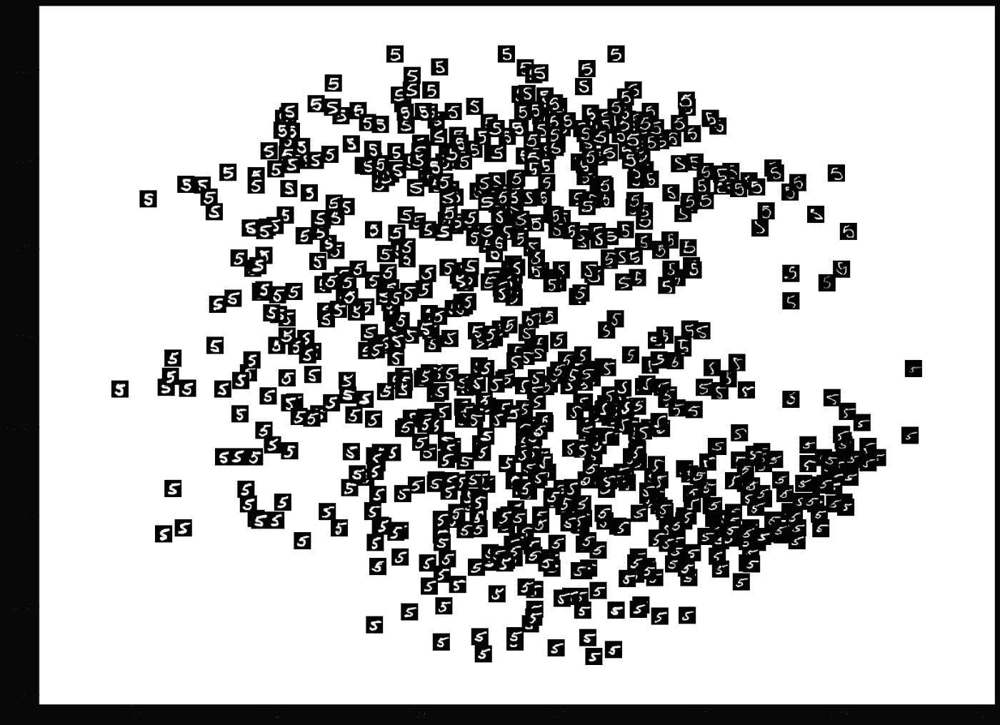
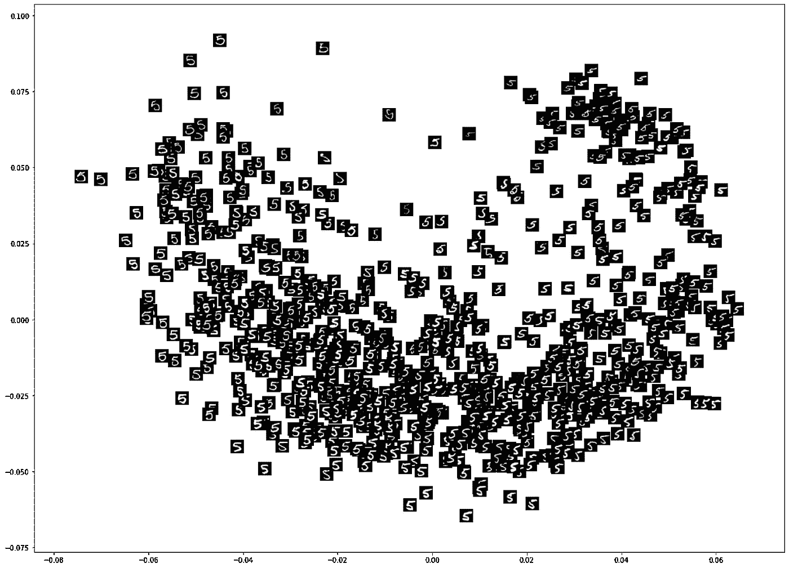
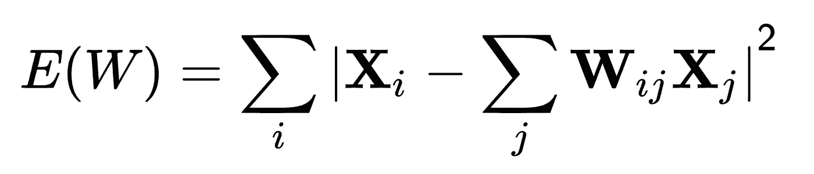
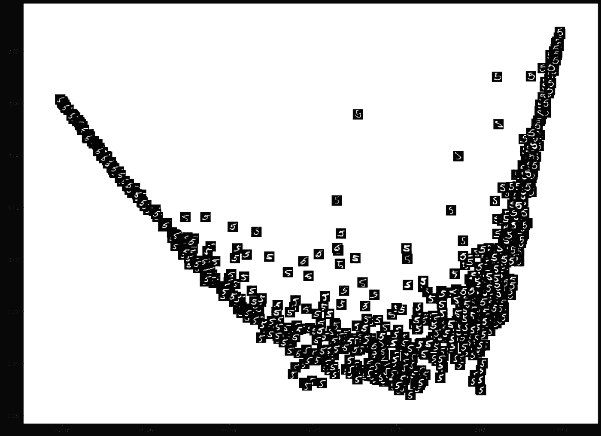
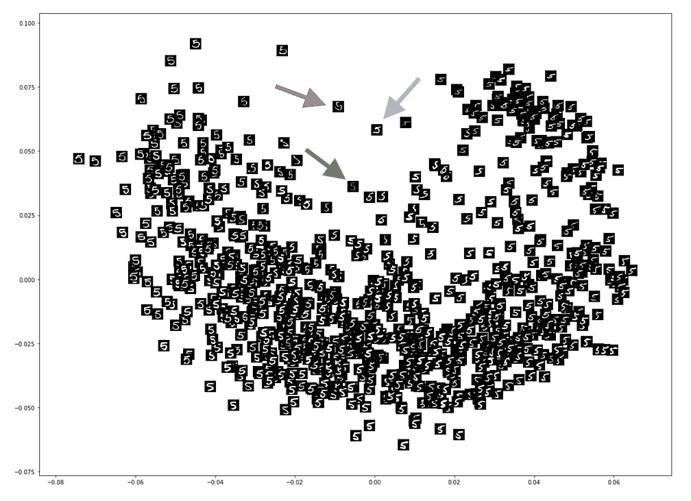
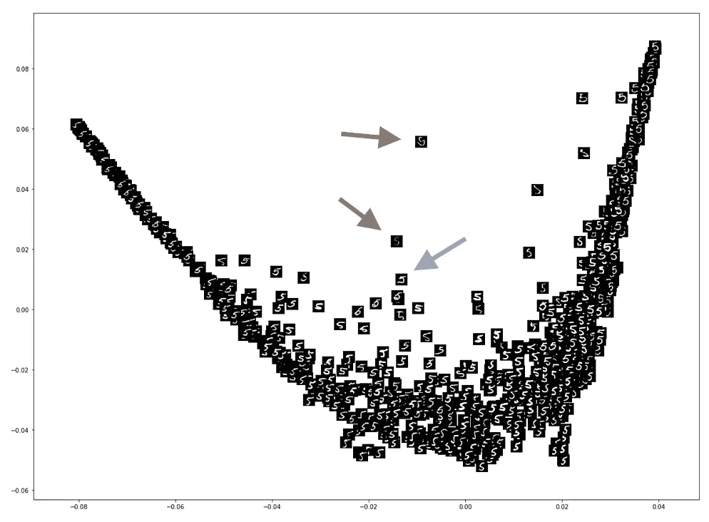

# 基于机器学习的分步信号处理:流形学习

> 原文：<https://towardsdatascience.com/step-by-step-signal-processing-with-machine-learning-manifold-learning-8e1bb192461c?source=collection_archive---------12----------------------->

## 关于如何使用 Python 中的 Isomap 和 LLE 从头开始执行非线性降维的教程

[https://www.delish.com/cooking/recipe-ideas/a24788319/how-to-make-donuts-at-home/](https://www.delish.com/cooking/recipe-ideas/a24788319/how-to-make-donuts-at-home/)

在我关于使用机器学习进行信号处理的第一篇文章中，我介绍了用于降维的**主成分分析** (PCA)和**独立成分分析** (ICA)。我们能够看到如何使用这些方法来**减少**数据中的特征数量。然而，它们是**线性**方法:当我们的数据中存在**非线性**关系时，它们并不总是表现良好。

这就是**流形学习**的用武之地。**流形**是局部欧几里得的任何空间。简单来说，你可以把它想象成任何在小尺度上近乎“扁平”的物体。例如，地球是圆的，但在我们看来它是平的。地球是一个流形:局部它是平的，但整体上我们知道它是一个球体。然后，流形学习通过将数据表示为嵌入在高维空间中的**低维**流形来进行降维。

在本文中，我将介绍两种流形学习算法: **Isomap** 和**局部线性嵌入** (LLE)。它们都在 [scikit-learn](https://scikit-learn.org/stable/modules/classes.html#module-sklearn.decomposition) 上有现成的实现，这对您的项目很有用，但是出于本文的目的，我将展示如何从头开始实现这些方法。

我将在整篇文章中提供代码片段，您可以在 [Github](https://github.com/kayoyin/signal-processing) 上找到完整的代码和示例数据集。

出于演示的目的，我对一组数字为 5 的手写图像进行了降维处理。每个图像的大小为 28x28，在应用算法之前，我们对数据进行整形以获得大小为 784 的 1D 向量。首先，这是使用主成分分析的 2D 投影:

我们可以看到这个投影组图像在一定程度上具有相似的空间特征:在 x 轴上，左侧的图像具有较粗的线条，而右侧的图像具有较细的线条。在 y 轴上，顶部的图像更加直立，或者稍微向左倾斜，而底部的图像向右倾斜。

# Isomap

Isomap 是一种基于谱理论的流形学习方法，用于保持测地线距离。Isomap 可以理解为多维标度(MDS)的扩展:经典的 MDS 执行**主坐标分析**，基本上是基于数据点之间成对的**欧几里得距离**对距离矩阵而不是协方差矩阵进行 PCA。Isomap 使用**测地线距离**代替，这是数据点之间的**最短路径**的距离。

首先，这里有一个简单的代码提供了 Isomap 的步骤:计算数据集的**距离** **矩阵**，获得**最短路径**矩阵，并对其应用 **MDS** 。

距离矩阵可根据输入数据集计算，如下所示，其中我们使用欧几里德距离。

现在，我们将实现 MDS。对于 MDS，重要的是首先**双中心**输入距离矩阵。双定心操作不会改变任何一对点之间的距离，但允许生成的矩阵具有简化后续操作的属性。

接下来，像在 PCA 中一样，我们计算中心距离矩阵的**特征向量**和相应的**特征值**。

然后，我们通过选择具有两个最大特征值的特征向量来选择两个主分量，并且我们获得将用于投影的形状为 784×2 的子空间变换矩阵 *W* 。

以下是我们将 Isomap 应用于示例数据所获得的结果:

在上面的结果中，我们可以观察到投影有一个“U”形，图像的变化似乎遵循这个“U”形。这是因为 Isomap 寻找非线性流形，这就是它能够检测潜在的现有曲线的原因。

左上末端的形状较圆，并且“5”的下半部分较大，而在右上末端，“5”的下半部分较小。与 PCA 投影不同，它似乎不会用更细或更粗的线来分隔数字。

此外，检查该投影的不同区域，图像看起来与它们的每个邻居更相似，不像 PCA 投影，其中不具有相似形状的图像可以彼此相邻。PCA 投影是一种线性缩减，可能擅长拾取**线性** **相关性**，例如像素值和线条粗细之间的相关性，但是 Isomap 投影可能会找到有意义的非线性相关性。

# 局部线性嵌入

局部线性嵌入(LLE)是另一种流形学习算法。LLE 背后的想法是计算一组**权重**，将每个数据点描述为其邻居的**线性组合。**然后，类似于前面的方法，它使用基于特征向量的优化技术来寻找低维嵌入，使得点与其邻居之间的线性组合关系被**保持**。

我们像以前一样通过计算距离矩阵来开始 LLE，除了这次，我们感兴趣的是每个数据点的**最近邻居**的点。

接下来，LLE 找到最小化以下成本函数的权重矩阵 *W* :

这个函数就是每个点 *X_i* 和它从它的邻居*X _ j*的重建之间的误差之和。我们可以使用 FastLLE 算法实现这个部分，如下所示。

以下是使用 LLE 进行降维的结果:

LLE 投影给出了比 ICA 投影更尖锐的“V”形，我们甚至可以认为这种表示与以前的 Isomap 投影相比有些失真。这是因为 LLE 是一个**局部**方法，而 Isomap 是一个**全局**方法，所以 LLE 更倾向于**扭曲**投影空间，而 Isomap 更稳定。

有趣的是，在 LLE 和 Isomap 投影中，远离一般聚类的点对应于相同的图像。这两种方法都确定了相同的数据点，这些数据点看起来确实不像“5”的其余部分，并将它们投射到远离其余部分的空间中，如下所示。

Left: Isomap, right: LLE

我希望你喜欢我的文章，谢谢你的关注！请随时告诉我你想在我的[信号处理库](https://github.com/kayoyin/signal-processing):)里看到什么