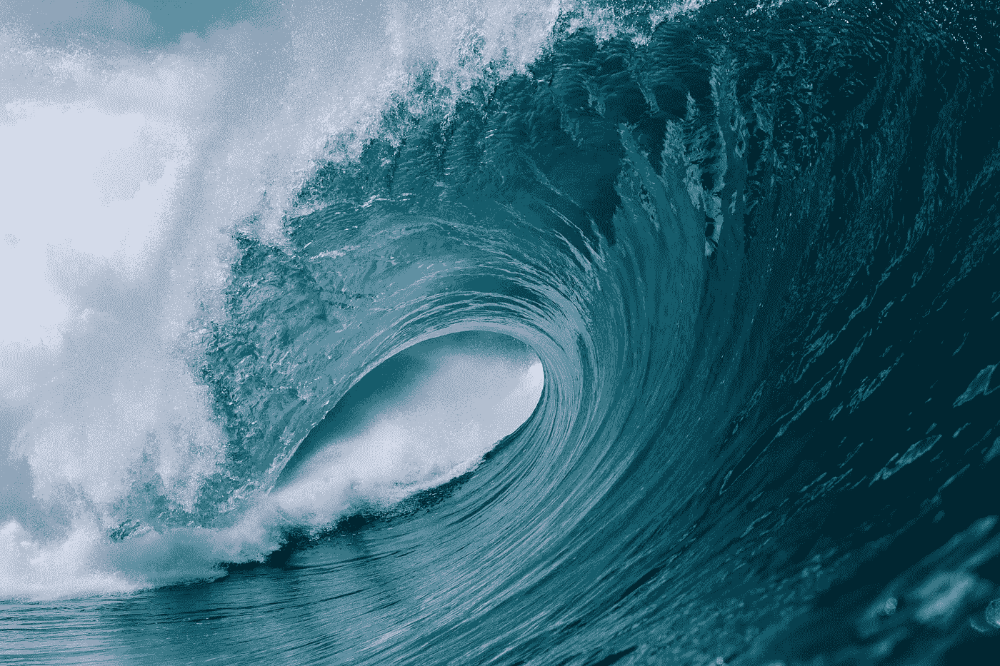
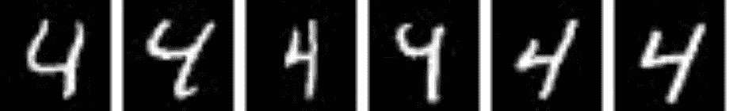
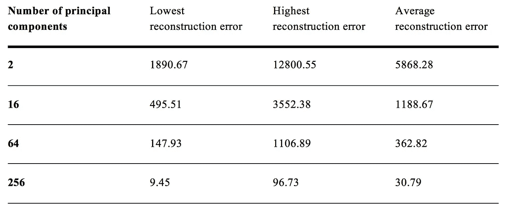
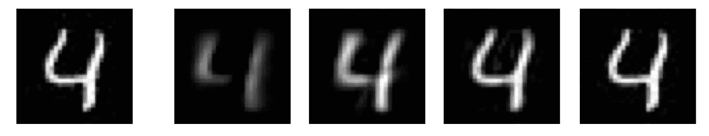
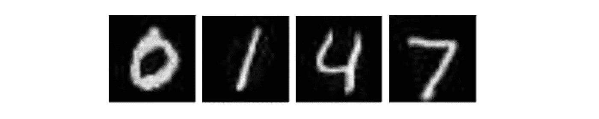
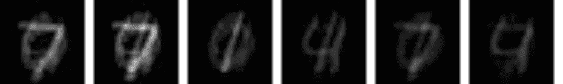
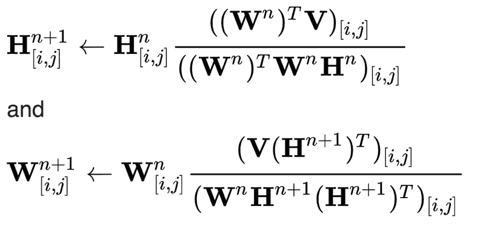
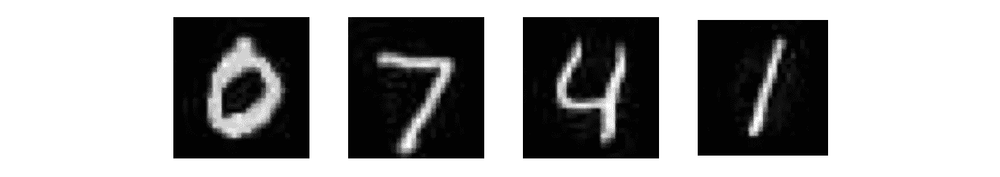

# 逐步信号处理与机器学习:主成分分析，独立分量分析，NMF 源分离，降维

> 原文：<https://towardsdatascience.com/step-by-step-signal-processing-with-machine-learning-pca-ica-nmf-8de2f375c422?source=collection_archive---------13----------------------->

## 关于如何在 Python 中从头开始使用 PCA 执行降维以及使用 ICA 和 NMF 执行源分离的教程

[https://www.surfline.com/contests/wave-of-the-winter/north-shore/2018-2019/](https://www.surfline.com/contests/wave-of-the-winter/north-shore/2018-2019/)

信号处理在许多数据科学任务中至关重要。一旦我们开始处理音频文件、图像甚至生物测量，了解处理这些数据的技术是很有用的。

在这篇文章中，我将介绍三种算法，你可以用在两个用例中:**主成分分析** (PCA)用于降维和特征提取，**独立成分分析** (ICA)和**非负矩阵分解** (NMF)用于源分离。

所有这三个方法在 [scikit-learn](https://scikit-learn.org/stable/modules/classes.html#module-sklearn.decomposition) 上都有现成的实现，对您的项目很有用，但出于本文的目的，我将展示如何从头开始实现这些方法，只使用 [OpenCV](https://opencv.org/) 打开和保存图像，使用 [NumPy](https://numpy.org/) 处理矩阵。

我将在整篇文章中提供代码片段，您可以在 [Github](https://github.com/kayoyin/signal-processing) 上找到完整的代码和示例数据集。

# 主成分分析

我将总结实现 PCA 的要点，并向热心的读者推荐这篇[很棒的文章](https://sebastianraschka.com/Articles/2014_pca_step_by_step.html)，它给出了更全面的解释。

PCA 的主要目的是找到我们数据集的特征子集**能够最好地捕获整个数据的信息，以便我们能够以最小的信息损失**减少维度**。例如，我们可以通过在将训练图像数据送入深度神经网络进行分类之前降低其维度来缩短计算时间。**

有几种降维技术，如高相关滤波器、随机森林或后向特征消除。PCA 通过识别**主成分**来完成这项任务，主成分是原始特征的线性组合。提取这些分量，使得第一主分量包含数据集中的最大方差，第二主分量包含与第一主分量不相关的剩余方差，依此类推。

作为一个例子，我们将使用手写数字 4 的 982 个图像的数据集。每个图像的尺寸为 28x28，但是在应用 PCA 之前，我们首先**对数据进行整形**,使得每个图像成为大小为 784 的 1D 向量，并且整个数据集的形状为 982x784。

Input images

为了使用 PCA 将特征的数量减少到 *k* ，我们首先计算这个数据集的**协方差** **矩阵**。

然后，我们计算协方差矩阵的**特征向量**和相应的**特征值**。

为了选择 *k* 主分量，我们首先按照特征值的降序对特征向量和特征值对进行排序。我们选择具有 *k 个*最大特征值的特征向量，因为它们包含关于数据的最多信息。

最后我们得到一个形状为 784 x *k* 的矩阵 *W* ，我们将其与数据集的转置取乘积，得到降维后的数据 *k* x 982。

为了重建已经减少的数据，我们简单地将减少的数据与之前获得的矩阵 *W* 的逆矩阵相乘。这样，我们获得了与原始数据具有相同维度的数据。最后，我们将 2D 数据整形为 982x28x28 维的 3D 矩阵，这样我们就有了一组可以再次可视化的图像。

为了计算重建误差，我们可以通过比较原始图像和重建图像之间的每个图像像素来计算均方误差。

Results of dimensionality reduction with PCA, error measured with MSE

以上结果表明，主成分**越多**我们取，**越低** **重构误差**就越大。这是因为维数降低得越多，我们丢失的可用于重建的原始信息就越多。选择最佳分量数以优化降维和信息之间的权衡的一种常见方法是计算每个分量数的 PCA 的**解释方差**，并选择方差在 95–99%之间的分量数。这确保我们不会丢失太多关于数据的信息。

Left to right: original image, reconstruction from 2, 16, 64, 256 components

# 独立成分分析

现在，我们有 1000 张图像，是四个手写数字 0，1，4，7 的组合，比例各不相同。我们希望从混合图像中恢复源图像。

Source images

Mixed data

一种分离线性混合信号的方法是通过**独立分量分析** (ICA)。信号的混合可以定义为矩阵乘积 *WH = X* ，其中 *H* 是包含不同源信号的矩阵， *W* 定义混合期间源的比率， *X* 是混合输出。然后 ICA 旨在恢复矩阵 *W* ，这样我们就可以计算 *H = WinvX* ，其中 *Winv* 是 *X* 的逆。

ICA 不能应用于任何混合信号。首先，混合信号必须是源信号的**线性组合**，原因如前矩阵乘积所示。接下来，ICA 假设源信号是**独立的**，而混合信号不是(因为它们共享相同的源信号)，并利用这一事实进行分离。最后，ICA 还假设源信号为**非高斯信号**，并使用中心极限定理，该定理意味着两个信号之和的分布比两个信号本身的分布更接近高斯分布。

我们可以使用 [FastICA](https://en.wikipedia.org/wiki/FastICA) 算法高效地进行 ICA。该算法用维度(n_sources，n_samples)的**随机** **权重** *W* 初始化，其中我们使用先验信息，我们有 4 个想要分离的源，并且我们有 1000 个图像样本。对于我们期望分离的每个源，我们迭代与该源相关联的权重。

对于 *W* 中的每个权重向量 *w* ，该算法寻求最大化投影 *v* = *w.TX* 的**非高斯程度(其中 *w.T* 是 *w* 的转置)。为了测量非高斯性，该算法使用一个**非二次非线性函数***f(v)*它的一阶导数 *g(v)* 和它的二阶导数 *g'(v)。***

对于这些函数，我们使用**梯度下降**来更新权重。

然后，我们**归一化**和**去相关**权重。去相关是为了确保后续源的迭代不会返回与在前一次迭代中获得的源相同的输出。最后，我们检查**收敛**来决定是停止还是继续迭代。

为了从 ICA 的输出 *W* 中获得原始源，我们简单地取 *W* 和给定输入数据的乘积，以获得维度矩阵( *n_sources* ， *n_features* )，然后我们将它整形为原始的 3D 维度以获得图像。

Four sources separated by ICA

上述 ICA 的结果表明，它能够在某种程度上提取图像 0、4 和 7，但它不能提取图像 1，相反，它返回的图像似乎是几个源图像叠加在一起。让我们看看我们是否能做得更好…

# **非负矩阵分解**

分离混合信号的第二种方法是**非负矩阵分解** (NMF)。像 ICA 一样，NMF 也旨在将混合数据 *X* 分解成矩阵 *WH = X* 的乘积，但这里有一个附加约束，即每个矩阵 *X，W，H* 都是**非负的**。这种约束在数据本质上是非负的应用中提供了优势，并且给出了具有更好的可解释性的结果。

为了应用 NMF，我们从随机初始化 *W* 和 *H* 的**开始。**

然后，在每次迭代中，我们首先更新新的 *H* 给定旧的 *H* 和 *W* ，然后更新新的 *W* 给定 *H* 和旧的 *W* ，使用**乘法更新规则**直到收敛。

[Multiplicative update rules](https://en.wikipedia.org/wiki/Non-negative_matrix_factorization)

我们使用 *X* 和 *WH* 之间的 Frobenius 范数来检查收敛性。

最后，我们对获得的矩阵进行归一化，并在保存可视化之前对其进行整形，使其包含 2D 图像。

Four sources separated by NMF

正如我们在上面看到的，在我们的例子中，NMF 算法比独立分量分析好得多。

感谢阅读我的文章，我希望你喜欢它！我希望开始向我的[信号处理库](https://github.com/kayoyin/signal-processing)添加更多的方法，所以如果接下来有什么需要我介绍的，请告诉我:)