# 使用 Spotify API 逐步可视化音乐流派

> 原文：<https://towardsdatascience.com/step-by-step-to-visualize-music-genres-with-spotify-api-ce6c273fb827?source=collection_archive---------11----------------------->

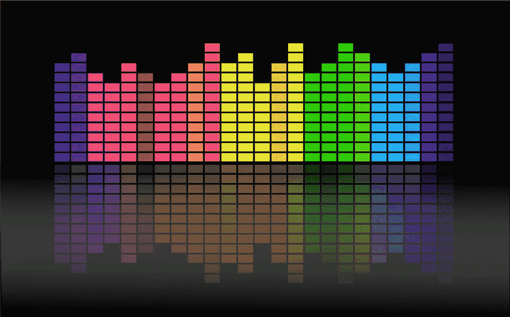

Source: OpenClipart-Vectors on Pixabay

你听什么，你就是什么。每个人都有他/她喜欢的音乐家，这些音乐家通常擅长某些类型的音乐。我们很容易把一首歌归类为蓝调、爵士或乡村音乐，那么它背后的寓意是什么呢？我们能说出或看到音乐**和数据**的区别吗？由于 Spotify 的[开放 API，我们可以理解音乐的不同方面，包括速度、音调和音频特征，并构建网络应用程序来有效地回答我们的问题。](https://developer.spotify.com/)

在这篇文章中，我们使用 R Shiny 作为与 Spotify API 通信的接口，并将其托管在 [shinyapps.io](https://www.shinyapps.io/) 上。通过此处的链接[可以访问该网站](https://panda.shinyapps.io/spotify_analysis/)。然而，shinyapp.io 有一些限制——每月 25 个小时的免费活动时间。如果您无法正常连接，请下个月再试。否则，如果您已经安装了 R，下面的命令可以在您自己的环境中运行它。

```
shiny::runGitHub("Music_ANA","BarryPan")
```

这篇文章有两个部分。第一部分是关于构建可视化应用程序的步骤；在第二部分，我们可以分享它如何帮助我们确定不同的音乐流派。阅读后，你将能够建立自己的音乐分析工具，并对 Spotify API 有更多的见解。

# 步骤 1:阅读 API 文档

F 首先，我们需要了解我们的数据以及我们拥有哪些信息。Spotify 为其 API 提供了全面的解释，开发者或分析师在开始做任何事情之前阅读它是非常重要的。根据我们的经验，我们认为速度、音调和音频特征是识别音乐流派的决定性因素，它们应该是我们要可视化的内容。

在 Spotify API 中，它提供了许多音频功能。我们选择某些特性，下面显示了[定义](https://developer.spotify.com/documentation/web-api/reference/tracks/get-audio-features/):

*   **声学:**一个从 0.0 到 1.0 的音轨是否声学的置信度度量。1.0 表示音轨是声学的高置信度。
*   **可跳舞性:**可跳舞性描述了一首曲目在音乐元素组合的基础上适合跳舞的程度，包括速度、节奏稳定性、节拍强度和整体规律性。值 0.0 最不适合跳舞，1.0 最适合跳舞。
*   **能量:**能量是从 0.0 到 1.0 的量度，代表强度和活动的感知量度。通常，高能轨道感觉起来很快，很响，很嘈杂。例如，死亡金属具有高能量，而巴赫前奏曲在音阶上得分较低。对该属性有贡献的感知特征包括动态范围、感知响度、音色、开始速率和一般熵。
*   **speech ness:**speech ness 检测音轨中是否存在口语单词。越是类似语音的录音(例如脱口秀、有声读物、诗歌)，属性值就越接近 1.0。高于 0.66 的值描述可能完全由口语单词组成的轨道。介于 0.33 和 0.66 之间的值描述可能包含音乐和语音的轨道，可以是分段的，也可以是分层的，包括说唱音乐。低于 0.33 的值很可能代表音乐和其他非语音类轨道。
*   **效价:**从 0.0 到 1.0 的一个量度，描述一个音轨所传达的音乐积极性。高价曲目听起来更积极(例如，快乐、愉快、欣快)，而低价曲目听起来更消极(例如，悲伤、沮丧、愤怒)。

对于其他目的，您可以选择不同的变量来满足您的需要。一旦你知道你要向你的观众传达什么，让我们进入下一步。

# 步骤 2:后端开发

potify API 遵循 OAuth 认证，因此用户需要在开始连接之前申请 API 密钥。此外，R 中有一个`[spotifyr](https://cran.r-project.org/web/packages/spotifyr/index.html)` [包](https://cran.r-project.org/web/packages/spotifyr/index.html)使得请求变得容易多了。

在这个可视化中，我们想按艺术家对数据进行分组。由于不同的艺术家擅长不同类型的音乐，我们可以根据艺术家来比较不同风格的音乐。为了提供有用的信息，我们需要计算每个艺术家的平均速度、受欢迎程度、声音、舞蹈性、精力、语速和价值。还要计算大调的频率，看音乐流派的差异。这些计算可以用 R 中的`dplyr`包轻松完成，输出可以用`ggplot`包可视化。

我们希望用户决定他们对谁感兴趣，而不是只选择某些艺术家。为此，我们需要一个文本输入小部件和一个搜索按钮来激活。一旦用户点击按钮，程序应该连接到 Spotify API 并获取信息，进行计算并将其可视化，并将信息更新到前端。在 Shiny 中，我们可以使用`observeEvent`来触发功能并完成任务序列。

# 第三步:用户界面设计

数据可视化是科学和艺术的结合。因此，考虑什么是传达你的想法的最佳方式以及你的观众的感受是非常重要的。

在我们的可视化工具中，有很多我们想要传递给观众的信息，不同的信息可以用不同的方式说出来。经过一些尝试，我们找到了显示这些信息的正确方法，如下所示:

*   平均速度可以用词来表达。
*   艺术家的音调频率可以用水平条形图来表示。为了便于阅读，我们只列出了艺术家的前 5 个关键词。
*   艺术家的平均音频特征可以在雷达图中显示。

除了这些信息之外，还有一些对用户做出判断至关重要的信息。因此，我们在 Spotify 上包括了歌曲的受欢迎程度、歌曲数量和播放时间。此外，我们还应该在网站上包含相册图片，使其看起来更花哨。

A 同样，颜色也是数据可视化成功的一个重要因素。为了避免过于分散注意力，我们选择了白底黑字。我们可以使用 Spotify 的品牌颜色， [html 颜色代码](https://brandpalettes.com/spotify-color-codes/) `#1DB954,`作为我们绘图的主色调。第一个版本看起来是这样的。它包含了所有的功能，但对用户没有太大的吸引力。通过改变字体，情节大小，添加标志和音频功能的解释，我们可以使它成为我们的最终版本。现在好多了，至少我是这么认为的。

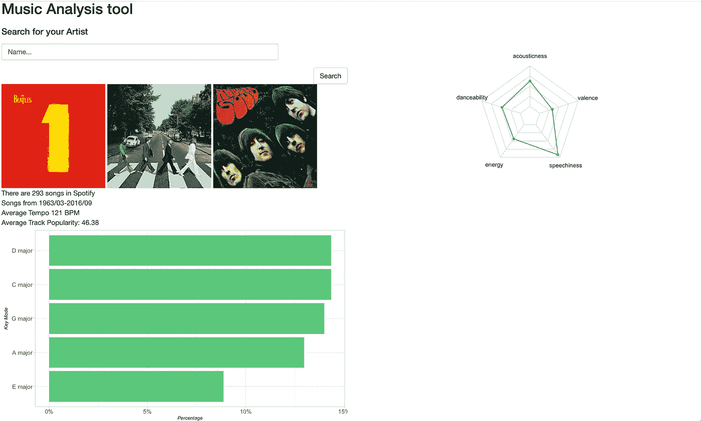

Figure 1: First Version for our tool

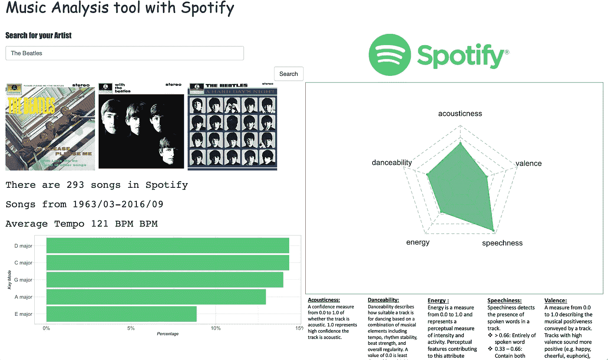

Figure 2: Final Version for our tool

# 第四步:托管它

要让每个人都能看到你的结果，你需要找到一个服务器来托管它。我们有很多选择，包括一些流行的云平台，像 [GCP](https://cloud.google.com/) 、 [AWS](https://aws.amazon.com/) 或 [Azure](https://azure.microsoft.com/en-us/) ，价格实惠。对于 Shiny 应用程序，还有另一个选择:shinyapp.io。这是一个为 Shiny 应用程序设计的平台，根据你选择的软件包，价格从 0 美元到 299 美元不等。如果你想将闪亮的应用发布到 shinyapp.io，只需在 R Studio 中点击“发布”并链接到你的 Shiny app . io 账户。

有了这个工具，我们可以看到不同风格的艺术家的样子。这里有一些流行蓝调、乡村音乐、爵士乐和流行音乐艺术家的例子。

# **布鲁斯**

乔安妮·肖·泰勒

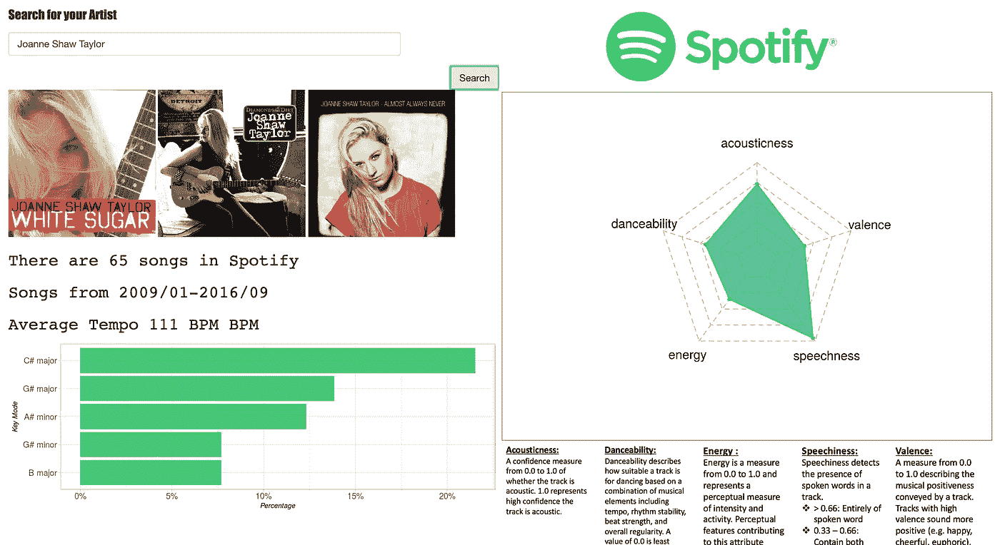

Figure 3: Joanne Shaw Taylor

**乔·博纳马萨**

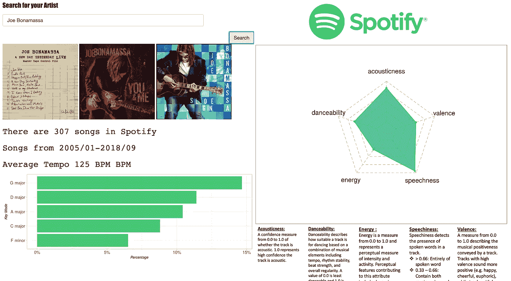

Figure 4: Joe Bonamassa

**迈克·济托**

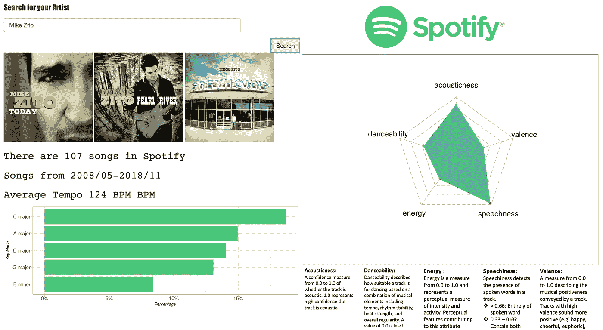

Figure 5: Mike Zito

# 乡村音乐

克里斯·斯台普顿

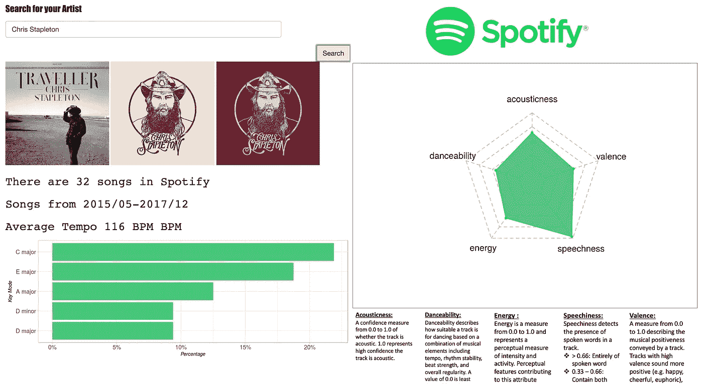

Figure 6: Chris Stapleton

**佛罗里达乔治亚边境线**

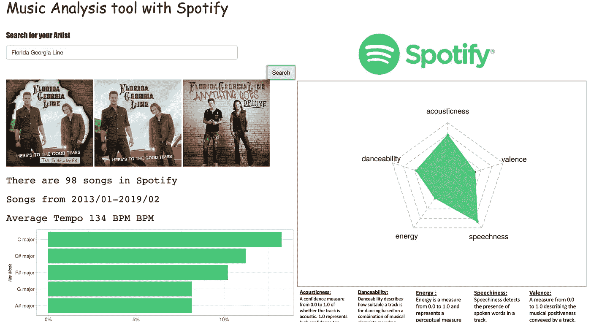

Figure7: Florida Georgia Line

杰森·阿尔迪恩

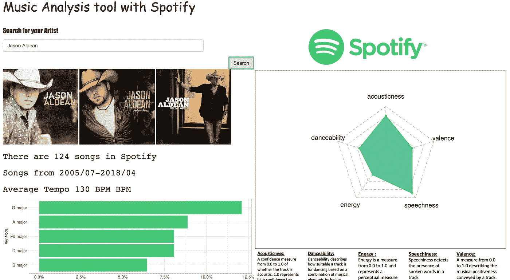

Figure 8: Jason Aldean

# 爵士乐

**保罗·西蒙**

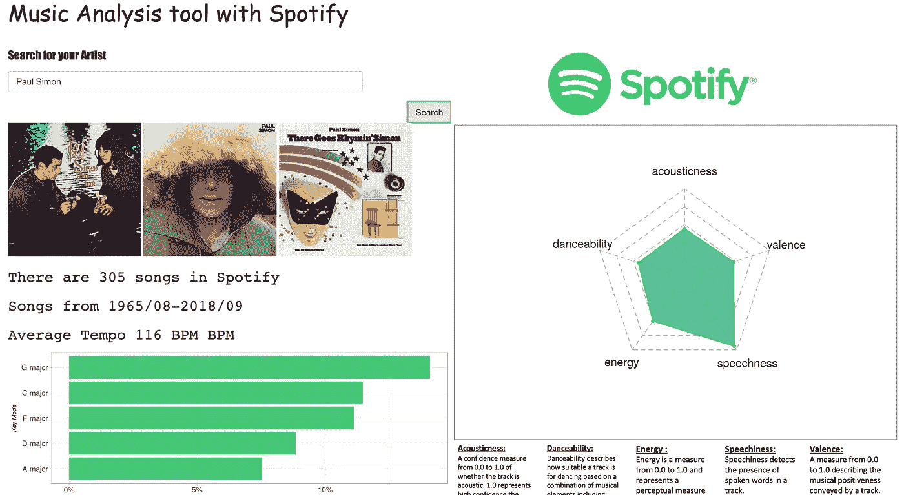

Figure 9: Paul Simon

**范·莫里生**

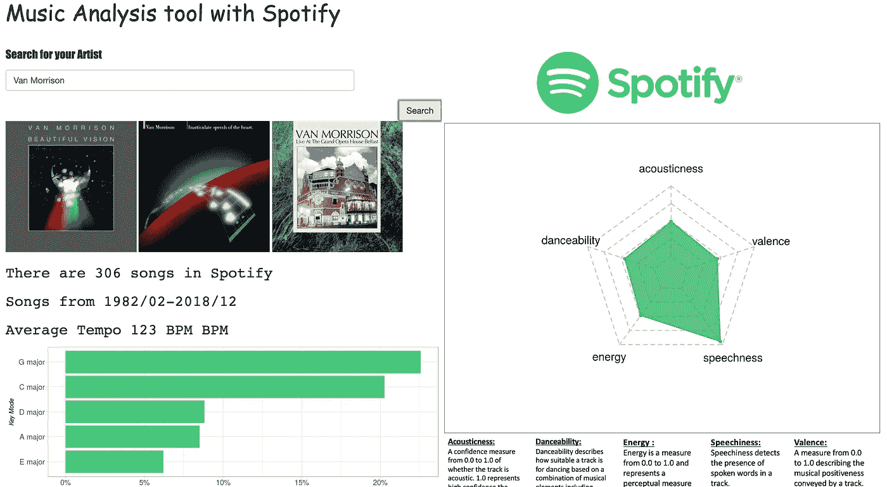

Figure 10: Van Morrison

**威利·尼尔森**

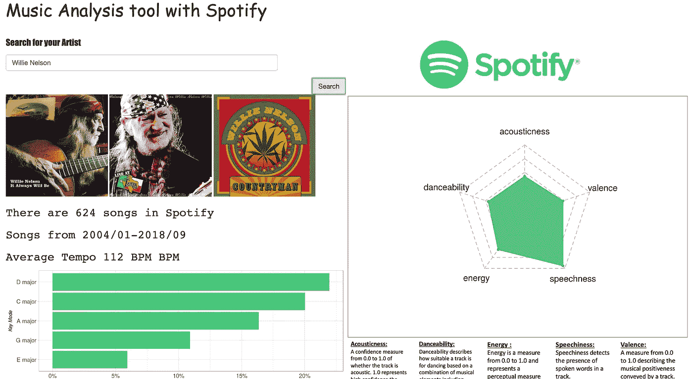

Figure 11: Willie Nelson

# 流行音乐

**Lady Gaga**

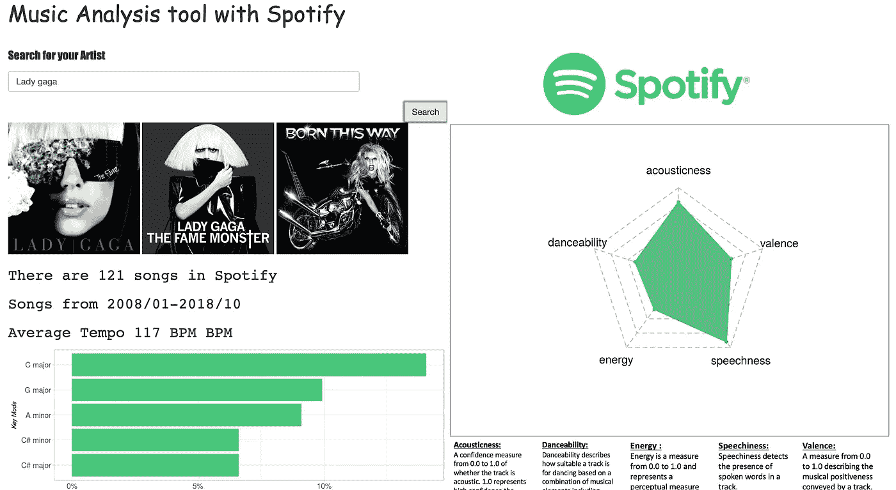

Figure 12: Lady Gaga

**魔力红**

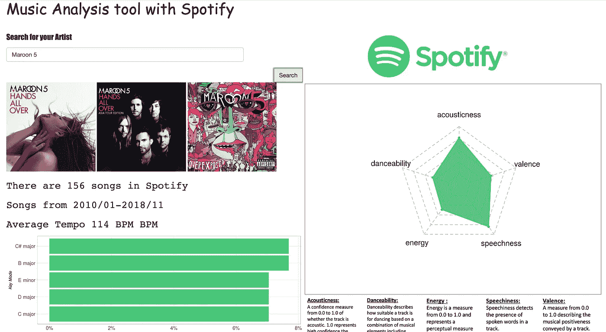

Figure 14: Maroon 5

泰勒·斯威夫特

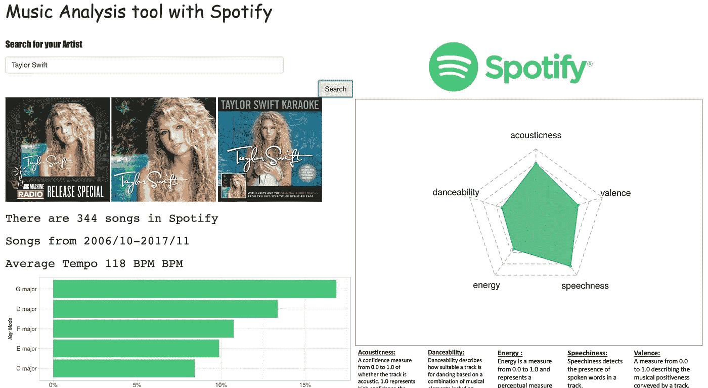

Figure 15: Taylor Swift

根据上面的视觉效果，我们可以看到这些流派之间的一些差异:

*   与布鲁斯、乡村音乐和爵士乐相比，流行音乐倾向于使用更多样的音调。至于蓝调、乡村和爵士艺术家，前 5 个调占据了他们创作的 50%以上，相比之下，流行音乐家不会只关注某些调。
*   乡村音乐和爵士音乐通常使用大调来给听众带来一些积极的印象。
*   蓝调在“能量”和“化合价”上的价值较低，因为它们是蓝调。

# C 结束语

在这篇文章中，我们从一个简单的问题开始:我们如何区分音乐流派。我们想回答这个问题，所以我们试图找到数据，找出我们想要表达和证明我们思想的方式，然后玩电脑。感谢开放的环境，包括公共 API、开放数据和像 R 这样的开放资源软件，让编程能力有限的人开发自己的创作并与世界分享真的很简单。如果你对这个世界有什么想法，让我们一起努力，用数据把它可视化。