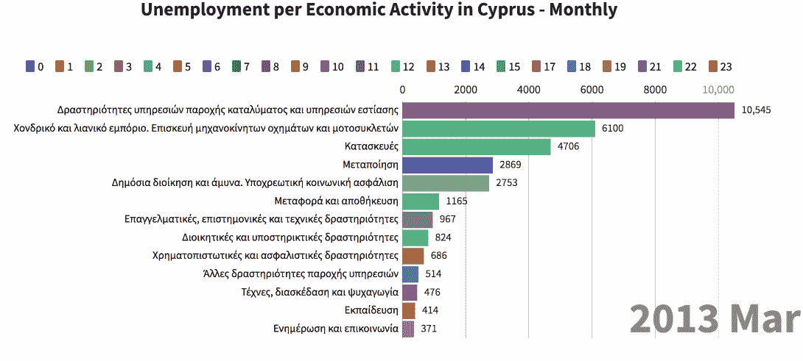
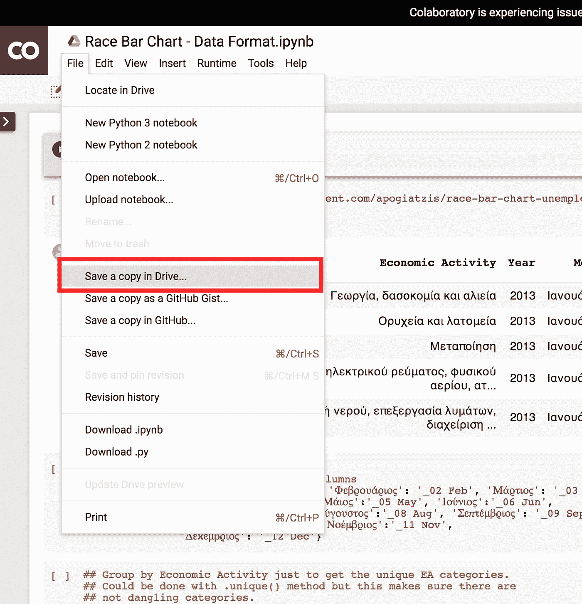
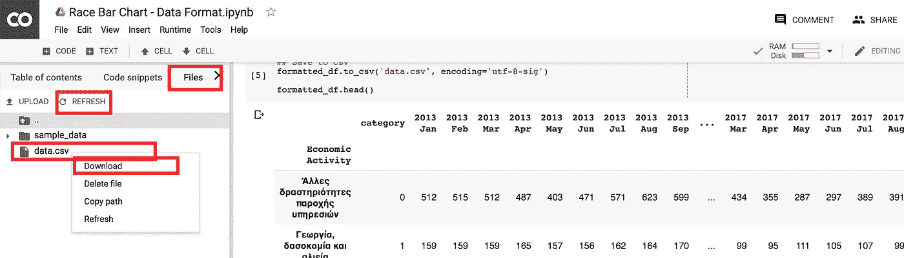
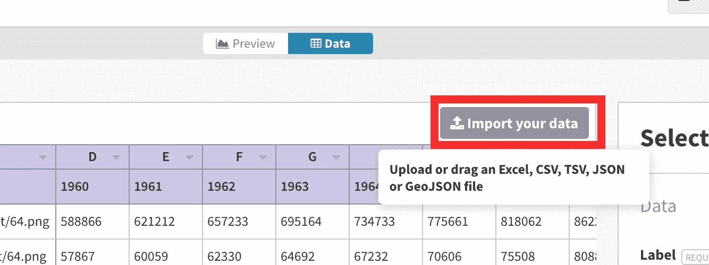
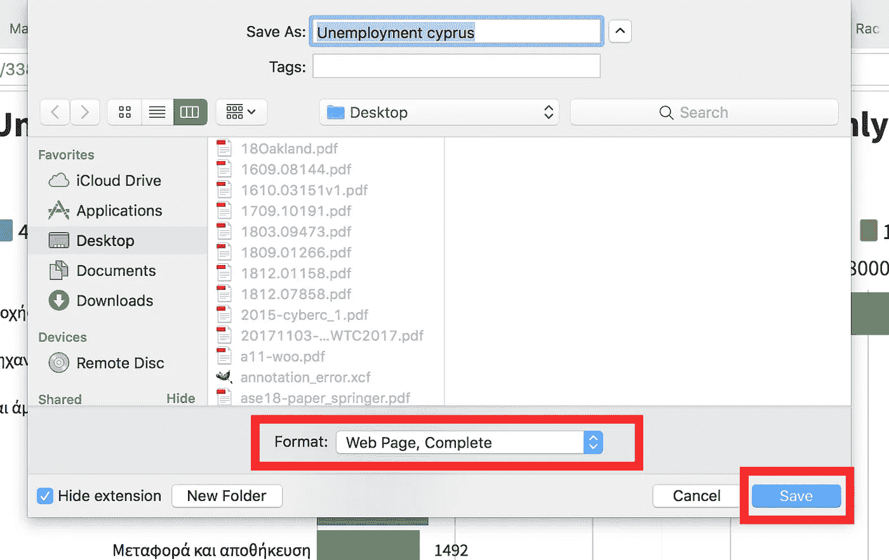

# 逐步教程-创建条形图竞赛动画

> 原文：<https://towardsdatascience.com/step-by-step-tutorial-create-a-bar-chart-race-animation-da7d5fcd7079?source=collection_archive---------8----------------------->

## 使用 Python 和 flore 构建 2019 年的虚拟场景

Photo by [Lukas Blazek](https://unsplash.com/photos/mcSDtbWXUZU?utm_source=unsplash&utm_medium=referral&utm_content=creditCopyText) on [Unsplash](https://unsplash.com/collections/1837872/analytics?utm_source=unsplash&utm_medium=referral&utm_content=creditCopyText)

2019 年是条形图竞赛动画年。当然，这种类型的动画已经存在了一段时间，其受欢迎程度在 2019 年初达到顶峰。虽然我不是一个大粉丝——因为同样的见解可以用一个简单的线图来解释——但这是一个有趣的可视化和毫无疑问的审美愉悦观看。

因此，这篇文章是关于如何用 Python 和 T2 创建条形图比赛动画的一步一步的教程。事实上，fluore 将是创建可视化的主要工具，但格式化数据集也需要一些 python 脚本。我的意思是，如果数据格式化可以手动完成(当然是在可接受的时间内),你可以跳过 Python。).

最终的输出应该是这样的:(如果你想知道，Y 轴标签是用希腊语写的，但是数据集就是这样)

Bar Chart Race Visualisation

或者，如果上面的 GIF 预览滞后，您可以在以下网站在线观看:

 [## 塞浦路斯失业——种族歧视可视化

preview . floride . studio](https://preview.flourish.studio/338947/pzgmyVTKTwIOqgG7X10bF6MlXioP4cn0LjH464Jwa5OD0S7jll0nQzSOPR3VKiz_/) 

最后，这里是 GitHub 存储库，包含所有相关的代码和数据:

 [## apogiatzis/种族条形图-失业

### 塞浦路斯每项经济活动失业率的种族柱状图---- apogiatzis/种族柱状图----失业率

github.com](https://github.com/apogiatzis/race-bar-chart-unemployment) 

# 资料组

出于本教程的考虑，我将使用来自塞浦路斯开放数据门户的数据集。更准确地说，该数据集包含自 2013 年以来每个月每个经济活动类别申请失业津贴的人数。想象这些数字如何随时间循环将会很有趣，这也是利用国家开放数据门户提供的一些数据集的好机会。

我已经在数据格式化代码中包含了数据集的链接，但下面的链接仅供参考:

 [## 国家开放数据门户

### Αποστολή της Υπηρεσίας είναι η εφαρμογή της κυβερνητικής πολιτικής στον τομέα των κοινωνικών ασφαλίσεων με την…

www.data.gov.c](https://www.data.gov.cy/node/3779?language=en) 

# 这个计划

这个计划很简单，因为荣替我们处理繁重的工作。便利的是，荣有一个模板来创造这种特殊的观想。因此，我们将使用 Python 将数据集转换成适合 flower 模板数据格式的格式。然后，数据将被导入并繁荣，而视觉化将被捕捉。

# 逐步地

正如承诺的，本教程是一步一步的。因此，让我们继续前进，并遵循以下步骤。

## 第一步:创建繁荣账户

请通过以下链接创建一个“繁荣”账户:

 [## 蓬勃发展|数据可视化和讲故事

### 蓬勃发展是最强大的平台，数据可视化和讲故事

app . floride . studio](https://app.flourish.studio/register) 

## 步骤 2:打开条形图竞赛模板

使用下面的链接打开条形图比赛模板，并点击“创建可视化”:

 [## 条形图竞赛

### 让您自己的条形图比赛与蓬勃发展

app . floride . studio](https://app.flourish.studio/@flourish/bar-chart-race) 

单击“数据”选项卡，观察数据应如何格式化以使模板工作。请注意，每个条形是一行，每个时间点是一列(除了可选的“区域”和“图像 URL”)。

## **第三步:数据格式化**

让我们继续并格式化要导入的数据，使其更加丰富多彩。我已经在 Colab 中为此编写了 Python 代码，因此不需要任何环境设置:

 [## 谷歌联合实验室

### Bar Race 数据格式

colab.research.google.com](https://colab.research.google.com/drive/1TZHUPS1ReaNrijIlS28INqxzBqRo3O_T) 

打开 Jupyter 笔记本，并在您的硬盘上保存一份副本，如下所示:

当笔记本被复制后，您应该能够运行代码，从而继续运行所有的单元格。代码将格式化数据，并在本地 Jupyter 笔记本电脑中生成一个 *data.csv* 文件。

我不会在这篇文章中解释代码是如何工作的，但是为了更容易理解，我在笔记本中加入了注释。

## 步骤 4:下载格式化数据并导入

可以通过展开左侧窗格，点击“文件”选项卡，右键单击 data.csv 文件(如果还没有，点击刷新)并点击“下载”来下载 *data.csv* 。

## 步骤 5:导入文件并修复列名

返回到 Flourish 模板，点击“导入您的数据”并选择刚刚下载的 *data.csv* :

出于某种原因，fluorescence 将月份列的名称转换为“dd/mm/YY”格式的日期，但是，这在可视化上看起来不太好，所以让我们用最初给定的名称来重命名这些列。

通过在电子表格编辑器中打开 CSV 文件，复制列名并将其粘贴到 Flourish data 选项卡中，这是一个相当容易的手动操作。

## 步骤 6:调整可视化和预览

回到预览选项卡，可视化应该已经与您的导入数据动画。此外，在颜色、布局、字体大小等方面，Flourish 提供了调整视觉效果的机会，所以你可以根据自己的喜好随意改变。

最后，点击左上方的“全屏”图标，打开一个只包含可视化的新网页。

## 步骤 7:保存观想

到现在为止，你应该会看到在一个新窗口中产生的可视化效果，并且赞叹它是多么的整洁！干得好！但是是时候把它保存在某个地方了。

有两种方法，视情况而定，一种可能比另一种更可取。

1.  **另存为 HTML 文件:**可视化的全屏预览可以保存为本地独立的 HTML 页面。右键单击页面上的任意位置，然后选择“另存为”并确保格式设置为“网页，完整”

2.**记录为 GIF:** 将可视化图像记录为 GIF 或任何其他视频格式，这使得它易于分享(在大多数情况下)。有许多程序可以做到这一点。如果你用的是 Windows，一定要用**的 ScreenToGif** ，如果用的是 Mac，一定要用**的 LiCEcap** 。使用这两个的主要原因是它们没有录音长度的限制。无论如何，可以随意使用任何达到相同目的的软件。

请注意，由于帧速率的限制，录制为 GIF 可能会给动画带来延迟。

# 结束了

这就是辅导的结束。我希望这足够简单易懂。保存在本地的观想可以在博客、演示、网站或任何你喜欢的地方分享。

虽然我们只使用免费功能，但我想说，如果你对数据可视化感兴趣，升级到高级账户是值得的。

任何反馈都非常受欢迎。下次见！