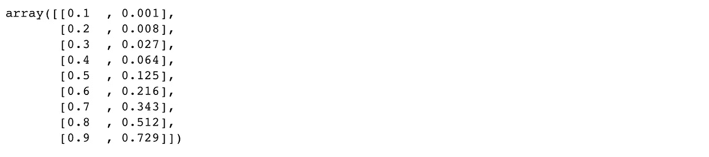
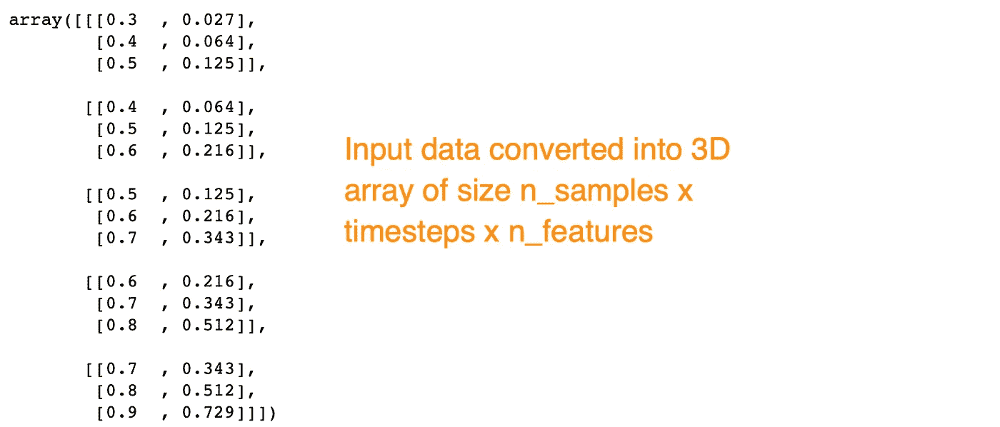
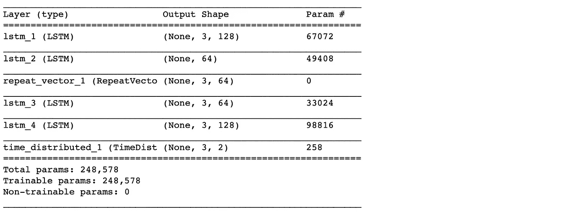
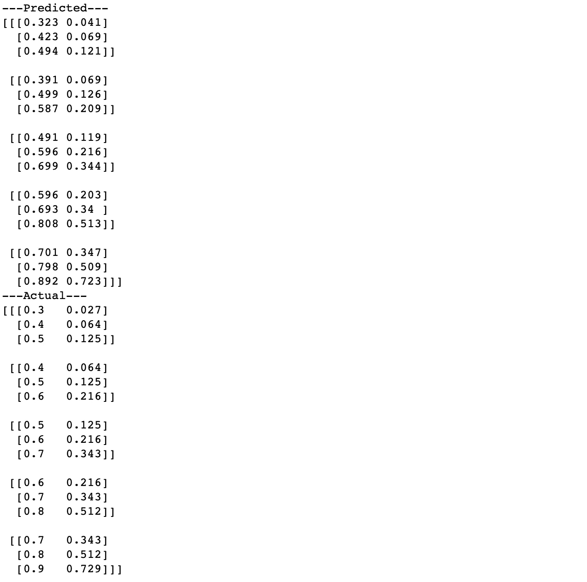
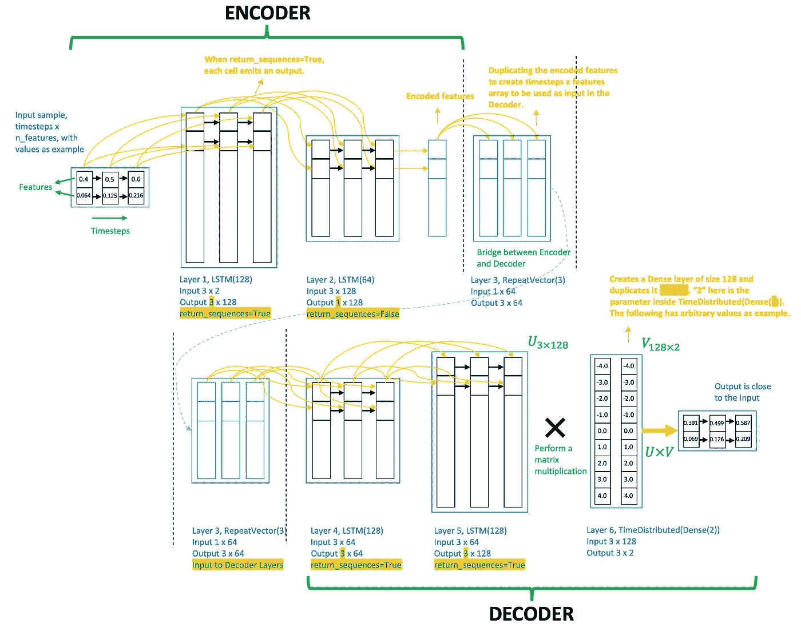
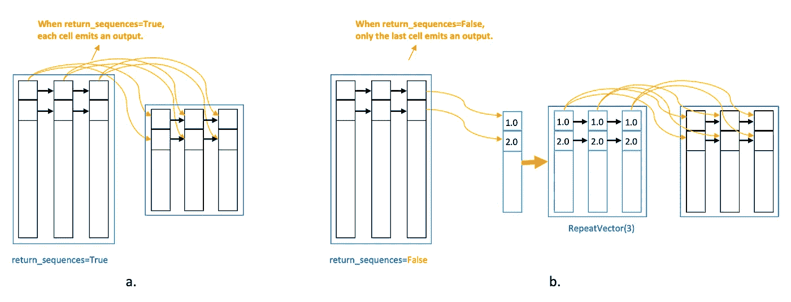
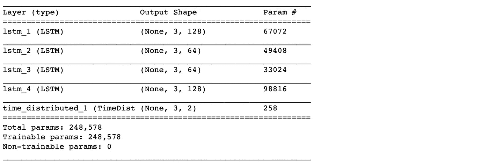
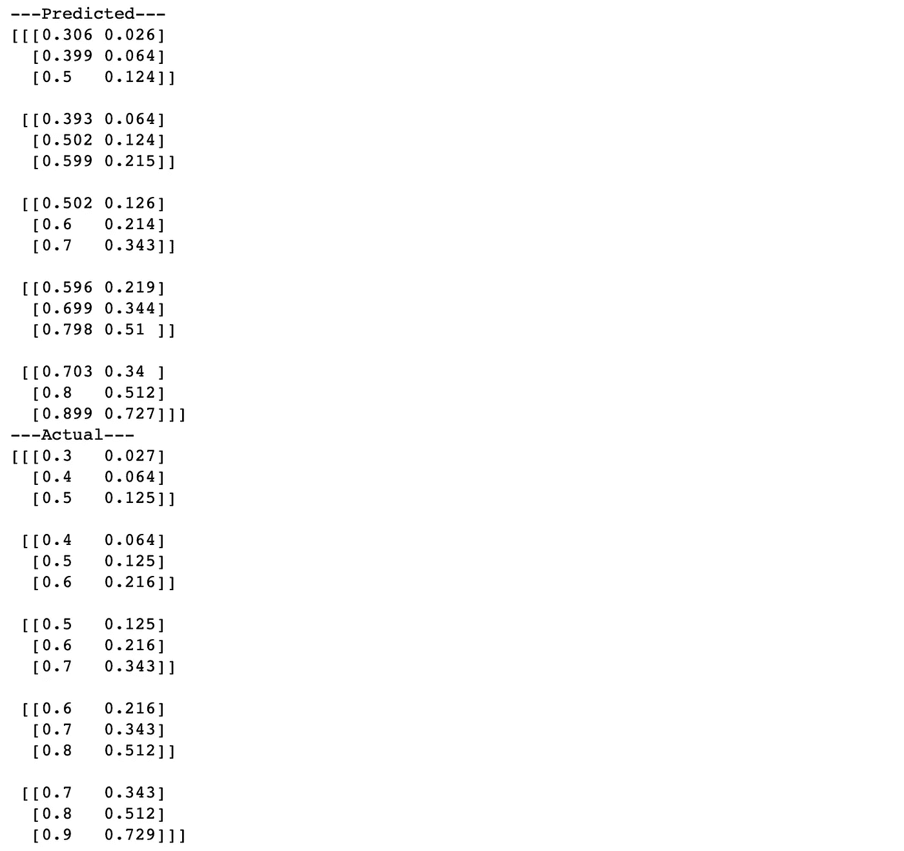
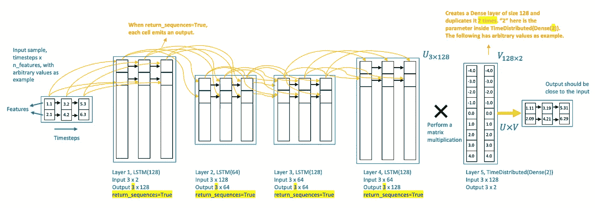

# 逐步了解 LSTM 自动编码器图层

> 原文：<https://towardsdatascience.com/step-by-step-understanding-lstm-autoencoder-layers-ffab055b6352?source=collection_archive---------1----------------------->

## 这里我们将分解一个 LSTM 自动编码器网络来逐层理解它们。我们将检查各层之间的输入和输出流，并将 LSTM 自动编码器与常规的 LSTM 网络进行比较。

<<download the="" free="" book="" class="ae lb" href="https://www.understandingdeeplearning.com/" rel="noopener ugc nofollow" target="_blank">了解深度学习，了解更多></download>

在我之前的文章[极端罕见事件分类的 LSTM 自动编码器](/lstm-autoencoder-for-extreme-rare-event-classification-in-keras-ce209a224cfb) [ [1](/lstm-autoencoder-for-extreme-rare-event-classification-in-keras-ce209a224cfb) ]中，我们学习了如何为多元时间序列数据构建 LSTM 自动编码器。

然而，深度学习中的 LSTMs 稍微复杂一些。理解 LSTM 中间层及其设置并不简单。例如，`return_sequences`参数、`RepeatVector`和`TimeDistributed`层的用法可能会令人混淆。

LSTM 教程已经很好的解释了 LSTM 单元的结构和输入输出，例如[ [2](https://machinelearningmastery.com/lstm-autoencoders/) ， [3](https://medium.com/mlreview/understanding-lstm-and-its-diagrams-37e2f46f1714) ]。但是，尽管有其特殊性，很少发现解释 LSTM 层在网络中一起工作的机制。

这里我们将分解一个 LSTM 自动编码器网络来逐层理解它们。此外，普遍使用的 **seq2seq** 网络类似于 LSTM 自动编码器。因此，这些解释中的大多数也适用于 seq2seq。

在这篇文章中，我们将使用一个简单的玩具例子来学习，

*   `return_sequences=True`、`RepeatVector()`、`TimeDistributed()`的含义。
*   了解每个 LSTM 网络层的输入和输出。
*   常规 LSTM 网络和 LSTM 自动编码器之间的区别。

# 理解模型架构

首先进口我们的必需品。

```
*# lstm autoencoder to recreate a timeseries*
**import** **numpy** **as** **np**
**from** **keras.models** **import** Sequential
**from** **keras.layers** **import** LSTM
**from** **keras.layers** **import** Dense
**from** **keras.layers** **import** RepeatVector
**from** **keras.layers** **import** TimeDistributed*'''*
*A UDF to convert input data into 3-D*
*array as required for LSTM network.*
*'''*

**def** temporalize(X, y, lookback):
    output_X = []
    output_y = []
    **for** i **in** range(len(X)-lookback-1):
        t = []
        **for** j **in** range(1,lookback+1):
            *# Gather past records upto the lookback period*
            t.append(X[[(i+j+1)], :])
        output_X.append(t)
        output_y.append(y[i+lookback+1])
    **return** output_X, output_y
```

## 创建示例数据

我们将创建一个多元时间序列数据的玩具示例。

```
*# define input timeseries*
timeseries = np.array([[0.1, 0.2, 0.3, 0.4, 0.5, 0.6, 0.7, 0.8, 0.9],
                       [0.1**3, 0.2**3, 0.3**3, 0.4**3, 0.5**3, 0.6**3, 0.7**3, 0.8**3, 0.9**3]]).transpose()

timesteps = timeseries.shape[0]
n_features = timeseries.shape[1]timeseries
```



Figure 1.1\. Raw dataset.

根据 LSTM 网络的要求，我们需要将一个输入数据整形为 *n_samples* x *时间步长* x *n_features* 。在这个例子中，`n_features` 是 2。我们将制作`timesteps = 3`。这样，结果`n_samples`是 5(因为输入数据有 9 行)。

```
timesteps = 3
X, y = temporalize(X = timeseries, y = np.zeros(len(timeseries)), lookback = timesteps)

n_features = 2
X = np.array(X)
X = X.reshape(X.shape[0], timesteps, n_features)

X
```



Figure 1.2\. Data transformed to a 3D array for an LSTM network.

## 了解 LSTM 自动编码器结构

在本节中，我们将构建一个 LSTM 自动编码器网络，并可视化其架构和数据流。我们还将考察一个常规的 LSTM 网络，比较它与自动编码器的不同之处。

定义 LSTM 自动编码器。

```
*# define model*
model = Sequential()
model.add(LSTM(128, activation='relu', input_shape=(timesteps,n_features), return_sequences=**True**))
model.add(LSTM(64, activation='relu', return_sequences=**False**))
model.add(RepeatVector(timesteps))
model.add(LSTM(64, activation='relu', return_sequences=**True**))
model.add(LSTM(128, activation='relu', return_sequences=**True**))
model.add(TimeDistributed(Dense(n_features)))
model.compile(optimizer='adam', loss='mse')
model.summary()
```



Figure 2.1\. Model Summary of LSTM Autoencoder.

```
*# fit model*
model.fit(X, X, epochs=300, batch_size=5, verbose=0)
*# demonstrate reconstruction*
yhat = model.predict(X, verbose=0)
print('---Predicted---')
print(np.round(yhat,3))
print('---Actual---')
print(np.round(X, 3))
```



Figure 2.2\. Input Reconstruction of LSTM Autoencoder.

`model.summary()`提供了模型架构的概要。为了更好的理解，让我们在下面的图 2.3 中可视化它。



Figure 2.3\. LSTM Autoencoder Flow Diagram.

该图示出了一个数据样本通过 LSTM 自动编码器网络的各层的数据流。数据样本是数据集中的一个实例。在我们的例子中，一个样本是图 1.2 中大小为 3x2 的子数组。

从这个图表中，我们了解到

*   LSTM 网络采用 2D 阵列作为输入。
*   一层 LSTM 的像元数量与时间步长一样多。
*   设置`return_sequences=True`使每个时间步长的每个单元发出一个信号。
*   这在图 2.4 中变得更加清晰，该图显示了`return_sequences`为`True`(图 2.4a)与`False`(图 2.4b)之间的差异。



Figure 2.4\. Difference between return_sequences as True and False.

*   在图 2.4a 中，来自一层中时间步长单元的信号被后续层中相同时间步长的单元接收。
*   在 LSTM 自动编码器的编码器和解码器模块中，重要的是在如图 2.4a 所示的连续 LSTM 层中的各个时间步长单元之间具有直接连接
*   在图 2.4b 中，只有最后一个时间步长单元发出信号。因此，**的输出是一个矢量**。
*   如图 2.4b 所示，如果后续层是 LSTM，我们使用`RepeatVector(timesteps)`复制这个向量，以获得下一层的 2D 数组。
*   如果后续层是`Dense`，则不需要变换(因为`Dense`层需要一个矢量作为输入)。

回到图 2.3 中的 LSTM 自动编码器。

*   输入数据有 3 个时间步长和 2 个特征。
*   第 1 层，LSTM(128)，读取输入数据并输出 128 个特征，每个特征有 3 个时间步长，因为`return_sequences=True`。
*   第二层，LSTM(64)，采用第一层的 3x128 输入，并将特征尺寸减小到 64。从`return_sequences=False`开始，它输出大小为 1x64 的特征向量。
*   该层的输出是输入数据的**编码特征向量**。
*   这个编码的特征向量可以被提取并用作数据压缩，或者任何其他监督或非监督学习的特征(在下一篇文章中我们将看到如何提取它)。
*   层 3，RepeatVector(3)，复制特征向量 3 次。
*   RepeatVector 层充当编码器和解码器模块之间的桥梁。
*   它为解码器中的第一个 LSTM 层准备 2D 阵列输入。
*   解码器层设计用于展开*编码。*
*   因此，解码器层以与编码器相反的顺序堆叠。
*   第 4 层 LSTM (64)和第 5 层 LSTM (128)分别是第 2 层和第 1 层的镜像。
*   最后添加第 6 层(时间分布式(密集(2))，以获得输出，其中“2”是输入数据中的要素数。
*   时间分布图层创建一个长度等于前一图层输出的要素数量的矢量。在这个网络中，第 5 层输出 128 个特征。因此，时间分布图层创建了一个 128 长的矢量，并将其复制了 2 (= n_features)次。
*   第 5 层的输出是一个 3x128 的数组，我们将其表示为 U，而第 6 层的时间分布的输出是一个 128x2 的数组，表示为 V，U 和 V 之间的矩阵乘法产生一个 3x2 的输出。
*   拟合网络的目的是使输出接近输入。请注意，这个网络本身确保了输入和输出维度匹配。

## LSTM 自动编码器与常规 LSTM 网络的比较

当我们将其与为重构输入而构建的常规 LSTM 网络相比较时，上述理解变得更加清晰。

```
*# define model*
model = Sequential()
model.add(LSTM(128, activation='relu', input_shape=(timesteps,n_features), return_sequences=**True**))
model.add(LSTM(64, activation='relu', return_sequences=**True**))
model.add(LSTM(64, activation='relu', return_sequences=**True**))
model.add(LSTM(128, activation='relu', return_sequences=**True**))
model.add(TimeDistributed(Dense(n_features)))
model.compile(optimizer='adam', loss='mse')
model.summary()
```



Figure 3.1\. Model Summary of LSTM Autoencoder.

```
*# fit model*
model.fit(X, X, epochs=300, batch_size=5, verbose=0)
*# demonstrate reconstruction*
yhat = model.predict(X, verbose=0)
print('---Predicted---')
print(np.round(yhat,3))
print('---Actual---')
print(np.round(X, 3))
```



Figure 3.2\. Input Reconstruction of regular LSTM network.



Figure 3.3\. Regular LSTM Network flow diagram.

**常规 LSTM 网络和 LSTM 自动编码器的区别**

*   我们在所有的 LSTM 图层中都使用了`return_sequences=True`。
*   这意味着，每一层都输出一个包含每个时间步长的 2D 数组。
*   因此，没有一维编码的特征向量作为任何中间层的输出。因此，将样本编码成特征向量是不可能的。
*   **这个编码**向量的缺失将用于重建的常规 LSTM 网络与 LSTM 自动编码器区分开来。
*   但是，请注意，在自动编码器(图 2.1)和常规网络(图 3.1)中，参数的数量是相同的。
*   这是因为，自动编码器中额外的`RepeatVector`层没有任何附加参数。
*   最重要的是，**两个网络的重建精度相似**。

# 引人深思的事

在 [LSTM 罕见事件分类自动编码器](/lstm-autoencoder-for-extreme-rare-event-classification-in-keras-ce209a224cfb) [ [1](/lstm-autoencoder-for-extreme-rare-event-classification-in-keras-ce209a224cfb) ]中讨论的使用异常检测方法的罕见事件分类正在训练 LSTM 自动编码器来检测罕见事件。[ [1](/lstm-autoencoder-for-extreme-rare-event-classification-in-keras-ce209a224cfb) 中自动编码器网络的目标是重建输入，并将重建不佳的样本归类为罕见事件。

既然，我们也可以建立一个常规的 LSTM 网络来重建一个时间序列数据，如图 3.3 所示，**这样会改善结果吗？**

这背后的假设是，

> 由于没有编码层，在某些情况下重建的精度会更好(因为时间维度的维数没有减少)。除非任何其他分析需要编码向量，否则尝试常规 LSTM 网络值得尝试稀有事件分类。

## [Github 资源库](https://github.com/cran2367/understanding-lstm-autoencoder/blob/master/understanding-lstm-autoencoder.ipynb)

完整的代码可以在[这里](https://github.com/cran2367/understanding-lstm-autoencoder/blob/master/understanding-lstm-autoencoder.ipynb)找到。

[](https://github.com/cran2367/understanding-lstm-autoencoder/blob/master/understanding-lstm-autoencoder.ipynb) [## cran 2367/理解-lstm-自动编码器

### 了解 LSTM 自动编码器。通过创建一个项目，为 cran 2367/understanding-lstm-auto encoder 的开发做出贡献

github.com](https://github.com/cran2367/understanding-lstm-autoencoder/blob/master/understanding-lstm-autoencoder.ipynb) 

# 结论

在本文中，我们

*   通过一个玩具示例来一层一层地理解 LSTM 网络。
*   了解每层之间的输入和输出流。
*   理解了`return_sequences`、`RepeatVector()`、`TimeDistributed()`的含义。
*   比较和对比了 LSTM 自动编码器和常规 LSTM 网络。

在下一篇文章中，我们将学习优化一个网络: ***如何决定添加一个新层及其大小*** ？

# 参考

1.  [Keras 极端罕见事件分类的 LSTM 自动编码器](/lstm-autoencoder-for-extreme-rare-event-classification-in-keras-ce209a224cfb)
2.  [LSTM 自动编码器简介](https://machinelearningmastery.com/lstm-autoencoders/)
3.  [了解 LSTM 及其图表](https://medium.com/mlreview/understanding-lstm-and-its-diagrams-37e2f46f1714)