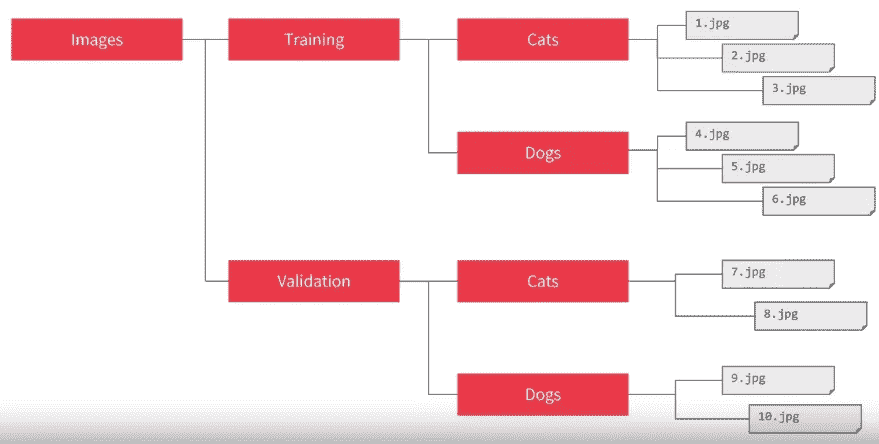
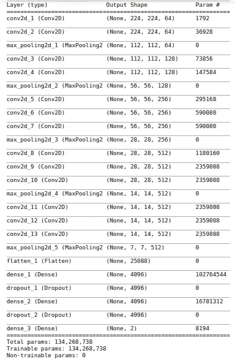
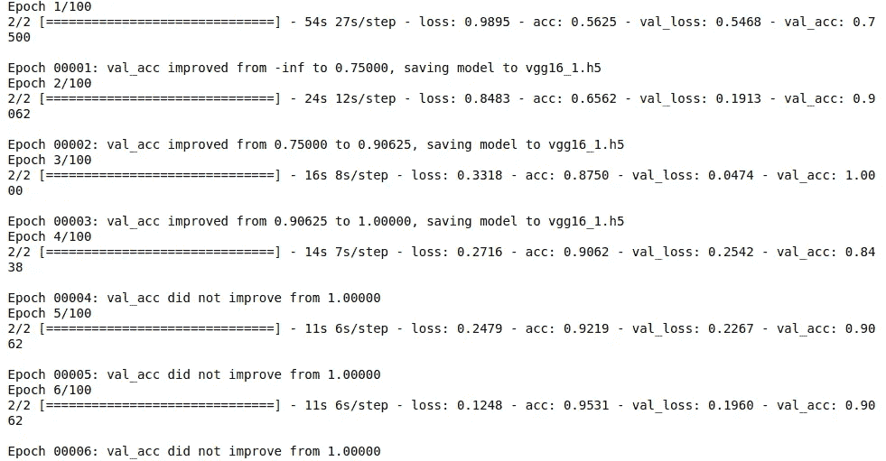
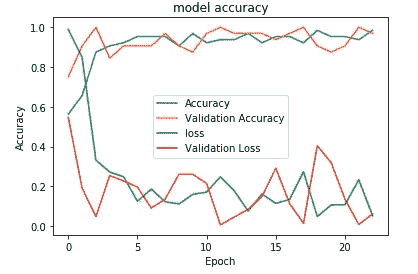
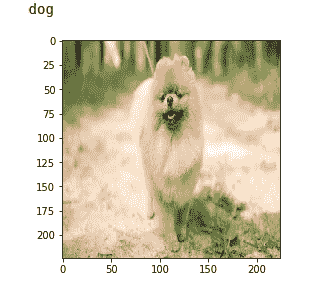

# 初学者在 Keras 中逐步实现 VGG16

> 原文：<https://towardsdatascience.com/step-by-step-vgg16-implementation-in-keras-for-beginners-a833c686ae6c?source=collection_archive---------0----------------------->

VGG16 是一种卷积神经网络(CNN)架构，用于在 2014 年赢得 ILSVR(Imagenet)比赛。它被认为是迄今为止最优秀的视觉模型架构之一。关于 VGG16 最独特的事情是，他们没有大量的超参数，而是专注于使用步长为 1 的 3×3 滤波器的卷积层，并始终使用相同的填充和步长为 2 的 2×2 滤波器的最大池层。在整个体系结构中，它始终遵循卷积和最大池层的这种安排。最后，它有 2 个 FC(全连接层),后跟一个 softmax 输出。VGG16 中的 16 指的是它有 16 层有权重。这个网络是一个相当大的网络，它有大约 1.38 亿个(大约)参数。


Architecture of VGG16

我打算在 Keras 中从头开始实现完整的 VGG16。这个实现将在狗和猫的数据集上完成。您可以从下面的链接下载数据集。

> [https://www.kaggle.com/c/dogs-vs-cats/data](https://www.kaggle.com/c/dogs-vs-cats/data)

一旦你下载了图片，你就可以继续下面的步骤了。

```
import keras,os
from keras.models import Sequential
from keras.layers import Dense, Conv2D, MaxPool2D , Flatten
from keras.preprocessing.image import ImageDataGenerator
import numpy as np
```

在这里，我首先导入实现 VGG16 所需的所有库。我将使用顺序方法，因为我正在创建一个顺序模型。顺序模型意味着模型的所有层将按顺序排列。在这里，我从 keras.preprocessing 导入了 ImageDataGenerator。这是一个非常有用的类，因为它有许多功能来缩放，旋转，缩放，翻转等。这个类最有用的一点是它不会影响存储在磁盘上的数据。该类在将数据传递给模型的过程中不断修改数据。

```
trdata = ImageDataGenerator()
traindata = trdata.flow_from_directory(directory="data",target_size=(224,224))
tsdata = ImageDataGenerator()
testdata = tsdata.flow_from_directory(directory="test", target_size=(224,224))
```

在这里，我为训练和测试数据创建了一个 ImageDataGenerator 对象，并将包含训练数据的文件夹传递给对象 trdata，类似地，将包含测试数据的文件夹传递给对象 tsdata。数据的文件夹结构如下-



Folder structure of the data to passed to ImageDataGenerator

ImageDataGenerator 会自动将猫文件夹中的所有数据标记为猫，而不是狗文件夹。通过这种方式，数据很容易传递到神经网络。

```
model = Sequential()model.add(Conv2D(input_shape=(224,224,3),filters=64,kernel_size=(3,3),padding="same", activation="relu"))model.add(Conv2D(filters=64,kernel_size=(3,3),padding="same", activation="relu"))model.add(MaxPool2D(pool_size=(2,2),strides=(2,2)))model.add(Conv2D(filters=128, kernel_size=(3,3), padding="same", activation="relu"))model.add(Conv2D(filters=128, kernel_size=(3,3), padding="same", activation="relu"))model.add(MaxPool2D(pool_size=(2,2),strides=(2,2)))model.add(Conv2D(filters=256, kernel_size=(3,3), padding="same", activation="relu"))model.add(Conv2D(filters=256, kernel_size=(3,3), padding="same", activation="relu"))model.add(Conv2D(filters=256, kernel_size=(3,3), padding="same", activation="relu"))model.add(MaxPool2D(pool_size=(2,2),strides=(2,2)))model.add(Conv2D(filters=512, kernel_size=(3,3), padding="same", activation="relu"))model.add(Conv2D(filters=512, kernel_size=(3,3), padding="same", activation="relu"))model.add(Conv2D(filters=512, kernel_size=(3,3), padding="same", activation="relu"))model.add(MaxPool2D(pool_size=(2,2),strides=(2,2)))model.add(Conv2D(filters=512, kernel_size=(3,3), padding="same", activation="relu"))model.add(Conv2D(filters=512, kernel_size=(3,3), padding="same", activation="relu"))model.add(Conv2D(filters=512, kernel_size=(3,3), padding="same", activation="relu"))model.add(MaxPool2D(pool_size=(2,2),strides=(2,2)))
```

在这里，我首先通过指定模型是顺序模型来初始化模型。初始化模型后，我添加了

→ 2 个 3×3 内核的 64 通道卷积层，填充相同

→ 1 个最大池层，池大小为 2x2，跨度为 2x2

→ 2 个 3×3 内核的 128 通道卷积层，填充相同

→ 1 个最大池层，池大小为 2x2，跨度为 2x2

→256 通道的 3 x3 内核和相同填充的 3x 卷积层

→ 1 个最大池层，池大小为 2x2，跨度为 2x2

→3 x 3 内核和相同填充的 512 通道的 3x 卷积层

→ 1 个最大池层，池大小为 2x2，跨度为 2x2

→3 x 3 内核和相同填充的 512 通道的 3x 卷积层

→ 1 个最大池层，池大小为 2x2，跨度为 2x2

我还添加 relu(整流线性单位)激活到每一层，使所有的负值不会传递到下一层。

```
model.add(Flatten())model.add(Dense(units=4096,activation="relu"))model.add(Dense(units=4096,activation="relu"))model.add(Dense(units=2, activation="softmax"))
```

创建完所有的卷积后，我将数据传递给密集层，因此我将卷积后的矢量展平并相加

→ 1 个 4096 单位的密集层

→ 1 个 4096 单位的密集层

→1 x 2 个单元的密集 Softmax 层

我将对 4096 个单元的密集层都使用 RELU 激活，以便停止通过网络转发负值。我在最后使用了一个 2 单位的密集层，因为我有 2 个职业可以预测，分别是狗和猫。softmax 层将根据图像所属类别的模型置信度输出介于 0 和 1 之间的值。

创建 softmax 层后，模型最终准备就绪。现在我需要编译模型。

```
from keras.optimizers import Adam
opt = Adam(lr=0.001)model.compile(optimizer=opt, loss=keras.losses.categorical_crossentropy, metrics=['accuracy'])
```

在这里，我将使用亚当优化器达到全局最小值，同时训练出模型。如果我在训练时陷入局部最小值，那么亚当优化器将帮助我们走出局部最小值，达到全局最小值。我们还将指定优化器的学习速率，在本例中，它被设置为 0.001。如果我们的训练在不同的时期有很大的波动，那么我们需要降低学习率，这样我们就可以达到全局最小值。

我可以使用下面的代码检查我创建的模型的概要。

```
model.summary()
```

其输出将是我刚刚创建的模型的摘要。



Summary of the model

```
from keras.callbacks import ModelCheckpoint, EarlyStoppingcheckpoint = ModelCheckpoint("vgg16_1.h5", monitor='val_acc', verbose=1, save_best_only=True, save_weights_only=False, mode='auto', period=1)early = EarlyStopping(monitor='val_acc', min_delta=0, patience=20, verbose=1, mode='auto')hist = model.fit_generator(steps_per_epoch=100,generator=traindata, validation_data= testdata, validation_steps=10,epochs=100,callbacks=[checkpoint,early])
```

创建模型后，我将从 keras 导入 ModelCheckpoint 和 EarlyStopping 方法。我将创建两者的对象，并将其作为回调函数传递给 fit_generator。

ModelCheckpoint 通过监控模型的特定参数来帮助我们保存模型。在这种情况下，我通过将 **val_acc** 传递给 ModelCheckpoint 来监控验证的准确性。只有在当前时期的模型验证精度高于上一时期的模型验证精度时，才会将模型保存到磁盘。

如果我在早期停止中设置监控的参数没有增加，早期停止有助于我们尽早停止模型的训练。在这种情况下，我通过将 **val_acc** 传递给 EarlyStopping 来监控验证的准确性。我在这里将**耐心**设置为 20，这意味着如果模型在 20 个时期内没有看到验证准确性的任何提高，它将停止训练。

我使用 model.fit_generator，就像我使用 ImageDataGenerator 将数据传递给模型一样。我将把训练和测试数据传递给 fit_generator。在 fit_generator 中，steps_per_epoch 将设置批量大小以将训练数据传递给模型，validation_steps 将对测试数据执行相同的操作。您可以根据您的系统规格进行调整。

在执行上述代码行之后，模型将开始训练，您将开始看到训练/验证的准确性和损失。



Training of the model

一旦你训练了模型，你可以可视化训练/验证的准确性和损失。您可能已经注意到，我正在将 mode.fit_generator 的输出传递给 hist 变量。所有的训练/验证准确性和损失都存储在 hist 中，我将从那里可视化。

```
import matplotlib.pyplot as plt
plt.plot(hist.history["acc"])
plt.plot(hist.history['val_acc'])
plt.plot(hist.history['loss'])
plt.plot(hist.history['val_loss'])
plt.title("model accuracy")
plt.ylabel("Accuracy")
plt.xlabel("Epoch")
plt.legend(["Accuracy","Validation Accuracy","loss","Validation Loss"])
plt.show()
```

在这里，我将使用 matplotlib 可视化训练/验证准确性和损失。



training/validation accuracy and loss

为了对训练好的模型进行预测，我需要加载保存最好的模型，预处理图像，并将图像传递给模型进行输出。

```
from keras.preprocessing import imageimg = image.load_img("image.jpeg",target_size=(224,224))
img = np.asarray(img)
plt.imshow(img)
img = np.expand_dims(img, axis=0)from keras.models import load_model
saved_model = load_model("vgg16_1.h5")output = saved_model.predict(img)
if output[0][0] > output[0][1]:
    print("cat")
else:
    print('dog')
```



Output of the model

在这里，我已经使用 keras 中的 image 方法加载了图像，并将其转换为 numpy 数组，并为图像添加了一个额外的维度，以匹配 keras 的 NHWC(数字、高度、宽度、通道)格式。

这是一个完整的 VGG16 在 keras 中使用 ImageDataGenerator 的实现。我们可以根据需要分类的类别，将最后一个 softmax 密集层的单位更改为我们想要的任何数量，从而使该模型适用于任何数量的类别

Github 回购链接:[https://github.com/1297rohit/VGG16-In-Keras](https://github.com/1297rohit/VGG16-In-Keras)

如果你的数据量较少，那么你可以尝试**迁移学习**，而不是从头开始训练你的模型。我还为初学者编写了一个使用 Keras 在 VGG16 上进行迁移学习的分步指南。可以到:[https://medium . com/@ 1297 rohit/transfer-learning-from scratch-using-keras-339834 b 153 b 9](https://medium.com/@1297rohit/transfer-learning-from-scratch-using-keras-339834b153b9)查看

如果你想从头开始一步一步地学习人脸检测和人脸识别，那么你可以点击链接阅读我的文章:[https://medium . com/@ 1297 rohit/step-step-by-step-Face-Recognition-code-implementation-from-scratch-in-python-cc95fa 041120](https://medium.com/@1297rohit/step-by-step-face-recognition-code-implementation-from-scratch-in-python-cc95fa041120)

享受分类！