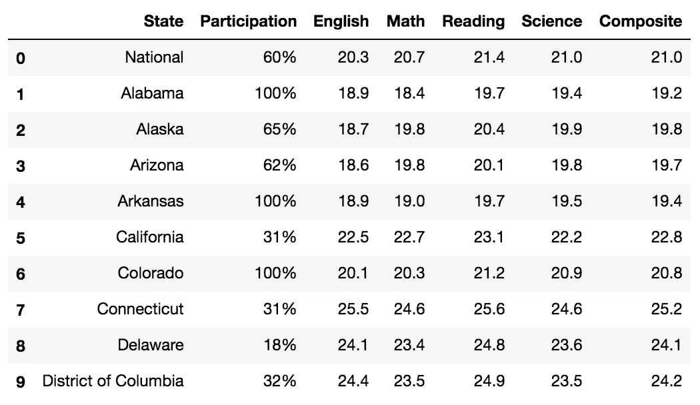
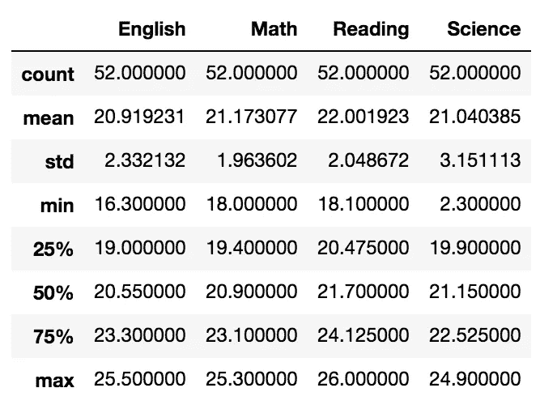
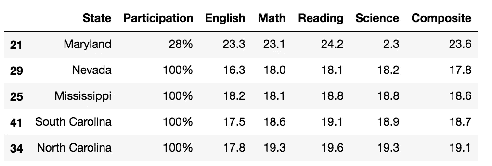
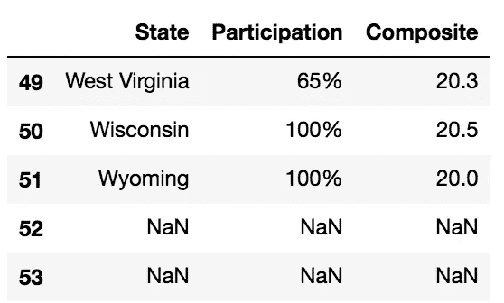
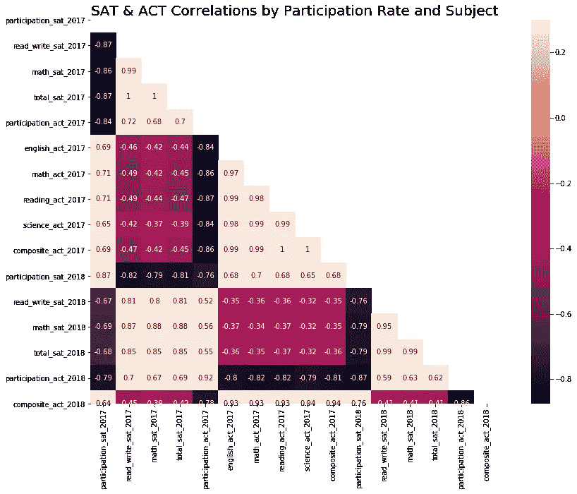
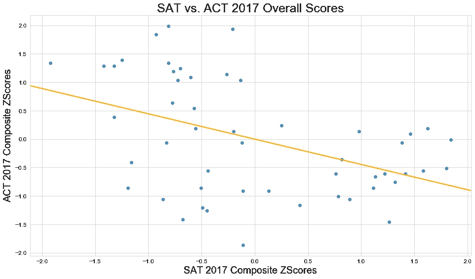
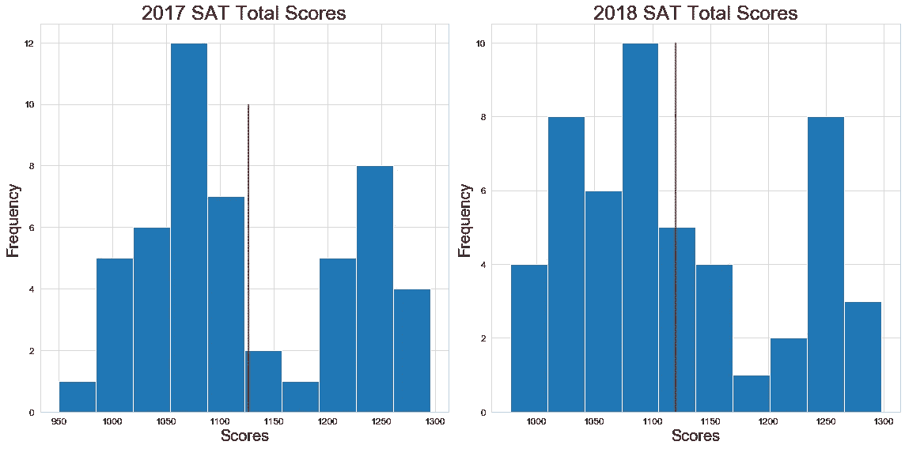
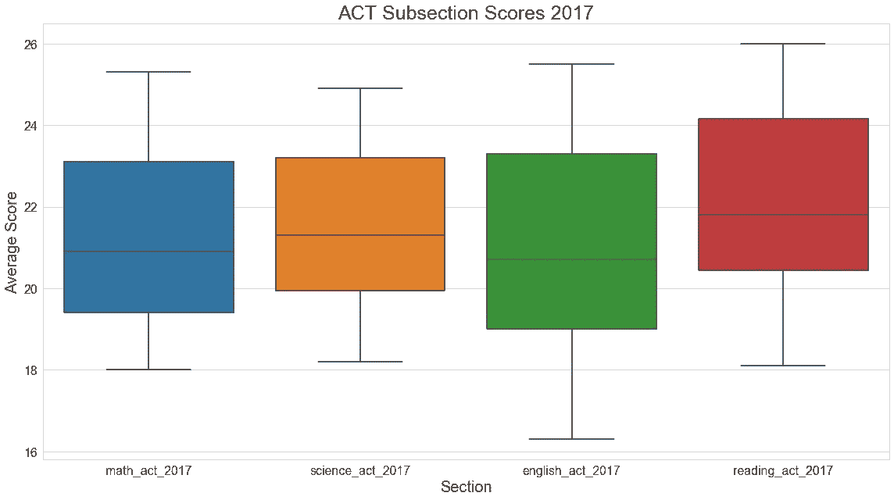

# 建模前的步骤:清理至 EDA

> 原文：<https://towardsdatascience.com/steps-before-modeling-cleaning-to-eda-9a9e02981e57?source=collection_archive---------21----------------------->

## Python 中的数据清理和 EDA 初学者指南

在能够利用我们都知道并喜爱的机器学习算法之前，重要的是要了解如何最初以适当的顺序获得数据，以及如何有效地分析数据，以便产生最佳模型。这篇文章将提供一个基本的路线图，数据科学家在使用 Python 处理新数据集时可以遵循它来执行探索性数据分析(EDA)。

## 数据集:

在这篇文章中，我们将调查 2017 年和 2018 年各州的 SAT 和 ACT 参与率。数据集包括每个考试部分的全州平均分数、两次考试的综合/总分以及参与率。

## Python 库:

```
#Imports:
import num               as np
import pandas            as pd
import matplotlib.pyplot as plt
import seaborn           as snsfrom scipy               import stats
```

## 初步审查:

在将文件加载到 Pandas dataframe 中之后，查看前几行和数据集的大小会对您正在处理的内容有所帮助。这最好通过使用**来完成。头()**和**。形状**方法。



First 10 rows of 2017 SAT data

**。describe()** 方法提供了数据集中定量特征的快速统计概览，从每个特征的标准差到最小值和最大值。这也可以用来发现潜在的异常值。在下图中，我们可以很快看到*科学*的最低分数是 2.3，与其他值相比，这看起来并不正确。这需要进一步研究。



Summary of 2017 ACT data

```
act_2017.sort_values('Science').head()
```



利用 **sort_values()** 方法，我们可以看到马里兰州的平均科学分数为 2.3。这很可能是一个打字错误，需要更正。

描述完数据后，务必确保没有缺失值，并且所有数据类型都适用于每个要素。这个。 **isnull()** 和**。在这种情况下，最好使用 info()** 方法。

```
act_2018.isnull().sum()State            2
Participation    2
Composite        2
```

从上面我们可以看到，2018 ACT 数据在每一列中都包含 2 个缺失值。下面的参与列作为一个对象列出，但它应该是一个浮点型，因为值是百分比。


这些 Pandas 方法为我们提供了数据的初步视图，以及在我们开始建模之前可能需要清理或纠正的内容。

## 数据清理:

在我们的初步审查之后，修复我们发现的错误是很重要的。首先，我们将使用**将马里兰的*科学*分数改写为 23.2。锁定**以隔离数据框中的特定位置。

```
act_2017.loc[act_2017['State'] == "Maryland", 'Science'] = 23.2
```

下面，我们可以看到包含空值的 2 行。



```
act_2018.drop(act_2018.index[[52,53]], inplace = True)
```

上面的代码可以用来删除两行丢失的值。**。dropna()** 方法是另一个有用的工具，当有丢失的值需要删除时。

最后，在我们开始可视化数据之前，我们需要纠正参与列的数据类型。使用**。astype()** 方法，我们可以将列中的值更新为浮点数而不是对象。

```
sat_2018['Participation'] = sat_2018['Participation'].astype(float)
```

## 可视化数据:

创建可视化可以帮助我们更详细地理解数据，并允许我们发现潜在的关系，这些关系是我们仅通过描述数据无法看到的。可视化还可以揭示可能会扭曲我们结果的异常值。我们将使用 seaborn 和 matplotlib 库来创建我们的可视化。

关联热图对于查看要素之间的线性关系非常有用。决定在模型中使用哪些要素时，避免多重共线性非常重要。在下图中，较亮的值表示高度正相关的要素，较暗的图像表示高度负相关的要素。这两种考试的分数和参与率往往是逐年相关的。

```
sns.heatmap(final.corr(),mask=mask, vmax=.3, square=True, annot=True)
```



Correlation Heatmap of All Features

散点图是查看两个特征之间是否存在线性关系的另一种方法。

```
# Establish the size of the figure.
plt.figure(figsize=(16, 9))# Create scatter plot of SAT vs. ACT math scores for 2017.
sns.regplot(stats.zscore(final['total_sat_2017']),
            stats.zscore(final['composite_act_2017']), 
            ci = None, 
            line_kws = {'color': 'orange'})plt.title("SAT vs. ACT 2017 Overall Scores", fontsize = 25)
plt.ylabel("ACT 2017 Composite ZScores", fontsize = 20)
plt.xlabel("SAT 2017 Composite ZScores", fontsize = 20)
plt.xticks(size = 12)
plt.yticks(size = 12);
```



从散点图可以看出，ACT 和 SAT 综合成绩是负相关的。所以，一门考试考得好，不一定代表你另一门也会考得好。

直方图在查看特征分布时非常有用。下面的代码在同一个图上创建了两个直方图，因此我们可以并排分析这些特征。

```
plt.figure(figsize=(16, 8))plt.subplot(1, 2, 1)
final['total_sat_2017'].hist()
plt.title('2017 SAT Total Scores', size = 25)
plt.xlabel('Scores', size = 20)
plt.ylabel('Frequency', size = 20)
plt.vlines(x = np.mean(final['total_sat_2017']), ymin = 0, ymax = 10, color = 'r')
plt.xticks(size = 12)
plt.yticks(size = 12)plt.subplot(1, 2, 2)
final['total_sat_2018'].hist()
plt.title('2018 SAT Total Scores', size = 25)
plt.xlabel('Scores', size = 20)
plt.ylabel('Frequency', size = 20)
plt.vlines(x = np.mean(final['total_sat_2018']), ymin = 0, ymax = 10, color = 'r')
plt.xticks(size = 12)
plt.yticks(size = 12)
```



从上面的直方图我们可以看出，2017 年和 2018 年的 SAT 总分并不是正态分布，而是向右偏的。在这两年中，分数下降的频率在 1100 和 1200 之间。看了这张图之后，我们可能会决定进一步研究为什么会有这种差距。

最后，箱线图在查看要素分布时也很有用，但它们也有助于发现异常值。

```
#2017 ACT scores by section
plt.figure(figsize = (16, 9))plt.title("ACT Subsection Scores 2017", size = 25)
sns.boxplot(data = final[["math_act_2017", "science_act_2017", "english_act_2017", "reading_act_2017"]])plt.ylabel("Average Score", size = 20)
plt.xlabel('Section', size = 20)plt.xticks(size = 16)
plt.yticks(size = 16)
```



在上图中，我们可以看到 2017 年 ACT 分段分数的数据集中没有剩余异常值。在执行数据清理时，*科学*部分中的异常值已被移除。

## 后续步骤:

现在，我们的数据是干净的，我们已经分析了我们的特征，我们准备开始预处理和建模。

正确清理数据集和执行 EDA 是数据科学家工作流程中的关键步骤。每个数据集都是不同的，但希望你学到了一些有用的方法，下次当你面临需要分析数据集的问题时可以遵循这些方法。

*这个帖子的代码可以在我的* [*Github*](https://github.com/lwinter819/Project-1---Participation-Rates) *上找到。*

*你也可以在*[*LinkedIn*](https://www.linkedin.com/in/lucas-winter/)*上找到我。*