# 从零开始到基本现代神经网络模型的步骤

> 原文：<https://towardsdatascience.com/steps-to-basic-modern-nn-model-from-scratch-1e86b7c042?source=collection_archive---------20----------------------->

## 该博客将包括创建初级神经网络的步骤，从理解矩阵乘法开始，到构建你的训练循环。除了构建神经网络，我还将讨论各种定制技术。

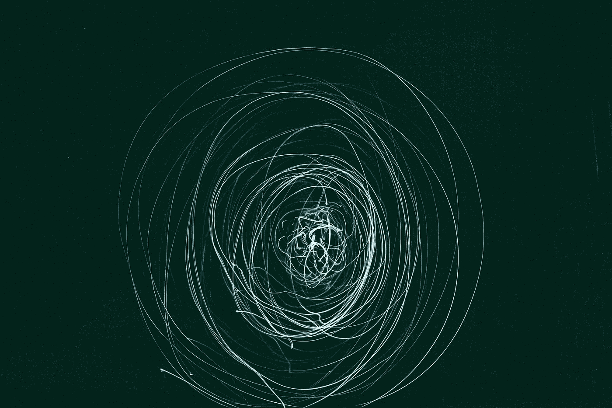

Photo by [Gertrūda Valasevičiūtė](https://unsplash.com/@skraidantisdrambliukas?utm_source=unsplash&utm_medium=referral&utm_content=creditCopyText) on [Unsplash](https://unsplash.com/s/photos/artificial-intelligence?utm_source=unsplash&utm_medium=referral&utm_content=creditCopyText)

# 步骤 1 — MatMul

今天，我们将学习构建神经网络的第一步，即初级矩阵乘法。有许多方法可以做到这一点，我们将看到每一种方法，并将比较它们以获得最佳结果。

我们需要神经网络的线性层中的矩阵乘法。要做矩阵乘法，我们需要一个数据集。Fastai 很好地提供了各种数据集，我们将使用 MNIST 数据集来做操作。

所以，让我们抓住数据集。

*   首先，我正在导入我将在整个系列中使用的库。
*   之后，我正在下载带有扩展名`.gz`的 MNIST 数据集。
*   因为下载的文件是 pickle 格式的；因此，我使用函数`pickle.load`来访问数据集。
*   下载的数据集是 numpy 数组，我们希望 PyTorch 张量执行关于神经网络的操作。因此，我使用`map`函数将 numpy 数组映射到 torch 张量。
*   这样，我们的数据集就准备好了。

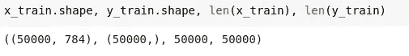

Training dataset

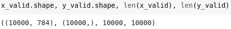

Validation dataset

```
weights = torch.randn(784,10)
bias = torch.zeros(10)m1 = x_valid[:5]
m2 = weightsm1.shape,m2.shape **= (torch.Size([5, 784]), torch.Size([784, 10]))**
```

## 类型 1:简单的 Python 程序

我们可以用简单的 python 程序做矩阵乘法。但是 python 程序需要很多时间来实现，让我们来看看如何实现。

```
%timeit -n 10 t1=matmul(m1, m2)
```

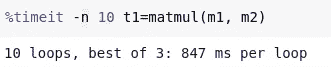

847 ms

*   当验证数据集中只有 5 行时，847 ms 是一段很长的时间。

## 类型 2:元素式操作

Pytorch 为我们提供了一种毫不费力的方法来做矩阵乘法，它被称为元素操作。让我们来理解一下。

*   我们已经消除了最后一个循环。
*   在逐元素运算中，乘法单元被视为秩为 1 的张量。

```
m2[:, 1].shape
  **=** **torch.Size([784])**m1[1, :].shape
  **=** **torch.Size([784])**
```

*   上面的代码在 c 中运行，让我们看看它执行所用的时间。

```
%timeit -n 10 t1=matmul(m1, m2)
```

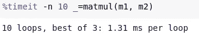

1.31 ms < 847 ms

## 类型 3:广播

广播是矩阵乘法的另一种方式。

根据 Scipy 文档，术语 broadcasting 描述了 numpy 在算术运算中如何处理不同形状的数组。在某些约束条件下，较小的阵列在较大的阵列中“广播”,以便它们具有兼容的形状。广播提供了一种向量化数组操作的方法，因此循环在 C 而不是 Python 中发生。这样做不会产生不必要的数据副本，并且通常会导致高效的算法实现。广播发生在一个 C 速度和 CUDA 速度的 GPU 上。

```
m1[2].unsqueeze(1).shape **= torch.Size([784, 1])**
```

*   在广播中，尺寸为[1 * 784]的输入的整个列被压缩为[784 * 1]，然后乘以权重。
*   最后，在列中取总和作为`sum(dim=0)`，并存储在`c`中。

```
%timeit -n 10 _=matmul(m1, m2)
```

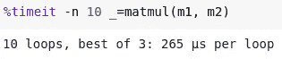

265 us << 1.31 ms < 847 ms

## 第四类:爱因斯坦求和

爱因斯坦求和(`einsum`)是一种以一般方式组合乘积和求和的紧凑表示。

来自 numpy docs:
"下标字符串是一个逗号分隔的下标标签列表，其中每个标签都指向相应操作数的一个维度。"

*   这是一种更紧凑的表示。
*   输入的数量代表输入的秩`ik`表示秩 2 张量，`kj`表示秩 2 张量。
*   矩阵的维数表示为`i*k`、`k*j`和`i*j`。
*   每当你看到重复的维度，就在那个维度上做点积。

```
%timeit -n 10 _=matmul(m1, m2)
```

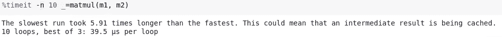

39.5 us <<< 265 us << 1.31 ms < 847 ms

## 类型 5: PyTorch 操作

我们可以直接用 PyTorch 的函数或算子进行矩阵乘法。

```
%timeit -n 10 t2 = m1.matmul(m2)
```

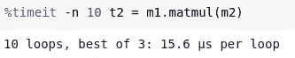

15.5 us < 39.5 us <<< 265 us << 1.31 ms < 847 ms

```
%timeit -n 10 t2 = m1@m2
```

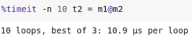

10.9 us < 15.5 us < 39.5 us <<< 265 us << 1.31 ms < 847 ms

因此，我们可以很容易地比较各种代码的时序。这也是我们不喜欢用 Python 语言编写代码的原因，因为它的性能很慢。因此，大多数 python 库都是用 c 实现的。

# 步骤 2 和 3 — Relu/init &向前传递

在我们定义了矩阵乘法策略之后，是时候为神经网络定义 ReLU 函数和前向传递了。我想请读者浏览一下本系列的第 1 部分，以了解下面使用的数据的背景。

神经网络定义如下:

```
output = MSE(Linear(ReLU(Linear(X))))
```

**基础架构**

```
n,m = x_train.shape
c = y_train.max()+1
**n,m,c**
```

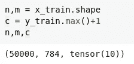

让我们解释一下矩阵乘法的权重。

我将创建一个两层的神经网络。

*   第一线性层将进行输入与 w1 的矩阵乘法。
*   第一个线性图层的输出将作为第二个线性运算的输入，该输入将乘以 w2。
*   我将获得单个输出，并使用 MSE 来计算损失，而不是针对单个输入获得十个预测。
*   让我们宣布权重和偏差。

```
w1 = torch.randn(m,nh)
b1 = torch.zeros(nh)w2 = torch.randn(nh,1)
b2 = torch.zeros(1)
```

*   当我们使用 PyTorch `randn`声明权重和偏差时，获得的权重和偏差被归一化，即它们的**均值**为 0，而**标准差**为 1。
*   我们需要对权重和偏差进行归一化，以便它们不会在对神经网络的输入进行线性运算后产生实质性的值。因为大量的输出对计算机来说变得难以处理。因此，我们倾向于将输入标准化。

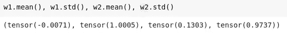

*   出于同样的原因，我们希望 out 输入矩阵的均值**为 0，标准差**为 1，但目前并非如此。让我们看看。****

```
train_mean,train_std = x_train.mean(),x_train.std()
train_mean,train_std
```

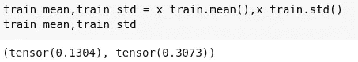

*   让我们定义一个函数来归一化输入矩阵。

```
def normalize(x, m, s): return (x-m)/sx_train = **normalize**(x_train, train_mean, train_std)
x_valid = **normalize**(x_valid, train_mean, train_std)
```

*   现在，我们根据相同的均值和标准差对训练数据集和验证数据集进行归一化，以便我们的训练数据集和验证数据集具有相同的特征定义和比例。现在，让我们重新检查一下**平均值**和**标准差**。

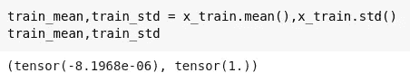

Mean approx. to 0 & SD approx. to 1

*   现在，我们有了标准化的权重、偏差和输入矩阵。

让我们为神经网络定义**线性层**并执行操作。

```
def lin(x, w, b): return x@w + bt = lin(x_valid, w1, b1)
t.mean(),t.std()
```

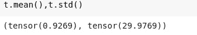

现在，线性运算后获得的平均值和标准偏差再次是非归一化的。现在，问题还是单纯的。如果保持这种状态，更多的线性运算将导致重要的和实质性的价值，这将是一个挑战。因此，我们希望线性运算后的激活也能被规范化。

## 简化的明凯初始化或氦初始化

为了处理线性神经网络操作的非标准化行为，我们定义了将被明凯初始化的权重。尽管明凯归一化或初始化被定义为处理 ReLu/泄漏 ReLu 操作，我们仍然可以将其用于线性操作。

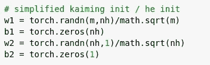

我们将权重除以 math.sqrt(x ),其中 x 是行数。

完成上述琐事后，我们得到归一化的平均值和标准差。

```
def lin(x, w, b): return x@w + bt = lin(x_valid, w1, b1)
t.mean(),t.std()
```

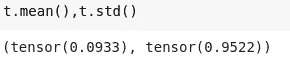

让我们为神经网络定义**ReLU**层并执行操作。现在，为什么我们将 ReLU 定义为非线性激活函数，我希望你知道 ***通用逼近定理。***

```
def relu(x): return x.clamp_min(0.)
t = relu(lin(x_valid, w1, b1))t.mean(),t.std()
```

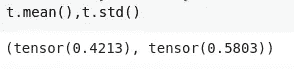

```
t = relu(lin(x_valid, w1, b1))
t = relu(lin(t, w2, b2))t.mean(),t.std()
```

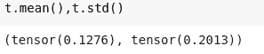

## 你注意到什么奇怪的事情了吗？

请注意，我们的标准偏差是线性运算后得到的一半，如果它在一层后减半，想象在八层后它将达到 1/2 ⁸，这非常非常小。如果我们的神经网络有 10000 层😵，算了吧。

来自 PyTorch docs:
a:该层之后使用的整流器的负斜率(ReLU 默认为 0)

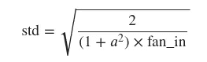

这是在描述 Imagenet 获奖方法的论文中介绍的，作者是何等人:[深入研究整流器](https://arxiv.org/abs/1502.01852)，这也是第一篇声称 Imagenet 具有“超人性能”的论文(最重要的是，它介绍了 ResNets！)

因此，按照相同的策略，我们将把我们的权重乘以`math.sqrt(2/m)`。

```
w1 = torch.randn(m,nh)*math.sqrt(2/m)t = relu(lin(x_valid, w1, b1))
t.mean(),t.std()
```


It is still better than (0.1276, 0.5803).

虽然我们有了更好的结果，但平均水平还是不太好。根据 fastai 文档，我们可以通过下面的调整来处理平均值。

```
def relu(x): return x.clamp_min(0.) - 0.5w1 = torch.randn(m,nh)*math.sqrt(2./m )
t1 = relu(lin(x_valid, w1, b1))
t1.mean(),t1.std()
```

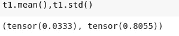

Now, it is so much better.

让我们结合上述所有代码和策略，创建我们的神经网络的**正向传递。PyTorch 定义了明凯归一化的方法，即`kaiming_normal_`。**

```
def model(xb):
  l1 = lin(xb, w1, b1)
  l2 = relu(l1)
  l3 = lin(l2, w2, b2)
  return l3%timeit -n 10 _=**model(x_valid)**
```


对于正向传递，最后要定义的是**损失函数:MSE。**

根据我们以前的知识，我们通常使用`CrossEntroyLoss`作为单标签分类函数的损失函数。我稍后会谈到这个问题。目前，我使用 MSE 来理解操作。

```
def mse(output, targ): return (output.squeeze(-1) - targ).pow(2).mean()
```

让我们对训练数据集执行上述操作。

```
preds = model(x_train)
preds.shape, preds
```

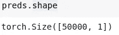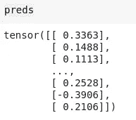

为了执行 MSE，我们需要浮动。

```
y_train,y_valid = y_train.float(),y_valid.float()**mse(preds, y_train)**
```

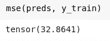

在所有上述操作之后，仍有一个问题没有得到实质性的回答，它是

# 为什么我们需要明凯初始化？

让我们再来理解一下。

如下初始化两个张量。

```
import torch**x** = torch.randn(512)
**a** = torch.randn(512,512)
```

对于神经网络，主要步骤是矩阵乘法，如果我们有一个大约 100 层的深度神经网络，那么让我们看看所获得的激活的标准偏差和平均值。

```
for i in range(100):
    **x = x @ a**x.**mean()**, x.**std()**
```

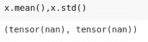

mean=nan, sd=nan

我们可以很容易地看到平均值，标准差不再是一个数字。这也是合理的。计算机不能储存那么多的数字；它无法解释如此庞大的数字。出于同样的原因，它限制了从业者训练这样的深度神经网络。

你会遇到的问题是激活爆炸:很快，你的激活将去南。我们甚至可以在第一次出现这种情况时要求循环中断:

```
for i in range(100):
    **x** = x @ a
    if x.std() != x.std(): **break**i
```

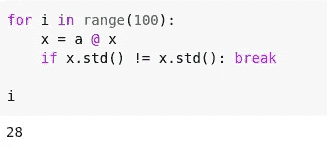

Just after 28 loops

因此，这样的问题导致了明凯初始化的发明。最终想出这个主意肯定花了几十年时间。

S o，这就是我们如何定义神经网络的 ReLu 和反向传递。

# 步骤 4 —向后传球

到目前为止，我们已经理解了矩阵乘法、ReLu 函数和神经网络前向传递背后的思想。现在，我们将讨论向后传球。

在进入后传之前，让我们先了解一个问题。

## 什么是反向传播？

这是深度学习实践者的花哨术语，尤其是在你和某人讨论的时候。但是，更简单地说，反向传播只是通过链式法则计算梯度。我们发现关于权重/参数的梯度。就是这么简单。反向传播正好与正向传播的梯度相反。

让我们一步一步地寻找梯度。

—**MSE 层的梯度**

`def mse(output, targ): return (output.squeeze(-1) — targ).pow(2).mean()`

```
def **mse_grad**(inp, targ):
    **# grad of loss with respect to output of previous layer**
    inp.g = 2\. * (inp.squeeze() - targ).unsqueeze(-1) / inp.shape[0]
```

*   我们计算输入层的梯度，这是前一层的输出。MSE 的梯度定义为
    `2(predicted — target)/mean`。
*   由于计算梯度形成链规则，我们需要存储每一层的梯度，这得到乘以前一层。出于这个原因，我们将渐变保存在`inp.g`输入层，因为它是前一层的输出层。

—**ReLU 的坡度**

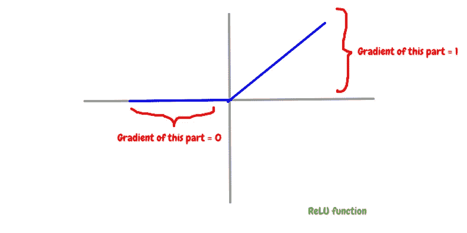

现在，对于任何大于 0 的值，我们都要用 0 来代替，对于小于 0 的值，我们要保持它们为 0。

`def relu(x): return x.clamp_min(0.)`

```
def **relu_grad**(inp, out):
    **# grad of relu with respect to input activations**
    inp.g = (inp>0).float() * out.g
```

*   我们将前一层的梯度相乘，这是 ReLU 的输出层，即`out.g`。
*   这定义了链式法则。

— **线性层的渐变**

我发现线性图层的渐变比其他图层更难理解。但我会尽量简化。

`def lin(x, w, b): return x@w + b`

```
def **lin_grad**(inp, out, w, b):
    **# grad of matmul with respect to weights**
    **inp.g** = out.g @ w.t() 
    **w.g** = (inp.unsqueeze(-1) * out.g.unsqueeze(1)).sum(0)
    **b.g** = out.g.sum(0)
```

*   inp.g —首先，我们计算关于参数的线性层的梯度。
*   w.g —重量梯度
*   b . g——与重量相关的偏差梯度。

现在，让我们把向前传球和向后传球结合起来。

```
def **forward_and_backward**(inp, targ):**# forward pass:**
    **l1** = inp @ w1 + b1
    **l2** = relu(l1)
    **out** = l2 @ w2 + b2  
    **# we don't actually need the loss in backward!**
    **loss** = mse(out, targ)**# backward pass:**
    **mse_grad**(out, targ)
    **lin_grad**(l2, out, w2, b2)
    **relu_grad**(l1, l2)
    **lin_grad**(inp, l1, w1, b1)
```

`forward_and_backward(x_train, y_train)`

如果我们把我们计算的梯度和 PyTorch 计算的梯度进行比较。

在比较之前，我们需要存储我们的梯度。

```
**w1g** = w1.g.clone()
**w2g** = w2.g.clone()
**b1g** = b1.g.clone()
**b2g** = b2.g.clone()
```

*我们稍微作弊，用 PyTorch 签名来检查我们的结果。*

```
**xt2** = x_train.clone().requires_grad_(True)
**w12** = w1.clone().requires_grad_(True)
**w22** = w2.clone().requires_grad_(True)
**b12** = b1.clone().requires_grad_(True)
**b22** = b2.clone().requires_grad_(True)
```

让我们使用 PyTorch 定义正向函数来计算梯度。

```
def **forward**(inp, targ):
    **# forward pass:**
    **l1** = inp @ w12 + b12 
    **l2** = relu(l1) 
    **out** = l2 @ w22 + b22
    **# we don't actually need the loss in backward!**
    **return** mse(out, targ)loss = forward(xt2, y_train)
loss.backward()
```

让我们比较一下 w2 的梯度。

```
w22.grad.T, w2g.T
```

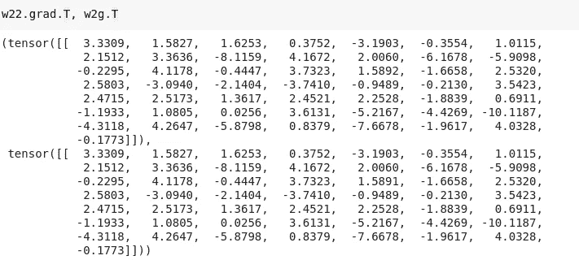

They are almost the same.

现在，我们有很多方法可以重构上面写的代码，但这不是我们所关心的。我们需要理解神经网络反向传递背后的语义。这就是我们在模型中定义向后传球的方式。

# 步骤 4(b) —卷积网络的明凯初始化

在前一部分中，我们寻找了稳定非线性激活动作效果的**明凯初始化**的需求。现在，主要是看明凯初始化如何用于卷积网络。我还会告诉你它是如何在 PyTorch 中实现的。因此，让我们开始学习之旅。

## 背景

从上一章中，我们得到了下面的值。

```
**x_train.shape, y_train.shape, x_valid.shape, y_valid.shape**
```

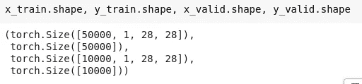

让我们看看数据集的形状。

```
**x_train**[:100].shape, **x_valid**[:100].shape
```

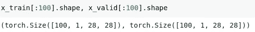

根据我们对[卷积网络](/cnn-resnets-a-more-liberal-understanding-a0143a3ddac9)的了解，让我们使用 PyTorch 创建一个简单的卷积神经网络。

```
import torch.nn as **nn****nh**=32
**l1** = nn.**Conv2d**(1, nh, 5)
```

*   CNN 的输入层数是 1。
*   输出滤波器或层的数量是 32。
*   `5`代表仁的大小。

当我们谈到明凯初始化时，首先想到的是计算卷积神经网络权重的均值和标准差。

```
def **stats**(x): return x.mean(),x.std()
```

l1 在其中定义了权重。在计算统计数据之前，让我们先了解它们。

```
l1.weight.shape
```

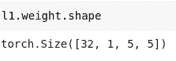

按重量计:

*   `32`表示输出层/过滤器的数量。
*   `1`代表输入层数
*   `5, 5`代表内核大小。

我们需要关注卷积神经网络的输出。

```
**x = x_valid[:100]** 
# *you may train the neural network using the training dataset but for now, I am taking vaidation daaset. There is no specific reason behind it.*x.shape
```


*   `100` —图像数量
*   `1` —输入层。
*   `28, 28` —输入图像的尺寸。

```
**t** = l1(x)
t.shape
```

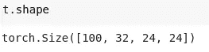

*   `100` —图片数量
*   `32` —输出层数
*   `24, 24` —果仁大小

```
stats(t)
```

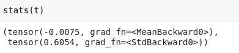

但是，我们希望标准差为 1，而不是 0.6，尽管我们的平均值为 0。因此，让我们将明凯初始化应用于权重。

```
init.**kaiming_normal_**(l1.weight, a=1.)
**stats**(l1(x))
```

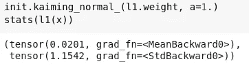

现在，更好了。平均值几乎为 0，标准差大约为 1。

但是，明凯初始化被引入来处理非线性激活函数。让我们来定义一下。

```
import torch.nn.functional as **F**def f1(x,a=0): return F.**leaky_relu**(l1(x),a)init.**kaiming_normal_**(l1.weight, a=0)
**stats**(f1(x))
```

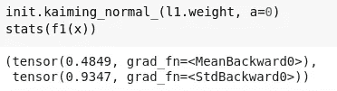

— Mean 不在 0 附近，但 SD 几乎等于 1。

没有明凯初始化，让我们找到统计数据。

```
l1 = nn.**Conv2d**(1, nh, 5)
stats(f1(x))
```

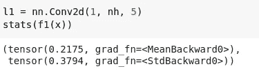

*   现在，你可以很容易地比较有和没有明凯的统计数据。
*   在明凯，结果要好得多。

# 比较

现在，让我们将我们的结果与 PyTorch 进行比较。在此之前，我们需要看到 PyTorch 代码。

```
**torch.nn.modules.conv._ConvNd.reset_parameters**
```

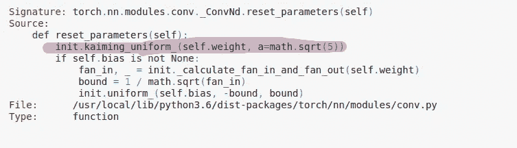

## 明凯制服

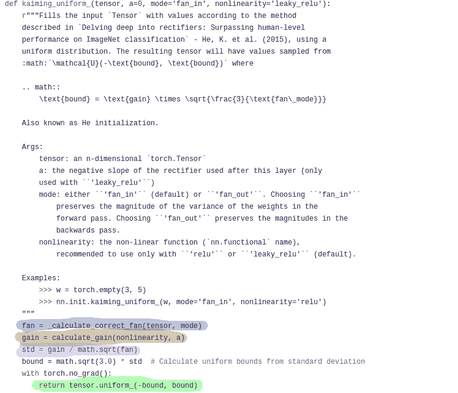

## 计算 _ 校正 _ 风扇

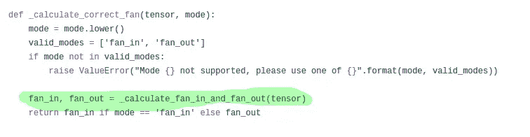

## 计算扇入扇出

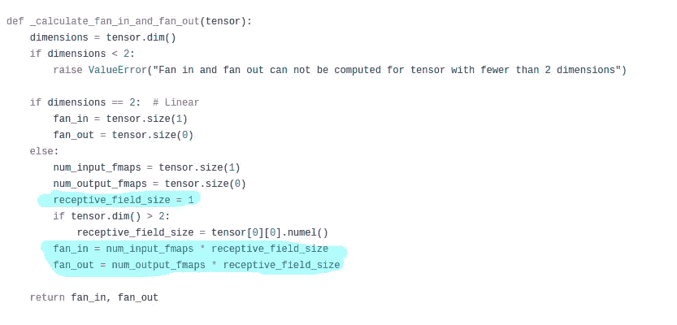

让我们了解一下上面的方法。

*   PyTorch 使用明凯制服，而不是明凯正常。明凯统一在价值边界上不同于后者。

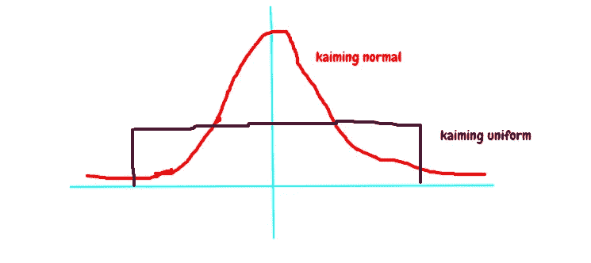

*   calculate_fan_in_fan_out()中有一个变量`receptive_field_size`。计算如下。

```
l1.weight.shape
 ** = torch.Size([32, 1, 5, 5])**l1.weight[0,0].**shape
  = torch.Size([5, 5])**rec_fs = **l1.weight[0,0].numel()**
**rec_fs**
```

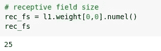

*   `fan_in(number of input parameters)`和`fan_out(number of output filters)`计算如下。

```
nf,ni,*_ = **l1.weight.shape**
nf,ni
```

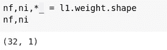

32 is output filters/layers, 1 is the input layer

```
**fan_in**  = ni*rec_fs
**fan_out** = nf*rec_fsfan_in,fan_out
```

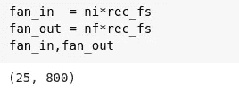

*   明凯 _ 制服()里多了一个参数`gain`。它是非线性激活函数中的泄漏量。其定义如下。

```
def **gain**(a): return math.sqrt(2.0 / (1 + a**2))
```

*   对于 ReLU，a 的值为 0。因此，ReLU 的 gain 值是 math.sqrt(2.0)。查看下面的链接。

[](https://github.com/pytorch/pytorch/blob/fd4f22e4eaae17b8ee8c7de8b0b2b0e202fdf147/torch/nn/init.py#L60) [## 皮托赫/皮托赫

### 此时您不能执行该操作。您已使用另一个标签页或窗口登录。您已在另一个选项卡中注销，或者…

github.com](https://github.com/pytorch/pytorch/blob/fd4f22e4eaae17b8ee8c7de8b0b2b0e202fdf147/torch/nn/init.py#L60) 

从所有上述知识，我们可以创建我们的明凯 _ 制服如下。

```
def **kaiming2**(x,a, use_fan_out=False):
    **nf,ni**,*_ = x.shape
    **rec_fs** = x[0,0].shape.numel()
    **fan** = nf*rec_fs if use_fan_out else ni*rec_fs
    **std** = gain(a) / math.sqrt(fan)
    **bound** = math.sqrt(3.) * std
    **x.data.uniform_**(-bound,bound)
```

让我们来计算一下统计数据。

```
**kaiming2**(l1.weight, a=0);
**stats**(f1(x))
```

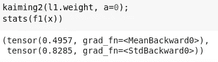

成绩还是比较好的。

这就是明凯概念在卷积神经网络中的应用。

# 步骤 5 —训练循环

现在，我们已经到了需要了解交叉熵损失的地步，因为交叉熵损失主要用于单分类或多分类问题。因为我们使用 MNIST 数据集，所以我们需要创建一个神经网络来预测 10 个数字，即从 0 到 9。之前，我们使用 MSE 损失并预测单一结果，这是我们通常不做的。

所以在深入学习损失函数之前，让我们使用 PyTorch nn.module 创建一个神经网络。

```
from torch import nn
class **Model**(**nn**.Module):
    def __init__(self, n_in, nh, n_out):
        super().__init__()
        **self.layers** = [nn.**Linear**(n_in,nh), nn.**ReLU**(),      nn.**Linear**(nh,n_out)]

    def __call__(self, x):
        for l in self.layers: x = **l(x)**
            return **x**
```

我们有下面定义的变量。

```
**n,m** = x_train.shape
**c** = y_train.max()+1
**nh** = 50
```

让我们再次定义权重。

```
**w1** = torch.randn(m,nh)/math.sqrt(m)
**b1** = torch.zeros(nh)
**w2** = torch.randn(nh,10)/math.sqrt(nh)
**b2** = torch.zeros(10)
```

您可以观察到重量初始化的差异。这一次，我们需要十个预测，输出中的每个数字一个。这就是我把 w2 初始化为(nh，10)的原因。

```
model = Model(m, nh, 10)
pred = model(x_train)**pred.shape**
```

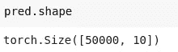

## —交叉熵损失

同样，在沉迷于交叉熵损失之前，我们需要对我们的预测或激活进行 softmax。我们在这种情况下做 softmax 我们想要单一标签分类。在实践中，当我们计算损失时，我们将需要 softmax 的对数，因为它有助于进一步计算交叉熵损失。

Softmax 定义为:


或者更简洁地说:

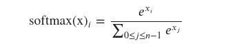

```
def log_softmax(x): return (x.exp()/(x.exp().sum(-1,keepdim=True))).log()
```

*   `x.exp().sum(-1,keepdim=True)`将对该行激活的指数求和。
*   如果`keepdim`是`True`，则输出张量的大小与`input`相同，除了在维度`dim`中其大小为 1。否则，`dim`被压缩，导致输出张量比`input`少一个维度。

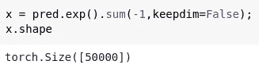

Dimensions are squeezed

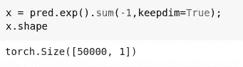

既然我们已经定义了`log_softmax`，那就让我们取预测的`log_softmax`。

```
sm_pred = log_softmax(pred)
```

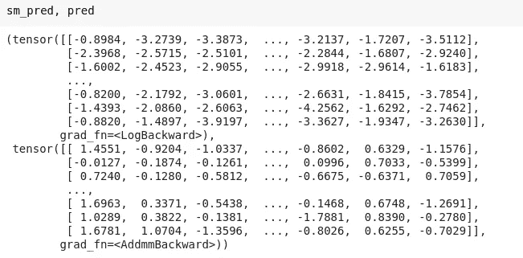

交叉熵损失定义如下:

```
**def** CrossEntropy(yHat, y):
    **if** y == 1:
      **return** -log(yHat)
    **else**:
      **return** -log(1 - yHat)
```

在二进制分类中，类的数量 M 等于 2，交叉熵可以计算为:

```
−(*𝑦*log(*𝑝*)+(1−*𝑦*)log(1−*𝑝*))
```

如果 M>2(即多类分类)，我们计算每个观察的每个类标签的单独损失，并对结果求和。

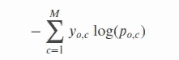

我们的问题是多类分类，所以我们的交叉熵损失函数将是后一个。多类分类的交叉熵损失函数也可以使用 numpy 风格的[整数数组索引](https://docs.scipy.org/doc/numpy-1.13.0/reference/arrays.indexing.html#integer-array-indexing)来完成。让我们用它来实现。

```
def **nll**(input, target): return -input[range(target.shape[0]), target].mean()
**loss** = nll(sm_pred, y_train)
```

请注意，公式


当我们计算 log softmax 时，给出了一个简化，之前定义为`(x.exp()/(x.exp().sum(-1,keepdim=True))).log()`。

```
def **log_softmax**(x): return x - x.exp().sum(-1,keepdim=True).log()
**loss** = **nll**(log_softmax(pred), y_train)
```

然后，有一种更稳定的计算指数之和的对数的方法，叫做 [LogSumExp 窍门](https://en.wikipedia.org/wiki/LogSumExp)。这个想法是使用下面的公式:


where a is the maximum of the *𝑥𝑗*.

*   从预测中取出最大值。
*   从预测的指数中减去最大值。
*   最后，将最大值添加到操作日志中，如上图所示。
*   它有助于计算，并使它更快，而不影响任何情况下的输出。

让我们定义我们的 LogSumExp。

```
**m** = **pred**.max(-1)[0]
m[:,None]
```


```
def **logsumexp**(x):
    m = x.max(-1)[0]
    return m + (x-m[:,None]).exp().sum(-1).log()
```

*因此*我们可以将它用于我们的`log_softmax`功能。

```
def **log_softmax**(x): return x - x.**logsumexp**(-1,keepdim=True)
```


让我们看看 PyTorch 中的上述实现。

```
import torch.nn.functional as F
F.**nll_loss**(F.**log_softmax**(pred, -1), y_train)
```

> 在 PyTorch 中，`F.log_softmax`和`F.nll_loss`被组合在一个优化函数`F.cross_entropy`中。

## —基本训练循环

训练循环重复以下步骤:

*   根据一批输入获取模型的输出
*   将输出与我们拥有的标签进行比较，并计算损失
*   计算损失相对于模型每个参数的梯度
*   用这些梯度更新参数/权重，使它们更好一点。
*   在称为`epochs`的循环中重复上述步骤。

让我们结合上述所有概念，创建我们的循环。

```
bs = 64
lr = 0.5   # learning rate
epochs = 1 # how many epochs to train for
```

S o，这就是我们在神经回路中定义训练回路的方式。现在，在 PyTorch 中，它有一些语法差异，你现在可以理解了。随着时间的推移，我将在这个系列中添加更多的步骤。在那之前，请随意探索 fastai。

## 参考

*   [fast.ai](https://www.fast.ai/)