# STL 分解:如何从零开始？

> 原文：<https://towardsdatascience.com/stl-decomposition-how-to-do-it-from-scratch-b686711986ec?source=collection_archive---------0----------------------->

## 弄清楚什么是 STL 分解，以及它是如何工作的。

这篇文章将帮助你理解什么是 STL 分解，以及如何从头开始。最后，我也将使用 statsmodel 库，在几秒钟内得到结果。

# 什么是 STL 分解？

所以，STL 代表**使用黄土进行季节和趋势分解。**这是一种将时间序列数据分解为包含季节性、趋势和残差的 3 个分量的统计方法。

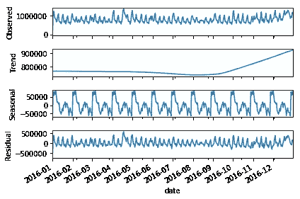

现在，什么是时间序列数据？它是一系列数据点，在一个连续的时间轴上变化。下面是一个时间序列数据的例子，你可以看到时间轴是在一个小时的水平，股票价值随时间而变化。

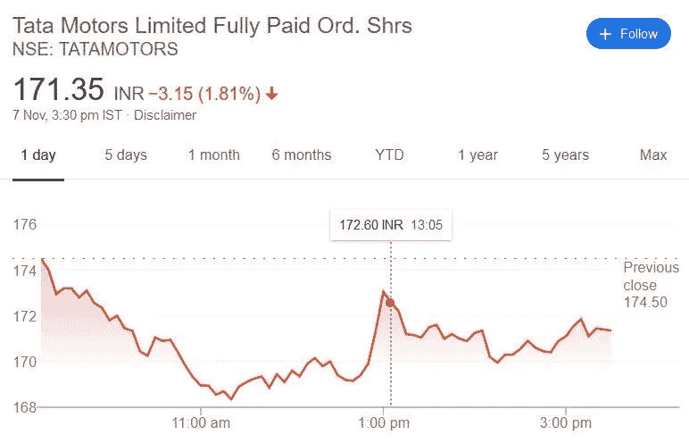

现在我们来谈谈趋势。趋势给你一个总体数据的大致方向。从上面的例子中，我可以说，从上午 9:00 到上午 11:00 有一个下降趋势，从上午 11:00 到下午 1:00 有一个上升趋势，下午 1:00 之后趋势是恒定的。

而季节性是以固定时间间隔重复出现的规则且可预测的模式。例如，下图有助于我们了解零售商每月的总销售量。所以，如果我们仔细观察，我们会发现每年 12 月份的单位销售额都在增加。因此，在 12 个月的时间内，单位销售额有一个规律或季节性。

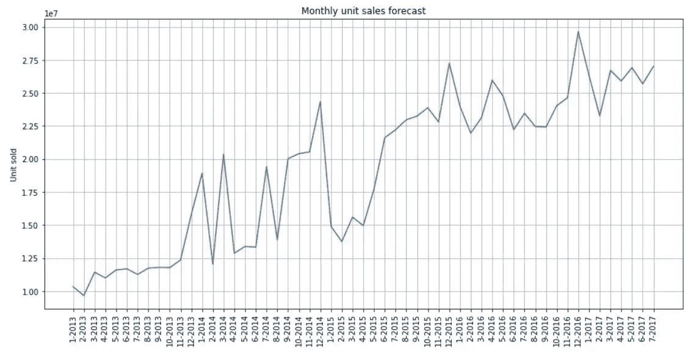

随机性或噪声或残差是随机波动或不可预测的变化。这是我们无法猜测的。例如，2014 年 3 月有一个高单位销售额，这在每个 3 月都是不规则的。因此，我们可以说，在这个月中，它有一些高百分比的噪声或残余。

现在，我们来谈谈**黄土**。因此，黄土是一种回归技术，它使用局部加权回归来拟合通过序列中的点的平滑曲线，在我们的情况下，序列是时间序列数据。要更详细地了解黄土，[点击这里](https://blogs.sas.com/content/iml/2016/10/17/what-is-loess-regression.html)。

# 如何从零开始做 STL 分解？

所以在这里，我采用 [Corporación Favorita 杂货销售预测数据集](https://www.kaggle.com/c/favorita-grocery-sales-forecasting/data)来可视化每一步。为了更好地理解，我将数据按月进行了汇总。

该数据集的时间序列数据如下所示。这里我们可以观察 2013 年到 2016 年每个月售出的单位价值。

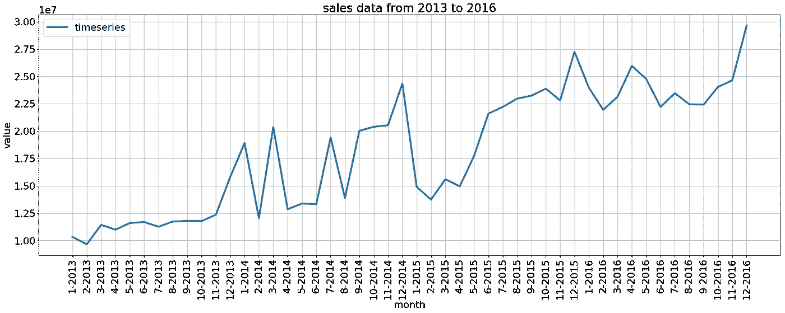

## **第一步**

找出符合上述时间序列数据的近似趋势线。

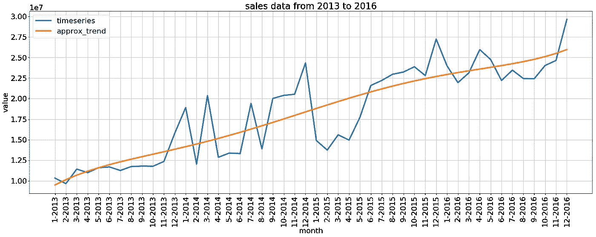

## 第二步

通过用近似趋势线减去时间序列数据，找到去趋势序列。

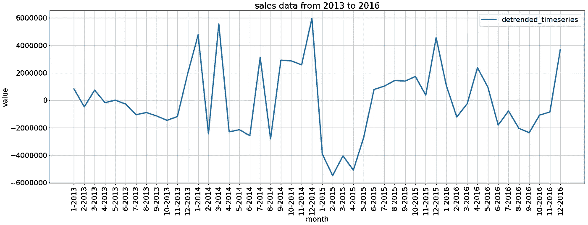

## 第三步

找出季节性因素。在这里，我找出了月水平上的季节性(周期= 12)。因此，我必须按月对去趋势化系列进行分组，以找出整个数据(48 个月)中每个月的平均销售量。

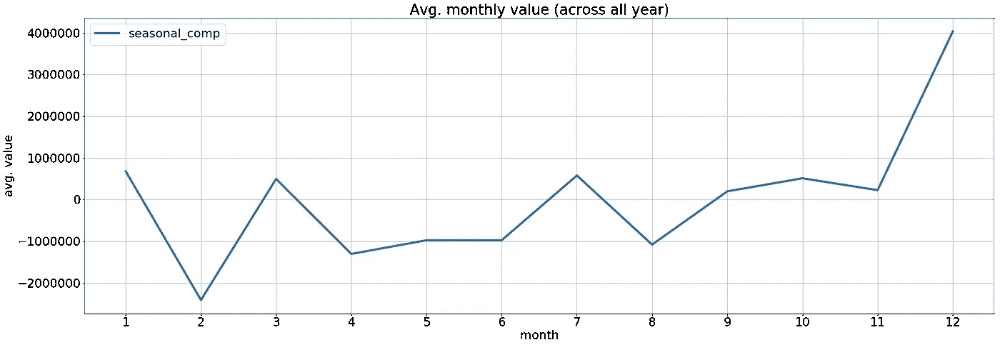

## 第四步

在整个数据中填充此组件(48 个月)。

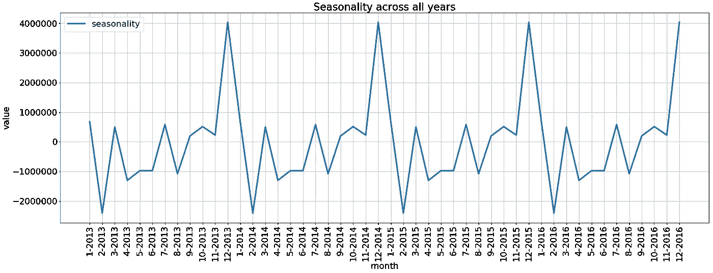

## 第五步

通过用季节性数据减去时间序列数据，找到去季节性的时间序列。

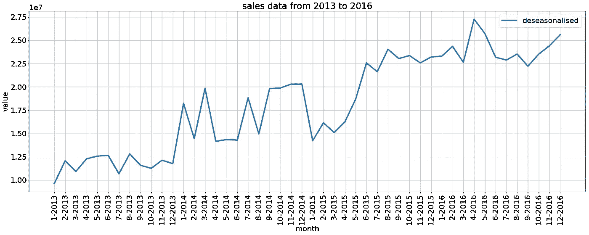

## 第六步

通过将去季节性数据拟合到多项式模型中来寻找趋势。

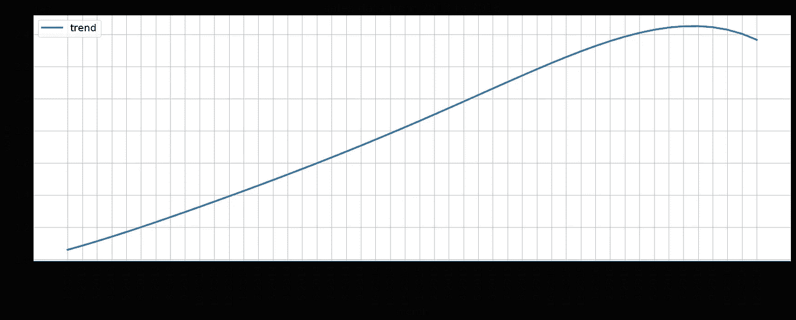

## 第七步

通过减去具有季节性和趋势性的时间序列数据来找到残差。

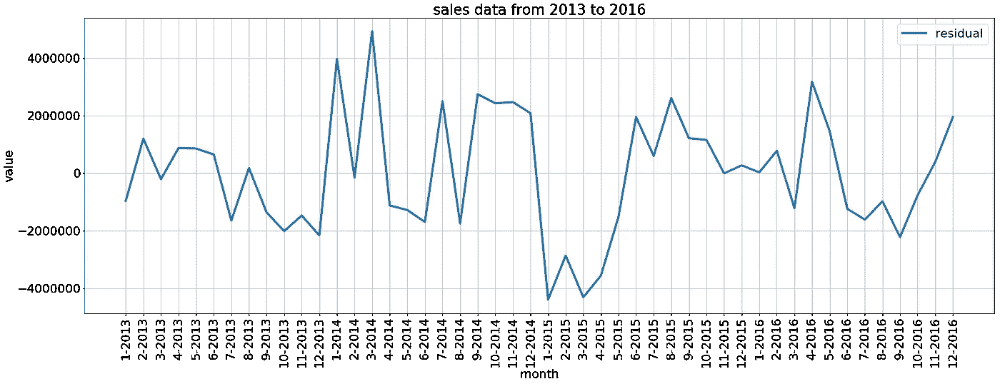

## 时间序列的分解成分

所以，下面是 STL 分解的最终图:

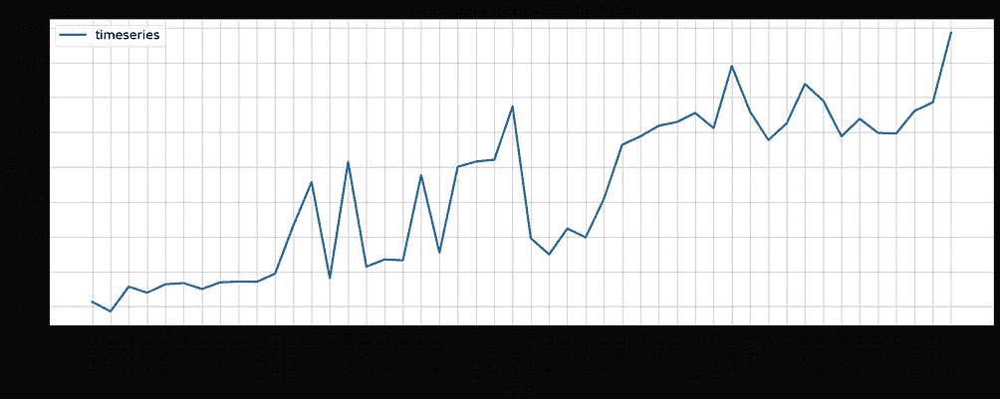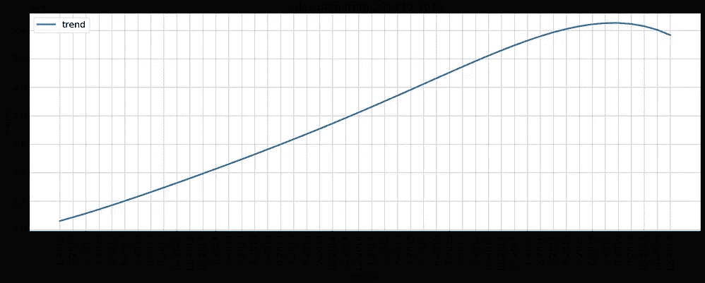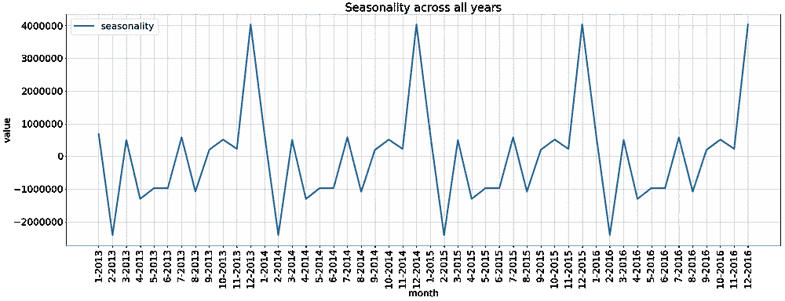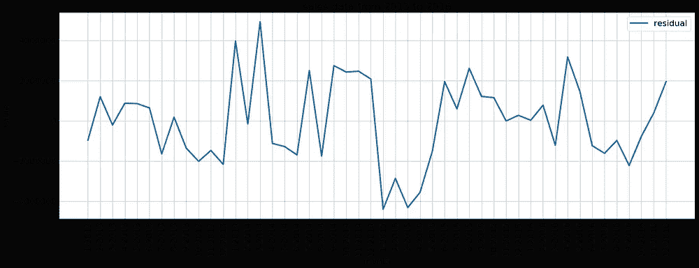

# 使用 stats 模型库进行 STL 分解

首先，您必须完成 statsmodel 库的 pip [安装](https://pypi.org/project/statsmodels/)。然后，运行下面几行代码。

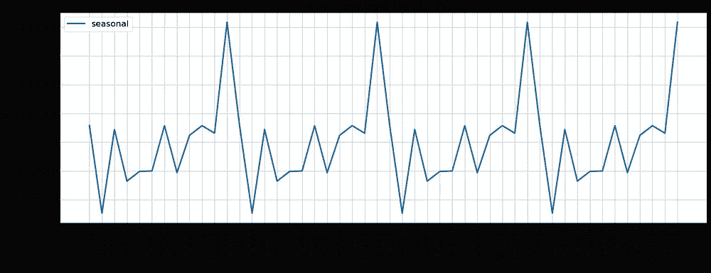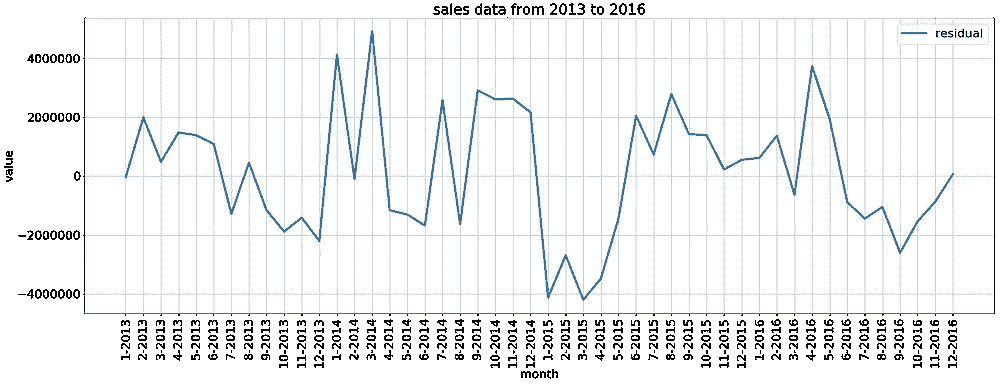

通过比较两种技术的结果，我们可以看到，趋势和残差分量只有显著变化，季节分量与实际情况相同。

# 链接到笔记本

这里是[到笔记本](https://github.com/rajatsharma369007/blog_codes/blob/master/STL_decoposition.ipynb)的链接，用于上面执行的观察。

最后，我只想说，一旦你使用一个库来完成任何统计和机器学习任务，试着去了解构建这些任务所需的实现和数学。这将帮助您更好地理解任何库的每个已定义类的方法参数的用法。

敬请关注下一篇博客…

