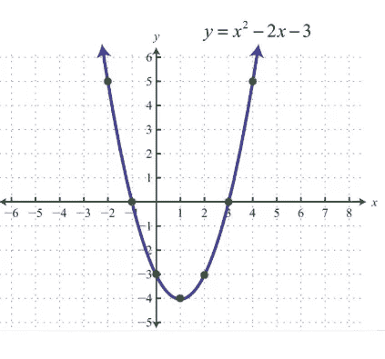

# 随机梯度下降——解释清楚！！

> 原文：<https://towardsdatascience.com/stochastic-gradient-descent-clearly-explained-53d239905d31?source=collection_archive---------0----------------------->

随机梯度下降是各种机器学习算法中非常流行和常用的算法，最重要的是形成了神经网络的基础。在这篇文章中，我尽力用简单的语言详细解释它。我强烈建议在阅读本文之前，先浏览一下[线性回归](/regression-explained-in-simple-terms-dccbcad96f61)。

## 梯度下降的目的是什么？

简单地说，坡度意味着一个表面的斜度。所以梯度下降字面上的意思是沿着斜坡下降，到达表面的最低点。让我们想象一个二维图形，比如下图中的抛物线。

A parabolic function with two dimensions (x,y)

在上图中，抛物线的最低点出现在 x = 1 处。梯度下降算法的目标是找到“x”的值，使得“y”最小。“y”在这里被称为梯度下降算法操作的目标函数，以下降到最低点。

在继续下一步之前，理解以上内容是很重要的。

# 梯度下降——算法

我用线性回归问题来解释梯度下降算法。正如我们从[这篇](/regression-explained-in-simple-terms-dccbcad96f61)文章中回忆的，回归的目标是最小化残差平方和。我们知道，当斜率等于 0 时，函数达到最小值。通过使用该技术，我们解决了线性回归问题并学习了权重向量。同样的问题可以用梯度下降技术解决。

**“梯度下降是一种迭代算法，它从一个函数上的随机点开始，一步一步地沿着它的斜率向下移动，直到它到达那个函数的最低点。”**

在通过将函数的斜率等于 0 而找不到最佳点的情况下，该算法很有用。在线性回归的情况下，您可以在脑海中将残差平方和映射为函数“y ”,将权重向量映射为上面抛物线中的“x”。

## 如何分步下移？

这是算法的关键。总的想法是从一个随机的点开始(在我们的抛物线例子中，从一个随机的“x”开始)，并找到一种方法在每次迭代中更新这个点，这样我们就可以沿着斜坡下降。

该算法的步骤是

1.  找到目标函数**相对于每个参数/特征**的斜率。换句话说，计算函数的梯度。
2.  为参数选择一个随机的初始值。(为了澄清，在抛物线的例子中，区分“y”和“x”。如果我们有更多像 x1、x2 等功能。我们对每个特征取“y”的偏导数。)
3.  通过插入参数值来更新梯度函数。
4.  计算每个特征的步长:**步长=梯度*学习率。**
5.  计算新参数如下:**新参数=旧参数-步长**
6.  重复步骤 3 至 5，直到梯度几乎为 0。

上面提到的“学习率”是一个灵活的参数，它严重影响算法的收敛性。较大的学习率使得算法在斜坡上向下迈出巨大的步伐，并且它可能跳过最小点，从而错过它。所以，坚持 0.01 这样的低学习率总是好的。从数学上也可以看出，如果起点较高，梯度下降算法会在斜坡上向下迈出较大的步伐，当它接近目的地时会迈出较小的步伐，以确保不会错过它，并且足够快。

# 随机梯度下降

梯度下降算法有一些缺点。我们需要更仔细地看看我们为算法的每次迭代所做的计算量。

假设我们有 10，000 个数据点和 10 个特征。残差平方和由与数据点一样多的项组成，因此在我们的例子中有 10000 项。我们需要计算这个函数相对于每个特征的导数，所以实际上我们每次迭代要做 10000 * 10 = 100，000 次计算。通常需要 1000 次迭代，实际上我们有 100，000 * 1000 = 100000000 次计算来完成算法。这是相当大的开销，因此梯度下降在大数据上是缓慢的。

随机梯度下降来救我们了！！“随机”，简单来说就是“随机”的意思。

**在梯度下降算法中，我们可以在哪里引入随机性？？**

是的，你可能猜对了！！在每一步选择数据点来计算导数。SGD 在每次迭代中从整个数据集中随机选取一个数据点，以极大地减少计算量。

通常在每一步采样少量的数据点，而不是一个点，这被称为“小批量”梯度下降。Mini-batch 试图在梯度下降的优势和 SGD 的速度之间取得平衡。

# 结论

我希望这篇文章有助于掌握该算法。敬请关注更多文章。请在下面留下您的评论/疑问。