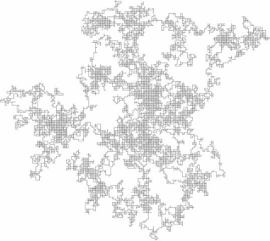
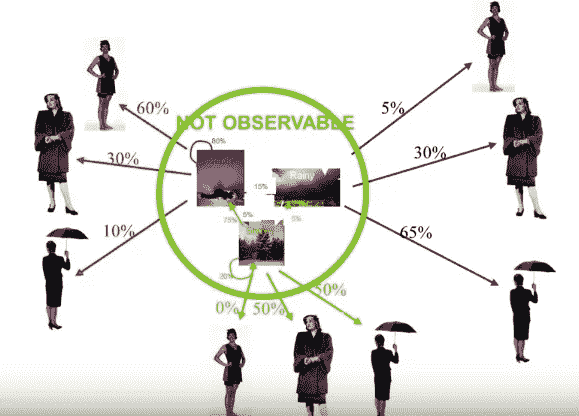
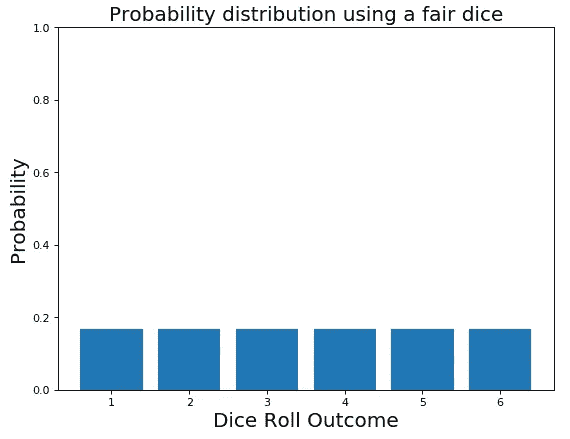
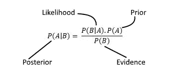

# 随机过程分析

> 原文：<https://towardsdatascience.com/stochastic-processes-analysis-f0a116999e4?source=collection_archive---------2----------------------->

## [内部 AI](https://medium.com/towards-data-science/inside-ai/home)

## 随机过程的介绍，以及它们在数据科学和机器学习中的日常应用。

(Source: [https://www.europeanwomeninmaths.org/etfd/](https://www.europeanwomeninmaths.org/etfd/))

> “唯一简单的事实是，在这个复杂的宇宙中没有简单的东西。一切都有关联。万物相连”
> 
> —约翰尼·里奇，《人类剧本》

# 介绍

机器学习的主要应用之一是模拟随机过程。机器学习中使用的随机过程的一些例子是:

1.  **泊松过程:**用于处理等待时间和排队。
2.  **随机漫步和布朗运动过程:**用于算法交易。
3.  **马尔可夫决策过程:**常用于计算生物学和强化学习。
4.  **高斯过程:**用于回归和优化问题(如超参数调整和自动机器学习)。
5.  **自回归和移动平均过程:**用于时间序列分析(如 [ARIMA 模型](/stock-market-analysis-using-arima-8731ded2447a))。

在本文中，我将向您简要介绍这些过程。

# 历史背景

随机过程是我们日常生活的一部分。使随机过程如此特殊的是它们对模型初始条件的依赖。在上个世纪，许多数学工作者如庞加莱、洛仑兹和图灵都被这个话题迷住了。

如今，这种行为被称为确定性混沌，它与真正的随机性有着截然不同的界限。

多亏了爱德华·诺顿·罗伦兹，对混沌系统的研究在 1963 年取得了突破。那时，洛伦兹正在研究如何改进天气预报。洛伦兹在他的分析中注意到，即使是大气中很小的扰动也会引起气候变化。

洛伦茨用来描述这种行为的一个著名表达是:

> “一只蝴蝶在巴西扇动翅膀就能在得克萨斯州引起一场龙卷风”
> 
> —爱德华·诺顿·罗伦兹

这就是今天混沌理论有时被称为“蝴蝶效应”的原因。

## 分形

一类混沌系统的简单例子是分形(如文章精选图片所示)。分形是不同尺度上永无止境的重复模式。它们不同于其他类型的几何图形，因为它们的比例不同。

分形是*递归*驱动的系统，能够捕捉混沌行为。现实生活中的一些分形的例子有:树木、河流、云彩、贝壳等…

Figure 1: MC. Escher, Smaller and Smaller [1]

艺术中运用自相似物体的例子很多。毫无疑问，M.C. Esher 是从数学中获取作品灵感的最著名的艺术家之一。事实上，在他的画中重现了各种不可能的物体，比如彭罗斯三角形和 T2 的莫比乌斯带。在《越来越小》中，他也再次使用了自相似性(图 1)。除了蜥蜴的外环，图画的内部图案是自相似的。它包含了每次重复的一半比例的副本。

# 确定性和随机过程

有两种主要类型的过程:确定性的和随机的。

在确定性过程中，如果我们知道一系列事件的初始条件(起点),我们就可以预测这一系列事件的下一步。相反，在随机过程中，如果我们知道初始条件，我们就不能充满信心地确定接下来的步骤。那是因为有很多(或者无限！)过程可能演变的不同方式。

在确定性过程中，所有后续步骤的已知概率为 1。另一方面，这不是随机过程的情况。

任何完全随机的东西对我们来说都没有任何用处，除非我们能从中识别出一种模式。在随机过程中，每个单独的事件都是随机的，尽管连接这些事件的隐藏模式是可以识别的。这样，我们的随机过程就不再神秘，我们能够对未来事件做出准确的预测。

为了用统计术语描述随机过程，我们可以给出以下定义:

*   **观察:**一次试验的结果。
*   **总体:**可以从试验中登记的所有可能的观察结果。
*   **样本:**从分离的独立试验中收集的一组结果。

例如，投掷一枚公平的硬币是一个随机的过程，但是由于大数定律，我们知道给定大量的尝试，我们将得到大致相同数量的正面和反面。

大数定律表明:

> 随着样本量的增加，样本的平均值将更接近总体的平均值或期望值。因此，随着样本量趋于无穷大，样本均值将收敛于总体均值。重要的是要明确样本中的观察值必须是独立的”
> 
> ——杰森·布朗利[2]

随机过程的一些例子是股票市场和医疗数据，如血压和脑电图分析。

# 泊松过程

泊松过程用于模拟一系列离散事件，其中我们知道不同事件发生之间的平均时间，但我们不知道这些事件可能发生的确切时间。

如果一个过程满足以下标准，则可以认为它属于泊松过程类:

1.  这些事件相互独立(如果一个事件发生，这不会改变另一个事件发生的概率)。
2.  两件事不能同时发生。
3.  事件发生之间的平均速率是恒定的。

让我们以停电为例。电力供应商可能会公布平均每 10 个月可能会发生一次停电，但我们无法准确说出下一次停电会在何时发生。例如，如果发生重大问题，电力可能会重复中断 2-3 天(例如，如果公司需要对电源进行一些更改)，然后在接下来的 2 年内继续供电。

因此，对于这种类型的过程，我们可以非常确定事件之间的平均时间，但是它们的发生在时间上是随机间隔的。

从泊松过程中，我们可以得到一个泊松分布，它可以用来计算不同事件发生之间的等待时间的概率或一段时间内可能发生的事件的数量。

泊松分布可以使用以下公式建模(图 2)，其中 k 代表一段时间内可能发生的事件的预期数量。

Figure 2: Poisson Distribution Formula [3]

可以使用泊松过程建模的现象的一些例子是原子的放射性衰变和股票市场分析。

# 随机行走和布朗运动过程

随机行走可以是在随机方向上移动的任何离散步骤序列(长度总是相同)(图 3)。随机漫步可以发生在任何类型的维度空间(如 1D，2D，钕)。

Figure 3: Random Walk in High Dimensions [4]

我现在将向你介绍使用一维空间(数线)的随机漫步，这里解释的这些相同的概念也适用于更高维度。

让我们想象一下，我们在一个公园里，我们可以看到一只狗在寻找食物。他现在在数轴上的零位置，他有相等的概率向左或向右移动以找到任何食物(图 4)。

Figure 4: Number Line [5]

现在，如果我们想知道狗在 N 步之后的位置，我们可以再次利用大数定律。利用这个定律，我们会发现，当 N 趋于无穷大时，我们的狗可能会回到它的起点。反正这个在这种情况下用处不大。

因此，我们可以尝试使用均方根(RMS)作为我们的距离度量(我们首先平方所有的值，然后计算它们的平均值，最后计算结果的平方根)。这样，我们所有的负数都会变成正数，平均值不再等于零。

在这个例子中，使用 RMS 我们会发现，如果我们的狗走 100 步，它平均会从原点移动 10 步(√100 = 10)。

如前所述，随机游走用于描述离散时间过程。相反，布朗运动可以用来描述连续时间的随机行走。

随机行走应用的一些例子是:在扩散过程中追踪分子穿过气体时所采取的路径，体育赛事预测等

# 隐马尔可夫模型

隐马尔可夫模型都是关于理解序列的。它们可应用于数据科学领域，例如:

*   [计算生物学](/computational-biology-fca101e20412)。
*   书写/语音识别。
*   自然语言处理(NLP)。
*   强化学习。

hmm 是概率图形模型，用于从一组**可观测**状态中预测一系列**隐藏**(未知)状态。

这类模型遵循马尔可夫过程假设:

> 鉴于我们了解现在，未来独立于过去

因此，当使用隐马尔可夫模型时，我们只需要知道我们的当前状态，以便对下一个状态做出预测(我们不需要任何关于先前状态的信息)。

为了使用 hmm 进行预测，我们只需要计算隐藏状态的联合概率，然后选择产生最高概率(最有可能发生)的序列。

为了计算联合概率，我们需要三种主要类型的信息:

*   初始条件:我们在任何隐藏状态下开始序列的初始概率。
*   **转移概率:**从一个隐藏状态转移到另一个隐藏状态的概率。
*   **发射概率:**从隐藏状态转移到可观察状态的概率。

举个简单的例子，假设我们正试图根据一群人的穿着来预测明天的天气(图 5)。

在这种情况下，不同类型的天气将成为我们的隐藏状态(如晴天、刮风和下雨)，而穿着的衣服类型将成为我们的可观察状态(如 t 恤、长裤和夹克)。我们的初始条件将是这个系列的起点。转移概率，将代表我们从一种不同类型的天气转移到另一种天气的可能性。最后，排放概率将会是某人根据前一天的天气穿着某种服装的概率。

Figure 5: Hidden Markov Model example [6]

使用隐马尔可夫模型时的一个主要问题是，随着状态数量的增加，概率和可能场景的数量呈指数增长。为了解决这个问题，可以使用另一种称为[维特比算法](https://web.stanford.edu/~jurafsky/slp3/A.pdf)的算法。

如果您对生物学中使用 HMMs 和 Viterbi 算法的实际编码示例感兴趣，这可以在我的 Github 库中的[这里](https://github.com/pierpaolo28/Artificial-Intelligence-Projects/blob/master/Computational%20Biology/Tutorials/Tutorial%202/Tutorial%202.ipynb)找到。

从机器学习的角度来看，观察形成了我们的训练数据，隐藏状态的数量形成了我们要调整的超参数。

hmm 在机器学习中最常见的应用之一是在基于代理的情况下，如强化学习(图 6)。

Figure 6: HMMs in Reinforcement Learning [7]

# 高斯过程

高斯过程是一类平稳的零均值随机过程，完全依赖于其自协方差函数。这类模型可用于回归和分类任务。

高斯过程的最大优点之一是，它们可以提供关于不确定性的估计，例如，给我们一个估计，一个算法有多确定一个项目是否属于一个类。

为了处理包含一定程度不确定性的情况，通常使用概率分布。

离散概率分布的一个简单例子是掷骰子。

想象一下，现在你的一个朋友向你挑战掷骰子，你赌 50 点。在公平掷骰子的情况下，我们期望 6 个面中的每一个都有相同的概率出现(各 1/6)。这如图 7 所示。

Figure 7: Fair Dice Probability Distribution

无论如何，你玩得越多，你越会注意到骰子总是落在相同的面上。在这一点上，你开始认为骰子可能被装载了，因此你更新了关于概率分布的最初信念(图 8)。

Figure 8: Loaded Dice Probability Distribution

这个过程被称为贝叶斯推理。

> 贝叶斯推理是一个过程，通过这个过程，我们在收集新证据的基础上更新我们对世界的信念。

我们从一个***先验信念*** 开始，一旦我们用全新的信息更新它，我们就构建一个 ***后验信念*** 。这一推理同样适用于离散分布和连续分布。

因此，高斯过程可以让我们描述概率分布，一旦我们收集到新的训练数据，我们就可以使用贝叶斯规则(图 9)更新概率分布。

Figure 9: Bayes Rule [8]

# 自回归移动平均过程

自回归滑动平均(ARMA)过程是一类非常重要的用于分析时间序列的随机过程。ARMA 模型的特点是它们的自协方差函数只依赖于有限数量的未知参数(使用高斯过程是不可能的)。

ARMA 首字母缩写词可以分为两个主要部分:

*   **自回归** =该模型利用了预定义数量的滞后观测值和当前观测值之间的联系。
*   **移动平均** =该模型利用了残差和观测值之间的关系。

ARMA 模型利用了两个主要参数(p，q)。这些是:

*   **p** =滞后观察次数。
*   **q** =移动平均线窗口的大小。

ARMA 过程假设时间序列围绕一个时不变均值均匀波动。如果我们试图分析一个不遵循这种模式的时间序列，那么这个序列将需要差分，直到它能够达到平稳。

这可以通过使用 ARIMA 模型来实现，如果你有兴趣了解更多，我写了一篇关于使用 ARIMA 进行股票市场分析的文章。

***感谢阅读！***

# 联系人

如果你想了解我最新的文章和项目[，请在媒体](https://medium.com/@pierpaoloippolito28?source=post_page---------------------------)上关注我，并订阅我的[邮件列表](http://eepurl.com/gwO-Dr?source=post_page---------------------------)。以下是我的一些联系人详细信息:

*   [领英](https://uk.linkedin.com/in/pier-paolo-ippolito-202917146?source=post_page---------------------------)
*   [个人博客](https://pierpaolo28.github.io/blog/?source=post_page---------------------------)
*   [个人网站](https://pierpaolo28.github.io/?source=post_page---------------------------)
*   [中等轮廓](https://towardsdatascience.com/@pierpaoloippolito28?source=post_page---------------------------)
*   [GitHub](https://github.com/pierpaolo28?source=post_page---------------------------)
*   [卡格尔](https://www.kaggle.com/pierpaolo28?source=post_page---------------------------)

# 文献学

[1]M . C .埃舍尔，“越来越小”——1956 年。可从以下网址获取:[https://www . etsy . com/listing/288848445/m-c-escher-print-escher-art-smaller-和](https://www.etsy.com/listing/288848445/m-c-escher-print-escher-art-smaller-and)

[2]机器学习中大数定律的温和介绍。机器学习大师，杰森·布朗利**。**访问:[https://machine learning mastery . com/a-gentle-introduction-to-the-law-of-large-numbers-in-machine-learning/](https://machinelearningmastery.com/a-gentle-introduction-to-the-law-of-large-numbers-in-machine-learning/)

【3】正态分布，二项分布&泊松分布，让我来分析。访问网址:[http://makemanealyst . com/WP-content/uploads/2017/05/Poisson-Distribution-formula . png](http://makemeanalyst.com/wp-content/uploads/2017/05/Poisson-Distribution-Formula.png)

[4]维基共享。访问网址:[https://commons . wikimedia . org/wiki/File:Random _ walk _ 25000 . gif](https://commons.wikimedia.org/wiki/File:Random_walk_25000.gif)

【5】什么是数线？数学怪物。访问地址:[https://www . mathematics-monster . com/lessons/number _ line . html](https://www.mathematics-monster.com/lessons/number_line.html)

[6] ML 算法:一种 SD (σ)-贝叶斯算法。萨吉沙伊尔，中等。访问:[https://towards data science . com/ml-algorithms-one-SD-% CF % 83-Bayesian-algorithms-b 59785 da 792 a](/ml-algorithms-one-sd-σ-bayesian-algorithms-b59785da792a)

[7] DeepMind 的 AI 正在自学跑酷，结果很萌。边缘，詹姆斯·文森特。访问:[https://www . the verge . com/tldr/2017/7/10/15946542/deep mind-parkour-agent-reinforcement-learning](https://www.theverge.com/tldr/2017/7/10/15946542/deepmind-parkour-agent-reinforcement-learning)

[8]为数据科学专业人员介绍强大的贝叶斯定理。KHYATI MAHENDRU ，分析 Vidhya。访问:[https://www . analyticsvidhya . com/blog/2019/06/introduction-powerful-Bayes-theory-data-science/](https://www.analyticsvidhya.com/blog/2019/06/introduction-powerful-bayes-theorem-data-science/)