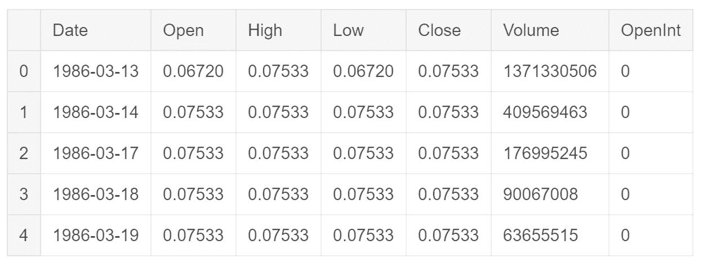
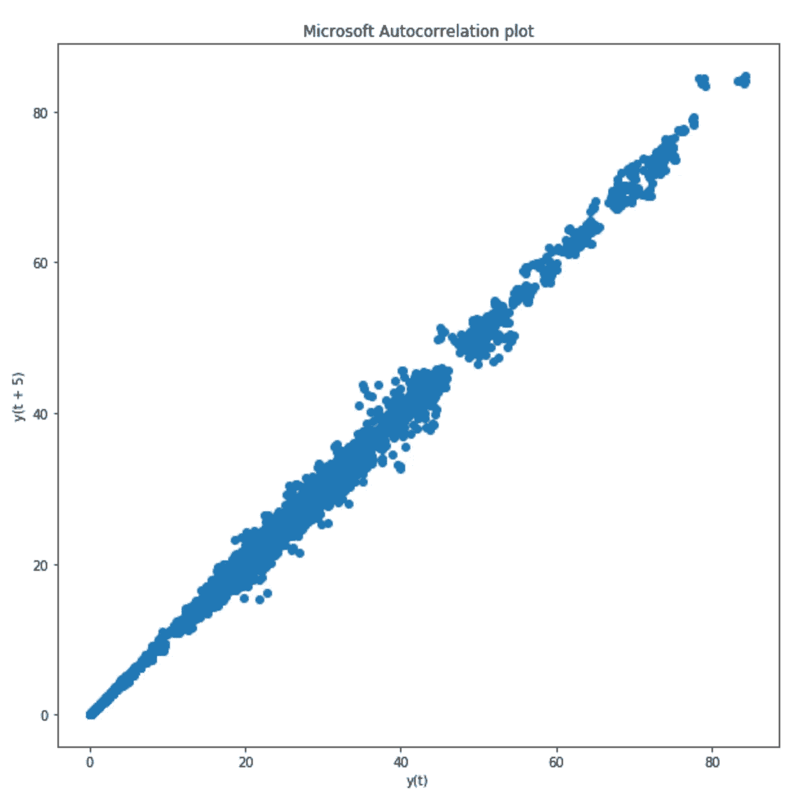
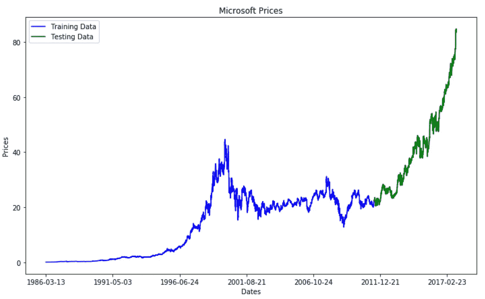
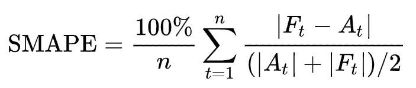
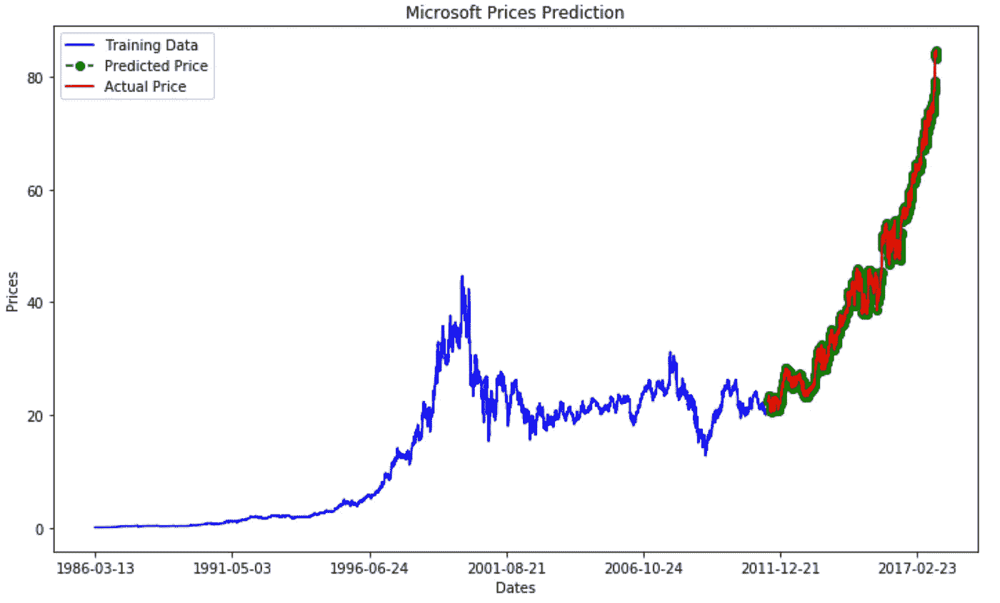
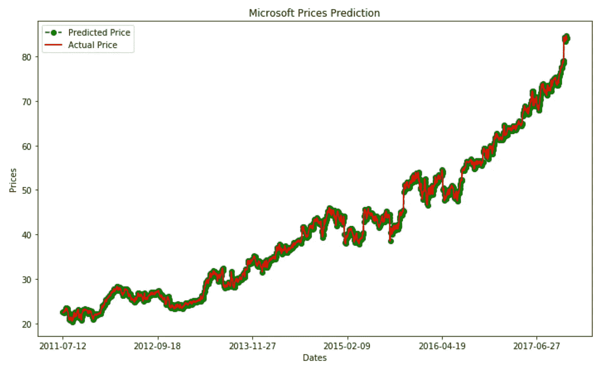

# 使用 ARIMA 进行股票市场分析

> 原文：<https://towardsdatascience.com/stock-market-analysis-using-arima-8731ded2447a?source=collection_archive---------3----------------------->


(Source: [https://ei.marketwatch.com/Multimedia/2018/03/30/Photos/ZH/MW-GG561_DJI_20_20180330105510_ZH.jpg?uuid=57e356ee-342a-11e8-978d-ac162d7bc1f7](https://ei.marketwatch.com/Multimedia/2018/03/30/Photos/ZH/MW-GG561_DJI_20_20180330105510_ZH.jpg?uuid=57e356ee-342a-11e8-978d-ac162d7bc1f7))

> *投资中最危险的四个字是:“这次不一样”*
> 
> -约翰·邓普顿爵士

# 时序数据

时间序列是我们日常生活的重要组成部分。事实上，它们被用于医学(脑电图分析)、金融(股票价格)和电子学(传感器数据分析)。为了处理这些类型的任务，已经创建了许多机器学习模型，两个例子是 ARIMA(自回归综合移动平均)模型和 RNNs(递归神经网络)。

# 介绍

我最近一直在 Kaggle 上做一个[股票市场数据集](https://www.kaggle.com/borismarjanovic/price-volume-data-for-all-us-stocks-etfs)。该数据集提供了所有美国股票的每日价格和交易量数据。如果你想了解更多，我所有的代码都可以在我的 [Kaggle](https://www.kaggle.com/pierpaolo28/stock-market-analysis-and-time-series-prediction) 和 [GitHub](https://github.com/pierpaolo28/Kaggle-Challenges/blob/master/stock-market-analysis-and-time-series-prediction.ipynb) 个人资料中免费获得。

在这篇文章中，我将解释如何使用 ARIMA 进行时间序列预测，以及在预测微软公司股票价格时，我使用这种方法获得了什么结果。

# ARIMA(自回归综合移动平均)

ARIMA 的首字母缩写代表[1]:

*   **自回归** =该模型利用了预定义数量的滞后观测值和当前观测值之间的联系。
*   **综合** =原始观测值之间的差异(例如，减去不同时间步长的观测值)。
*   **移动平均** =该模型利用了残差和观测值之间的关系。

ARIMA 模型利用了三个主要参数(p，d，q)。这些是:

*   **p** =滞后观察次数。
*   **d** =差分的程度。
*   **q** =移动平均窗口的大小。

如果应用于短期预测，ARIMA 可以产生特别好的结果(就像本例中所使用的)。Python 中 ARIMA 的不同代码模型在这里可用[。](https://machinelearningmastery.com/arima-for-time-series-forecasting-with-python/)

# 分析

为了实现下面的代码练习，我使用了下面的库和依赖项。

```
import numpy as np 
import pandas as pd 
import matplotlib.pyplot as plt
from pandas.plotting import lag_plot
from pandas import datetime
from statsmodels.tsa.arima_model import ARIMA
from sklearn.metrics import mean_squared_error
```

首先，我在所有其他可用的数据集中加载了特定的微软(MSFT)数据集。该数据集由七个不同的要素组成(图 1)。在这篇文章中，我将只研究“开放”的股票价格特性。对于大多数其他特征，可以重复同样的分析。

```
df = pd.read_csv("../input/Data/Stocks/msft.us.txt").fillna(0)
df.head()
```



Figure 1: Dataset Head

在开始研究时间序列预测之前，我决定分析相对于固定滞后 5 的“开放”特征的自相关图(图 2)。图 2 中显示的结果证实了 ARIMA 是适用于此类数据的良好模型。

```
plt.figure(figsize=(10,10))
lag_plot(df['Open'], lag=5)
plt.title('Microsoft Autocorrelation plot')
```



Figure 2: Autocorrelation plot using a Lag of 5

接着，我将数据分为训练集和测试集。完成后，我将两者绘制在同一张图上，以便对我们的时间序列有一个大致的了解(图 3)。

```
train_data, test_data = df[0:int(len(df)*0.8)], df[int(len(df)*0.8):]
plt.figure(figsize=(12,7))
plt.title('Microsoft Prices')
plt.xlabel('Dates')
plt.ylabel('Prices')
plt.plot(df['Open'], 'blue', label='Training Data')
plt.plot(test_data['Open'], 'green', label='Testing Data')
plt.xticks(np.arange(0,7982, 1300), df['Date'][0:7982:1300])
plt.legend()
```



Figure 3: Graphical Representation of Train/Test Split

为了评估 ARIMA 模型，我决定使用两种不同的误差函数:均方误差(MSE)和对称平均绝对百分比误差(SMAPE)。SMAPE 通常用作基于相对误差的精度测量(图 4)。

Scikit-learn 目前不支持 SMAPE 作为一个损失函数，因此，我必须首先自己创建这个函数。

```
def smape_kun(y_true, y_pred):
    return np.mean((np.abs(y_pred - y_true) * 200/ (np.abs(y_pred) +       np.abs(y_true))))
```



Figure 4: SMAPE (Symmetric mean absolute percentage error) [2]

之后，我创建了 ARIMA 模型用于这个实现。在这种情况下，我决定将 p=5、d=1 和 q=0 设为 ARIMA 参数。

```
train_ar = train_data['Open'].values
test_ar = test_data['Open'].valueshistory = [x for x **in** train_ar]
print(type(history))
predictions = list()
for t **in** range(len(test_ar)):
    model = ARIMA(history, order=(5,1,0))
    model_fit = model.fit(disp=0)
    output = model_fit.forecast()
    yhat = output[0]
    predictions.append(yhat)
    obs = test_ar[t]
    history.append(obs)
error = mean_squared_error(test_ar, predictions)
print('Testing Mean Squared Error: **%.3f**' % error)
error2 = smape_kun(test_ar, predictions)
print('Symmetric mean absolute percentage error: **%.3f**' % error2)
```

该模型的损失结果如下所示。根据 MSE，模型损耗相当低，但是对于 SMAPE，模型损耗一直较高。这种差异的主要原因之一是因为 SMAPE 是时间序列问题中常用的损失函数，因此可以提供更可靠的分析。这表明我们的模型还有改进的余地。

```
Testing Mean Squared Error: 0.343
Symmetric mean absolute percentage error: 40.776
```

最后，我决定绘制训练、测试和预测价格相对于时间的曲线图，以直观地显示模型相对于实际价格的表现(图 5)。

```
plt.figure(figsize=(12,7))
plt.plot(df['Open'], 'green', color='blue', label='Training Data')
plt.plot(test_data.index, predictions, color='green', marker='o', linestyle='dashed', 
         label='Predicted Price')
plt.plot(test_data.index, test_data['Open'], color='red', label='Actual Price')
plt.title('Microsoft Prices Prediction')
plt.xlabel('Dates')
plt.ylabel('Prices')
plt.xticks(np.arange(0,7982, 1300), df['Date'][0:7982:1300])
plt.legend()
```



Figure 5: Microsoft Price Prediction

图 6 提供了图 5 的放大版本。由此可以看出两条曲线是如何紧密相连的。然而，预测价格似乎看起来像实际价格的“嘈杂”版本。

```
plt.figure(figsize=(12,7))
plt.plot(test_data.index, predictions, color='green', marker='o', linestyle='dashed',label='Predicted Price')
plt.plot(test_data.index, test_data['Open'], color='red', label='Actual Price')
plt.legend()
plt.title('Microsoft Prices Prediction')
plt.xlabel('Dates')
plt.ylabel('Prices')
plt.xticks(np.arange(6386,7982, 300), df['Date'][6386:7982:300])
plt.legend()
```



Figure 6: Prediction vs Actual Price Comparison

使用 ARIMA 的这种分析总体上导致可观的结果。事实证明，该模型提供了良好的预测精度，并且与 RRNs(递归神经网络)等其他替代方法相比相对较快。

# 联系人

如果你想了解我最新的文章和项目[，请通过媒体](https://medium.com/@pierpaoloippolito28?source=post_page---------------------------)关注我，并订阅我的[邮件列表](http://eepurl.com/gwO-Dr?source=post_page---------------------------)。以下是我的一些联系人详细信息:

*   [领英](https://uk.linkedin.com/in/pier-paolo-ippolito-202917146?source=post_page---------------------------)
*   [个人博客](https://pierpaolo28.github.io/blog/?source=post_page---------------------------)
*   [个人网站](https://pierpaolo28.github.io/?source=post_page---------------------------)
*   [中等轮廓](https://towardsdatascience.com/@pierpaoloippolito28?source=post_page---------------------------)
*   [GitHub](https://github.com/pierpaolo28?source=post_page---------------------------)
*   [卡格尔](https://www.kaggle.com/pierpaolo28?source=post_page---------------------------)

# 文献学

[1]如何用 Python 创建时间序列预测的 ARIMA 模型，Jason Brownlee **，**机器学习精通。访问网址:[https://machine learning mastery . com/ARIMA-for-time-series-forecasting-with-python/](https://machinelearningmastery.com/arima-for-time-series-forecasting-with-python/)

[2]对称平均绝对百分比误差，维基百科。访问地址:[https://en . Wikipedia . org/wiki/Symmetric _ mean _ absolute _ percentage _ error](https://en.wikipedia.org/wiki/Symmetric_mean_absolute_percentage_error)