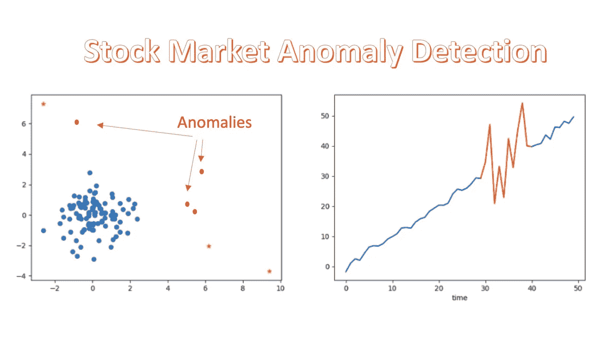
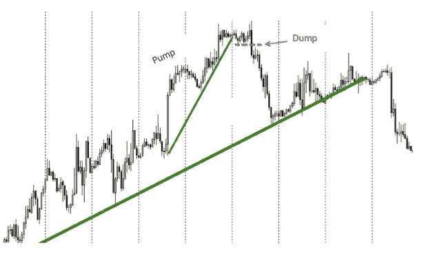
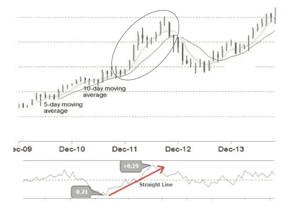

# “股市异常”和“股市异常检测”是两回事

> 原文：<https://towardsdatascience.com/stock-market-anomalies-and-stock-market-anomaly-detection-are-two-different-things-624331c7b65a?source=collection_archive---------4----------------------->

如果这是你第一次看到这两个术语，你可能会想:“啊？他要谈什么？它们不都是关于股市中发生的怪事吗？”大多数人不明白他们代表了两个不同的大型文学研究作品。发行的动机和技术也不同。在这篇文章中，我将谈论他们是什么。

股票价格时间序列值得我们努力研究和创新。对于刚刚开始研究股价运动的读者，可能会对我的文章《[R 中技术指标的算法交易](https://medium.com/analytics-vidhya/algorithmic-trading-with-technical-indicators-in-r-6883b07cd067)》和《[RNN/LSTM/GRU 股价预测技术指南](https://dataman-ai.medium.com/a-technical-guide-on-rnn-lstm-gru-for-stock-price-prediction-bce2f7f30346)》感兴趣。

**(一)什么是股票市场异常现象？**

人们认为，价格应该已经充分反映了所有可用的信息。没有办法“跑赢大盘”获得超额收益。这就是著名的“效率市场假说(EMH)”。根据 EMH 的观点，价格已经反映了至少所有过去公开的信息——所谓的弱式；或者价格瞬间变化*以反映所有可公开获得的信息——所谓的半强式；或者价格也反映了任何隐藏的内幕信息——所谓的强势形式。尤金·法玛(Eugene Fama)提出 EMH 后，几十年来一直有激烈的争论和实证数据分析。2013 年诺贝尔奖得主尤金·法玛(Eugene Fama)认为，异常现象与理性定价是一致的。他将此归因于风险回报权衡:没有办法使用预测模型来改善风险回报权衡。*

*所有交易者都订阅 EMH 吗？不完全是。许多交易者认为，存在价格被错误定价的机会，他们可以获得异常回报。“异常”是一种价格没有完全反映所有公开信息的情况，因此提供了一个交易机会。尽管“战胜市场”是许多新手或有经验的交易者都想做的事情，但很少有人成功。罗伯特·希勒——也是 2013 年诺贝尔奖得主——认为市场是非理性的，并且受制于投资者预期的行为偏差。如果是这样的话，投资业绩可以通过已经存在或即将出现的先进预测模型来提高。*

***公认的市场异常有哪些？***

*几十年的市场研究在金融文献中被吹捧。已经发现了许多市场异常现象。这里我描述八个典型:*

1.  ***动量:**你是否有时会观察到一个上涨的股票价格持续上涨超过合理水平，或者持续下跌低于不可思议的水平？似乎有一种推动资产价格超出预期价值的势头。*
2.  ***“一月”回来:**这种异常现象就是“一月效应”，或许也是符合逻辑的。前一年第四季度表现不佳的股票往往会在 1 月份跑赢大盘。这种“日历效应”有一个很好的解释:投资者倾向于在年底前出售亏损的股票，以冲销他们的税收损失。然而，这种现象不会在市场历史中可靠地重复。因此，在 1 月份买入 12 月份的输家并不能保证交易策略盈利。*
3.  ***一周中的每一天:**股票往往在周五而不是周一有好的结果。这种现象有时被称为周末效应，自 20 世纪 70 年代以来就有记录。但它的规模还不足以成为一种有利可图的交易策略。可能的解释是，公司倾向于将坏消息保留到周五收盘后。*
4.  *账面市值比:这可能是文献中记载的最古老的效应。它将公司的账面价值与其价格进行比较。较大的市净率意味着股价被低估，否则被高估。公司的账面价值来源于其历史成本或会计价值。一家公司的市场价值是其股票价格乘以其发行在外的股票数量，即市场资本总额。这种异常在经典的 [Fama 和法国研究论文(1993)](https://www.sciencedirect.com/science/article/pii/0304405X93900235) 中有很好的描述。一种解释是，投资者对成长股的增长方面反应过度，因此价值股被低估。*
5.  ***被忽视的股票:**文献记载，不太知名的公司的股票可以产生更高的收益。小型股往往较少被市场分析师分析。但是，是因为不重视还是因为小？文献还发现，较小的公司可以表现出更好的业绩，因为更高的风险和更高的回报。*
6.  *价格反转:关于这个主题的文献中有大量可信的研究。表现非常好的股票在长达一年的时间里逆转并跑输市场。类似地，在一段时间内表现不佳的股票可以在很长一段时间内跑赢市场。即使没有基本的财务报表来证明价格变动，这种现象也会发生。价格反转的原因是什么？这可能是投资者心理使然。不幸的是，很难预测投资者情绪开始导致价格突然上涨或下跌的时间。*
7.  ***收益惊喜:**投资者根据分析师的报告形成预期。当实际报告的收益与预期相差很大时，收益意外可能会导致价格长期大幅波动。福斯特、奥尔森和谢夫林表明，积极的惊喜导致价格在宣布后长达两个月的时间里上涨，而消极的惊喜导致在随后的七天里大幅下跌。他们的研究表明，如果投资者只是观察收益惊喜并迅速做出反应，异常情况就可能发生。它们还显示，价格变化没有 EMH 所说的那么快。*
8.  ***小公司效应:**小公司往往表现优于大公司。Banz (1981)和 Reinganum (1981)首次证明了这种小企业效应。随后的许多其他研究发现了小企业在其他资产和市场中的影响。然而，自从发现小企业异常现象的论文首次发表以来，这种现象似乎已经消失了。*

***市场异常现象经常发生，但并不总是发生**
创造超常回报一直是许多投资者的追求。请记住，市场异常可能已经发生，但不会可靠地重复。*

**

***(B)什么是股市异常检测？***

***异常检测**在统计学和机器学习中被广泛研究，它也被称为异常检测、偏差检测或新奇检测。各种成功的异常值检测算法的出现现在被应用于检测股票市场价格中的异常值。*

*异常值检测的一个直接应用是检测任何**市场操纵**。市场操纵是一种故意干预市场价格的企图，目的是在证券价格方面制造人为的、虚假的或误导性的表象。市场操纵是有害的，因为它扭曲了价格，破坏了证券市场的功能。更有甚者，由于大多数操纵者的非法获利，许多投资者将遭受重大损失。[艾伦和盖尔(1992)](https://academic.oup.com/rfs/article-abstract/5/3/503/1576822) 和[贾罗(1992)](https://www.cambridge.org/core/journals/journal-of-financial-and-quantitative-analysis/article/market-manipulation-bubbles-corners-and-short-squeezes/C99DDD1FFA925CEACD081595DDC50341) 是最早研究操纵的研究者。艾伦和盖尔将操纵行为分为基于行动的操纵、基于信息的操纵和基于交易的操纵。这里的重点是基于交易的操纵，艾伦和盖尔将其定义为通过实际交易订单扭曲股票市场价格。为此，需要收集每日股票数据或日内数据，如分笔成交点数据。检测任何非法内幕交易是另一个应用。任何人在内部消息公开之前就掌握了它，就可以利用这一优势进行交易。在大多数情况下，非法内幕交易是在消息公开一段时间后才被发现的。往往为时已晚:欺诈已经发生，无辜的投资者已经处于不利地位。我们需要及时的反应或预警探测系统。因此，机器学习开始扮演一个有希望的角色。*

*我想你明白“股市异常”和“股市异常检测”之间的区别:前者涉及效率市场假说(EMH)，后者的动机主要是由机器学习创新驱动的。*

***发生内幕交易的典型企业事件有哪些？***

*并购(M&A)和收益公告是典型的发生内幕交易的公司事件。 [Ahern (2017)](https://msbfile03.usc.edu/digitalmeasures/kahern/intellcont/Ahern%20JFE%202017-1.pdf) 通过使用美国证券交易委员会(SEC)和司法部(DOJ)在 2009 年至 2013 年间提交的所有内幕交易案件，报告称 M & As 占内幕交易的大约 51%，其次是收益公告，占 26%。剩下的事件包括临床试验和监管公告、新证券的销售以及运营新闻，如首席执行官更替。*

***典型的内幕交易有哪些症状？***

*当人们根据内部消息交易时，他们会在交易数据中留下痕迹。[多诺霍(2004)](https://dl.acm.org/citation.cfm?id=1014100) 记录了一些已知的症状:*

*   *异常高的交易量*
*   *异常的价格变动*
*   *交易较少(或“交易清淡”)的证券*
*   *选项作为经济高效的渠道。如果内幕人士对内幕消息非常确定，期权可以放大内幕人士的收益。例如，如果一个人知道 XXX 公司将在未来几周内被收购，股票很可能从 50 美元涨到 60 美元。如果内幕人士以 50 美元买入 XXX 股票，当股票涨到 60 美元时，他或她获利 20%。然而，如果这个人以 1 美元买了一个看涨期权(执行价格为 50 美元),那么这个看涨期权在跳跃后将价值 10 美元。交易者将获得 900%的利润，而不是 20%。*

*早期预警系统的目标是提醒监管者进行进一步的调查。值得注意的是，股票价格的上涨并不总是涉及内幕交易，即使所有的迹象都表明异常。金融业监管局(FINRA)的欺诈检测和市场情报办公室(OFDMI)肩负着这一特殊使命。OFDMI 将其组织结构分为四个单位:(I)内幕交易监督小组，(ii)欺诈监督小组，(iii)中央审查小组，以及(iv)举报人办公室。听[本期播客](http://www.finra.org/industry/podcasts/insider-trading-finding-needle-haystack)了解他们发现非法内幕交易的操作。*

***一些著名的股价操纵***

*你可能在新闻中听说过“泵转储”和“欺骗交易”。泵和转储是一种操纵方法，购买股票，推动其价格上升，然后转储所有的股票，以赚取利润。欺骗交易是一种操纵方法，欺骗其他投资者以操纵的价格买入或卖出。*

**

*Figure (I): Pump and dump*

***追踪内幕交易的证据***

*当人们根据内部消息交易时，他们会在交易数据中留下痕迹。交易量通常非常高，价格波动也不寻常。这在“交易清淡”的证券(通常交易量较低)中尤其如此，因为少量的内幕交易对整体交易有较大的影响。*

***利用数据发现价格操纵***

*监控系统的建立是为了寻找内幕交易的痕迹证据。新闻是“触发器”，开始搜索新闻之前的异常交易。全国证券交易商协会(NASD)的市场监管部建立了两个主要的“中断检测”系统——高级检测系统(ADS)和证券观察、新闻分析和监管(SONAR)——用于监视纳斯达克和其他几个市场。除了检测非法交易，该系统还可以用来防止恐怖袭击。*

*数据分析师将使用所有数据源，包括新闻、文本、每日股票价格或报价单位价格、公司信息等。找出任何操纵价格的行为。贸易数据可以分为两个层次。1 级数据是成功执行的交易。它是特定时期内的开盘价-最高价-最低价-收盘价和成交量。2 级数据包括 1 级数据和不匹配的买/卖订单。它显示输入、取消或匹配的每个特定订单。*

***创建要检测的特征***

*创建信号以识别潜在的泵送和倾倒方案仅仅是第一步，这并不容易。我们必须非常有创意地创造信号，或者用数据科学术语“特征”。这些功能可能会检测到完全正常的股票走势，因此信号会变成假阳性。我们的工作是高效和有效地发现异常交易，换句话说，以较小的误报率。图(二)是一个假设的“泵送-倾倒”方案(用圆圈标出)。你可以应用 5 日和 10 日移动平均线来发现潜在的情况。你也参考同期新闻或内幕交易信息，获得更多见解。除了价格变动，你还可以监控交易量的变化。图(二)的底部监测数量变化。*

**

***一个假设的例子***

*这里我们选取一只小股票“利民纸业有限公司”，代号 LMPMY，来创造特色。当您使用`getSymbols()`时，它将在数据集中加载股票的历史价格。数据有开盘-盘高-盘低-收盘和成交量信息。我使用 R 库`quantmod`和`TTR`。这在股票市场分析中很流行。*

*我加了几个技术分析指标:`addVo()`加成交量，`addBBands()`加布林线，`addCCI()`加商品通道指数。布林线是一种统计图表，描述了价格和波动性随时间的变化。商品通道指数是一个振荡器。还有很多其他的技术指标。注意，这些指标本身都不能揭示异常交易。你需要相关信息来调查案件。*

*** [## 通过我的推荐链接加入 Medium-Chris Kuo/data man 博士

### 阅读 Chris Kuo/data man 博士的每一个故事。你的会员费直接支持郭怡广/戴塔曼博士和其他…

dataman-ai.medium.com](https://dataman-ai.medium.com/membership)*