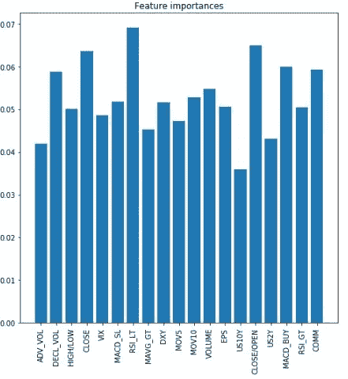

# RNN 利用每日市场变量进行股票市场预测

> 原文：<https://towardsdatascience.com/stock-market-predictions-with-rnn-using-daily-market-variables-6f928c867fd2?source=collection_archive---------10----------------------->

在这个项目中，我试图构建一个 RNN(特别是 LSTM)来预测股票市场的回报。该预测是根据 S&P500 指数做出的，该指数是最广泛用于交易和衡量股票市场回报的指数之一。然后，基本交易策略的执行基于预测，其相对于 S&P500 指数的表现是我们衡量成功的标准。

众所周知，股票市场由于其高维空间而很难预测，S&P500 可能是全球最有效的市场股票指数。由于这个原因，项目任务更具挑战性。因此，这可以看作是作者对机器学习技术的学习，特别是对时间序列分析中的神经网络的学习。

该项目经历了以下几个步骤:数据生成、数据预处理和特征选择、基线预测、LSTM 训练和结果展示。该项目已建立在 Python 编程语言与神经网络的 Keras 库。

## 训练集和测试集的数据生成

该项目使用了 20 多个具有日常频率的市场变量(特征),数据历史从 2006 年开始，一直到 2019 年 4 月。数据来源于彭博终端。使用的特征大多是各种 S&P500 技术指标，但也有市场变量，如指数前瞻共识收益估计，美国国债 2 年期和 10 年期收益率，美元指数，商品指数和波动指数。第三类是用 S&P500 指数信号收盘和开盘，高，低称为 OHLC 集，和交易量。与该领域的大多数类似项目相比，最初的特征选择试图带来更多的多样性和代表性，这些项目主要使用价格信号或指数的 OHLC。在项目期间，不同的特征集合已经被实验，但是最终总共 10 个特征被选择用于训练。预测的输出是 S&P500 指数第二天的回报(价格变化)。

数据预处理遵循 RNNs 情况下所需的时序排序原则。它是超过 13 年的连续每日数据，被分成 43 个学习周期，每个学习周期的长度为 3 年(假设一年中有 240 个交易日)用于培训，60 天(大约。3 个月)进行测试。它提供了 10 年零 9 个月的连续预测范围。图一。下图说明了数据排列。


Fig 1\. Dataset arrangement during the whole period

此外，每个研究周期(训练和测试)被排序作为图 2 中的示例说明。在滚动功能窗口和相应的输出方面。


Fig 2\. Input sequence illustration on selected features and output

在项目期间，试验了 5 到 20 天范围内的不同时间步长，但这里选择了 10 天时间步长。整个数据集按照以下维度顺序排列:病历报告、样本、时间步长、特征。

## 数据预处理和特征选择

用于训练的原始输入数据被标准化为每个研究期间的 z 得分，因此训练数据中的每个要素的均值为 0，标准差为 1。重要的是，用从训练数据中获得的平均值和标准偏差来标准化测试数据。

为了确定特性的相对重要性，来自 XGBoost 库的回归器在标准化的特性和输出上实现。图 4。下面显示了功能的重要性，从中选出了 10 个最重要的功能，以供以后使用。然而，当选择具有最高重要性的特性时，我们冒着丢失全部特性集合中所表示的关系的风险。



Fig 4\. Feature importances from XGBoost

数据预处理后，数据集具有以下形状，可用于训练和测试。

```
X train (43, 711, 10, 10) y train (43, 711, 1) x test (43, 60, 10, 10) y test (43, 60, 1)
```

## 基线预测-K-最近邻

为了评估 RNN 在股市预测中的能力，我们使用 scikit-learn 回归实现了基于 K-近邻算法的基线预测。从 1 到 200 范围内的不同 K-s 已经在训练期间回归，并且在验证期间具有最小均方误差的 K-s 已经在测试的特定研究期间使用。图五。下图在上图中显示了真实的 S&P500 和预测回报。下图显示了测试期间的交易表现(在任何真实生活成本之前)。这里我们使用的是对称规则，即如果预测回报为正，则 150%投资于指数，如果预测回报为负，则 50%投资于指数。在超过 2500 个交易日的所有测试期间，该结果与 S&P500 指数买入并持有表现一起绘制。即使准确性是评估分类模型的传统度量，我们在这里和在后面的阶段使用性能来比较 K-NN 和 RNN 预测能力。K-NN 模型在整个期间都取得了优异的表现，回报是初始投资的 3.5 倍，而 S&P500 买入并持有策略的回报是 3.0 倍。下方面板中的红色标记代表相对于全指数投资的多头(1)和空头(-1)头寸信号(在 alt y 轴上)。即使 K-NN 在整个期间的结果是正的，它也是不一致的，因为在时间跨度的开始和后半段有很长一段时间(以年计)表现不佳。


Fig 5\. K-NN performance

## LSTM 预测

该问题被设置为二进制分类，并为正的日回报分配值 1，为负的日回报分配值 0。所使用的 LSTM 网络设置和架构如图 6 所示。


Fig 6\. LSTM settings and architecture

用于拟合的参数是批量大小 32、验证分割 20%和 200 个时期。每个研究阶段的训练和验证损失结果如图 7 所示。以及图 8 中的相应精度。这些表明网络在纪元期间在验证方面有困难。重要的是，很少有损失更低、准确性更高的异常值研究集，这可以在测试期间对交易表现产生影响。然而，在训练期间近似的关系似乎在验证期间也勉强成立，因为在最后一个时期之后的研究期间的平均验证准确度是 53.75%。


Fig 7\. LSTM network training and validation loss


Fig 8\. LSTM network training and validation accuracies

## 基于 LSTM 模型的交易绩效

当对 LSTM 输出应用与 K-NN 相同的交易规则时，结果表现在图 9 中。我们可以观察到，交易结果是初始投资的 4 倍，相比之下，S&P500 买入-持有是 3 倍，K-NN 是 3.5 倍(图 5。).因此，在这个项目中，基于 LSTM 的交易表现优于 S&P500 指数和 K-NN 算法。


Fig 9\. S&P500 buy&hold and LSTM based trading performance

该项目的结论是，在其他机器学习方法中，LSTM 神经网络可以很好地替代股票市场时间序列预测。然而，目前的 LSTM 设置在解决该项目中的任务方面的整体成功是值得怀疑的，因为在所有测试期间，51.6%的测试精度可能是不够的。需要进一步测试不同的参数和架构设置，以提高精度。

## 未来工作:用于特征提取的神经网络

下一步，计划是使用卷积神经网络(CNN)上的自动编码器生成提取的特征。想法是使用提取的特征作为 LSTM 网络的输入。由于时间限制，这里不介绍由此产生的损失、准确性和交易性能，但是下面介绍构建自动编码器和提取压缩特征的描述。将 CNN 用于特定目的的想法来源于一篇很好的文章[这里是](/autoencoders-for-the-compression-of-stock-market-data-28e8c1a2da3e)，它提供了自动编码器不同网络的比较和结果，其中 CNN 似乎是一个有前途的替代方案。

为该项目构建的自动编码器网络架构如图 10 所示。可以看出，尝试将 10 个特征编码成 5 个特征。在对来自第一卷积层的编码器输出进行拟合之后，它被用于生成压缩特征，然后将被馈送到 LSTM。


Fig. 10 CNN autoencoder

进一步的想法包括用小波进行输入转换，并试验不同的数据处理方法和超参数。

*免责声明:本故事中呈现的材料不应被视为与持有、购买或出售证券或其他金融产品相关的建议或推荐，也不是创建或使用本故事中提及的任何技术或策略的建议或推荐。*