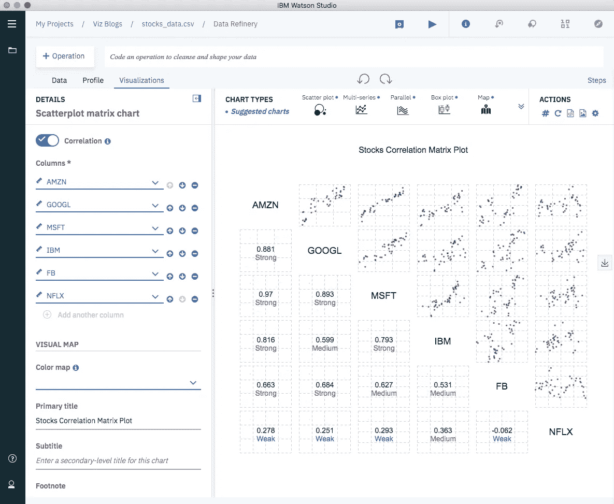
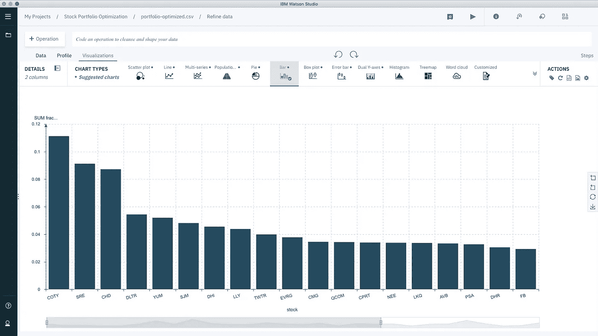

# 不要孤注一掷

> 原文：<https://towardsdatascience.com/stock-portfolio-optimization-d1dc66c7251?source=collection_archive---------36----------------------->

## 如何利用数据科学优化你的股票投资组合

Photo by [Markus Spiske](https://unsplash.com/@markusspiske?utm_source=medium&utm_medium=referral) on [Unsplash](https://unsplash.com?utm_source=medium&utm_medium=referral)

现代投资组合理论认为，多样化有助于降低投资组合的风险。投资组合包含高波动性但总体波动性低的资产，因为你可以组合负相关的资产——当一些资产上涨，另一些资产下跌。

这篇文章描述了我使用 S&P500 的股票，通过数学和数据科学优化投资组合的努力。

## 模型

目的是确定投资组合的哪一部分投资于几种可能的资产中的每一种，以最小化投资组合的波动性为目标，并符合目标回报。

为了用数学方法来框定这个问题，假设 **f** 是一个 **n** 维向量，它是我将投资于每一项 **n** 金融资产的分数。设 **C** 表示资产日收益的协方差矩阵，一个 **n** x **n** 矩阵。设 **r** 为每项资产预期收益的 **n-** 维向量。目标回报由 **r*决定。**

要解决的优化问题是:

由于我们希望最小化投资组合波动性(风险水平)的函数，问题的三个约束是:

*   分数之和应该是 1。
*   投资组合应该达到目标收益， **r*** 。
*   每只股票的分数应小于 100%。

因为我们要最小化的目标函数是一个二次的，这类问题在运筹学和数值优化界被称为*二次* *程序*。值得注意的是，因为它是一个[凸函数](http://mathworld.wolfram.com/ConvexFunction.html)，所以总是有唯一的解。

## 数据

我用了一个 2019 年 2 月 20 日到 4 月 18 日之间的股票价格的[数据集](https://towardsdatascience.com/r/?url=https%3A%2F%2Fwww.kaggle.com%2Fqks1lver%2Famex-nyse-nasdaq-stock-histories)。我选择了科技行业的一些股票——AMZN、GOOGL、MSFT、IBM、FB 和 NFLX(亚马逊、谷歌、微软、IBM、脸书和网飞)——并制作了一个图表来可视化它们的相关性:

除了网飞(NFLX)之外，大多数股票都有很强的相关性，但是记住这只是 2 个月的时间。

## 最优投资组合分配

为了解决这个问题，我需要计算 S & P500 指数中每只股票的日收益和估计收益的协方差矩阵 **C** 。我决定用 9%作为我的目标回报率。

一旦我计算了预期收益和每日收益的预期波动性(和协方差)，我就准备好解决最优化问题了。

访问 [this repo](https://github.com/IBMDataScience/stocks-portfolio-optimization/blob/master/Stock%20Portfolio%20Optimization%20WSD.ipynb) 查看我的 Python 代码，它将在 Watson Studio 桌面上运行。(你只需要将[数据集](https://towardsdatascience.com/r/?url=https%3A%2F%2Fwww.kaggle.com%2Fqks1lver%2Famex-nyse-nasdaq-stock-histories)放入你的项目中。)下面是一个片段:

优化模型从 S&P500 指数中的 500 只股票中选择了总共 28 只股票，包括作为前 3 名的这些股票:

1.  COTY——11.14%
2.  SRE——9.14%
3.  冠心病——8.74%

Portfolio Optimal Allocation

为了解决优化问题，我使用了来自 Python 的决策优化工具 CPLEX，灵感来自 CPLEX github repo 的一个笔记本。

## 最后的想法

*   我在这篇博客中使用的预期回报只是来自数据集中观察到的 2 个月期间，但你也可以使用机器学习和人工智能技术来确定它们。如果您对项目的预测方面感兴趣，请联系我们，我们可以合作！
*   该数据仅包含 S&P500 指数的股票。显然，股票是风险很大的资产。根据你的风险厌恶程度，你可以选择将短期和中期债券纳入投资组合，以降低投资组合的波动性。
*   同样，我只使用了两个月的数据。我当然不会建议根据这个数据集或任何时间框架如此短的数据集做出任何严肃的决定。
*   每个目标回报都有相应的投资组合波动性。对不同的目标回报率做同样的练习，以画出所谓的马科维茨有效边界。如果感兴趣，请阅读这篇关于用 Python 绘制有效边界的伟大的[帖子](/python-markowitz-optimization-b5e1623060f5)。
*   我在 [Watson Studio 桌面](https://towardsdatascience.com/r/?url=https%3A%2F%2Fwww.ibm.com%2Fproducts%2Fwatson-studio-desktop)中完成了所有的分析，结合了不同的工具:Jupyter 笔记本、数据精炼(用于可视化)和 CPLEX 决策优化社区版(用于求解二次规划)。

[1]哈里·马科维茨。(1952).[投资组合选择](https://www.math.ust.hk/~maykwok/courses/ma362/07F/markowitz_JF.pdf)。*《金融杂志》第 7 卷第 1 期。(1952 年 3 月)，第 77-91 页。*

[2]数据来源:[https://www . ka ggle . com/qks 1 lver/amex-NYSE-Nasdaq-stock-histories](https://www.kaggle.com/qks1lver/amex-nyse-nasdaq-stock-histories)

[3] IBM 决策优化(CPLEX) Github Repo。[https://ibmdecisionoptimization . github . io/tutorials/html/Beyond _ Linear _ programming . html](https://ibmdecisionoptimization.github.io/tutorials/html/Beyond_Linear_Programming.html)

特别感谢[史蒂夫·摩尔](https://medium.com/u/c81f0352abb7?source=post_page-----d1dc66c7251--------------------------------)对这篇文章的大力反馈。

***在 Twitter 上关注我:***[@ castan](https://twitter.com/castanan) ***在 LinkedIn 上找我:*** @ [jorgecasta](https://www.linkedin.com/in/jorgecasta/)