# 基于递归神经网络的股票预测

> 原文：<https://towardsdatascience.com/stock-prediction-using-recurrent-neural-networks-c03637437578?source=collection_archive---------2----------------------->

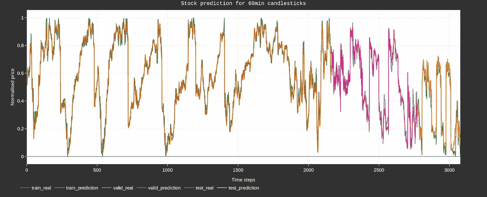

Normalized stock price predictions for train, validation and test datasets. Don’t be fooled!

## 与人工智能交易

## 预测给定股票的梯度

这种类型的帖子已经写了很多次，但很多都让我不满意。最近，我阅读了利用深度学习的最新进展来预测股票价格走势的[](/aifortrading-2edd6fac689d)*，我认为这是一篇非常有趣的文章。它涵盖了许多主题，甚至给了我一些想法(它也促使我写了我的第一篇文章🙂).但它实际上并没有说明网络的表现有多好。我的直觉告诉我“不太好”，因为这是通常的情况，但也许/希望我是错的！
一段时间以来，我一直在开发自己的交易算法，所以这篇文章介绍了我的方法、想法和一些结果。*

*这包括:*

1.  ***挑战***
2.  ***数据***
3.  ***构建数据集***
4.  ***培训***
5.  ***结果***
6.  ***结束语***

## *挑战*

*总体挑战是确定一个收盘价和下一个收盘价之间的梯度差。*不是*实际的股票价格。为什么？当你试图预测可能小幅波动(| < 0.01%|)和/或大幅波动(| > 5%|)的东西时，很容易欺骗自己认为你有一个可行的模型。下图给出了一个例子。一个基本模型(没什么特别的)被训练来预测高盛的(标准化)价格:*

*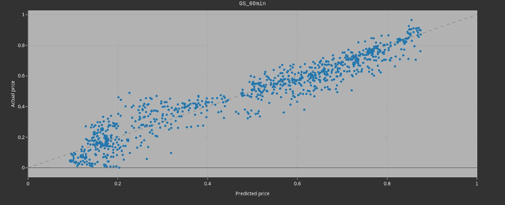*

*Actual vs predicted (normalized) prices for the validation dataset.*

*股票的实际价格在 y 轴，而预测价格在 x 轴。这里显然有一个很好的线性趋势。或许可以由此发展出一种交易策略。但是如果我们画出两个连续点之间的梯度会怎么样呢？*

*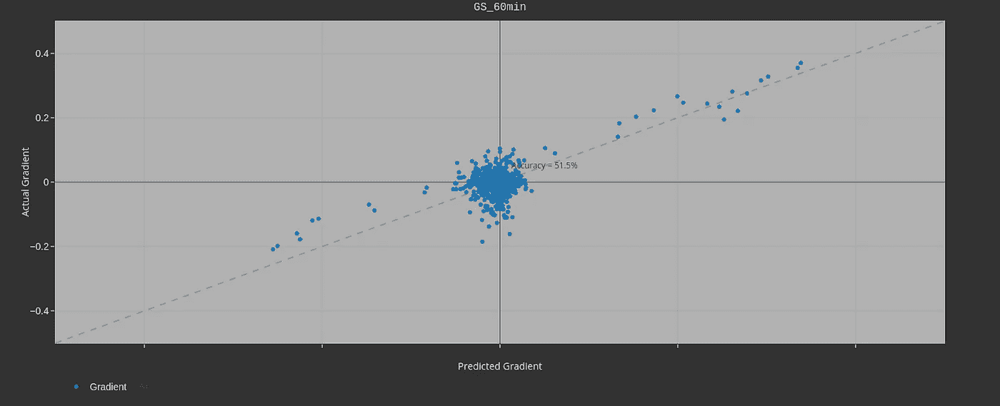*

*The actual vs predicted gradient for the validation+test datasets. Ideally, it would be a diagonal line.*

*啊哦。对于预测下一根蜡烛线(这里梯度的定义)的价格是上涨还是下跌，我们的模型本质上并不比猜测好多少。这是一个相当大的基本问题。这里的准确度(51.5%)是通过将正确象限(右上和左下)中的值相加并除以所有点计算出来的。*

*我不会告诉你为什么这是一个困难的问题(你可能已经知道了)，我会提到我在这里面临的两个个人斗争。*

1.  *数据。**数据的质量决定了你的模型的结果**。**显然是**。清理和处理你的数据，理解它，玩它，绘制它，拥抱它。确保你探索了它的每一个方面。比如说；我用新闻故事。它们在不同的时区出版。股票价格数据来自另一个时区。确保您正在正确同步，而不是使用未来的信息欺骗自己。这只是一个例子。另一个:当向我的经纪人索要每小时一次的烛台时，第一栏是一个 30 分钟的窗口。如果没有抓到这个的检查，你将会有一段时间挠头。*
2.  *构建一个简单的估计器。我的意思是，你的模型的预测很大程度上是基于前一点。这似乎是股票预测中最常见的问题。建立一个模型来缓解这种情况并保持准确性是关键，因此也是困难的部分。*

*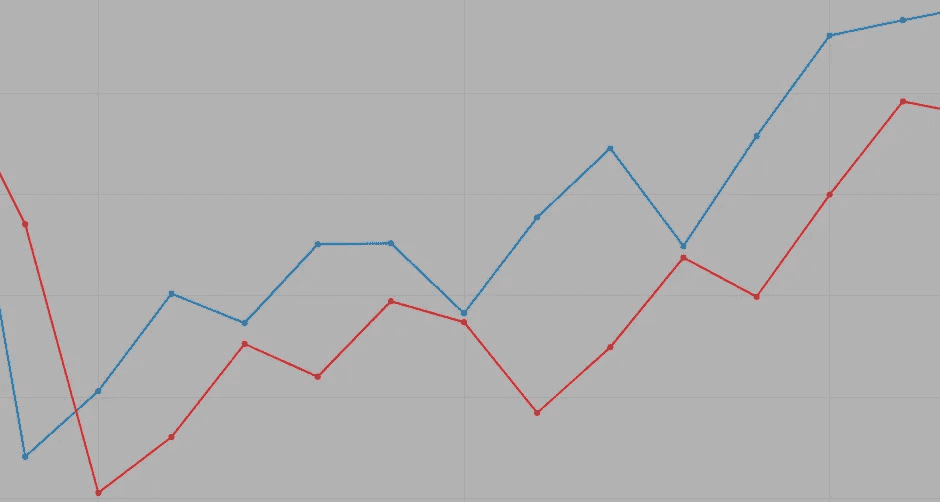*

*A naive estimator. The red line (the prediction) follows the blue line (the actual price) with a lag of 1 data point.*

*好吧，简而言之:*

> *我们能否训练一个模型，准确预测下一个梯度变化，同时减轻天真的估计影响？*

*剧透警告:是的，我们可以！(我觉得)。*

## *数据*

****股票价格信息****

*花在这个项目上的大部分时间是确保数据的格式正确，或者排列正确，或者不太稀疏等等。(嗯，还有我围绕这个工具构建的 GUI，但那是完全不同的问题🙄).*

*我的数据来自 [*互动券商*](https://www.interactivebrokers.co.uk/en/home.php) (IB)。注册并存入最低金额后，您就可以订阅各种订阅源。目前，我每月为实时数据支付 15 欧元。*

*我利用 [*他们的 API*](https://interactivebrokers.github.io/tws-api/introduction.html) 下载股票价格的功能可以在本要旨 中看到 [*。*](https://gist.github.com/0575fc78f9d54a93988ad29300dfe4b7#file-downloadfromib-py)*

*重要的是:*

*1)连接到 IB
2) [创建一个“契约”](https://gist.github.com/jwsmithers/0575fc78f9d54a93988ad29300dfe4b7#file-downloadfromib-py-L38-L56)
3) [请求使用那个契约的历史条](https://gist.github.com/jwsmithers/0575fc78f9d54a93988ad29300dfe4b7#file-downloadfromib-py-L60-L68)。*

*由于我的代码已经在一个线程上，所有这些都放在一个打了补丁的异步循环上(因此有了包 *nest_asyncio* )。上述要点中的*用法*给出了一个如何调用这个函数的例子。*

*我现在有一个 1 小时烛台的熊猫数据框。从那里很容易制作情节:*

*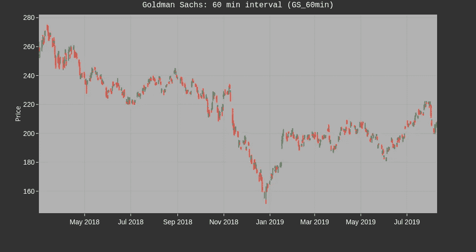*

*60 minute candlesticks for Goldman Sachs*

*我用的是相当牛逼的[](https://plot.ly/python/)*库。稍微复杂一点的语法是对交互式情节的牺牲(尽管对本文来说不是交互式的)。通过放大某个部分，可以更好地突出目标:**

**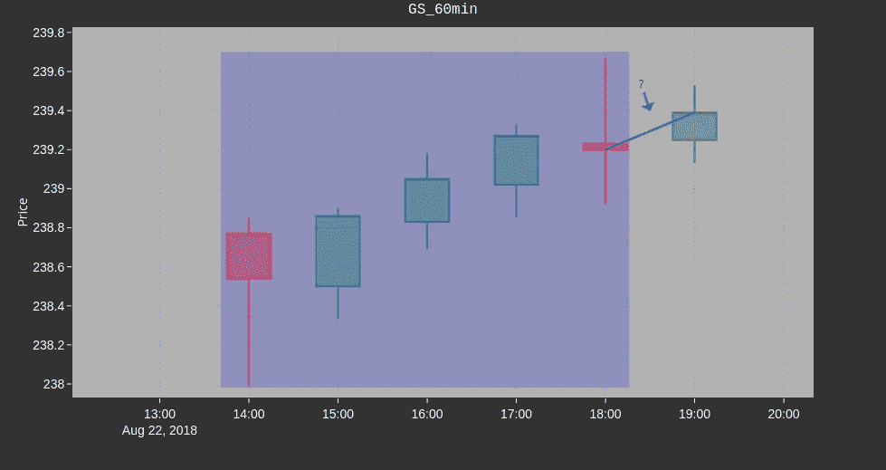**

**What is the gradient (i.e. sign change) from one Close price to the next? To make this prediction, everything in the shaded box (among other things) is taken into account. More on variables later. This shows a sequence of 5 candles used to predict the 6th.**

**我将尝试预测从我最近的收盘价到即将到来的收盘价的梯度。这可以用来制定交易策略。在稍后阶段，梯度的大小也可能被考虑。**

*****新闻*****

**假设是新闻对股票价格的演变有很大的影响。有几个消息来源，比如 newsapi.org，IB 也有一些选择，汤森路透等等。至于我的消息来源，我还没准备好分享🙂。**

**我目前以最基本的形式使用新闻情绪:我计算给定时间段内正面/负面和中性故事的数量，并将它们用作特征。我使用自己自制的半监督新闻分类器，但也可以使用 [*BERT*](https://arxiv.org/abs/1810.04805) 或任何其他预先训练好的库。
还有其他方法来包含情感，例如将嵌入内容直接注入网络。**

**对于每只股票，我选择了某些关键字并检索相关的新闻文章。一个超参数是“滞后”。滞后值为 0 意味着如果我预测下午 2 点的收盘价，那么只使用同一天下午 2 点*之前的报道。滞后 1 表示包括前一天的新闻，依此类推。这里的问题是:消息通过社会和交易算法传播需要多长时间，它对股票的影响有多长时间？
下面显示了给定时间段和 2 天滞后期内高盛的故事数量。我认为 4 月 15 日至 18 日之间的负峰值与银行报告第一季度业绩[](https://finance.yahoo.com/news/goldman-sachs-reports-q1-earnings-112756222.html)*喜忧参半有关。****

**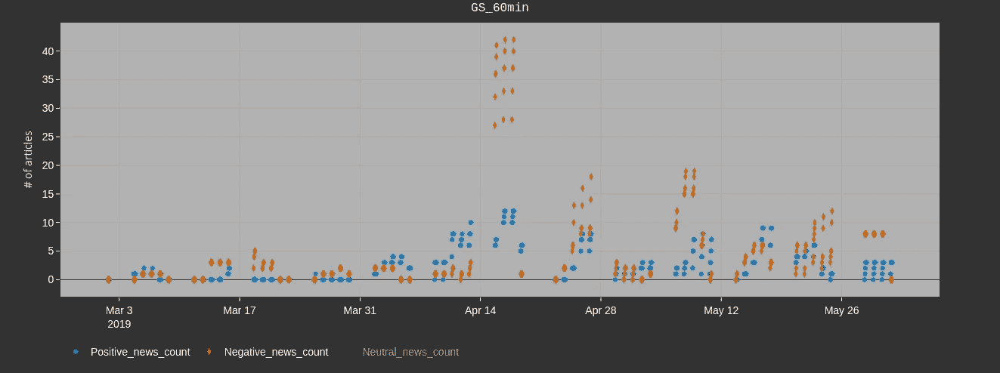**

**The number of positive and negative news articles with lag=2 for a given date range**

## **构建数据集**

*****变量和特性*****

**预测股票价格的一个问题是，实际上只有有限的数据。此外，我不想回到太久远的过去，因为我相信从 2013 年到现在，交易的本质已经完全改变了。我可以训练许多或少数股票串联在一起，与其他人使用的功能。通过将股票串联起来，我增加了数据的数量，也可能学到新的见解。我的数据集构建器的伪代码如下所示:**

```
**# Specify stocks to concatenate and specify those to use as features. 
Training_assets=[...] # i.e. currencies, or other stocks
Feature_assets[...] # i.e. related stocks
For stock in Training_assets:
  Download/update stock from IB
  Merge in News sentiments
  Add extra variables like MACD, Boilinger Bands, etc.
  Download Feature_assets and append to stock
  Normalize
  Concatenate with the previous training stock**
```

*****归一化*****

**在训练期间，我将每个特征标准化，并将参数保存到一个标量文件中。然后，在推断时，我读取文件并将参数应用于变量。这加快了我可以向我的经纪人询问最新数据的推断过程。如何正常化的一个要点可以在[这里](https://gist.github.com/0d0caab9f1d5bb6a53fd063a6f726270#file-normalise-py)看到。一个有趣的参数是`norm_window_size`。这指定了要素中有多少个点应该一起归一化。窗口太大意味着分辨率不够精细。尚未被考虑在内的各种各样的外部因素将发挥更大的作用。太小的窗口本质上看起来就像噪音。这是一个有趣的参数。**

*****相关性*****

**每个变量之间的相关性如下所示。请记住，在最广泛的意义上，两个高度相关的变量意味着如果一个增加，另一个也会增加。对于反相关，如果一个变量减少，另一个就会增加。
较高的正相关性颜色较深，较低/负相关性颜色较浅。目前，我确实使用开放、高、低作为特征。它们与收盘价高度相关，但我在推断时有所有这些信息，所以嘿，为什么不呢。在未来的训练中，我可能会移除它们，看看会发生什么。总的来说，有“重复性”的变量不好。
其他看似多余的功能是用收盘价构建的指标。但是它们给了我一个简单的方法来改变那些变量的序列长度，所以我现在把它们留在这里。**

**但是有哪些“外部”来源(即，不是来自我们试图推断的股票)？这些是最重要的变量。
货币、指数等特征之间的高度相关性以及与 VIX 的反相关性是非常有前途的。
一些货币可能会被淘汰，以减少整体网络规模(即，美元和南非兰特似乎不会相互影响，但谁知道呢)，针对不同变量的进一步培训可能会淘汰其中一些货币。**

**重要的是要记住“…相关性和交易预测不是一回事。”正如丹尼尔·夏皮罗在 [*算法交易的数据科学*](/data-science-in-algorithmic-trading-d21a46d1565d) 中指出的，我**。相关性不是因果关系。因此，待办事项列表中的一项过滤技术是，观察单个变量与给定股票收盘价的相关性如何随时间演变。这将允许我们删除变量并减少维数。****

**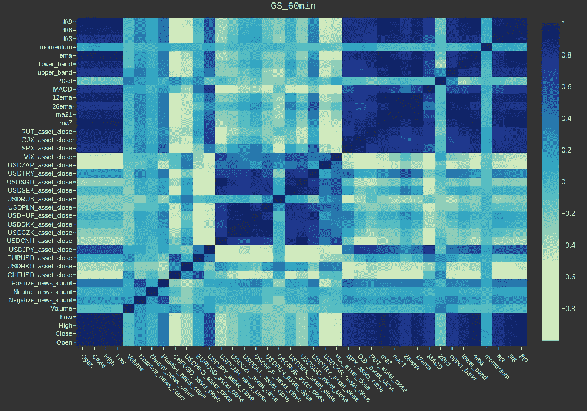**

**Variable correlations. Currencies are technically “midpoints” instead of “close” prices.**

*****滑动窗口算法*****

**此时`pandas.head()`给出:**

**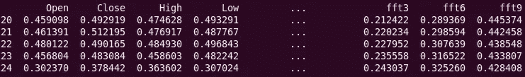**

**其中显示了 5 个时间步长，7 个归一化特征(为了简洁)。**

**然后，我们创建训练、验证和测试数据集。
由于这是一个序列预测问题，我们使用滑动窗口算法。前提如下图所示。使用了 X 个点(图中为 4 个),以 X+1 作为标签，形成一个新的数组。然后，窗口向前移动 1 点，重复计算。这样你就有了一个大的数组(X，是你的输入)以及你的标签，y。**

**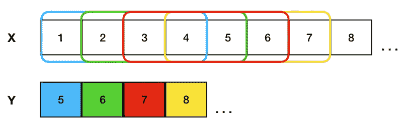**

**Sliding window algorithm of sequence length 4, for data (X) and corresponding labels (Y).**

**从这里开始，在分成训练、验证和测试大小(80%、15%、5%)之后，数据可以输入到神经网络中。**

## **结构**

**我尝试过各种架构(包括 GANs)，直到最终选定一个简单的递归神经网络(RNN)。就这样 [*奥卡姆可以安息*](https://simple.wikipedia.org/wiki/Occam%27s_razor) *。理论上，LSTM(RNN 的一种)应该更好，我需要再玩一次。Christopher Olah 提供了一篇关于 RNN 和 LSTMs 的非常好的文章。***

**我在 Tensorflow (1.12)中的模型看起来有点像这样(名称空间和直方图等)。已删除):**

```
**def gru_cell(state_size):
  cell = tf.contrib.rnn.GRUCell(state_size)
  return cell# Inputs
inputs = tf.placeholder(tf.float32, [None, seq_len, len(variables)])
labels = tf.placeholder(tf.float32, [None ,n_outputs])# Placeholder for dropout to switch on and off for training/inference
keep_prob = tf.placeholder(tf.float32)# Run the data through the RNN layers
batch_size = tf.shape(inputs)[0]initial_state = tf.zeros([batch_size, num_layers * size])cell = tf.contrib.rnn.MultiRNNCell([gru_cell(size) for _ in range(num_layers)], state_is_tuple=False)outputs, final_state = tf.nn.dynamic_rnn(cell, inputs, initial_state=initial_state) # Then feed into a dropout layer
dense_layer = tf.contrib.layers.dropout(outputs[:,-1], keep_prob=keep_prob)# ... and a dense layer
dense_layer = tf.layers.dense(dense_layer, dense_units, activation=tf.nn.selu)# ... followed by a single node dense layer
final_predictions = tf.layers.dense(dense_layer,n_outputs,activation=tf.sigmoid)**
```

**图表看起来像这样:**

**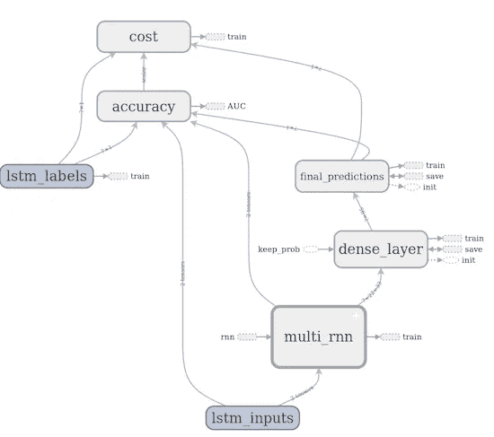**

**Tensorboard graph visualization (The multi_rnn namespace is connected to accuracy by a variable placeholder, batch size).**

**这是一个相当简单的网络，其中一个多层 RNN(带有 GRU 层)被馈入一个密集层(包括一个漏失层)。层数、激活和退出百分比都在训练期间被优化。
“准确性”节点是一组复杂的 TF 运算，将密集网络的预测转换为二元梯度运动。作为一个实验，这种精度实际上目前在我的成本函数中使用为:**

```
**cost = (1-Accuracy) + tf.losses.mean_squared_error(labels, final_predictions)**
```

**其中*标签*是归一化价格，*最终预测*是归一化实际价格预测。我使用具有循环函数学习率的*adamotimiser*。这是做这件事的最佳方法吗？我还不完全确定！🙂**

## **培养**

**我在训练阶段也使用了 [*贝叶斯优化*](https://github.com/fmfn/BayesianOptimization) (BO)。我认为这是一个很棒的库，但是，我确信它对这种类型的问题很有效，并且实际上节省了大量的时间吗？不完全是。我想画一些图来看看训练是如何进行的，功能是什么样子的。但是有这么多参数，这很难。然而，也许它提供了一个略有偏差的随机数生成器。也就是说，本文中用于结果的参数是:**

**Final parameters used for training for the purpose of this article**

**[*这里有一个有趣的阅读*](/selu-make-fnns-great-again-snn-8d61526802a9) 关于比例指数线性单位(selus)。**

**训练(橙色)和验证(蓝色)数据集的损失曲线如下所示。生产线非常不稳定，也许使用更大的批量会有所帮助。这两个数据集之间也有一些不同。这并不奇怪。请记住，我已经将高盛的多只股票串联(并洗牌)，所以我们实际上训练的是一个给定“部门”的模型，或者随便你怎么称呼它。理论上，它更一般化，因此更难训练(这是获得更多数据的代价)。因此，它可能暗示一些过度训练；有待进一步检查的东西。然而，人们可以看到验证损失随着时间的推移而减少的趋势(直到某一点)👍。**

**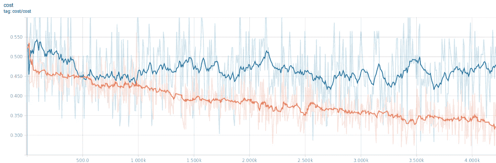**

**Loss function for 4k iterations. Only the best model is saved.**

## **结果**

**这种最新型号性能如何？下面是实际坡度与预测坡度的对比。65%的准确性(使用之前使用的相同定义)并不算太差。**

**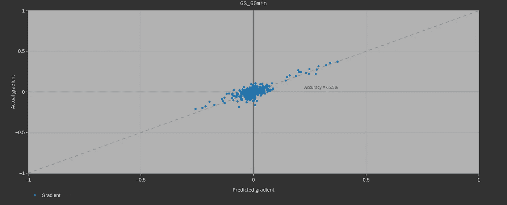**

**The actual vs predicted gradient for the validation+test dataset.**

**下图显示了实际梯度与预测梯度的混淆矩阵。它表明，我们 59%的时间正确预测负梯度，而 71%的时间正确预测正梯度。这种不平衡可能来自数据集和模型的性质，即，可能三个小的正梯度进行单个负梯度。模型了解这一点，因此引用准确性可能有点误导。这在实际制定交易策略时会变得非常重要。**

**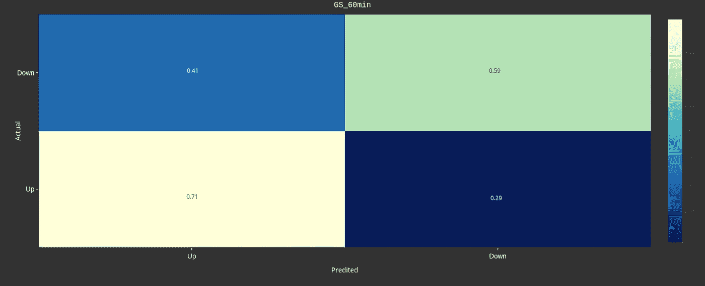**

**Confusion matrix showing accuracy for up and down predictions.**

**再次显示了封面图，重点是验证和测试数据集。说实话，不是*那么*性感。但是有时候梯度变化的趋势确实是遵循的。对我来说，每当这样的情节以看似完美的重叠出现时，读者的脑海中就会响起警钟。
记住，验证数据集仅在训练步骤中用于确定何时停止训练(即 x 个时期后无改善，停止)。测试数据集没有在任何地方使用*。*即表示该图显示了大约 600 小时的“半看不见的”数据，以及不到 300 小时的完全看不见的数据。**

**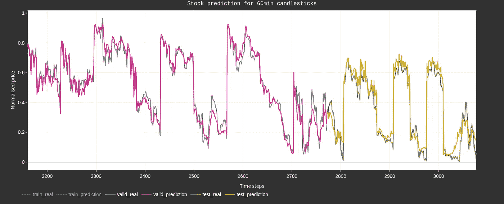**

**Predictions for the validation and test datasets.**

**我们的结果有多稳定？
在 114 次训练中，预测梯度的准确度分布如下所示(绿色直方图)。每次训练的准确度都用橙色标出了跑步次数。这证实了我的怀疑，BO 在这里工作得不太好，但也许它只是需要更多的迭代和/或调整参数。**

**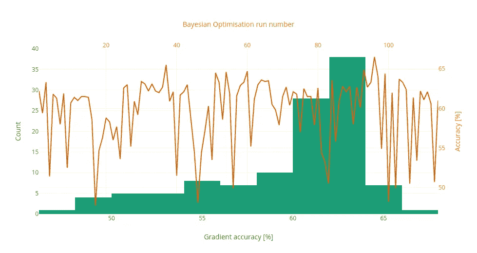**

**事实证明，我本可以使用一个更好的结果。哎哟😀。(更好的结果是在混淆矩阵中上/上相对于下/下有更均匀的分布，这很好)。
从绿色直方图中可以看出，我们正在学习*一些东西。*同样，很高兴看到有些结果并不比猜测好，这意味着我们*并不总是*在玩参数时学到东西。有些模特就是很烂。如果没有模特表现糟糕，这将是一个警钟。**

## **结束语**

**在这篇文章中，我强调了我构建 RNN 的方法，它能够在大约 65%的时间内预测两个收盘价之间的正确梯度差。我相信随着更多的发挥和一些调整，这个数字可以得到改善。此外，还可以进行更多的检查和研究。
回测的时候真的会赚钱吗？交易直播的时候呢？需要考虑的数量很大。从使用相当酷的[*back trader*](https://www.backtrader.com/)*库，到将其插入 IB API，这些将是下一篇文章的主题。🙂***

***我希望你觉得这篇文章很有趣…我写得很开心！***

***约书亚·怀亚特·史密斯***