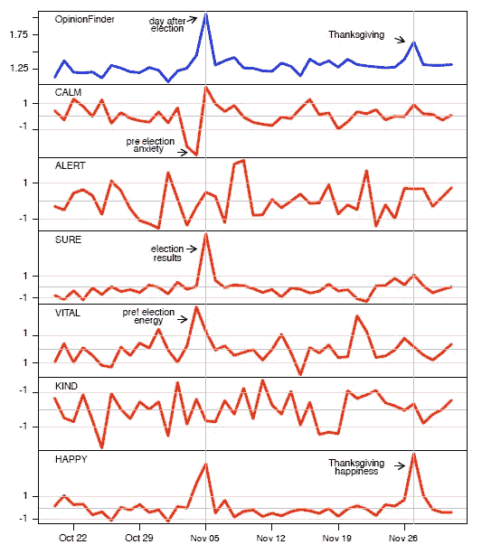
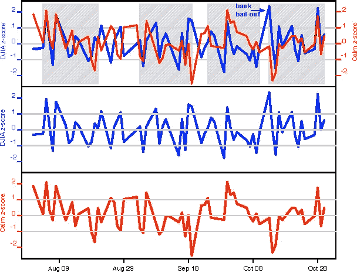
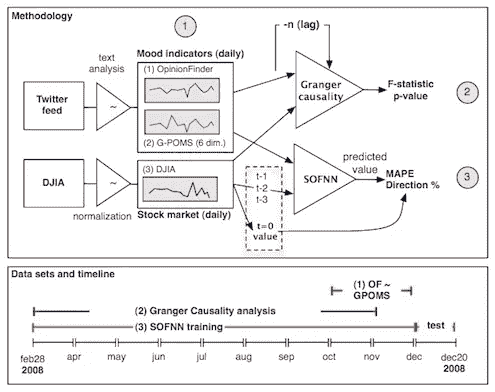

# 使用 Twitter 进行股票预测

> 原文：<https://towardsdatascience.com/stock-prediction-using-twitter-e432b35e14bd?source=collection_archive---------4----------------------->

## 有没有想过如果你能预测股市你能做什么？很多:)

许多经济学家认为，股票市场是随机的，因为它受随机事件的控制，这是在[有效市场假说](https://www.investopedia.com/terms/e/efficientmarkethypothesis.asp)和[随机漫步理论](https://www.investopedia.com/terms/r/randomwalktheory.asp)中提出的。但真的是这样吗？

研究人员对此进行了测试，并试图预测股票市场，以表明确实有可能对市场的走向有所了解，并且似乎已经证明了他们的观点具有一定的准确性。关于这个主题的一篇里程碑式的论文是由[博伦等人撰写的。艾尔。，](https://arxiv.org/pdf/1010.3003.pdf) [1]在这篇博客中，我将试着用简单的语言解释他们是如何做到的。

Bollen 利用公众意见(使用 twitter tweets)证明了在 twitter 上表达的公众情绪与股市表现之间存在相关性。

在详细了解 Bollen 做了什么以及他是如何做的之前，我们需要了解一些事情:

1.  什么是股票市场，它是如何运作的？
2.  如何从推文中找到表达的心情？
3.  “如何发现/证明两个时间序列之间的相关性”
4.  假设两个时间序列相关，如何从一个时间序列回归/预测另一个时间序列的未来结果。

# 什么是股票市场？

公司是一个大实体。现在，大多数公司都不是由一个人甚至一个组织所拥有，而是大量的人分享公司，这些人被称为股东。所有这些人都拥有公司的一部分，称为股票，因此这些人也被称为股东。股票市场是一个你可以出售你的公司股票或购买公司股票的地方。

更正式地说，股票可以定义为:

> 一家[公司](https://en.wikipedia.org/wiki/Corporation)的**股**是该公司所有权被分割成的全部[股](https://en.wikipedia.org/wiki/Share_(finance))。[【1】](https://en.wikipedia.org/wiki/Stock#cite_note-longman-1)在美式英语中，股份俗称股票。[【1】](https://en.wikipedia.org/wiki/Stock#cite_note-longman-1)一股股票代表与股份总数成比例的公司的部分所有权。这通常赋予[股东](https://en.wikipedia.org/wiki/Stockholder)那部分公司收益、资产清算所得(在清偿所有优先债权，如有担保和无担保的[债务](https://en.wikipedia.org/wiki/Debt))、[【2】](https://en.wikipedia.org/wiki/Stock#cite_note-2)或投票权，通常按照每个股东投资的金额比例进行分配。[-维基百科](https://en.wikipedia.org/wiki/Stock)

股票市场可以定义为:

> 一个**股票市场**是[股票](https://en.wikipedia.org/wiki/Stock)(也称为股份)的买方和卖方的集合(一个松散的经济交易网络，而不是一个实体设施或实体)，它代表着对企业的所有权要求；这些可能包括在公共证券交易所上市的证券，以及只在私下交易的股票。[-维基百科](https://en.wikipedia.org/wiki/Stock_market)

如果您有兴趣了解更多信息，请参考[此链接](https://corporatefinanceinstitute.com/resources/knowledge/trading-investing/stock-market/)

现在有许多股票市场，但我们的重点将是“纽约证券交易所”。为什么？因为它是最大的股票市场，大部分研究都围绕着它。在继续之前，我们需要了解一个术语，它就是“道琼斯工业平均指数”，或者简称为“道琼斯指数”。

> 道琼斯工业平均指数(DJIA)是在纽约证券交易所和 T2 纳斯达克交易的 30 种重要股票的价格加权平均值。DJIA 是查尔斯·道在 1896 年发明的。
> 
> 通常被称为“道琼斯”，DJIA 是世界上最古老、最受关注的单一指数之一，包括通用电气公司、华特·迪士尼公司、埃克森美孚公司和微软公司等公司。当电视网说“T4 股市今天上涨了”时，他们通常指的是道琼斯指数。[-投资媒体](https://www.investopedia.com/terms/d/djia.asp)

所以道琼斯(或 DJIA)给了我们一个好主意，股票市场是在高点还是在低点收盘，那么 DJIA 到底衡量什么呢？它只是前 30 家公司股票价格的加权平均值，其中价值更高的股票具有更大的权重，最终结果被归一化以剔除一次性事件。因此，它本身就是一个价格。

所以有了 DJIA，我们现在有了一个可靠的方法来观察市场一天的表现。我们现在需要的是挖掘公众意见的方法，为此我们求助于 twitter。

# 推特情绪分析

机器能理解情感吗？不，他们不能，直到现在，我说的“不”不是指一个完美的“不”(而是一个非常不完美的“不”)，因为机器现在可以理解广泛的情感(尽管不是完美和可靠的)，并且很容易被愚弄/混淆。(这是另一篇博文的话题)。

有了机器学习算法，就有可能衡量某段文本中表达的情绪(或情感)。但是精确度还有待提高。但是如果情感表达明确，文字没有扭曲，那么我们就可以做出一个可靠的情感分析模型。这是 Bollen 用来从推文中获取情绪的工具背后的想法。

情感分析是机器学习的一个非常重要的应用，难怪许多不同的算法(我指的是很多)被应用于从文本中获取情感，让我们选择一个最简单和直观的算法。让我们考虑一下正文:

> “埃隆·马斯克的个性和他的人生哲学给我留下了深刻的印象，难怪特斯拉和 spaceX 会如此努力”。

我们的算法将只查看重要的词，如“漂亮”、“印象深刻”等。(而不是像“我”、“我”之类的词。此外，我们的算法可能不知道 spaceX、Elon、Musk，所以它可能会忽略它)。现在，考虑到该算法之前已经看到了积极的文本看起来是什么样子(在训练它的时候)，它已经弄清楚了像“漂亮”、“印象深刻”、“棒极了”这样的词大多与积极的情绪相关联。因此，很可能将文本标记为正面的。

这是一种非常简单的方法，它是由 [Textblob](https://textblob.readthedocs.io/en/dev/) (一种文本分析工具)采用的，Textblob 基于朴素贝叶斯算法，这是一种非常简单的算法，考虑到它的简单性，它给出了很好的结果，所以其思想是-每个单词根据它所关联的文档的类型给出一个分数，因此在正面文档中出现得比负面文档多的单词可能具有更大(或更正面)的分数，因此如果它出现在文档中，那么该文档更可能是正面的。因此，每个单词都有自己的分数，然后对这些分数进行平均，以获得文档的情感。

不用说，这种方法并不理想，而且在复杂的文档中效果很差。因此，大多数研究人员使用更复杂的分类器(如支持向量机)来建立情感分析模型。

Bollen 使用了两个工具进行意见挖掘，一个是意见查找器，另一个是情绪状态的 Google Profile。这些天我没有看到很多人使用意见查找器，它对这个博客来说也不是很重要，所以我们将把它放在一边，专注于谷歌情绪状态(或 GPOMS)的概况。

GPOMS 是一个工具，可以帮助你准确地检测出一段文字所表达的情绪。它基于[情绪状态简介](https://en.wikipedia.org/wiki/Profile_of_mood_states)问卷，这是一份由 65 或 37 个问题组成的问卷，取决于你选择哪一个。对于每个问题，你都要表明你的感受——从“一点也不”、“一点点”、“一般”、“相当多”、“非常多”。例如，对于问题“遗憾”,你将表明你作为上述状态之一的感受，它将使用 [a 标准](https://www.brianmac.co.uk/pomscoring.htm)转换为分数，并根据你的回答计算你的情绪。这里有一个[到测试](https://www.brianmac.co.uk/poms.htm)的链接。

那么 GPOMS 是如何利用 POMS 从文本中预测情绪的呢？谷歌连接来了。博伦使用了谷歌发布的数据集之一。该数据集由从英语网络文本的 1 万亿个单词中提取的 n 元语法的频率计数组成。你可以在这里[试试](https://books.google.com/ngrams/graph?content=Marx%2Ccommunism%2Ccapitalism&case_insensitive=on&year_start=1800&year_end=2000&corpus=18&smoothing=3&share=&direct_url=t4%3B%2CMarx%3B%2Cc0%3B%2Cs0%3B%3BMarx%3B%2Cc0%3B%3BMARX%3B%2Cc0%3B.t4%3B%2Ccommunism%3B%2Cc0%3B%2Cs0%3B%3BCommunism%3B%2Cc0%3B%3Bcommunism%3B%2Cc0%3B%3BCOMMUNISM%3B%2Cc0%3B.t4%3B%2Ccapitalism%3B%2Cc0%3B%2Cs0%3B%3Bcapitalism%3B%2Cc0%3B%3BCapitalism%3B%2Cc0%3B%3BCAPITALISM%3B%2Cc0)。bollen 所做的是:将 POMS 调查问卷中的每个单词与谷歌 n-gram 数据集中的 n-gram 相关联，然后将最频繁出现的 n-gram 分成标记，现在这些单词中的每一个都有与之相关联的语气，并可以给它们一个加权分数(基于出现次数),根据这些单词在一段文本中的出现方式，可以用相应的语气进行标记。

以上是我对 Bollen 在论文中解释的内容的理解:

> 因此，964 个术语的扩大词典允许 GPOMS 捕捉推文中更广泛的自然出现的语气术语，并将它们映射到各自的 POMS 语气维度。我们将每条推文中使用的术语与该词典进行匹配。匹配 n 元词的每个推文词被映射回其原始 POMS 词(根据其共现权重)，并通过 POMS 评分表映射到其各自的 POMS 维度。因此，每个 POMS 情绪维度的得分被确定为与 GPOMS 词典匹配的每个推特词语的同现权重的加权和。

不幸的是，GPOMS 不再可用，它现在是一个闭源工具。[Goel-Mittal](http://cs229.stanford.edu/proj2011/GoelMittal-StockMarketPredictionUsingTwitterSentimentAnalysis.pdf)【2】用一种更简单的方法建立了一个类似的模型(尽管不太准确)，他们使用了 POMS 调查问卷中出现的单词的同义词，然后将它们映射到文本。

根据他的 GPOMS 模型和意见搜索器，博伦发现了人们的情绪，结果如下:

Results From GPOMS and Opinion Finder

如你所见，图表上有两件突出的事情:一件是 2008 年总统大选，另一件是感恩节，Bollen 似乎因为这个非常特殊的原因选择了这个时期，因为人们的情绪在这些场合是可以理解的，所以我们可以用这个来表明我们的模型确实能够衡量公众的情绪，公众情绪和股票市场的波动都很大，因此很容易观察到。

我们现在完成了四个部分中的两个，我们知道如何衡量公众的情绪和市场的情绪。现在我们可以继续证明这两者确实相关。

# 时间序列之间的相关性

如上图所示，我们已经获得了人们情绪的时间序列，类似的时间序列对于 DJIA 的得分也可以很容易地获得。现在我们需要寻找一种方法来证明这些是相关的，或者人们的情绪(从 twitter 上挖掘)导致了股票市场的变化。

我们用[格兰杰因果关系](https://en.wikipedia.org/wiki/Granger_causality)来做这件事。那么格兰杰因果关系到底是什么？根据这篇[的《学院派》文章](http://www.scholarpedia.org/article/Granger_causality):

> **格兰杰** [**因果关系**](http://www.scholarpedia.org/article/Causality) 是基于预测的因果关系的统计概念。根据格兰杰因果关系，如果一个信号 *X* 1“格兰杰原因”(或“G 原因”)一个信号 *X* 2，那么 *X* 1 的过去值应该包含有助于预测 *X* 2 的信息，而不仅仅是包含在 *X* 2 的过去值中的信息。它的数学公式是基于随机过程的线性回归模型(格兰杰 1969)。存在对非线性情况的更复杂的扩展，然而这些扩展在实践中通常更难应用。

因此，如果我们有两个时间序列，比如 X1 和 X2，我们可以证明 X2 依赖于它以前的值，即，

***X2(t)= a(0)+a(1)X2(t-1)+a(2)X2(t-2)+……。+ a(p)X2(t-p)***

这里，常数 a(1)，a(2)，…，中的至少一个..，a(p)不为零，那么我们可以说 X2(t)依赖于其先前的值，在表明这一点之后，如果下面的关系对于 b(1)，b(2)，…，中的至少一个成立。，b(p)不为零:

***X2(t)= a(0)+a(1)X2(t-1)+a(2)X2(t-2)+……。+a(p)X2(t-p)+b(1)X1(t-1)+b(2)X1(t-2)+……。*+b(p)X1(t-p)**

那么我们可以说 X1 是 X2 的原因，或者 X1 有可能预测 X2。请参考[这段视频](https://www.youtube.com/watch?v=ZUv7T8iPGrc)更好的理解格兰杰因果关系。

经过双变量格兰杰因果分析，Bollen 发现，在六个情绪状态(即平静、警觉、确定、充满活力、善良和快乐)中，只有一个，即“平静”情绪状态与股票市场的格兰杰因果关系最高，滞后时间为 2 到 6 天，其他四个情绪维度与股票市场的因果关系不显著。

因此，博伦绘制了“平静”时间序列(滞后 3 天)和 DJIA 时间序列，以显示两者之间的相关性:

阴影部分显示了具有显著相关性的部分。我们应该记住，平静的图表是滞后 3 天的，因此 twitter 数据不是同时预测市场，而是提前 3 天预测。如果我们仔细观察，我们可以看到在这个图表中存在大量的相关性，因此现在可以确定这两个时间序列之间存在相关性。我们可以利用这些信息来预测股票市场，看看我们的预测有多准确。

# 预测股票市场

现在进行石蕊测试，我们能根据可用的推文预测以前看不见的股票市场趋势吗，我们能预测未来吗？！！

为了预测股票市场，Bollen 使用了一种称为自组织模糊神经网络(SOFNN)的东西，他们使用了一种五层混合 SOFNN 模型来预测股票市场，并获得了相当令人印象深刻的结果。他们使用不同的数据排列，例如，只有平静，平静和快乐等等。他们最好的准确率是 87.6%(哎哟！！！)是他们用非线性的方式把平静和快乐结合起来后得到的。

那么，SOFNN 到底是什么？根据[的这篇](http://www.scholarpedia.org/article/Fuzzy_neural_network)学者百科文章，他们结合了[模糊逻辑](https://en.wikipedia.org/wiki/Fuzzy_logic)和[神经网络](https://en.wikipedia.org/wiki/Neural_network)的精华，为这类任务创建了一个非常好的模型。这两个主题都超出了本文的范围。因此，我们将只简要地讨论其中的每一个。

当处理计算机时，我们主要处理布尔或二进制逻辑，即，任何实体可以是 0 或 1，但是这种类型的逻辑在许多真实世界场景中不适用，因为我们主要处理不止一个结果，例如，游戏的结果主要是赢或输，但是也可以是平局/平局，或者可能赢的差距也可以被考虑， 因此，在 0 和 1 之间可以有更多的状态，这对我们来说似乎比二进制(又称黑和白)方法更自然，更有助于模拟真实世界的情况，这种模糊方法是模糊逻辑背后的逻辑，你可以在这里阅读更多信息。

如果你还没有听说过神经网络，现在是时候从岩石下走出来了，看看一些[博客](https://www.analyticsvidhya.com/blog/2018/10/introduction-neural-networks-deep-learning/)，神经网络是一个时髦词。基本上，它们是一个数学模型，试图模仿(还没有成功)人脑内部的神经元。

这里有一个来自 [sholaropedia](http://www.scholarpedia.org/article/Fuzzy_neural_network) 的关于什么是混合模糊神经网络的很好的解释:

> 混合神经模糊系统是同质的，通常类似于神经网络。这里，模糊系统被解释为一种特殊的神经网络。这种混合 NFS 的优点在于它的结构，因为模糊系统和神经网络不再需要相互通信。他们是一个完全融合的实体。这些系统可以在线和离线学习。
> 
> 模糊系统的规则库被解释为神经网络。模糊集可以被视为权重，而输入和输出变量以及规则被建模为神经元。神经元可以在学习步骤中被包括或删除。最后，网络的神经元代表模糊知识库。显然，两种基本系统的主要缺点都被克服了。

# 大局

以上四个部分试图解释用于构建 Bollen 提出的模型的较小部分。现在我们来看看最终的模型，以便更好地理解可用于预测股票市场的模型:

The Final Model

首先提取和处理来自 twitter 和 DJIA 的原始数据，然后 twitter 数据通过情绪分析模型 Opinion Finder 和 GPOMS，然后对它们进行格兰杰因果分析，以证明来自 twitter 的情绪确实与 DJIA 值有一些相关性，一旦这种相关性消失，我们现在可以开始用 SOFNN 模型预测股票市场。

[1] Bollen，j .，Mao，h .，Zeng，x .:推特情绪预测股市。计算科学杂志，2(1)，1–8(2011)

[2]米塔尔、安舒尔和阿尔皮特·戈埃尔。"使用推特情绪分析进行股票预测."斯坦福 cs 229(2011)[http://cs 229 . Stanford . edu/proj 2011/goel Mittal-stockmarketpredictionusingtwittersentimentanalysis . pdf](http://cs229.stanford.edu/proj2011/GoelMittal-StockMarketPredictionUsingTwitterSentimentAnalysis.pdf))(2012)。