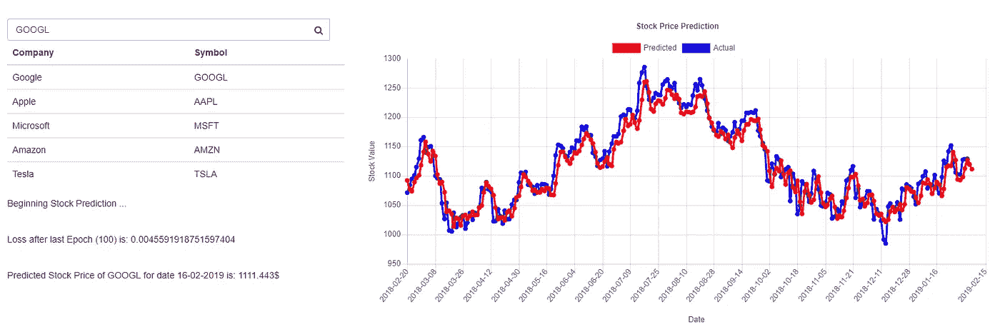
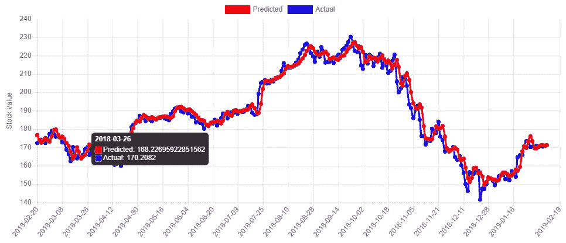

# 股票价格预测系统使用 1D CNN 与 tensor flow . js-机器学习轻松有趣

> 原文：<https://towardsdatascience.com/stock-price-prediction-system-using-1d-cnn-with-tensorflow-js-machine-learning-easy-and-fun-fe5323e68ffb?source=collection_archive---------1----------------------->

## 了解如何建立股票价格预测系统使用 1D 卷积神经网络与张量流。JS 库



Image 1: Stock Price Prediction Application

当我在网上阅读股票预测时，我看到人们谈论使用 1D CNN 来预测股票价格。这引起了我的注意，因为 CNN 是专门为处理像素数据而设计的，用于图像识别和处理，这看起来是一个有趣的挑战。

这个解决方案是使用 Tensorflow.js 库的前端应用程序，最好的部分是它不需要任何服务器端。数据可通过“ *IEX 开发者平台*API 服务获得。上面的*图片 1* 来自这个股票预测应用程序。

*代码可以在我的 Github 库中找到。*

[](https://github.com/Gago993/StockPredictionCNN) [## gago 993/股票预测 CNN

### 使用卷积神经网络和 TensorflowJS-gago 993/StockPredictionCNN 的股票预测

github.com](https://github.com/Gago993/StockPredictionCNN) 

所有需要完成的工作可以分为 6 个步骤:

1.  获取数据
2.  生成要素
3.  生成 ML 模型
4.  训练 ML 模型
5.  测试 ML 模型
6.  用 ML 模型预测

**那么让我们开始…**

## 获取数据

这些数据是使用 IEX 的 API 收集的。API 描述可从以下[链接](https://iextrading.com/developer/docs/#chart)获得。在此应用程序中，我使用的图表端点具有预定义的 1y (1 年)历史周期。占位符 *%company%* 用于替换我们在应用程序中输入的公司符号。

```
let url = 'https://api.iextrading.com/1.0/stock/%company%/chart/1y'
```

这个 API 的结果是带有所请求公司历史数据的 json 数组。以下是来自响应数据的一些示例。

```
[
...
   {
      "date":"2018-02-20",
      "open":169.4694,
      "high":171.6463,
      "low":168.8489,
      "close":169.2724,
      "volume":33930540,
      "unadjustedVolume":33930540,
      "change":-0.5713,
      "changePercent":-0.336,
      "vwap":170.3546,
      "label":"Feb 20, 18",
      "changeOverTime":0
   },
...
]
```

## 生成要素

检索数据后，我们需要处理它并准备特征集和标签集。当我在研究的时候，我发现了他们使用日期字段作为特性的想法。然而，我不喜欢这样，因为有两个原因。首先，日期是不断增加的特征。第二，日期是独立的(与股价没有直接联系)。

我认为与当前股价联系更紧密的是过去股价是如何变化的。例如，今天的股价取决于过去 7 天的股价变化。为此，我们为测试集定义了 7 个特征，每个特征都标有第二天的股票价格。

所有这些数据的预处理都是在 helpers.js 文件中定义的 *processData* 函数中进行的。在我们的例子中*时间部分*变量的值为 7。

```
...
// Create the train sets
for (let i = timePortion; i < size; i++) {
   for (let j = (i - timePortion); j < i; j++) {
      trainX.push(scaledFeatures[j]);
   }
   trainY.push(scaledFeatures[i]);
}
...
```

对于 trainX，我们得到的是值的平面数组，但是稍后我们将把它重新整形为具有格式的矩阵:
【样本数- 7，特征数】

另一件重要的事情是，我们首先使用 helpers.js 文件中定义的 *minMaxScaler* 函数来规范化我们的特性。这将缩放 0 到 1 之间的所有值。这一点很重要，这样预测模型才能更好地适应我们的模型，并且在有大量数据时会更快。如果你想知道更多关于这个最小-最大标准化的信息，你可以在这个博客的末尾找到参考资料。

## 生成 ML 模型

下一步是创建 CNN 模型。这是由 prediction.js 文件中的 *buildCnn* 函数完成的。使用 Tensorflow 库确实简化了这一步。我们需要做的是定义顺序(层的线性堆叠)张量流模型，然后添加预定义的层，以便构建我们的 CNN 模型。

[*但 CNN 是什么？*](https://en.wikipedia.org/wiki/Convolutional_neural_network) *CNN* 或*卷积神经网络*是[深度神经网络](https://en.wikipedia.org/wiki/Deep_neural_network)的一类，最常用于分析视觉表象。这就是为什么用它来预测股票价格是不寻常和有趣的挑战。

CNN 有 4 个重要的层次，使它与众不同。它们是卷积层、ReLU 层、汇集层和全连接层。他们每个人都有具体的任务要做。然而，我现在不会深入解释 CNN。

让我们继续用 Tensorflow 构建 CNN。我们总共定义了 7 层:

1.  输入层—输入大小为[7，1]，因为我们有 7 个特征
2.  conv1d—第一个卷积层
3.  averagePooling1d 第一个平均池层
4.  conv1d —第二卷积层
5.  平均池 1d-第二个池层
6.  展平-减小维度，将输入整形为[样本数，要素数]
7.  密集-使用线性激活函数的全连接图层，其中 1 个单元返回 1 个输出值

下面是我们在顺序张量流模型中定义所有这些层的代码。

在我们建立模型之后，我们进入下一步，即训练我们的模型。

## 训练 ML 模型

既然我们已经创建了模型，我们需要准备好并转换我们的数据。这意味着将我们的训练和标签集转换为张量数据，因为 tensorflow 使用的是它自己的数据类型，即张量。

这是非常简单的一步。我们创建张量并将我们的特征数据整形为[样本数，时间部分，1]。在这种情况下，时间部分是 7。

```
...
let tensorData = {
   tensorTrainX:    tf.tensor1d(built.data.trainX).reshape([built.data.size, built.data.timePortion, 1]),
   tensorTrainY: tf.tensor1d(built.data.trainY)
};
...
```

现在我们已经得到了张量，我们将它们与 cnn 函数中的模型一起使用。在这里，我们首先建立优化算法和损失函数。我们使用“ *adam* ”算法作为优化器，使用“ *minSquaredError* ”作为损失函数。

```
model.compile({ optimizer: ‘adam’, loss: ‘meanSquaredError’ });
```

与 SGD(学术梯度下降)不同，Adam 优化器对每个权重使用不同的学习率。

这里我们需要做的最后一件事是在 tensorflow 模型上调用 *fit* 函数，并发送 *trainX* (特征)和 *trainY* (标签)集合。我们还将 epochs 的选项设置为 100。

在集合的每个项目上训练你的网络一次是一个时期。

```
...
// Train the model
model.fit(data.tensorTrainX, data.tensorTrainY, {
   epochs: epochs
}).then(fucntion (result) {
...
```

当训练结束时，它返回结果，并且模型准备好用于生成预测。

## 测试 ML 模型

在这一步中，我们已经为将来的预测准备好了模型。我们首先要做的是使用这个模型在我们训练模型的同一个集合上进行预测。这背后的想法是，我们可以比较(可视化)我们的模型符合训练集的程度。

我们简单地通过从模型中调用*预测*函数来创建预测。

```
var predictedX = model.predict(tensorData.tensorTrainX);
```

我们通过调用以下命令获得预测数据:

```
predictedX.data().then(function (pred) {
...
```

由于我们之前已经归一化(缩放)了我们的特征，所以我们需要运行逆最小-最大运算，以便获得真实的特征值。我们通过从 helpers.js 调用*minmaxinverscaler*函数来实现，在这里我们发送预测数据以及最小值和最大值。

```
var predictedXInverse = minMaxInverseScaler(pred, min, max);
```

现在我们使用 plot.js 中定义的 plotData 函数，这样我们就可以可视化(实际的和预测的)数据集。P.S .我用了 Chart.js 库做可视化。



Image 2: Actual vs Predicted values for AAPL(Apple)

## 用 ML 模型预测

剩下要做的是为第二天的股票价格预测生成测试特性。该特性是使用 helpers.js 文件中的*generateNextDayPrediction*函数生成的。

```
let nextDayPrediction = generateNextDayPrediction(result.originalData, result.timePortion);
```

这个函数做的很简单。它从给定的数据中提取最近 7 个股票价格值，并创建测试特征集(用于第二天的预测)。

然后，我们重复相同的步骤，将该数据转换为张量数据，并将其整形为[样本数，特征数，1]，在这种情况下，它将是[1，7，1]，因为我们只有一个测试示例。

接下来，我们从模型中调用预测函数。

```
let predictedValue = model.predict(tensorNextDayPrediction);
```

我们得到预测值并运行逆最小-最大归一化

```
predictedValue.data().then(function (predValue) {
   // Revert the scaled features, so we get the real values
   let inversePredictedValue = minMaxInverseScaler(predValue, min,   max);
...
predictedXInverse.data[predictedXInverse.data.length] = inversePredictedValue.data[0];
```

最后，我们只需将该值添加到预测数据的末尾(来自之前“*测试 ML 模型*”部分中的训练集)，这样就可以在图表上显示该值。

# 结论

希望这是清晰易懂的。如果您认为某些部分需要更好的解释，请随时添加评论或建议。如有任何问题，请随时联系我。

希望你喜欢它！

## 有用的链接

 [## 功能缩放-维基百科

### 特征缩放是一种用于标准化独立变量范围或数据特征的方法。在数据中…

en.wikipedia.org](https://en.wikipedia.org/wiki/Feature_scaling) [](https://machinelearningmastery.com/adam-optimization-algorithm-for-deep-learning/) [## 深度学习的 Adam 优化算法简介

### 你的深度学习模型的优化算法的选择可能意味着良好结果之间的差异…

machinelearningmastery.com](https://machinelearningmastery.com/adam-optimization-algorithm-for-deep-learning/)