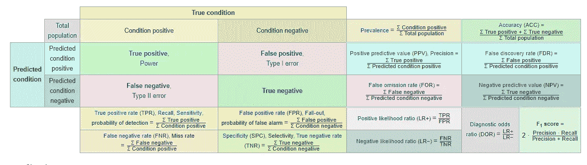
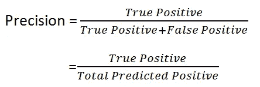

# 停止对商业领袖说精确和回忆…

> 原文：<https://towardsdatascience.com/stop-saying-precision-and-recall-to-business-leaders-f17082ab5052?source=collection_archive---------11----------------------->

开始说捕获率，改为命中率。

写这篇文章的动机是基于我最近参与的一个项目，在这个项目中，管理层试图辨别一个预测模型的商业价值。对模型结果及其业务影响的理解不够清晰。

用于评估模型能力的指标是[准确度](https://en.wikipedia.org/wiki/Accuracy_and_precision)、[精确度](https://en.wikipedia.org/wiki/Precision)和[召回](https://en.wikipedia.org/wiki/Precision_and_recall)。我不会去解释为什么这些特定的度量标准会被使用，那将是另一个时间。

**A diagnostic testing table for binary classification.** Source: [en.wikipedia.org/wiki/F1_score](https://en.wikipedia.org/wiki/F1_score)

我会假设你已经熟悉精度，并回忆或至少理解它们是什么。如果你没有听说过这些指标，Koo 的这篇文章很好地解释了它们。下面是公式的快速复习:

Source: towardsdatascience.com/331fb37c5cb9

我想关注的是管理层在分解预测模型结果时反复提出的问题:**那么如果精度是 90%呢？如果我的回忆率低于准确率，这对决策有什么帮助？**这些是数据科学家在交流他们的发现以帮助企业决策时必须克服的障碍。在追求创建有史以来最好的模型的过程中，经常会忽略模型的实际方面。

*除了了解什么是精确度和召回率，还应该了解关注不同的指标会如何影响预测模型在业务环境中的作用。*

我将尝试创建一个强大的业务联系，以提供更多关于如何提升业务价值预测模型的直觉。

**将*精度*转换为*转化率***

让我们从一个简单的上下文开始。假设我们是一家在线零售商，每天有 1000 名访客访问我们的网站。您制作的预测模型用于预测访问者是否可能购买(热门线索)。然后，跟进针对这些线索。

该模型预测并识别了这 1000 人中的 100 个热门线索，并假设 80 个热门线索实际上最终进行了购买。这意味着 80%的转化率。你可能意识到的是，**转化率**实际上是模型的**精度**！就这么简单！现在，你可以用一种熟悉的方式告诉管理层预测如何帮助业务，即提高转化率。现在，管理层可以将这个指标与他们当前的过程进行比较，您的项目现在有了清晰的业务含义。

**翻译*召回*到*捕获*再到**

假设现在你知道有一个由 100 名高价值访客组成的团队，他们比普通顾客花费更多。预测模型做着同样的预测:一个访问者是否具有高价值，后续行动是针对这些个人的。

该模型设法包括 80 个高价值客户，这是我们的目标市场。这将意味着我们试图锁定的 100 个人的捕获率为 80%。嗯，80%的**捕获率**实际上就是该车型的**召回**！

*简单来说，精准是获得高价值客户比例最高的能力，召回是不错失高价值客户的能力。*

请注意，对于不同质量的客户，我们的关注点会有所不同。在第一种情况下，我们更感兴趣的是用最少的努力将尽可能多的访问者转化为买家，而在第二种情况下，我们的目标是抓住尽可能多的目标细分市场。

让我们看一个不同的例子。如果一家银行发起一项活动，提供有吸引力的个人贷款套餐，你会希望将你的套餐提供给尽可能多的潜在贷款支付者，同时避免贷款给潜在的违约者。为了简单起见，我没有考虑其他成本，如竞选成本或因不平等待遇而疏远现有客户的成本。

重温之前的类比:

*精准是在活动中获得最高贷款支付者比例的能力，召回是不遗漏贷款支付者的能力。*

或者，precision 的目标是不把任何人误认为付款人。召回旨在不将任何人误认为违约者。你的**精度**是借款人的**命中率**，而**召回**是借款人的**捕获率**。

精确度越高，招募违约者的可能性就越小，但潜在客户群会变得更小。召回率越高，潜在客户群就越大，但招募违约者的风险也就越高。我们的召回和精确水平的平衡是一个风险偏好的问题。为了吸引更多的潜在客户，我们是否愿意承担招募不良客户的更大风险？至关重要的是，这些是企业关注的重点。

**与业务目标保持一致**

企业的战略目标可以是任何东西，从识别潜在客户，捕捉欺诈，最大限度地提高活动效果或减少流失。为了有效地传达预测模型的结果，我们应该与业务领导关注的指标保持一致:转化率、流失率、欺诈事件率、捕获率、命中率等。

**因此，与其说你的模型实现了某个百分比的召回率或精确度，不如说你设法实现了更高的捕获率或命中率。**

模型度量与业务目标完全一致！

虽然数据科学家能够产生所需的结果，但随之而来的沟通不匹配可能会让决策者感到困惑。确定业务指标对于最大化稳健预测算法的优势至关重要。

我希望我成功地引入了一种不同的视角来使用精确度和召回率来弥合业务用户和数据科学之间的差距。感谢阅读！