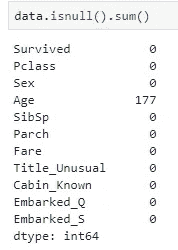
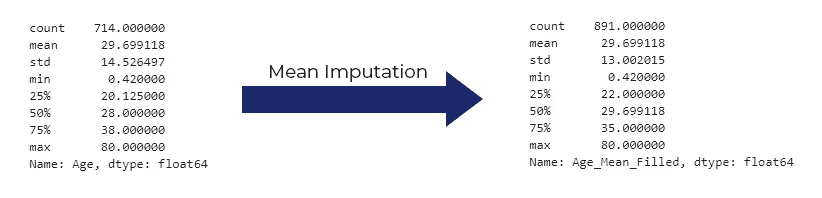
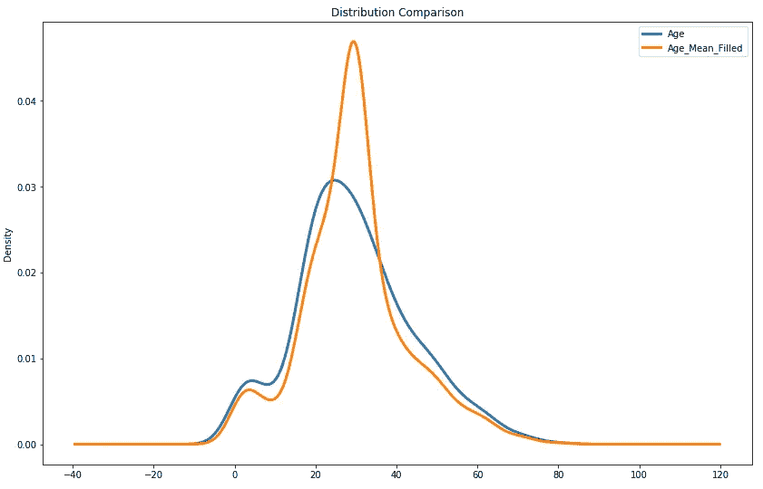
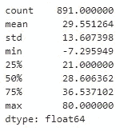
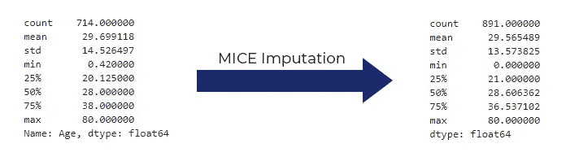
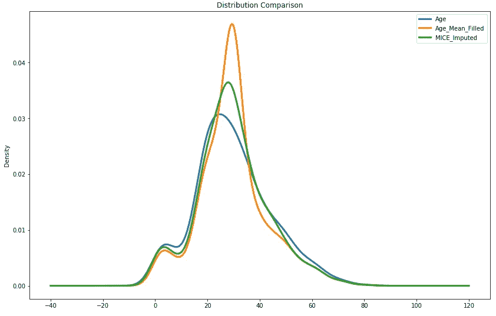

# 停止使用均值来填充缺失数据

> 原文：<https://towardsdatascience.com/stop-using-mean-to-fill-missing-data-678c0d396e22?source=collection_archive---------7----------------------->

均值插补是我用过的第一种处理缺失数据的“高级”方法。在某种程度上，这是用 0 或常数(例如-999)填充缺失值的一大步(请不要这样做)。

然而，这仍然不是一个最佳的方法，今天的帖子会告诉你为什么。


Photo by [Pietro Jeng](https://unsplash.com/@pietrozj?utm_source=medium&utm_medium=referral) on [Unsplash](https://unsplash.com?utm_source=medium&utm_medium=referral)

# 数据集

对于本文，我选择使用[泰坦尼克号数据集](https://github.com/datasciencedojo/datasets/blob/master/titanic.csv)，主要是因为它广为人知，并且 ***年龄*** 列包含一些缺失的值。首先，让我们导入所有需要的东西，并做一些基本的数据清理。以下是进口货:

Imports — [https://gist.github.com/dradecic/bd084cb0c27bd76ed848dccabc9ed9b4](https://gist.github.com/dradecic/bd084cb0c27bd76ed848dccabc9ed9b4)

当您检查数据集的头部时，您将得到以下内容:


Titanic Head

关于数据清理，应该完成以下工作:

1.  ***PassengerId*** 和 ***Ticket*** 应该被丢弃——第一个只是一个任意的整数值，第二个对于每个乘客都是不同的。
2.  ***性别*** 列的值应重新映射为 0 和 1，而不是“男性”和“女性”
3.  从 ***姓名*** 中提取人物头衔，如先生、夫人、小姐…，如果头衔常见(先生、小姐…)，则进一步转换为 0 和 1-0。)，如果不是，则为 1(博士、牧师、上尉)。最后， ***名称*** 应该去掉
4.  ***舱*** 应替换为 ***舱 _ 已知*** —如果值为 *NaN* ，否则为 1
5.  虚拟列应该从 ***开始创建*** 并且第一个虚拟列应该被删除以避免共线性问题

下面是实现这一点的一小段代码:

Data Cleaning — [https://gist.github.com/dradecic/74a77c38c4986b490d111331ee74c3ca](https://gist.github.com/dradecic/74a77c38c4986b490d111331ee74c3ca)

# 平均插补

数据集现在是干净的，但是在 ***年龄*** 列中仍然包含丢失的值:



Missing values

因为我不想弄乱原始数据集，所以我会做一个副本并做上标记，所以很明显这里会做均值插补。然后，我将创建一个新属性—***Age _ Mean _ Filled***—顾名思义，它将包含 ***Age*** 属性的平均估算值:

Mean Imputation — [https://gist.github.com/dradecic/f7cde4d83cd2fc800a63e59b718039b2](https://gist.github.com/dradecic/f7cde4d83cd2fc800a63e59b718039b2)

从统计学角度来说，均值插补对数据集的影响如下:



Mean Imputation Changes

是的，意思是一样的，很明显，但是看一下*第 25 位*、*第 50 位*、*第 75 位*百分位。另外，查看**标准差**的变化。结论是显而易见的——均值插补对属性可变性有影响。

让我们看看这些分布是什么样子的:



Mean Imputation Distribution Check

左侧和右侧都很接近，但是显著的差异在中间——如你所见。

现在的问题是——如何解决这个问题？

# 介绍老鼠

MICE，或*链式方程多元插补*(多么难忘的术语)，是一种插补方法，通过多次填充缺失数据来工作。链式方程方法还有一个好处，就是能够有效地处理不同的数据类型，比如连续数据和二进制数据。

引用 statsmodels.org 的[，](https://www.statsmodels.org/)

> 基本思想是将每个有缺失值的变量视为回归中的因变量，剩余变量中的一些或全部作为其预测变量。MICE 程序通过这些模型循环，依次拟合每个模型，然后使用一种称为“预测平均匹配”(PMM)的程序，从拟合模型确定的预测分布中产生随机抽取。这些随机抽取成为一个估算数据集的估算值。[1]

根据国家生物技术信息中心的说法，以下是使用老鼠的一些主要优势:

> 多重插补比其他缺失数据方法有许多优势。多重插补涉及多次填充缺失值，创建多个“完整”数据集。如[斯查费和格拉汉姆(2002)](https://www.ncbi.nlm.nih.gov/pmc/articles/PMC3074241/#R30) 所述，缺失值是基于给定个体的观察值和其他参与者数据中观察到的关系进行估算的，假设观察变量包含在插补模型中。[2]

好了，说够了，让我们做一些编码！要开始，您需要通过 *pip* 安装 ***impyute*** 库:

```
pip install impyute
```

如果你习惯于均值估算，你可能会认为其他任何事情都要复杂得多，至少在实现方面是如此。在这种情况下，你就大错特错了。

由于 ***impyute*** 库的简单性，MICE 的实现不能再简单了。你需要在数组中传递纯值，所以默认情况下 **Pandas DataFrame** 不会剪切它。很幸运，你可以直接叫 ***。值*和**就设置好了:

MICE Imputation — [https://gist.github.com/dradecic/6b567e42dd9890f9e6dae125a70a433f](https://gist.github.com/dradecic/6b567e42dd9890f9e6dae125a70a433f)

这很快。

快速调用**到*。描述()*** 对 ***小鼠 _ 年龄*** 会产生以下结果:



MICE default

请注意最小值。现在是零下 7 度。因为这个属性代表年龄，所以有负值是没有意义的。这可以通过一些基本的**列表理解**很容易地解决:

Negatives — [https://gist.github.com/dradecic/8e8a4c5df08369abb6b3246f25cd5cfc](https://gist.github.com/dradecic/8e8a4c5df08369abb6b3246f25cd5cfc)

如果你现在检查原始的 ***年龄*** 的统计数据，和老鼠估算的一，你会看到数值更接近:



MICE Imputation Changes

快速分布图证实了这些说法。小鼠估算值的分布更接近原始分布。



MICE Imputation Distribution Check

# 最后的话

你现在知道你的库存里有什么新技能了。我的建议是，你可以试着在你已经处理过的数据集上使用它，但是用均值插补或者其他方法代替。

如果你在那里开发了一个预测模型，看看准确性如何比较。如果能因此挤出点额外的精准度就太好了。

感谢阅读。

直到下一次…

*喜欢这篇文章吗？成为* [*中等会员*](https://medium.com/@radecicdario/membership) *继续无限制学习。如果你使用下面的链接，我会收到你的一部分会员费，不需要你额外付费。*

[](https://medium.com/@radecicdario/membership) [## 通过我的推荐链接加入 Medium-Dario rade ci

### 作为一个媒体会员，你的会员费的一部分会给你阅读的作家，你可以完全接触到每一个故事…

medium.com](https://medium.com/@radecicdario/membership) 

# 参考

[1]—[https://www.statsmodels.org/stable/imputation.html](https://www.statsmodels.org/stable/imputation.html)

[2]—[https://www.ncbi.nlm.nih.gov/pmc/articles/PMC3074241/](https://www.ncbi.nlm.nih.gov/pmc/articles/PMC3074241/)