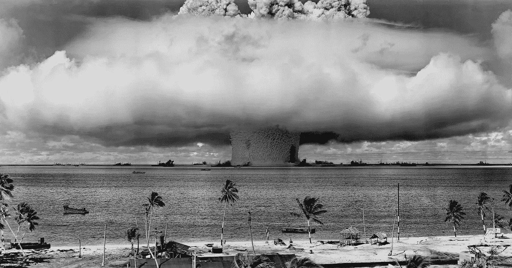

# 停止使用终结者图像

> 原文：<https://towardsdatascience.com/stop-using-terminator-images-10b2feb79c78?source=collection_archive---------37----------------------->

## 人工超级智能不会有奥地利口音

Image by [WikiImages](https://pixabay.com/users/WikiImages-1897/?utm_source=link-attribution&utm_medium=referral&utm_campaign=image&utm_content=67557) from [Pixabay](https://pixabay.com/?utm_source=link-attribution&utm_medium=referral&utm_campaign=image&utm_content=67557)

我们都看过这些文章。他们警告我们，未来先进的人工智能(AI)将变得“流氓”，并毁灭我们所知的生命。由于这部分是终结者电影的情节，这些文章使用这些电影的图像来说明这一点。

我完全赞成警告人类人工智能未来可能出现的问题。我确实认为这会导致我们的灭绝。这可能是我们最大的生存风险。我在使用《终结者》系列电影的图像时遇到的问题是，这些电影预测了一个极不可能的未来。终结者特许经营是**娱乐**——它(可能)甚至不意味着是准确的。

对于不知道终结者特许经营权的你们中的少数人，我将快速解释一下剧情。这个想法是，在某个时间点，一群人构建了一个名为**天网**的人工智能。用于国防，天网这个学习系统变得越来越聪明，最终发展成为一个**有自我意识的 AI** 。将人类视为一种威胁，它建立了一支杀手机器人军队，在导致不同国家相互投掷核弹后，与人类的残余进行战斗。人类由一个名叫**约翰·康纳**的人领导，天网在约翰出生前派了一个终结者(阿诺德·施瓦辛格饰演的一个被人肉覆盖的人形机器人)回到过去杀死了约翰的母亲**莎拉·寇娜**。

从电影中我不太清楚天网的确切智能水平，但由于天网确实有自我意识，并且是一个学习系统(智能不断增加)，我将假设它是一个**人工超级智能**:一个比任何人类都要智能得多的人工智能**。**

为什么我认为《终结者》电影中的场景不太可能？首先，高度先进的感知暗杀机器人将能够准确射击，施瓦辛格扮演的终结者是一个可怕的射手。

> 任何人类与 ASI 对抗并且不会很快被消灭的场景都是不现实的。

但是关于终结者的场景有一个更大(也更可怕)的问题，那就是:任何人类与人工智能对抗并且不会很快被消灭的场景都是不现实的。从定义上来说，一个 ASI 非常擅长实现它的任何目标，而且几乎对任何目标来说**自我保护**都很有用。因为从定义上来说，人工智能比我们更聪明，所以它很可能比我们更善于自我保护。这直接意味着**将赢得这场战争，如果有一个**的话。如果你认为一个 ASI 可能没有办法杀死我们，再想想。它会找到办法的。它甚至可能说服我们给它提供手段，就像如果它没有互联网连接，它会说服我们给它提供互联网连接一样。我在这里写了一个有趣的实验:

 [## 人工智能盒子实验

### 一个简单的实验能教会我们什么是超级智慧

towardsdatascience.com](/the-ai-box-experiment-18b139899936) 

《终结者》的场景不切实际，这是不使用其图片来说明高级人工智能出错警告的一个非常好的理由。即使人们知道这是科幻小说，我仍然害怕看到图片会产生一些 [**锚定**](https://en.wikipedia.org/wiki/Anchoring) **效果**他们知道场景是假的，但他们没有在头脑中进行足够的调整。结果是对未来的某种半虚构的憧憬，这对任何人都没有好处。考虑 ASI 已经非常困难了，因为我们很难不把**拟人化**；看到终结者的图像只会让这变得更加困难。