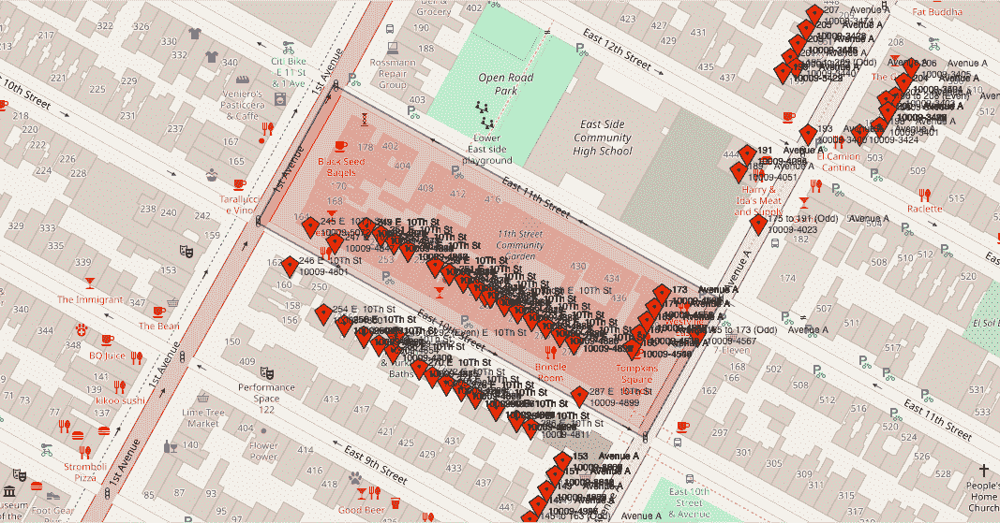
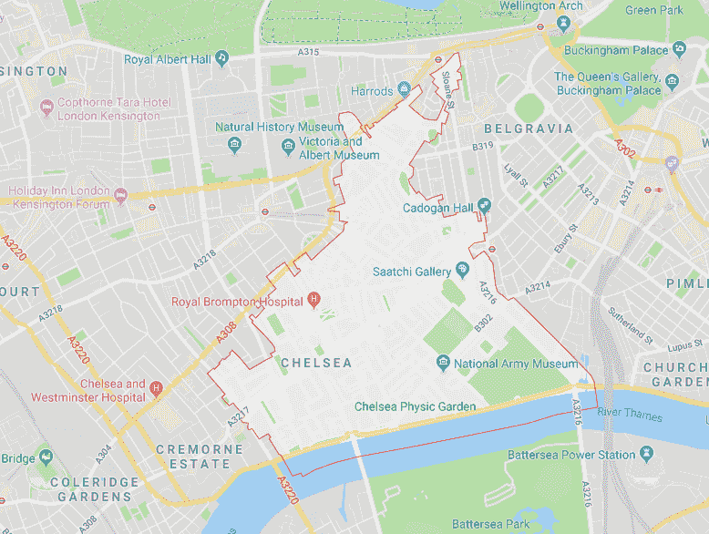
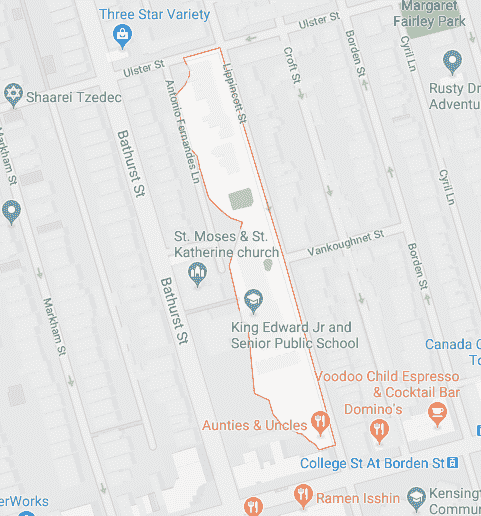
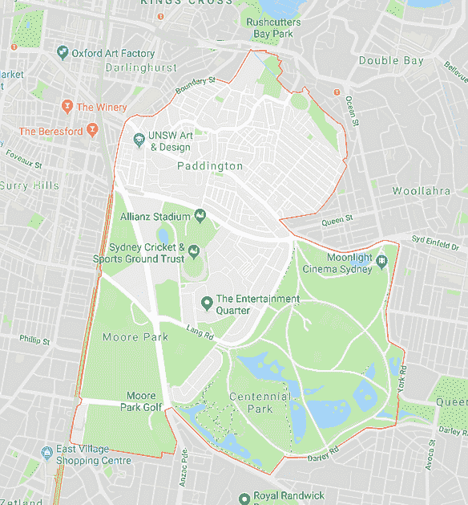
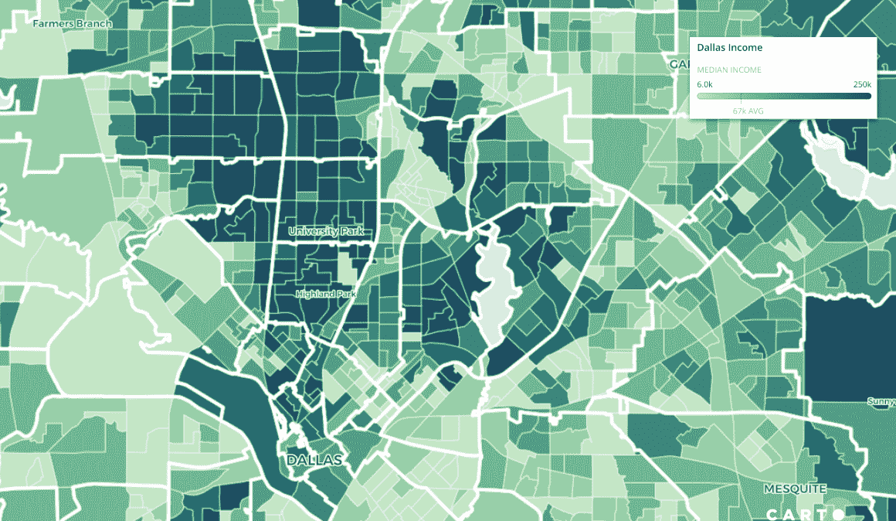
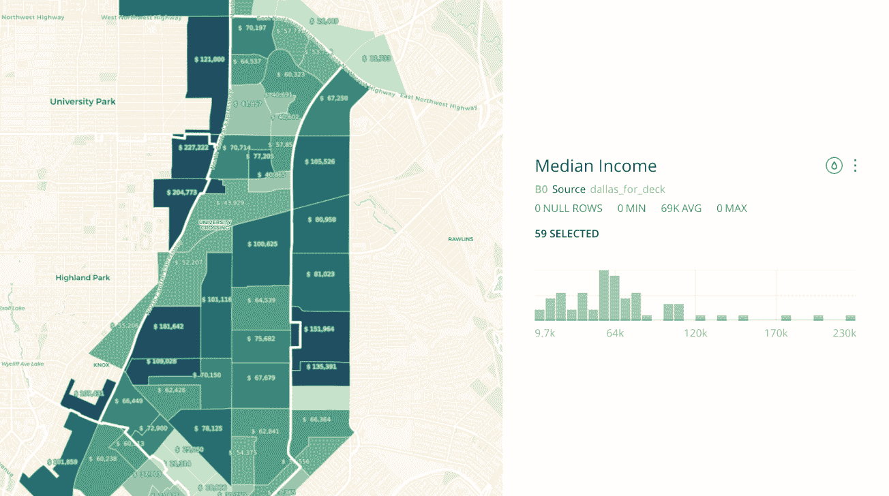
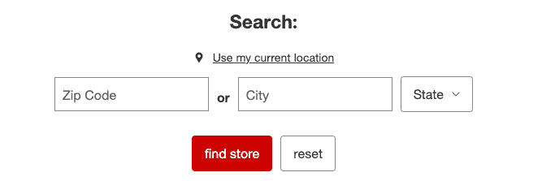
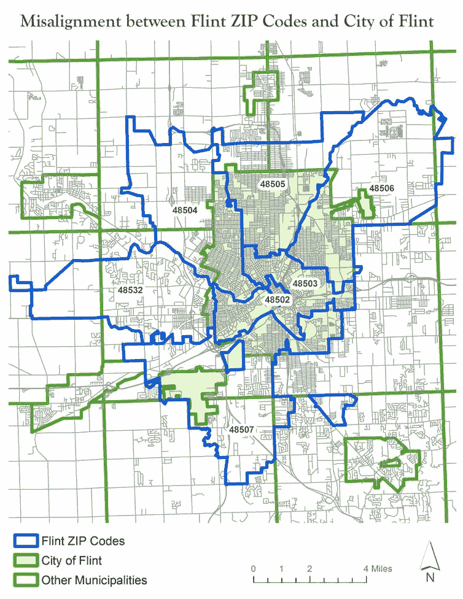
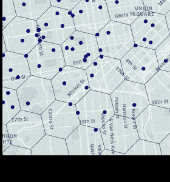

# 停止使用邮政编码进行地理空间分析

> 原文：<https://towardsdatascience.com/stop-using-zip-codes-for-geospatial-analysis-ceacb6e80c38?source=collection_archive---------3----------------------->

上次使用邮政编码时，您很可能是在网站上输入您的地址进行购物，在您家或办公室附近寻找商店，或者填写其他在线表格。你很可能找到了你想要的答案，而没有停下来进一步思考你刚刚输入的五位数代码。

然而，许多公司、营销人员和数据分析师会花数小时查看邮政编码。他们正在决定如何使用与这些邮政编码相关的数据来了解趋势，经营他们的业务，并使用相同的五位数代码找到联系您的新方法。

即使有不同的地点关联对你个人来说可能更有意义，例如街区、街道或你居住的街区，但在许多组织中，邮政编码是地理单位的选择。它用于制定营销、开店或关店、提供服务的重大决策，以及可能产生巨大财务影响的决策。

问题是，邮政编码并不能很好地代表真实的人类行为，当用于数据分析时，往往会掩盖真实的潜在见解，并可能最终导致糟糕的结果。要理解这是为什么，我们首先需要了解邮政编码本身。

# 邮政编码:简史

邮政编码的前身是邮政区，代表特定城市的邮局部门。例如:

> 无名氏先生
> 
> 亨内平大街 515 号
> 
> 明尼苏达州明尼阿波利斯 16

*“16”*代表明尼阿波利斯市的邮政区。但是随着越来越多的邮件被发送，1963 年邮政服务决定推出**区改善计划**，该计划将地址改造成如下所示:

> 无名氏先生
> 
> 亨内平大街 515 号
> 
> 明尼苏达州明尼阿波利斯 554 *16*

五位数代码代表国家的一部分(5_ _ _ _)，一个部门中心设施( *_* 5 4 _ _)，以及相关的邮局或投递区域(_ _ _ 1 6)。


The first digit for every zip code for the states in the contiguous United States

到 1967 年，邮政编码成为批量邮寄的强制性规定，并继续被几乎所有在美国发送邮件的人所采用。随着时间的推移，添加了 ZIP+4 来增加邮政编码的粒度，以表示特定的位置，甚至是供邮政工作人员投递的建筑物。邮政服务甚至创造了一个角色，邮政先生，来推广邮政编码的使用，他出现在邮票、商业广告和歌曲中。


Mr. Zip

邮政编码本身实际上并不代表一个区域，而是一组路线:

> *尽管大多数邮政编码的地理来源不同，但编码本身并不代表地理区域；通常，它们对应于地址组或传递路线。因此，邮政编码“区域”可以重叠，可以是彼此的子集，也可以是没有地理区域的人工构造(例如，095 表示寄给海军的邮件，它在地理上是不固定的)。以类似的方式，在没有常规邮政路线的地区(* [*农村路线*](https://en.wikipedia.org/wiki/Rural_delivery_service) *地区)或者没有邮件递送的地区(不发达地区)，不分配邮政编码或者基于稀疏的递送路线，因此邮政编码地区之间的边界是不确定的。*

美国人口普查局为邮政编码列表区或地理文件提供数据:

> *邮政编码列表区(ZCTAs)是美国邮政署​(USPS)邮政编码服务区的通用区域表示。*
> 
> *USPS 邮政编码标识与邮寄地址相关联的各个邮局或大都市地区投递站。USPS 邮政编码不是区域要素，而是邮件递送路线的集合。*

在这里，我们发现了邮政编码的第一个问题，即它们并不代表地图上的实际区域，而是帮助邮政工作人员有效投递邮件的路线集合。它们不是为了衡量社会人口趋势而设计的，而这正是一家企业通常想要做的。您可以实际查找[单个交货路线](https://www.melissa.com/v2/lookups/mapcartzip/zipcode?zipcode=10009)，如下图所示:



One zip code route in New York’s East Village

我们在这里只是触及了问题的表面。类似的问题在世界各地都存在，邮政编码代表着奇怪的边界:



Postal Codes in London, Toronto, and Sydney

# 使用邮政编码进行数据分析

快进到今天，许多公司可以很容易地查看他们的数据库，找到一个带有 zip_code 列的数据集，这使他们能够分组和聚合数据，以查看趋势和业务绩效指标。如前所述，邮政编码的问题在于:

1.  它们并不代表真正的边界，而是路线
2.  它们不代表人类的行为方式

后者代表了使用空间数据的两个具体问题:观测的空间比例和空间比例支持(您可以在 UChicago 的 Luc Anselin 的讲座中了解更多信息，[此处](https://youtu.be/MmCYeJ27DsA?t=326))。首先，人类的行为不会基于行政单位，如邮政编码，甚至人口普查单位。他们的行为更多地受到他们邻居的影响，或者受到社区或高活动区域(如中央商务区)的影响。第二，空间数据是以多种比例提供的，而且这些边界往往重叠或嵌套在另一个边界内。

让我们来看一个发生在达拉斯某个特定地区的例子。



Zip Code boundaries (white) with Census Block Groups based on Income

在这张地图中，我们可以看到大的白色边界，代表邮政编码的边界，在它们下面是美国人口普查区块组的边界。美国人口普查提供的数据显示，深绿色代表高收入。

当我们查看一个特定邮政编码时，我们可以看到更详细的收入数据:



我们可以看到，在这个单一邮政编码(75206)中，12 个月的家庭收入中位数在 9700 美元到 227000 美元之间，当我们看完全或部分属于这个单一邮政编码的街区群体时，人口普查列出的家庭收入中位数为 63392 美元。

收入中位数是评估一个邮政编码范围内的值的一种方法(请记住，这些是 ZCTA 边界)，但我们可能会在人口、就业和其他数据分析的相关指标中看到这样的差异。

坚持家庭收入中位数，我们决定将这一分析扩展到整个美国，当您查看邮政编码和与 ZCTA 边界相交的人口普查区块组(至少有 1 人居住在该区块组中)时，看看哪些区域最不平等和最不平等。

**最不平等的邮政编码是佛罗里达州迈阿密海滩的 33139**

1.  33139:佛罗里达州迈阿密(差额 241344 美元)
2.  44120:俄亥俄州克利夫兰(237501 美元差额)
3.  10013:纽约州纽约市(233，559 美元差额)
4.  10023:纽约州纽约市(233，157 美元差额)
5.  11201:纽约布鲁克林(233031 美元的差价)
6.  10601:纽约州怀特普莱恩斯(232，813 美元差价)
7.  33141:佛罗里达州迈阿密(差额 232633 美元)
8.  92648:加州亨廷顿海滩(231290 美元差价)
9.  98105:华盛顿州西雅图市(230，906 美元差额)
10.  33143:佛罗里达州迈阿密(差额 230626 美元)

**最相似的*邮政编码在西弗吉尼亚州的切萨皮克**

1.  25315:西弗吉尼亚州切萨皮克(2 美元差额)
2.  79357:德克萨斯州圆锥市(4 美元差价)
3.  65052:密苏里州林恩克里克(9 美元差价)
4.  73093:俄克拉荷马州华盛顿(相差 12 美元)
5.  68370:东北希伯伦(相差 13 美元)
6.  19541 年:宾夕法尼亚州莫尔斯维尔(相差 15 美元)
7.  05340:佛蒙特州邦德维尔(18 美元差价)
8.  12958:纽约州穆尔市(相差 26 美元)
9.  19941 年:埃伦代尔，德(相差 37 美元)
10.  54896:洛丽塔，威斯康星州(38 美元的差异)

**差异大于 0 时类似*

为了对整个美国进行这种分析，我使用 CARTO 及其笔记本扩展 CARTOframes 来获取人口普查区块组和人口普查 ZCTA 地区的人口普查数据，这些数据存储在 CARTO 中。

一旦我们有了两组边界，我们就要查看所有完全被 ZCTA 边界包含，或者至少 50%被 ZCTA 边界包含的块组。为此，我们可以使用 PostGIS 来查找这些交叉点，并根据这些数据创建不同的统计测量值(最小值、最大值和百分位数)。

你可以在这个[笔记本](https://github.com/mbforr/zip-codes-analysis/blob/master/Zip%20Code%20Analysis.ipynb)里看到完整的方法论和代码。

```
SELECTz.*,MIN(b.median_income),MAX(b.median_income),SUM(b.total_population) AS total_pop,percentile_disc(0.25) WITHIN GROUP (ORDER BYb.median_income) AS p_25,percentile_disc(0.5) WITHIN GROUP (ORDER BYb.median_income) AS mean,percentile_disc(0.75) WITHIN GROUP (ORDER BYb.median_income) AS p_75,stddev_pop(b.median_income)FROMincome_zips zLEFT JOIN income_bgs b ON ST_Intersects(z.the_geom, b.the_geom)WHEREb.total_population > 0AND (ST_Area(ST_Intersection(z.the_geom, b.the_geom))/ ST_Area(b.the_geom)) >.5GROUP BYz.cartodb_id
```

创建新表后，我们可以看到，大多数最不平等的邮政编码往往位于城市或更大的都会区，而更平等的邮政编码往往位于全国各地的农村地区。

根据最高值和最低值之间的范围探索邮政编码的空间显著性聚类也是值得的，这非常适合使用空间自相关。你可以在这篇[文章](https://gisgeography.com/spatial-autocorrelation-moran-i-gis/)或者这篇[教程](http://darribas.org/gds_scipy16/ipynb_md/04_esda.html)中了解更多。

# 那么我们为什么使用邮政编码呢？

实际上，使用邮政编码作为地理空间单位很容易。正如我们之前所说的，几乎所有使用定位或需要以任何方式定位用户的电子商务或交付服务或应用程序都会收集邮政编码。此外，每个人都熟悉邮政编码，因为在大多数国家，邮政编码是任何地址的一部分。



‘Find A Store’ on Target.com

不经常使用地理空间数据的人不太熟悉人口普查区块组或区域等术语，它们可能更难找到和使用，尤其是如果您不熟悉 Shapefile、FTP 和 ETL 等术语。即使这样，你也必须通过美国人口普查 FTP 网站，下载各州的地理文件，并将这些文件加入人口普查数据。

最后，不用看地图，大多数人都知道邮政编码代表的区域比城市小，但比街区大。从概念上讲，他们觉得自己足够小，可以获得一个非常集中的世界视图，也足够大，可以捕捉足够多的趋势样本。

简短的回答是邮政编码很容易找到，很熟悉，并且提供了一个足够详细的世界视图(或者我们是这样认为的)。

也就是说，在地理空间分析中使用邮政编码会产生一些现实问题。一个例子是房地产，在许多城市或地区，有房屋列在一个[‘期望’邮政编码](https://www.trulia.com/voices/Home_Selling/Do_zip_codes_affect_pricing_Or_-36526)中，尽管我们知道这些界限是任意的。[这篇来自《哈佛商业评论》的文章](https://hbr.org/2019/04/research-when-airbnb-listings-in-a-city-increase-so-do-rent-prices)也描述了 Airbnb 房源和房租上涨的类似现象。

> *简单来说，我们认为，如果一个邮政编码是“旅游性的”，意味着它有很多餐馆和酒吧，如果 Airbnb 的知名度增加，我们使用谷歌搜索指数搜索关键词“Airbnb”，那么该邮政编码的 Airbnb 供应的任何跳跃都可能是由 Airbnb 短期租赁需求的增加驱动的，而不是当地的经济状况。*

更重要的是，使用邮政编码进行分析可以掩盖在不同空间尺度上发生的严重情况。弗林特水危机就是其中之一。密歇根州立大学助理教授 Richard Casey Sadler 的这篇文章详细描述了这个问题，并提出了关于邮政编码的类似观点(全文值得一读):

> 亚利桑那州立大学的教授托尼·格鲁贝希奇博士称它们为“世界上更加古怪的‘地理学’之一”哈佛大学教授南希·克里格(Nancy Krieger)博士和他的同事们呼吁他们的[](http://www.ncbi.nlm.nih.gov/pmc/articles/PMC1447194/)**用于小范围分析。**

*最终，该州使用邮政编码来分析血铅统计数据，这有效地掩盖了实际问题。这是因为:*

> *在弗林特的案例中，州政府的错误是因为“弗林特邮政编码”与弗林特市或其供水系统不一致。城市和水系统几乎 100%相连，也就是说，它们共享相同的边界…总之，该州分析中使用的弗林特邮政编码覆盖了弗林特周围八个不同自治市(七个乡镇和一个城市)的部分区域。*

**

*Map by Richard Casey Sadler*

*在弗林特的例子中，简单地观察不同的空间尺度或分析可能会更清楚地显示问题。对于公共卫生和关键服务等领域，理解和使用适当的空间比例至关重要。*

# *我们还能做什么？*

*因此，如果您被迫放弃邮政编码分析，好消息是有几种不同的选择。*

***使用地址***

*首要的建议是使用真实的地址。当你知道一个地址串时，你可以使用地理编码器——或者谷歌或其他地图搜索引擎用来获取地址并将其转换为纬度和经度的服务。几乎每个主要的服务都为不同的语言提供了 API 和包装器来实现这一点。请记住，通常有一些清理数据的[最佳实践](https://docs.mapbox.com/help/troubleshooting/address-geocoding-format-guide/)，你将需要有效的地址串来这样做。其他工具如 [Libpostal](https://github.com/openvenues/libpostal) 可以帮助你规范化和解析你的地址字符串。*

***使用普查单位***

*您也可以使用人口普查单位，如人口普查区块组或区域。正如我提到的，寻找和收集大规模的数据并不总是容易的，但有许多新的工具正在变得可用。 [CenPy](https://github.com/cenpy-devs/cenpy) 是一个 Python 库，允许你连接和查找人口普查数据(好的[教程在这里](https://medium.com/@mswhitetoyou/scraping-us-census-data-via-cenpy-9aeab12c877e)),在这里你可以找到十年一次的人口普查或美国社区调查的数据。CARTO 还通过[数据观测站](https://carto.com/developers/data-observatory/)提供人口普查和 ACS，该观测站在笔记本中用于完整的美国分析。*

*您还可以使用[美国人口普查地理编码器](https://www.census.gov/data/developers/data-sets/Geocoding-services.html)找出特定地址位置的人口普查几何 id。你可以在 API 中传递各种参数，或者在 Python 中使用 [censusgeocode](https://pypi.org/project/censusgeocode/) 包。*

*在收集地址数据时，您可以轻松地将人口普查区域或街区组 ID 添加到该条目中，并在数据中使用该 ID 而不是邮政编码字段。这将允许您进行与之前相同的聚合，只是在更合适的地理范围内。*

***使用自己的空间索引***

*最后，现在有越来越多的地理空间索引工具。谷歌用 [S2 单元格](http://s2geometry.io/)，你可以用[四键](https://github.com/mapbox/mercantile)索引网格单元格，优步用 [H3 hexbins](https://eng.uber.com/h3/) 。所有这些库的好处是父单元的子单元被父单元更均匀地包含，以避免空间重叠问题。只要您有纬度和经度(这将需要地理编码)，您就可以使用各种各样的库之一为该记录分配一个 ID。*

*使用空间索引有两个主要优点。首先，您不会被锁定到任何特定的边界类型，您可以在地球上的任何地方使用相同的研究单位。只要基础数据相同，您就可以将曼哈顿中城的某个单元格的趋势与尼日利亚拉各斯的某个单元格的趋势进行比较。*

***

Uber H3 Cells* 

*第二是敏感数据的匿名化。考虑到地址数据可能很敏感，您可以创建一个数据管道，只需读取传入地址，对其进行地理编码，分配一个空间索引，然后将该索引数据传递到一个单独的表中，然后您可以根据需要存储或删除地址数据。*

*使用空间数据可能很困难，但数据和工具的可用性使其变得更容易访问。通过使用正确的空间比例并放弃邮政编码级别的分析，您可以提高见解的质量并创建更有意义的结果和分析。*

**Matt Forrest 在* [*CARTO*](https://carto.com) *工作，过去 9 年一直从事空间数据科学方面的工作。**