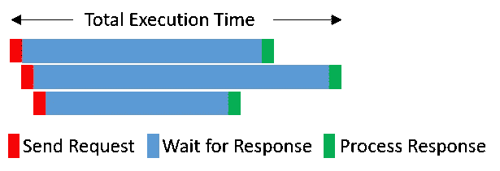

# 别等了！开始使用异步并等待！

> 原文：<https://towardsdatascience.com/stop-waiting-start-using-async-and-await-18fcd1c28fd0?source=collection_archive---------2----------------------->


Photo by [Harry Knight](https://unsplash.com/@harryknight?utm_source=unsplash&utm_medium=referral&utm_content=creditCopyText) on [Unsplash](https://unsplash.com/s/photos/wait?utm_source=unsplash&utm_medium=referral&utm_content=creditCopyText)

# 介绍

对我们数据科学家来说，最重要的因素是数据。我们如何把我们需要的数据输入到我们的程序中？我们通过一些 I/O 操作来做到这一点，如查询数据库、从磁盘加载文件或通过 HTTP 请求从 web 下载数据。这些 I/O 操作可能需要相当长的时间，我们只是在等待数据被访问。当我们必须加载多个文件、执行多个数据库查询或执行多个 HTTP 请求时，情况会变得更糟。大多数情况下，我们按顺序执行这些操作，这导致执行 100 个 I/O 操作总共要比执行单个操作多花 100 倍的时间。现在等待不仅令人讨厌，而且成为一种真正的痛苦。但是等待，不要太久:)，在我们启动另一个完全独立的请求之前等待请求的响应有意义吗？或者举一个日常生活中的例子，当你给两个人发邮件时，你会等到收到第一个人的回复后再给第二个人发邮件吗？我想不会。在本文中，我想向您展示如何使用 Python 中的异步 IO(简称 AsyncIO)编程范例来显著减少 IO 绑定问题的等待时间。我不会过多地探究技术细节，而是让它保持相当基本，并向您展示一个小的代码示例，希望这有助于您的理解。

# 问题是

假设我们想从一个服务器下载三个不同的文件。如果我们按顺序执行，大部分时间我们的 CPU 是空闲的，等待服务器响应。如果响应时间占主导地位，那么总执行时间就是各个响应时间的总和。示意性地，这看起来像图 1 所示。


Picture 1 showing the sequential execution flow and time.

我认为空闲的 CPU 听起来不太理想。按顺序发送请求，等待所有请求完成，然后组合所有响应，这样不是更好吗？在这种情况下，再次假设响应时间占主导地位，总的执行时间大致是所有请求中最大的响应时间。这示意性地显示在图 2 中。



Picture 2 showing the idealized concurrently send non-blocking request execution time.

请注意，蓝色条只是显示了发送请求和响应可用之间的时间。在这段时间内，我们不应该只是有一个空闲的 CPU，而是应该利用它来执行一些工作。这正是我们在这里所做的。当一个请求的响应到达时，我们已经处理了它，同时还在等待其他响应的到达。听起来很棒，不是吗？那么我们如何编写利用这一点的代码呢？正如在介绍中已经说过的，我们可以使用 AsyncIO 来达到这个目的。

# 解决方案

异步是一种更高级的编程范式，在这种情况下，您开始一项任务，虽然您没有该任务的结果，但您做了一些其他工作。这样，尽管在单个进程中使用单个线程，AsyncIO 还是给人一种并发的感觉。实现这一点的神奇要素是事件循环、协程和属于协程的可应用对象——对象、任务和未来。非常简单

*   一个**事件循环**协调一个可应用对象的执行和通信。没有事件循环，我们就不能使用 awaitables，因此，每个 AsyncIO 程序至少有一个事件循环。
*   本地**协程**是用**异步定义**定义的 python 函数。你可以把它想象成一个可暂停的函数，它可以保持状态并从暂停状态恢复执行。你可以通过调用**wait**来暂停一个协同程序。通过暂停，它将控制流释放回事件循环，从而使其他工作得以完成。当 awaitable 的结果就绪时，事件循环将控制流交还给协程。调用协程会返回一个协程对象，必须等待它才能得到实际结果。最后，重要的是要记住**你只能在一个协程内调用 await*。****您的根协程需要通过阻塞调用被调度到事件循环上。*

*下面是一些非常基本的代码，希望有助于您的理解*

```
***import** asyncio**async def** sample_coroutine():
    **return** 1212**async def** main_coroutine():
    coroutine_object = sample_coroutine()
 **# With await, we stop execution, give control back to the 
    # eventloop, and come back when the result of the 
    # coroutine_object is available.**    result = **await** coroutine_object
    **assert** result == 1212**# Blocking call to get the event loop, schedule a task, and close
# the event loop**
asyncio.run(main_coroutine())*
```

*如果你对更全面的介绍感兴趣，我向你推荐[这个](https://realpython.com/async-io-python/)、[这个](https://hackernoon.com/asyncio-for-the-working-python-developer-5c468e6e2e8e)和[那个](https://hackernoon.com/a-simple-introduction-to-pythons-asyncio-595d9c9ecf8c)。*

# *这个例子*

*理论够了，来试试吧。使用原生协程的先决条件是 Python 3.5+，但是 asyncio 发展很快，所以我建议使用最新的 Python 版本，在撰写本文时是 3.7+。举个例子，我下载了几张[狗的图片](https://dog.ceo/api/breed/hound/images)。为了进行比较，我以同步和异步方式进行了相同的操作。为了执行 HTTP 请求，我将[请求](https://requests.kennethreitz.org/en/master/)用于同步部分，将 [AIOHTTP](https://aiohttp.readthedocs.io) 用于异步部分。我有意省略了任何类型的错误检查，以避免重复代码。*

## *代码*

*所以让我们首先安装必要的模块*

```
*pip install aiohttp requests*
```

*接下来，我导入模块并添加一个小的助手函数*

```
***import** asyncio
**import** time
**from** typing **import** Any, Iterable, List, Tuple, Callable
**import** os
**import** aiohttp
**import** requests**def** image_name_from_url(url: str) -> str:
    **return** url.split(**"/"**)[-1]*
```

*现在，给定一组图像 URL，我们可以通过以下方式将它们顺序下载并存储为一个图像对列表(图像名，字节数组)*

```
***def** download_all(urls: Iterable[str]) -> List[Tuple[str, bytes]]:
    **def** download(url: str) -> Tuple[str, bytes]:
        print(**f"Start downloading** {url}**"**)
        **with** requests.Session() **as** s:
            resp = s.get(url)
            out= image_name_from_url(url), resp.content
        print(**f"Done downloading** {url}**"**)
        **return** out**return** [download(url) for url in urls]*
```

*我添加了一些打印语句，这样您就可以看到执行该函数时会发生什么。到目前为止还不错，到目前为止没有什么新的，但现在来了异步版本*

```
***async def** donwload_aio(urls:Iterable[str])->List[Tuple[str, bytes]]:
    **async def** download(url: str) -> Tuple[str, bytes]:
        print(**f"Start downloading** {url}**"**)
        **async with** aiohttp.ClientSession() as s:
            resp = **await** s.get(url)
            out = image_name_from_url(url), **await** resp.read()
        print(**f"Done downloading** {url}**"**)
        **return** out

    **return await** asyncio.gather(*[download(url) for url in urls])*
```

*啊哈，这看起来几乎是一样的，除了所有那些异步和等待关键字。让我给你解释一下这里发生了什么。*

*   *download_aio 是一个协同例程，因为它是用*异步定义定义的。它必须是一个协程，因为我们在其中调用其他协程。**
*   *在*下载*协程中，我们使用异步上下文管理器(async with)创建一个会话对象，并等待 get 请求的结果。此时，我们执行潜在的持久 HTTP 请求。通过等待，我们暂停执行，给其他任务工作的机会。*
*   *asyncio.gather 可能是这里最重要的部分。它执行一系列合适的对象，并返回收集结果的列表。有了这个功能，你可以达到一种并发的感觉，如图 2 所示。使用 gather 不能调度太多的协程，它的数量级是几百个。当您遇到这种问题时，您仍然可以将调用划分为较小的块，然后逐个收集。像调用协程返回一个变量一样，调用 gather 也返回一个变量，您必须等待它才能得到结果。*

*让我们把它们放在一起，运行它，然后比较下载狗狗需要多长时间。*

## *结果呢*

*下面是执行同步和异步 Http 调用的代码。*

```
***if** __name__ == **"__main__"**:
    **# Get list of images from dogs API**
    URL = **"https://dog.ceo/api/breed/hound/images"
**    images = requests.get(URL).json()[**"message"**]**# Take only 200 images to not run into issues with gather**     
    reduced = images[:200]
    st = time.time()
    images_s = download_all(reduced)
    print(f"Synchronous exec took {time.time() - st} seconds")st = time.time()
    images_a = asyncio.run(donwload_aio(reduced))
    print(f"Asynchronous exec took {time.time() - st} seconds")*
```

*在稍微简化的版本中，同步版本打印出*

> *开始 1，结束 1，开始 2，结束 2，…，开始 200，结束 200*

*这反映了图 1 所示的流程。异步副本打印出如下内容*

> *开始 1，开始 2，…，开始 200，结束 3，结束 1，…，结束 199*

*这反映了图 2 中所示的内容。太棒了，这就是我答应你的。但我认为单凭这一点并不太有说服力。所以，把最好的留到最后，让我们看看执行时间。在我的机器上下载 200 张图片，同步调用需要 52.7 秒，而异步调用需要 6.5 秒，大约比**快 8 倍**。竟有人会说出这种话来！亏你（他）说得出口加速会因单个项目的最大下载时间而异，这取决于项目的大小和服务器在不减速的情况下可以处理的负载。*

# *外卖*

*   *对于您希望加速的 IO 相关问题，请使用 AsnycIO。有许多 IO 绑定操作模块，比如 [Aioredis](https://aioredis.readthedocs.io) 、 [Aiokafka](https://aiokafka.readthedocs.io/) 或 [Aiomysql](https://aiomysql.readthedocs.io/en/latest/) 等等。要获得更高级别的异步 API 的完整列表，请访问 [awesome-asyncio](https://github.com/timofurrer/awesome-asyncio) 。*
*   *您只能等待协程中的协程。*
*   *您需要通过调用 python 3.7+中的 *asyncio.run* 或 asyncio.get_event_loop()来调度您的异步程序或“根”协程。python 3.5–3.6 中的 run_until_complete。*
*   *最后也是最重要的:**不要等待，等待！***

*希望你已经学到了一些新东西，可以减少等待时间。感谢您的关注，如果有任何问题、意见或建议，请随时联系我。*