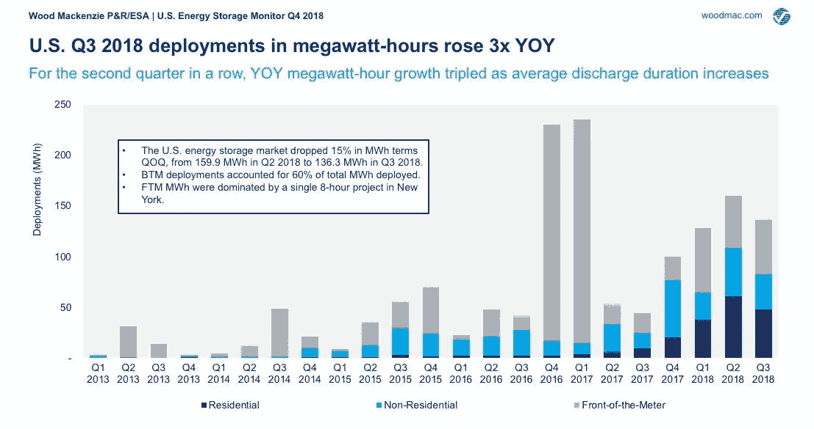

# 仓储+商业建筑:负荷预测

> 原文：<https://towardsdatascience.com/storage-commercial-buildings-part-1-load-forecasting-8d3c4d1e083d?source=collection_archive---------31----------------------->

Photo by [chuttersnap](https://unsplash.com/@chuttersnap?utm_source=medium&utm_medium=referral) on [Unsplash](https://unsplash.com?utm_source=medium&utm_medium=referral)

长期以来，储能一直被吹捧为“银弹”，它将通过一长串有前途的价值主张(例如，与间歇发电、能源套利、辅助服务相结合)来解决我们所有的能源挑战。

在过去几年中，我们看到前台和后台级别的存储部署都在快速增长。除了 2016-2017 年几个巨大的公用事业规模的电池部署，非住宅存储系统是增长的关键来源。

Source: Wood Mackenzie U.S. Energy Storage Monitor Q3 2019 ([link](https://www.greentechmedia.com/articles/read/tracking-the-shifting-makeup-of-the-us-energy-storage-market#gs.8gjy7f))

储能市场尚未爆发，技术和成本挑战仍阻碍着广泛部署。然而，我们非常接近拐点，这将为一个全新的技术类别打开大门，这将永远改变更广泛的能源领域的所有方面。从这个项目开始，我们寻求更好地理解这个巨大的技术浪潮(所以我们不要错过它！)🌊

# 项目目标

为了更好地了解商业存储领域的挑战和机遇，我们在商业建筑环境中模拟了一般电池存储单元的调度。

具体来说，我们试图回答以下问题:

1.  商业建筑负荷(千瓦)的关键决定因素是什么？
2.  商业存储的价值主张在哪些地区最强？
3.  是什么阻碍了现有商业规模存储公司的高速增长？
4.  在大型办公楼中调度电池时，需要考虑哪些关键因素和限制？

我们将首先探索商业建筑负荷，然后使用机器学习技术为我们感兴趣的地理位置生成预测(本文)。然后，我们将使用建筑负载预测作为输入来测试和改进我们的存储调度算法(即将推出⏳).

# 概述:商业负荷预测

仪表后储能单元最重要的变量之一是建筑的每小时能耗(单位为 kWh)。为了对大型商业建筑中的仪表后能量存储单元的最优调度进行适当建模，我们需要对建筑的负荷进行多年预测。

我们采用监督学习技术(特别是多项式回归)来预测这个商业建筑负荷。本文的其余部分将介绍这个过程的细节。

# 1.识别关键驱动因素💭

我们打算使用监督学习技术(特别是多项式回归)来预测这个商业建筑负荷。商业建筑负荷取决于各种内部和外部因素，包括:

*   小时
*   温度
*   尺寸(空间体积)
*   照明类型和消耗
*   HVAAC 类型和消耗量
*   雇员人数
*   工作时间
*   电动汽车的数量
*   房间数量
*   诸如此类…

不幸的是，这些数据很难在训练集中获得。出于此分析的目的，我们采用了一种简单的方法来预测单个建筑的商业负荷，方法是使用**外部空气温度(OAT)和时间**作为独立变量。

具体来说，我们将使用能源部的参考建筑 7(“办公室”)*长期能源消耗&室外空气温度*数据集([来源](https://openei.org/datasets/dataset/consumption-outdoor-air-temperature-11-commercial-buildings))，其中他们已经发布了每小时建模的建筑负荷数据，以及相应的时间戳和 OAT。

# 2.探索关系🔎

仅仅通过挖掘我们的独立变量(一天中的某个时间，温度)和相关变量(建筑负荷)之间的关系，我们就可以确定清晰的模式和见解。

## 时间序列(温度、负荷)

为了获得训练数据的鸟瞰图，我们绘制了温度和负载的每小时时间序列数据。将这两张图表放在一起看，你已经可以开始画出它们之间的关系了(极端温度=更高的建筑负荷)。

## 温度与负载

当我们观察温度和建筑负荷之间的关系时，事情变得更有趣了。**一般来说，建筑负荷似乎在极端天气(0–20℉和 80–100℉)期间达到峰值，很可能是由于制冷和供热增加&。这并不奇怪，因为暖通空调系统(供暖、通风和空调)占办公楼总能耗的 28%。**

我们确实注意到许多情况，尽管温度极高，但能源消耗保持相对平稳。这有点违反直觉，值得在未来研究。

## 小时与负载

小时与构建负载之间的关系也相当直观(尽管模式相对来说不那么“清晰”)。**在典型的工作时间(上午 9 点到下午 5 点)能耗水平较高，从下午 6 点开始能耗水平显著下降(也称为“快乐时光”)🍸)**。

一个意想不到的观察结果是，早上 5 点到 8 点之间的能耗水平明显高于夜间/黎明时段。一种假设是办公大楼可能在员工到达前几个小时就开始制冷/制热(有点怀疑，因为这意味着大楼需要 4 个小时制冷/制热😒).无论哪种方式，绝对值得一看后🕵️‍♀️

# 3.建模🤖

基于#2 中的探索性分析，很明显，因变量和自变量之间的关系是非线性的。因此，我们将使用带有正则化的多项式回归作为我们的模型。

为了确定超参数的最佳组合(即多项式次数、正则化 alpha)，我们使用了 *scikit-learn* 的 *GridSearchCV* 功能。

[关于评估指标的更多详细信息即将发布…🔃]

# 4.结果📊

为了预测我们感兴趣的位置(华盛顿州西雅图市)的建筑负荷，我们需要获得该城市的每小时温度数据。幸运的是，这在来自 *Kaggle* ( [来源](https://www.kaggle.com/selfishgene/historical-hourly-weather-data))的*历史整点天气数据 2012–2017*数据集中很容易获得。我们使用这些数据(经过一些预处理)作为我们在#3 中训练的回归模型的输入，来预测相应的每小时建筑负荷。

虽然得到的每小时负载形状与我们从 OpenEI 得到的训练数据集有些不同，但总体趋势与我们在#2 中观察到的一致。

工作时间的负载峰值:

极端天气下的负载峰值(主要在寒冷的冬天):

# 结论

由于商业建筑的能耗往往在工作时间达到峰值(尤其是在极端天气事件期间)，我们可以得出初步结论，气温变得非常热(例如亚利桑那州、奥斯汀、丹佛)或非常冷(例如纽约、芝加哥)的大都市更有可能成为有吸引力的市场。

考虑到预测值通常有意义并且与训练数据一致，我们开始使用该数据集作为输入来测试存储调度模型。同时，我们打算进一步完善和测试我们的建模，以生成更完善的每小时负载形状。

正如在开始时提到的，这绝对是一个非常简单的商业站点负荷预测模型，因为在现实中有许多其他变量决定着建筑物的能耗。虽然我们可以在 DoE 的参考建筑中保持相同的假设，用于本项目的实际目的，但扩展我们的回归模型以考虑额外的变量(在可能的范围内)可能是值得的。

上面分析的 GitHub repo 可以在[这里](https://github.com/jbbae/commercial_storage_analysis)找到。

**项目贡献者:** [Jae Beom Bae](https://medium.com/u/86ac5db10643?source=post_page-----8d3c4d1e083d--------------------------------) ， [Niel Patel](https://medium.com/u/2e3f7933869b?source=post_page-----8d3c4d1e083d--------------------------------)