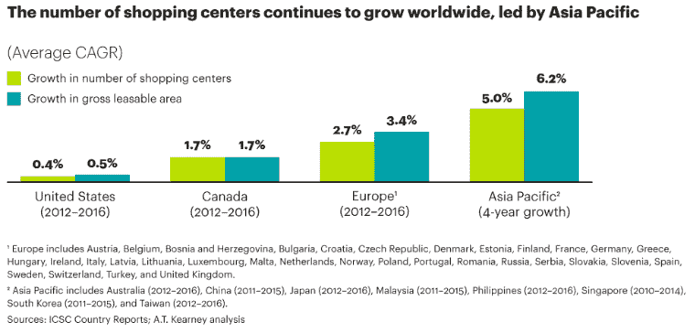

# 商店不会去任何地方:人工智能授权的客户真正想要什么

> 原文：<https://towardsdatascience.com/stores-arent-going-anywhere-what-ai-empowered-customers-really-want-6f06ca007e5f?source=collection_archive---------30----------------------->

Photo by [Mike Petrucci](https://unsplash.com/@mikepetrucci?utm_source=medium&utm_medium=referral) on [Unsplash](https://unsplash.com?utm_source=medium&utm_medium=referral)

网上购物更快、更方便，提供了更多的种类和选择，而且不会有烦人的推销人员来推销东西。实体店面对新一代客户，他们拥有人工智能和技术知识，有着多样化的需求和高期望。无论我们关注的是一家小型品牌商店还是整个购物中心，零售业要想生存下去，就必须提供全新的体验，以便为越来越多与渠道无关的一代客户提供服务。那些设法适应的商店将提供如此特别的东西，以至于任何电子商务平台都无法与之竞争。

你可以在网上买到任何东西。从杂货(亚马逊生鲜)到时尚(Stitchfix)，从汽车(Carvana)到眼镜(Warby Parker)。你想要的一切只需点击几下鼠标。很自然，我们不得不期待一场零售业的末日，因为商店正在关门，购物中心越来越空，似乎没有人再去把食品杂货带回家了。这是零售业末日的普遍说法。

*这里有些事实可能会让你大吃一惊:*

# 购物中心没有消亡。

在世界范围内，购物中心的数量正在增长而不是放缓。主要是在亚洲，对线下零售空间和商店概念有巨大的需求。[(在科尔尼)](https://www.atkearney.com/retail/article?/a/the-future-of-shopping-centers-article)

# 去商店仍然是零售的首选

目前，电子商务仅占美国零售总额的 16%，预计到 2030 年，这一数字将接近零售总额的三分之一。这意味着:在相当长的一段时间内，三分之二的零售销售不会发生在网上。[(在科尔尼)](https://www.atkearney.com/retail/article?/a/the-future-of-shopping-centers-article)

# 千禧一代非常喜欢在商店购物

只是不是任何商店。在美国的所有世代中，千禧一代对今天的零售空间持最积极的看法，57%的人说他们觉得商店更有吸引力。40%的 X 世代同意。此外，更令人惊讶的是，56%的千禧一代欢迎更多的个人店内互动，而老一辈人则觉得这很烦人。[(来源)](https://www.chainstoreage.com/technology/study-young-customers-show-surprising-in-store-shopping-preferences/)

*但是等等，还有这个:*

商场空无一人。2018 年是美国购物中心空置率最高的一年。各地的传统实体店都在关门。

年轻的购物者对流动性有很高的期望。越年轻的客户越不了解渠道，这意味着他们不在乎通过哪种方式从你这里购买。他们希望在线和线下、信使、电子邮件、网站聊天机器人和店内对话之间实现无缝转换。

电子商务正在扼杀当地企业及其商店。亚马逊杀了当地的书店，成千上万。现在，他们瞄准了你的杂货，并将淘汰较小的杂货连锁店。中国的同行也会如此。

Photo by [Markus Spiske](https://unsplash.com/@markusspiske?utm_source=medium&utm_medium=referral) on [Unsplash](https://unsplash.com?utm_source=medium&utm_medium=referral)

显然，我们不会很快看到实体店或购物中心的终结，但我们需要明白，我们正在目睹完全不同的购物期望的出现。这种转变要求企业思考，面对习惯于提高便利水平的人工智能客户，这意味着什么。

大约 20 年前，亚马逊的杰夫·贝索斯对实体店做了一个预测，在他看来，只有当实体店提供即时便利或某种形式的娱乐价值时，实体店才能生存。事实证明他是正确的。顾客关心的是位置、速度、产品的多样性以及在它们之间选择的认知便利性。因此，毫不奇怪，特别是杂货店已经把消除结账过程或至少使其更快作为目标。

# 未来的商店永远不会看到人们排队。

在旧金山，亚马逊最近开设了几家名为 [Amazon Go](https://www.amazon.com/b?ie=UTF8&node=16008589011) 的小型杂货店。在这些商店里，当你走进去的时候，用你的智能手机扫一个码。接下来，你抓起所有你想要和需要的东西，放进包里，然后走出来。没有更多的支付过程，因为你被数百个传感器和摄像头跟踪，当你走出去的时候，这些传感器和摄像头会自动为你的亚马逊账户充电。我亲自试过几次，可以确认是绝对无摩擦的体验。当然，亚马逊不是唯一一家试图取消支付处理的零售商。尤其是中国遥遥领先。在那里，你可以用你的脸、你的短信服务或你的阿里巴巴账户付款。

# 未来的商店永远不会缺货。

大胆的声明，我知道。但是，鉴于商店收集的数据质量不断提高，以及现在有无穷无尽的机会来观察、补充和预测产品需求，商店几乎不可能(或至少不太可能)用完某种产品。为了实现这一点，已经有几种技术问世。我们刚刚谈到的一个是天花板上堆放着摄像机和传感器，以便随时观察一切。沃尔玛正在他们所谓的[沃尔玛智能零售实验室](https://corporate.walmart.com/IRL/)进行测试。正如预期的那样，摄像头检测产品及其可用性，从而实时提高补货过程的效率，但真正有趣的是这一应用的结果。这一过程取代的不是销售助理，而是经理。他的任务完全由算法接管，但机器人补货仍然太复杂，甚至无法与地板上的客户交谈。

# 未来商店的首要目标不是卖东西。

虽然直到今天，商店仍在衡量他们是否、多久以及在不久的将来让顾客购买多少产品，但这一成功指标将不得不转向更复杂的衡量方法。零售空间的目的将不再是展示和销售，而是让顾客体验和谈论。如果你看看线上到线下的品牌和他们的展厅概念，你会发现，他们不仅不鼓励你在商店里买东西，他们实际上并不关心你是在线上还是线下购买。在许多情况下，在商店购买的过程与网上购买非常相似，因为销售代表使用相同的界面来获得想要的产品。通常，他们还会要求您提供电子邮件地址或电话号码，以便识别和跟踪您。

这让我们想到了未来十年零售业最重要的转变:

商店将充满技术，使识别、跟踪、监控、测试和观察顾客成为可能。这方面已经到位的例子有沃尔玛的智能零售实验室，或者前面提到的亚马逊 Go。此外，有趣的案例如 [b8ta](https://b8ta.com/) 或 [Target Open House](https://targetopenhouse.com/) 都旨在观察潜在客户与新产品的互动，并了解他们的问题和障碍。

沃尔玛还获得了一项心率监测器的专利，这种监测器被嵌入顾客推过商店的购物车中。这项技术能够区分紧张的顾客和兴奋的顾客，并告知商店服务员应该和谁交谈以及如何交谈。[(来源)](https://info.retailspacesevent.com/blog/10-crazy-technologies-about-to-transform-physical-retail)

沃尔格林和其他一些公司用屏幕取代了商店冰箱的玻璃门，屏幕上还有摄像头，可以跟踪顾客的虹膜运动，提供顾客的兴趣、偏好和年龄等信息。[(来源)](https://info.retailspacesevent.com/blog/10-crazy-technologies-about-to-transform-physical-retail)

所有这些都只有一个目的:为购物者提供最顺畅、最个性化和最真实的体验。我们谈了很多关于摩擦和效率，摆脱支付过程等等。现在让我们看看其他组件:

# 只适合我:个性化、完全定制、个性化的体验

电子商务从一开始就一直在分析客户在网上留下的数据踪迹。我们现在看到越来越多的尝试以类似的方式跟踪商店和零售空间中的客户数据。从无处不在的摄像头和传感器到心率监视器、虹膜跟踪和增强现实功能。我们看到有人试图通过客户的联系信息来识别他们，以建立关于他们长期购物习惯以及个人偏好的数据库，从而在他们走进商店时为他们提供定制体验。今天，当我们走过购物中心时，我们看到的商业广告和广告大多是普通的，是为了迎合大量的观众。在不久的将来，我们将会看到广告和横幅广告根据站在他们面前的人的个人喜好进行调整。

第一批数字价格标签正在实施，并允许定制产品信息。想象一下，在你当地的杂货店拿起一块鸡肉，它下面的屏幕开始向你显示鸡肉来自哪里、谁饲养它以及它如何生活的确切信息。对于你旁边拿起同样鸡肉的人来说，显示屏可能会显示最好的低碳水化合物鸡肉食谱。他们怎么知道你想看什么？第一，你购物篮或购物车里的其他产品比你想象的透露了更多关于你的细节。如果你所有的其他产品都是本地养殖的有机产品，你可能会关心你的鸡肉来自哪里。如果你的购物车里有蛋白质棒和一本健身杂志，你更有可能想了解健康食谱。第二，如果一家商店设法用面部识别软件识别你，它就有可能调出你购买过的所有购物车和购物篮。根据你的历史来个性化你的购物体验的机会是无穷无尽的。

因为预测是可能的，所以它将被部署。因为它将无处不在，客户将习惯于被预测。他们将习惯于别人问候他们的名字，他们将期望被记住，他们将要求所呈现给他们的东西具有高度的相关性。

# 帮助我成长:真实、教育品牌宗旨

你卖的只是开始。在大多数产品品牌中，有难以置信的有价值的未使用的知识。杂货店将成为健康顾问。购物中心将成为娱乐、教育、医疗和个人成长的中心。每个参与体验的个人都将提供一个高度策划的、知识增长的、个人的体验，这是网上无法提供的。

品牌需要问自己，他们服务的最终目的是什么。如果你制作太阳镜，你是想帮助人们看起来更时髦吗？如果是这样，你的品牌不仅仅是太阳镜业务，你也是咨询和发现业务，这就是人们来找你的原因。他们不想买眼镜，他们想看起来很帅。如果你从事空气净化器行业，人们来找你是因为他们担心自己呼吸的空气。那么你是在医疗保健、健身、生活方式或清洁行业。免费的瑜伽课从来没有伤害过任何生意。无论哪种方式，客户都希望向你学习，他们重视你的建议，信任你的专业知识。在美国，49%的千禧一代希望在零售场所看到研讨会和专家讲座。

# 让我分享一下:社交媒体就绪，值得 Instagram 的空间和设计

伟大的经历值得分享。像 Platform LA T1 这样的新购物中心概念为人们提供了视觉上准备好的空间，通过在不同的社交媒体渠道上分享他们的体验来策划他们的体验。如果购物中心没有 Instagram 帖子，可能是因为它没有提供可分享的体验。如果它不提供这种体验，那么它将无法生存。因此，可治愈性将成为购物中心或商店成功的一个非常重要的指标。虽然今天只有 12%的消费者认为在社交媒体上接触品牌对他们如何感受或思考该品牌有任何意义，但现实是，随着对品牌的影响力来源变得民主化，在线分享体验将变得更加重要。品牌从未完全掌控过自己的品牌形象，但今天和明天，消费者将会把品牌声誉掌握在自己手中。影响者将更加有机地成长，并要求品牌更加真实。

商店和购物中心哪儿也不会去，但它们会戏剧性地改变面貌。实体零售没有死亡，它正在重生。有了数据和人工智能支持的、高度个性化的、方便的、有教育意义的、值得分享的店内体验，实体零售空间将为客户已经在网上期待的东西增加难以置信的价值。

*阅读更多 _ _ _ _ _ _ _ _ _ _ _ _ _ _ _ _ _ _ _ _ _ _ _ _ _ _ _ _ _ _ _ _ _ _ _ _ _ _ _ _ _ _ _ _*

*   【https://www.atkearney.com/retail/article? /a/购物中心的未来-文章
*   [https://www . chain storage . com/technology/study-young-customers-show-shopping-in-store-shopping-preferences/](https://www.chainstoreage.com/technology/study-young-customers-show-surprising-in-store-shopping-preferences/)
*   [https://www . the verge . com/2019/4/25/18516004/亚马逊-仓库-履行-中心-生产力-解雇-终止](https://www.theverge.com/2019/4/25/18516004/amazon-warehouse-fulfillment-centers-productivity-firing-terminations)
*   [https://info . retailspacesevent . com/blog/10-crazy-technologies-about-transform-physical-retail](https://info.retailspacesevent.com/blog/10-crazy-technologies-about-to-transform-physical-retail)
*   [https://www . fast company . com/40437912/inside-the-l-a-mall-that-defying-the-retail-启示录](https://www.fastcompany.com/40437912/inside-the-l-a-mall-thats-defying-the-retail-apocalypse)