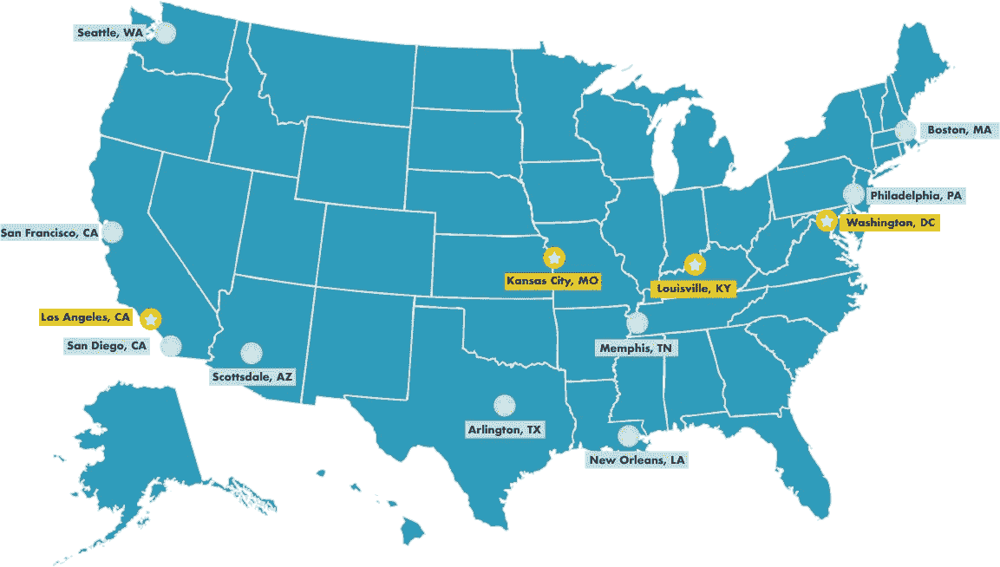

# 来自市政分析世界的故事

> 原文：<https://towardsdatascience.com/stories-from-the-world-of-municipal-analytics-d3dc97077682?source=collection_archive---------14----------------------->

## 我们的城市变得越来越智能

随着地方政府开始认真对待大数据，将其作为一种更好地了解公民、提高项目和政策的有效性以及节省资金的手段，分析领域在美国各城市继续获得发展势头。采用分析实践的城市比以往任何时候都多，这增加了对分析专业人员的需求，以监督这些新技术在当地的采用、部署和评估。在成功实现的项目中，许多都经历了多次失败和迭代，以实现与改善治理相关的目标。随着机器学习和人工智能等复杂技术的出现，人们需要理解更复杂的假设和偏见，这些假设和偏见可能会违背为舒适人群和弱势人群服务的目标。

可以在分析的帮助下解决的公民问题可能会通过内部资助的问题来源工作到达当权者的办公桌，但在参与式社区的情况下，需要优先考虑的问题通常会自己出现。为了与分析专业人员一起解决公民问题，似乎不仅必须存在对分析应用的明确需求，而且更重要的是，必须获得拥有决策权的利益相关方的认可，从人才和技术角度获得适当的资源，以及成熟、经过审查的数据。公共部门的创新努力往往会遇到官僚主义和低风险容忍度，这就是为什么较小规模的分析项目试点迭代在展示初始价值方面具有重要地位。尽管该领域存在固有的障碍，但我对市政分析和数据科学的潜力感到非常兴奋。事实上，我们在全国已经看到了许多成功的例子。为了激发您对这一不断发展的领域的兴趣，并希望您能够参与并了解您所在的市政当局在大数据应用于政策方面的进展，我将总结一些我最喜欢的成功故事，让您了解哪些事情已经成为可能，这是由成功实施公民分析的领先国家资源激发的。

## **烟雾探测器+纽奥良**

Source: NOLA Office of Performance and Accountability

新奥尔良消防局认识到，当一个家庭安装了烟雾报警器时，因火灾死亡的风险会减少一半，因此决定向有需要的居民免费发放救生烟雾报警器。该市通过其绩效和责任办公室建立了数据能力，该办公室建立了一个数据团队，并决定利用预测分析模型来确定房屋的属性，这将有助于该小组了解每个物业对新烟雾报警器的需求及其整体火灾死亡风险属性。该办公室尚未收集到此类数据，但当一名研究人员在美国人口普查局的美国住房调查中发现一个关于烟雾报警器的问题，并将其与该局的美国社区调查数据相结合时，该项目得以启动。该小组能够确定有助于预测新警报和高度易受影响房屋需求的关键特征。他们能够利用这一点来达成一个逐块烟雾探测器推广和分配计划。两年后，8000 个新的、针对风险的烟雾报警器问世，该部门得以庆祝这一出色的工作，肯定了分析的力量，并激励美国红十字会和 DataKind 在全国复制他们的项目。

*参见* [*预测火灾风险:从新奥尔良到全国范围的工具*](https://datasmart.ash.harvard.edu/news/article/predicting-fire-risk-from-new-orleans-to-a-nationwide-tool-846) *(哈佛大学灰中心)*

## **早期警方介入+纳什维尔/夏洛特**

芝加哥大学数据科学和公共政策中心开发的早期警察干预系统使警察部门能够识别那些可能发生不良事件的人，以便为他们提供培训、咨询和类似资源。该小组跟踪“不利事件”，这些事件可能以公民或同事投诉、使用武力、事故或伤害的形式出现。该系统用于在部门数据中查找不良事件的预测因素。这包括跟踪警官行为的各种实例，这些实例可能揭示警官的潜在倾向，可能对不良事件的发生有影响，也可能没有影响。系统还学习管理者如何对系统的发现进行优先化或去优先化。传统系统揭示了一个可行性问题，因为它们可能通过标记整个警察队伍中几乎 70%的人来捕获 80%的有不良事件的警察。鉴于许多警察部门的资源已经非常有限，建议一个部门持续地重新培训 70%的警力并不是非常有用。在 UChicago 设计的新系统仍然标记了 80%的警力，但能够锁定 30%最需要干预的警力，并根据历史表现给每个警官一个综合风险评分。像这样的系统显然不是为了取代警察主管做出判断的责任，而是可以帮助通知它，实施的长期影响仍在测量中。

*参见“* [*警察项目更新:扩大和实施早期干预系统*](https://dssg.uchicago.edu/2017/01/12/police-project-update-expanding-and-implementing-the-early-intervention-system/)*”(UChicago 的数据科学和公共政策中心)*

## **房东歧视+纽约市**

纽约市禁止基于种族、性别和收入来源歧视潜在租户……理论上。尽管有《纽约市行政法》第 8 条，基于收入的歧视仍然是报道最多的住房相关问题之一。纽约市长数据分析办公室和人权委员会决定建立一个模型，通过确定房主最有可能非法拒绝潜在租户购买住房券的地区，更有效地部署调查资源。研究人员假设，针对犯有此类行为的大型物业管理公司将产生涓滴效应，鼓励较小的潜在违法者遵守法律。通过确定较大的违规者，该模型更有效地揭露了非法住房做法，使人权委员会能够更好地确定其工作流程的优先次序，并提高纽约市遏制住房歧视的能力。

*见项目“* [*”。纽约市人权委员会与 MODA 合作，协助确定潜在收入歧视的地点*](https://moda-nyc.github.io/Project-Library/projects/source-of-income-discrimination/)*”(MODA 纽约市 GitHub)*

## **城市破坏+新奥尔良**

新奥尔良在 2005 年遭受卡特里娜飓风破坏的许多地区在飓风过后的许多年里都没有受到这座城市的影响，当市长米奇·兰德鲁(Mitch Landrieu)在 2010 年上任时，决定对城市周围的财产采取改造或拆除行动以弥补损失是一个关键的讨论话题。该市的数据中心 OPA 的任务是开发一种使用分析的性能管理工具来帮助解决这一问题。他们开发了 BlightSTAT 和 Blight Scorecard，以应对积压的 1500 处房产，这些房产正等待住房法规执行机构做出决定，要么出售房屋，要么继续拆迁。开发的系统允许中级主管外出并对物业进行评分，提高了评估过程的速度和一致性。在这种情况下，像许多情况一样，人类的判断是公民分析过程中不可替代的因素。拆除建筑物的决定是由先进的数据系统告知的，而不是被其取代。这一过程中的书面交流基本上被法规执行部门的技术消除了。反过来，等待裁决的积压财产也基本上消除了。

*参见* [*代码强制消减工具*](https://www.nola.gov/performance-and-accountability/reports/nolalytics-reports/nolalytics-blight-abatement-tool-brief/) *(新奥尔良市)*

*参见“* [*利用时空数据对有枯萎风险的物业进行早期检测*](https://dssg.uchicago.edu/wp-content/uploads/2016/10/34_blancas.pdf)*”(UChicago 的《社会公益数据科学》)*

## **食品检查+芝加哥**

Chicago Restaurants Failing to Pass Inspections: 2015–2016 ([https://chicago.github.io/food-inspections-evaluation/](https://chicago.github.io/food-inspections-evaluation/))

尽管对食品制备、储存和服务有着严格的规定，但在一个城市中监控食品安全确实具有挑战性，但分析模型可以帮助城市官员有效地分配专业知识和财政资源来完成这项任务。芝加哥有 7300 多家餐馆、数千家杂货店和其他食品摊贩，它们共同负责这座城市的整体健康。也就是说，只有大约 35 名检查员负责 15，000 多家食品企业。该市决定在分析的同时提高检查绩效，而不是简单地雇佣更多的检查员。芝加哥创新与技术部与公共卫生部合作，预测一家餐馆未通过检查的风险。最终的模型使该市能够比人工过程提前 7 天发现违规行为，并且在研究过程中，该团队创建了一个透明的、社区可访问的食品检查跟踪器，并根据实时检查结果进行更新。

*见* [*用食品检验预测更快出结果*](https://datasmart.ash.harvard.edu/news/article/delivering-faster-results-with-food-inspection-forecasting-631) *(哈佛大学灰中心)*

*参见* [*食品检验*](https://data.cityofchicago.org/Health-Human-Services/Food-Inspections/4ijn-s7e5/data) *(芝加哥数据门户)*

## **交通死亡人数+纽约市**

随着城市人口的增加，新技术已经为居民如何穿越城市的革命让路，随着这种变化，城市必须调整其系统和法规，以确保公民的安全。丰富的交通数据和新的分析模型为城市提供了一种低成本的途径来评估和改善交通系统。作为通过数据分析解决交通问题和低效率的全球愿景零运动的一部分，纽约市在 2015 年与 DataKind 合作，评估所有新交通改善项目的风险和某些结果的可能性。旨在改善交通模式和减少延误的项目可能与提高安全性相关，也可能与安全性相权衡。在克服了有限有用数据的速度障碍后，该团队能够制作一个模型，绘制暴露地图，以更准确地判断特定街道设计的有效性。该模型使纽约市交通局能够预测特定地区特定时间的活跃汽车数量，以帮助优化交通模式和提高道路安全。

*参见“* [*”更好的数据能否让零交通死亡成为现实？*](https://datasmart.ash.harvard.edu/news/article/can-better-data-make-zero-traffic-deaths-a-reality-1138) *(哈佛的灰烬中心)*

## **其他被彭博慈善机构“有效城市”认可的前瞻性城市**

A Bloomberg Philanthropies Map of Certified Cities

波士顿市市长马蒂·沃什在他的办公室里安装了一个类似芬威公园记分牌的 T2 大屏幕，汇集了一系列关键的城市绩效指标，如接听 311 电话的平均时间、救护车响应时间、犯罪统计数据以及与基准和目标进行比较的整体成功得分。堪萨斯市**市长 Sly James**实施了一项季度[市民满意度调查](http://kcmo.gov/data/citizen-satisfaction-survey-results/)来指导政策倡议，第一批由市民关注的问题积极推动的资助项目已经以债券的形式到位，用于资助毁坏建筑的拆除以及道路、桥梁和人行道的翻新。洛杉矶市长埃里克·加希提发布了清洁街道指数，该指数列出了需要清洁的街区，在发布该指数一年后，不清洁街道减少了 82%。路易斯维尔市市长格雷格·菲舍尔(Greg Fischer)推出了一个公民分析创新中心和合作空间，即 Louielab，以鼓励合作，并优先开放所有公共记录作为城市默认设置。圣地亚哥市长 Kevin Faulconer 帮助实现了一个名为 [Get It Done](https://www.sandiego.gov/get-it-done) 的应用程序，以方便市民报告城市公害，并向市民报告公害修复后的照片。市长穆里尔·布瑟发起了一个名为[DC 实验室](http://thelab.dc.gov/)的内部数据科学研究团队，致力于将科学思维应用到城市的日常运作中，他们因发布一项具有里程碑意义的研究而闻名，该研究是关于佩戴在身上的摄像头在使用警力方面缺乏[效力](http://bwc.thelab.dc.gov/)。

## **未来:智能城市需要智能政府**

Click the interactive visualization above for sample solutions & results

只有通过不同类型的利益相关者之间的合作，所有人的最光明的未来才会到来，而参与的不同部门行为者既可以相互传授宝贵的经验，也可以相互学习新的知识。

[智慧城市技术](https://www.mckinsey.com/industries/capital-projects-and-infrastructure/our-insights/smart-cities-digital-solutions-for-a-more-livable-future)，无论源自哪个行业，都必须与健全的政策举措相结合。例如，基础设施投资，倾向于长期的、昂贵的项目生命周期，可以变得更加灵活，以应对不断变化的环境。将现有车道重新分配给行人和骑自行车的人，或者支持建立私人运营的通勤巴士服务，可能会更好地服务于一个拥挤的城市，而不是精心策划一个为期 10 年的地铁线路基础设施开发项目。否则，基于这种长期愿景的项目很容易出现可能会在项目中期发生变化的情况或问题，并且解决方案本身的大部分价值可能会随着时间的推移而丧失。

市政府不应该在私人部门行为者的筒仓中运作。公共部门有充分的理由希望拥有许多智能技术应用和程序，但绝对有理由允许私营部门投资和政府项目财务回报的空间。应该由城市来确定哪些领域退一步是有意义的，并为企业、大学、基金会和非营利组织发挥作用腾出空间。许多城市遵循的“总体规划”方法并没有像那些将自己定位为潜在公私合作伙伴关系的资源中心和生态系统中心的城市所部署的项目那样取得成本效益上的成功。

利用智能的数据驱动系统提高公民参与度也有很大的潜力。公民和政府官员之间真正的双向对话可以通过互动应用和社交媒体来维持。决策者可以向公众关注的实时信息流敞开心扉，并将这些见解作为新政策的基础。因此，新技术和分析工作需要透明，以促进社区参与和信任。更大比例的人口应该上网，以增加获取相关信息的机会，这样城市就可以了解人口统计中的小众和主流意见。更好的信息系统和沟通渠道也有可能激发更积极的社区参与，如志愿服务、指导和其他积极的社区活动。

总之，我认为要真正实现数据驱动的智能城市，需要关注两个领域。公共部门必须找到一种方式，通过独特、创造性的激励计划，与私营部门争夺技术人才。城市还必须优先考虑网络安全，以保护新系统免受精通技术的坏人带来的风险，特别是在供水和电网等关键系统的情况下。似乎从市政技术事业的第一天起，这两个领域都需要加以考虑，以便经受住时间的考验。尽管存在风险，但我对市政部门越来越多地采用数据驱动系统和新技术持乐观态度，并迫不及待地继续阅读不同政府机构如何决定抓住眼前的机遇。

感谢阅读，

亚历克斯

*请随时提出您的想法和问题，或者在* [*LinkedIn*](https://www.linkedin.com/in/alexandershropshire/) *、*[*GitHub*](https://github.com/as6140)*和*[*Medium*](https://medium.com/@as6140)*上跟随我的数据科学之旅！*