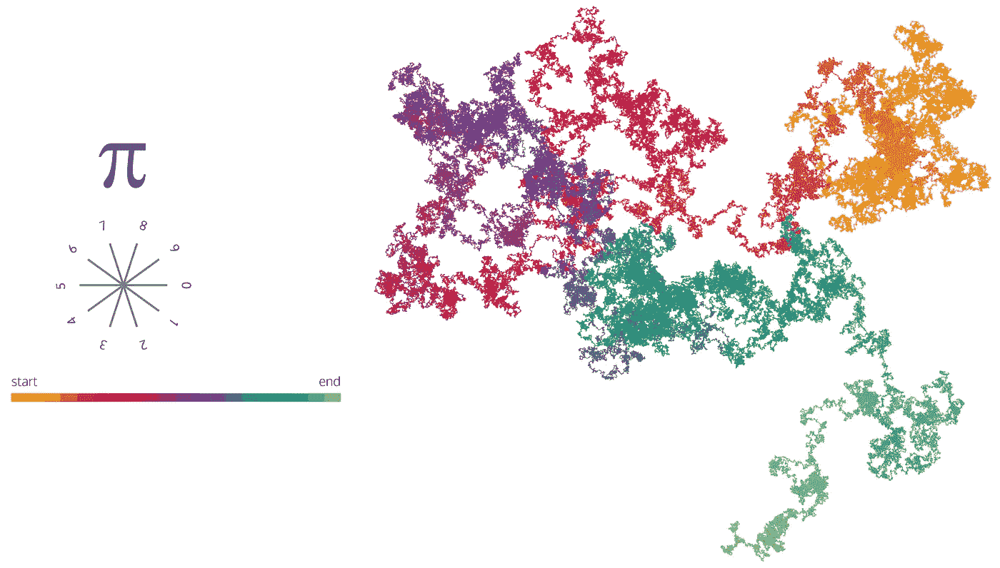

# 将电影存储到 pi (π)中

> 原文：<https://towardsdatascience.com/storing-a-movie-into-%CF%80-960ffcab4eed?source=collection_archive---------29----------------------->

## 用π做数据存档值得吗？

visual representation of ***φ****,* ***e*** *and* **π** as treemaps

多年来，关于 T2πT3，人们提出了许多比科学起源更浪漫的说法。所有这些都与无穷大有关，或者说，它的小数部分包含了所有其他从未设想过的数字序列。

**这不是真的**或者至少没人知道如何证明。即π的[正规性](https://en.wikipedia.org/wiki/Normal_number)的论证还不存在。

但是很多数学家相信π是一个正常数的事实，甚至不知道如何证明；那是因为目前所有的研究都指向这个方向。

因此，假设π是一个正常的数字，我们可以陈述如下:

*   小数部分的数字是均匀分布的
*   任何长度的数列都包含在π中。

这意味着我们可以在里面的某个地方找到我们的电话号码，或者，给定一个合适的编码，我们的名字或者这篇文章。

那么我们能在里面找到一部电影吗？是的，将电影和π编码成二进制字符串，我们最终可以在π中找到代表电影的比特序列。

好吧……但是如果π真的包含了世界上所有的电影、文章和任何产生的信息，我们能找到它们并记下它们在π中的位置吗？

再说一次，是的，我们可以！那么为什么我们现在不这样做呢？

# 压缩

在π内寻找一个比特序列，以便只存储它第一次出现的位置，这是一种压缩，因为我们希望通过只存储一个数字内的位置而不是整个序列来节省空间。

但是为了有效，序列(即另一个数)第一次出现的位置(即一个数)必须小于序列本身。否则，我们使用的空间会比需要的多。

# 让我们算一下

我们想知道的是给定序列 *{X₀，* ₂， *…}* 在π中的平均位置是多少，以及该位置是否小于序列的值(或者它平均占用的空间是否更小)。

这个信息可以用下面的定理来检索:

> 如果{X₀、X₁、X₂、…} *是一个独立同分布在集合* **m** *元素的* **S** *上的随机变量序列，则连续子序列****【𝜏】****∈****𝑆*ⁿ**的期望首达时间由下式递归给出

> 其中*是 ***𝜏*** 最长的固有 suffix，也是*的前缀。**

**例如，我们可以搜索序列“456456”，即 **𝜏** 。**

****

**正如我们所见，该序列可以用 6 位数字来描述，但它在π中的位置需要 7 位数字(1001000)。序列“456456”可以在位置 1023671≈*e*[*t*]≈**2⋅456456**中找到。因此，存储“456456”的位置需要比序列本身更多的空间。**

**还要考虑到所有的 **𝜏** 认为:**

****

**因此，子序列长度 *n* 呈指数增长。**

# **结论**

**虽然在π内部“存储”一部电影是可能的，但假设是一个普通的数，在π内部寻找一个序列并存储其位置，无论从空间还是时间上都不方便。以统计方式保存位置比直接存储值需要更多的空间，并且这个空间量呈指数增长。**

**这显然不仅限于π，而是任何正常的数字。**

****