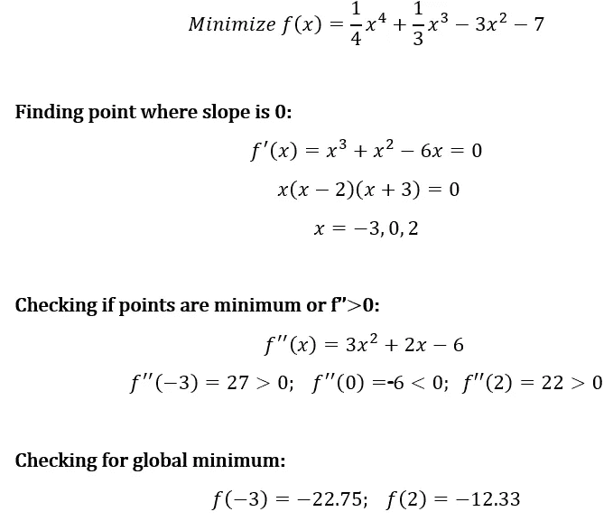

# 全局优化策略

> 原文：<https://towardsdatascience.com/strategies-for-global-optimization-79fca001c8bb?source=collection_archive---------6----------------------->


一旦我们离开高中微积分，局部和全局优化通常是已知的，但有些被忽略了。快速回顾一下，看看这篇博客的封面图片。对于一个给定的函数，在空间上有多个点有倾角。每次下降都是最小的。但是，你可以看到只有一个点是最深的，称为全局最小值。所有其他点都是局部最小值。第一部分，我将回顾计算一个已知函数的全局值。然而，一旦我们离开高中数学的这个已知函数的领域，大多数优化问题只处理局部优化。即使这样，我也要说明原因。快速注意，还有很多其他的策略我没有在这篇博客中提到。然而，我希望它能让你有足够的兴趣去探索更多的选择。

# 已知函数

我们来复习一些基础的高中微积分。首先，看一下这个简单的一元函数:


f(x) = 1/4x⁴ + 1/3x³ — 3x² — 7

从图表中，我们可以看到全球最小值在-3 左右。然而，让我们尝试使用微积分，因为我们知道这个情节的功能。



我们看到 **f(-3)=-22.75** ，f(x)的最小可能值。我们甚至可以超越 2D，进入多元微积分领域来解决这个问题。

# 未知函数

在处理数据科学的大部分时间里，我们无法访问函数来执行任何演算。通常，f(x)是一个系统，我们可以输入变量 x，并获得一些输出 y。一个可能的解决方案是执行随机梯度下降，我们迭代地沿着斜坡下降，直到我们达到最小值。


Stochastic Gradient Descent

现在让我们用 python 来实现这个问题，假设 f 是一个黑盒函数。

```
#Unknown Function
f = lambda x:(1/4*x**4)+(1/3*x**3)-(3*x**2)-7def next_step(x,f,step_size):
  y=f(x)
  #Left Point
  x_left=x-step_size
  y_left=f(x_left)
  diff_left=y_left-y
  #Right Point
  x_right=x+step_size
  y_right=f(x_right)
  diff_right=y_right-y
  #Comparison
  if diff_right<diff_left:
    return x_right, y_right, diff_right
  else:
    return x_left, y_left, diff_leftdef gradient_descent(f,start,step_size=0.01,tol=0.1, debug=False):
  x=start
  diff=9999999
  while abs(diff)>tol:
    x, y, diff=next_step(x,f,step_size)
    if debug:
      print("Current Point: (%.2f,%.2f), Change: %.2f"%(x,y,diff))
  print("Minimum Point: (%.2f,%.2f)"%(x,y))
```

现在我们有了函数，让我们试着从 x=4 开始搜索。

```
gradient_descent(f, start=4)#Minimum Point: (2.65,-9.54)
```

这给了我们 2.65 的最低分。现在，让我们对另一个起点 x=-4 做同样的尝试。

```
gradient_descent(f, start=-4)#Minimum Point: (-3.51,-20.43)
```

使用 x=-5，我们得到全局最小值-3.51。这是寻找全局和局部最小值变得棘手的时候。我们的最终结果取决于起点。


Stochastic Gradient Descent gives different minima based on starting point

由于它是一个未知函数，我们不知道:

*   理想的起点
*   理想的步长
*   理想域(我们不能穿越无限大的 x 空间)

一个可能的解决方案是使用模拟退火，它给我们一个达到全局最小值的合理概率。

# 模拟退火

这个名字和灵感来自冶金中的[退火](https://en.wikipedia.org/wiki/Annealing_(metallurgy))，一种涉及加热和控制冷却材料以增加其晶体尺寸并减少其缺陷的技术。两者都是依赖于热力学自由能的物质属性。加热和冷却材料会影响温度和热力学自由能。退火的模拟可用于寻找具有大量变量的函数的全局最小值的近似。

在模拟退火算法中实现的这种缓慢冷却的概念被解释为随着解空间的探索，接受更差解的概率缓慢降低。接受更差的解是元启发式算法的一个基本属性，因为它允许对全局最优解进行更广泛的搜索。

一般来说，模拟退火算法工作如下:

*   设 *x* = *x* 0
*   对于 *k* = 0 到 *k* max(不含):
    - *T* 每步递减
    -随机选取一个邻居， *x_* new ←邻居(*x*)
    -If*P*(*E*(*x【T22))， *E* ( 【T25*
*   输出:最终状态 x

以下是我们特定函数的 Python 实现:

```
import numpy as np#Unknown Function
f = lambda x:(1/4*x**4)+(1/3*x**3)-(3*x**2)-7def acceptance_probability(E, E_new, T):
    return np.exp(-(E-E_new)/T)def random_neighbour(x):
    return x += np.random.uniform(-1,1)def simulated_annealing(f, steps):
    x = np.random.random()
    E = f(x)
    print("x=%.2f, fmin=%.2f"%(x, E))
    for k in range(steps):
        T = T*0.9
        x = random_neighbour(x)
        E_new = f(x)
        P = acceptance_probability(E, E_new, T)
        if P > np.random.random():
            E = E_new
        print("x=%.4f, fmin=%.4f, Prob.=%.4f"%(x,E,P))
    return Esimulated_annealing(f,20)
```

运行该等式，我们得到以下输出:

```
x=0.62, fmin=-8.04
x=-0.3446, fmin=-7.3664, Prob.=0.4753
x=-0.8717, fmin=-9.3559, Prob.=11.6601
x=-0.8329, fmin=-9.1534, Prob.=0.7575
x=-1.6213, fmin=-14.5791, Prob.=3903.7178
x=-2.3907, fmin=-20.5342, Prob.=23982.6510
x=-1.8220, fmin=-20.5342, Prob.=0.0003
x=-1.1582, fmin=-20.5342, Prob.=0.0000
x=-0.2298, fmin=-20.5342, Prob.=0.0000
x=-0.8731, fmin=-20.5342, Prob.=0.0000
x=-1.8032, fmin=-20.5342, Prob.=0.0000
x=-2.1873, fmin=-20.5342, Prob.=0.0110
x=-1.8673, fmin=-20.5342, Prob.=0.0000
x=-2.7618, fmin=-22.3598, Prob.=1315.6210
x=-2.3266, fmin=-22.3598, Prob.=0.0001
x=-2.5017, fmin=-22.3598, Prob.=0.0036
x=-2.6164, fmin=-22.3598, Prob.=0.0466
x=-1.7016, fmin=-22.3598, Prob.=0.0000
x=-1.7248, fmin=-22.3598, Prob.=0.0000
x=-1.6569, fmin=-22.3598, Prob.=0.0000
x=-1.5051, fmin=-22.3598, Prob.=0.0000
```

如上所示，该值收敛到-22.75。虽然这种方法不能保证全局最优，但是如果我们不限制我们的领域，它是相当接近的。还要注意，尽管初始值非常接近局部最小值，但它仍然设法找到了全局最小值。

# 动态规划

这部分更多的是时间复杂性而不是准确性。动态编程主要是对普通[递归](https://www.geeksforgeeks.org/recursion/)的优化。每当我们看到递归解决方案重复调用相同的输入时，我们可以使用动态编程来优化它。其思想是简单地存储子问题的结果，这样我们就不必在以后需要时重新计算它们。这种简单的优化将时间复杂度从指数级降低到多项式级。例如，如果我们为[斐波纳契数](https://www.geeksforgeeks.org/program-for-nth-fibonacci-number/)编写简单的递归解决方案，我们得到指数时间复杂度，如果我们通过存储子问题的解决方案来优化它，时间复杂度降低到线性。

让我们以斐波那契数列为例:

```
def f(n):
    if n <= 1:
        return n
    else:
        return f(n-1)+f(n-2)
```

这个问题的复杂性在于 O(2^n).如果你问我，我会觉得非常复杂！然而，让我们更好地分析这个问题。


Fibonacci at n=6

如果你看一个 n=6 的递归树，有很多重复。只需计算 f(3)的值的个数。在动态编程中，我们将把值存储在内存中，如果再次调用，就不会重新计算。下面是斐波那契的动态编程版本:

```
store = {}
store[0] = 0
store[1] = 1def f(n):
    store[n] = f(n-1)+f(n-2)
    return store[n]
```

使用新方法，每一步的复杂度为 O(1)。这允许我们探索 n 的整个域，以找到具有最小时间复杂度的最优解。