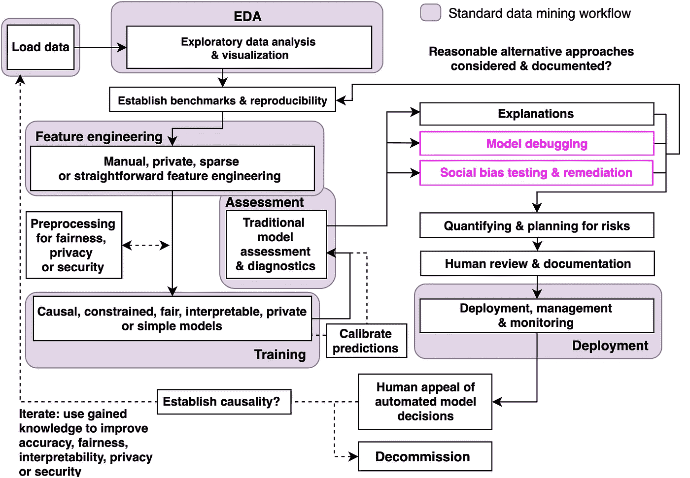
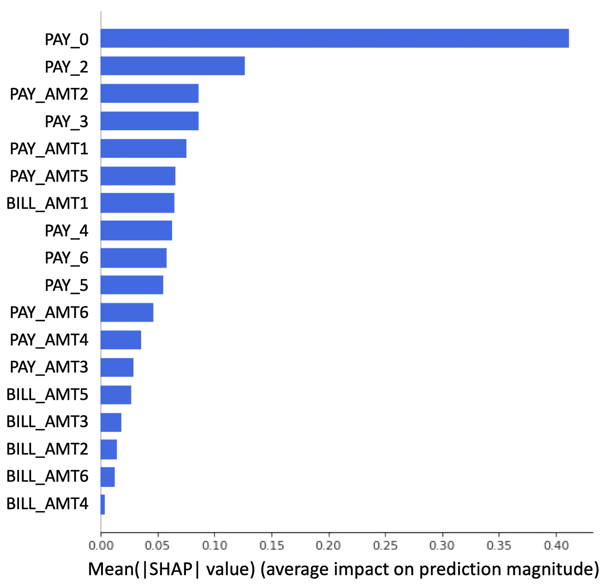

# 模型调试的现实策略

> 原文：<https://towardsdatascience.com/strategies-for-model-debugging-aa822f1097ce?source=collection_archive---------8----------------------->

## 测试和修复机器学习模型的系统方法

**内容:**

1.  **简介** 1.1 关于信任和理解的快速说明
    1.2 例题和数据集
2.  **检测策略** 2.1 敏感度分析
    2.2 残差分析
    2.3 基准模型
    2.4 针对 ML 攻击的安全审计
3.  **补救策略** 3.1 数据扩充
    3.2 噪声注入和强正则化
    3.3 模型编辑
    3.4 模型断言
    3.5 不需要的社会学偏见补救
    3.6 模型管理和监控
    3.7 异常检测
4.  **进一步阅读和结论**
5.  **参考文献**

—

# 1.介绍

所以，你已经训练了一个机器学习(ML)模型。你做的一切都是对的:交叉验证、提前停止、网格搜索、单调性约束和正则化。它在过时的测试数据中是准确和稳定的，并且比它所取代的线性模型要好。您甚至为您的数据工程和信息技术(IT)伙伴将您的模型包装在 Docker 容器中，以及它的所有依赖项。部署时间到了？没那么快。目前 ML 模型训练和评估的最佳实践并没有告诉我们如何发现和修复所有可能在现实世界 ML 系统中发生的讨厌的事情。如果这些系统能像常规应用程序一样被测试和调试就好了…输入:*模型调试*。模型调试是一门新兴学科，致力于发现和修复 ML 系统中的问题。模型调试试图像测试代码一样测试 ML 模型(因为它们通常是代码)，并探测复杂的 ML 响应函数和决策边界，以系统地检测和纠正 ML 系统中的准确性、公平性和安全性问题。

## 1.1 关于信任*和*理解的快速说明

在 ML 中，信任和理解是相似但不相同的。解开这种差异有助于我思考模型调试以及它与 ML 工作流的其他部分的关系。如图 1 所示，现在有很多工具可以用来促进人们对 ML 的信任和理解。一些技术，如模型调试和社会偏见测试和补救，帮助我们使 ML 更加准确、公平和安全，而无需告诉我们模型是如何工作的。这些帮助我们信任一个模型，而不是帮助我们理解它。其他技术，如可解释的 ML 模型和事后解释，通过揭示模型机制或总结模型决策来直接增加我们的理解。当我们喜欢模型或解释时，这些技术只会增加信任。

Figure 1: Many tools exist today to increase trust and understanding of ML systems. Some promote trust directly, while others promote understanding directly. Figure courtesy of Patrick Hall and H2O.ai.

这篇文章将集中在调试 ML 和促进 ML 信任的许多方面。然而，考虑负责任的 ML 工作流程的这两个额外方面是至关重要的:

*   促进对 ML 的理解
*   测试和强化支持 ML 模型的 IT 系统

即使您重视信任，特别是准确性，而不是公平性、可解释性或安全性，也需要使 ML 系统可理解，以实现逻辑上诉或操作员推翻错误的 ML 决策。很难反驳黑箱。[1]你不会喜欢你的孩子被一个精确但不可思议的 ML 系统拒之门外。你也不会喜欢被同样的黑箱系统拒绝医疗保健。你希望有机会对影响你生活的错误的 ML 决策提出上诉，这就是为什么商业或生活关键的 ML 系统总是可以理解的。图 2 提出了一个工作流程，包括在 ML 系统中增加信任和理解的步骤。当与图 2 中提出的其他技术一起使用时，模型调试可能工作得最好。

你们中的许多人可能比我更了解向消费者展示 ML 模型的测试和强化系统。那种工作还是有必要的，我就不多说了。仅仅因为一个系统包含一个 ML 模型并不能免除它的测试。此外，谷歌(可能还有其他公司)已经在这个问题上提出了一些可行的想法和框架。[2]

Figure 2: A ML workflow that can enhance trust and understanding. Figure courtesy of Patrick Hall and H2O.ai.

现在，让我们进入如何调试 ML 模型的内部。首先，我们将讨论本帖中使用的示例问题和数据集，然后讨论如何检测 bug，最后讨论如何消除 bug。

## 1.2 例题和数据集

下面的一些例子基于来自加州大学欧文分校(UCI) ML 知识库的著名的台湾信用卡数据集。[3]在这个数据集中，我们试图预测某人是否会在下一次信用卡付款时付款，DEFAULT_NEXT_MONTH = 0，或 DEFAULT，DEFAULT_NEXT_MONTH = 1。关于支付的变量用于产生违约概率，或 p_DEFAULT_NEXT_MONTH。我将使用我最喜欢的模型之一，一个可解释的单调约束梯度推进机(M-GBM)来进行这些预测。在 M-GBM 中，当某个输入变量增加时，p_DEFAULT_NEXT_MONTH 必须只增加，或者只减少。这使得解释和调试模型变得非常非常容易，并且不会真正影响该数据集模型的整体准确性。M-GBM 接受支付变量的训练，包括 PAY _ 0-PAY _ 6，或客户最近至前六个月的还款状态(较高的值是延迟付款)，PAY _ am t1-PAY _ AMT 6，或客户最近至前六个月的付款金额，以及 BILL _ am t1-BILL _ AMT 6，或客户最近至前六个月的账单金额。所有货币价值均以台币(新台币)为单位。

一些示例结果还包含变量 LIMIT_BAL 和 r_DEFAULT_NEXT_MONTH。LIMIT_BAL 是客户的信用限额。r_DEFAULT_NEXT_MONTH 是一个 logloss 残差值，或者是 M-GBM 预测 p_DEFAULT_NEXT_MONTH 与已知正确答案 DEFAULT_NEXT_MONTH 之间差距的数值度量。我还将使用数据集中的人口统计变量，如性别，来测试不想要的社会学偏见。在很大程度上，这篇文章将示例信用贷款问题视为一般的预测建模练习，而不考虑适用的法规。(当然，违规处罚可能会使模型调试更具商业吸引力。)

# 2.检测策略

我们如何发现 ML 模型中的数学 bug？我至少能想到四种主要方式:敏感性分析、残差分析、基准模型、ML 安全审计。你大概也能想到别人。

## 2.1 敏感性(“假设”)分析

敏感性分析，有时称为“假设”分析，是一个简单而强大的想法。只需模拟代表有趣场景的数据，然后查看您的模型在这些场景中做出何种预测。因为几乎不可能知道一个非线性 ML 模型将如何对它在训练期间没有看到的数据作出反应，所以对我们所有重要的 ML 模型进行敏感性分析是非常重要的。[4]你可能对测试什么样的场景有一些想法。如果是这样，那太好了，就这么做吧。也许你也想玩你的模型？也很棒。对于这些情况，一定要检查一下[假设工具](https://pair-code.github.io/what-if-tool/index.html)，它为某些类型的 ML 模型提供了交互式沙盒体验。

这也有助于采用更结构化的方法进行敏感性分析。本小节将介绍结构化敏感性分析的三种策略:

*   部分相关、个体条件期望(ICE)和累积局部效应图(ALE)
*   对抗性示例搜索
*   随机攻击

在我们开始之前，最好知道哪些变量对你的模型最重要。我总是首先将我的测试工作集中在那些变量上。图 3 是使用 [XGBoost](https://github.com/dmlc/xgboost) 通过 Shapley 值计算的精确一致的变量重要性图。[5] (Shapley 变量重要性测量在 [H2O](https://github.com/h2oai/h2o-3) 和 [LightGBM](https://github.com/microsoft/LightGBM) 中也是本地可用的。)图 3 向我们展示了 PAY_0 非常重要，而且可能太重要了，我们将在后面看到。

Figure 3: An accurate and consistent variable importance chart for the M-GBM model and the credit card dataset. Figure courtesy of Patrick Hall and H2O.ai.

## 2.1.1 部分依赖、ICE 和 ALE

部分相关将感兴趣的数据集中的感兴趣的列(例如 PAY_0)的所有值(例如验证数据集中的值)设置为感兴趣的值(例如 missing 或 NaN)或任何其他合理的值。这个新数据集通过训练好的模型运行，为每一行创建一个预测。取所有这些预测的平均值就是该变量、该数据集、该值和该模型的估计部分相关性。现在，我们对我们感兴趣的几个不同的值重复这个过程，以创建一个部分依赖曲线来绘制。在图 4 中，该图向我们展示了 M-GBM 模型中 PAY_0 的大致平均行为。

尽管这很容易理解，但是部分依赖并不完美。众所周知，当数据集中存在强烈的交互或相关性时，会显示不可信的结果。我们至少有两种选择来改善部分依赖，麦芽酒和冰块。听起来很有趣，对吧？ALE 几乎是部分依赖的直接替代。计算起来更有效率，通常也更准确。ALE 有 R 包，比如: [ALEPlot](https://cran.r-project.org/web/packages/ALEPlot/index.html) 、 [DALEX](https://cran.r-project.org/web/packages/DALEX/index.html) 和 [iml](https://cran.r-project.org/web/packages/iml/index.html) 。

冰经常和部分依赖一起使用。ICE 是与部分依赖非常相似的计算。除了感兴趣的数据集只有一行之外，遵循与上述相同的步骤。我们通常计算数据集中许多不同行的 ICE 曲线。当代表许多不同的真实或模拟个体的 ICE 曲线跟随由部分相关性代表的整体平均行为时，这是部分相关性足够准确的好迹象。当 ICE 曲线偏离部分相关性时，这可能表明模型中存在相互作用(可能是部分相关性的平均值)。简而言之，ICE 可以告诉我们在我们的模型下有趣的真实或模拟个体的行为，部分依赖是否值得信任，以及我们是否应该在我们的模型中寻找任何强相互作用。部分依赖和 ICE 的组合和变体可以在几个开源包中获得，如 [PDPbox](https://github.com/SauceCat/PDPbox) 、 [PyCEbox](https://github.com/AustinRochford/PyCEbox) 、 [ICEbox](https://cran.r-project.org/web/packages/ICEbox/index.html) 和 [pdp](https://bgreenwell.github.io/pdp/index.html) 。

图 4 结合了部分相关、ICE 和直方图，提供了关于 M-GBM 模型中最重要的变量 PAY_0 的更多信息。首先，我们可以看到，对于 PAY_0 > 1，训练数据非常稀疏。这通常是一个不好的迹象。ML 模型需要大量的数据来学习。这个模型几乎没有数据来了解最近一次还款逾期超过 1 个月的人。看看部分依赖，我们可以看到其他一些潜在的问题。该模型给出了缺失(即 NaN)数据的最低平均违约概率。这有商业意义吗？我不知道怎么做。此外，从安全角度来看，这有点可怕。如果我想从这个模型中得到一个好的分数，我可能只需要将一个带有缺失值 PAY_0 的对立示例放入 M-GBM 的生产评分队列中。此外，我们可以看到预测从 PAY_0 = 1 到 PAY_0 = 2 的巨大变化。从商业角度来看，这有意义吗？也许是这样，这很好，但从安全性和数据漂移的角度来看，这是另一件需要注意的事情。如果我想对这个模型的客户进行拒绝服务攻击，我只需要将他们的 PAY_0 值更改为大于 1。对于这个模型，我们可能希望让我们的 IT 伙伴知道监视涉及 PAY_0 = NaN 和 PAY_0 > 1 的对抗性示例攻击。此外，如果我们的市场向衰退条件转变，客户有更多的逾期账单，记住这个 M-GBM 对 PAY_0 > 1 的值有多敏感是很重要的。

Figure 4: Histogram, partial dependence, and ICE for PAY_0\. Figure courtesy of Patrick Hall and H2O.ai.

另一方面，部分相关性和 ICE 曲线显示了平均和许多个体对 PAY_0 的单调性约束。单调约束幸运地帮助我们处理了数据稀疏问题。由于单调性约束，该模型从有一些训练数据的 PAY_0 = 2，一直到没有训练数据的 PAY_0 > 8，保持违约概率。如果没有约束，在 PAY_0 的这个域中的模型预测可能只是随机噪声。最后，因为 ICE 和部分相关几乎是一致的，我们可以看到 PAY_0、这个数据集和 M-GBM 模型的部分相关曲线可能是相当可信的。现在，你只需要对其余最重要的变量进行分析。为了简洁起见，我将转移到下一个敏感性分析调试策略，对抗性示例搜索。

## 2.1.2 对抗性示例搜索

对立的例子是使模型产生意外结果的数据行。寻找对立的例子是一种很好的调试技术。搜索过程使我们能够看到我们的模型在许多不同场景中的表现。发现和理解实际的对立例子可以指引我们找到使我们的模型更健壮的方法，并告诉我们当模型进入生产环境时要寻找的异常。如果你在 Python 深度学习领域工作，可以看看 [cleverhans](https://github.com/tensorflow/cleverhans) 和 [foolbox](https://github.com/bethgelab/foolbox) 来寻找对立的例子。对于结构化数据，有更少的免费软件可以帮助我们，但是我有一个小的启发式搜索方法，你可以尝试或修改。图 5 显示了启发式搜索的结果。

Figure 5: Maximum predicted probability of default for adversarial example search across several important variables. Figure courtesy of Patrick Hall and H2O.ai.

对于 M-GBM 模型和数据，启发式搜索从 PAY_0 开始，像我在图 4 中做的那样计算 ICE，找到预测中摆动最大的 ICE 曲线。对于此数据集和模型，这是 p_DEFAULT_NEXT_MONTH 的第 90 个百分位数处的 ICE 曲线。然后，p_DEFAULT_NEXT_MONTH 的第 90 个百分位数的数据行被扰动 10，000 次，通过四个重要变量的十个不同值:PAY_0、PAY_3、PAY_AMT1 和 PAY_AMT2。(选择这些变量是因为它们的 Shapley 值范围很大，而不是直接来自图 3 中的变量重要性图。)然后，M-GBM 模型对 p_DEFAULT_NEXT_MONTH 的第 90 个百分位的 10，000 个受干扰的行实例的数据集进行重新存储，结果绘制在图 5 中。

图 5 向我们展示了 M-GBM 模型的一些有趣之处。首先，我们可以看到单调性约束甚至适用于几个变量的组合。其次，我们可能发现了 M-GBM 模型的一个逻辑缺陷。似乎无论某人最近或第二次最近的付款金额有多大，如果他们最近的付款逾期超过一个月，该模型都会产生很高的违约概率。这意味着 M-GBM 模型在不发布违约预测的情况下，可能无法考虑提前还款，或某人支付大笔款项以弥补逾期付款。如果我确实想在我的 M-GBM 模型或基于 M-GBM 模型的基于 ML 的信贷系统中考虑这些条件，我可以考虑编辑 M-GBM 模型或使用模型断言来使信贷系统能够处理这些更复杂的场景。(参见第 3.3 和 3.4 小节。)第三，这次调查确实发现了至少一个对立的例子。极低的 PAY_AMT1 和 PAY_AMT2 值，当与用于初始化搜索的行中的其他值组合时，将导致 M-GBM 模型生成高得惊人的违约概率。当 M-GBM 模型投入生产时，需要对这些值进行监控。他们可能会指出模型受到了恶意攻击。

如果你认为提出的对抗性搜索方法似乎有用，试试看。启发式搜索过程可以总结如下。

**对于每个重要变量:**

1.  计算模型预测每十分位数的冰曲线。
2.  找到预测中摆动最大的冰曲线。
3.  隔离与此 ICE 曲线相关的数据行。
4.  **对于这一行数据:**

*   扰乱行中 1-3 个额外的重要变量。(很难绘制超过 1-3 个变量的结果。)
*   重新对受干扰的行进行评分。
*   **继续** **直到**每个额外的重要变量循环通过其在训练数据中的域，并通过缺失或其他有趣的超范围值。

5.绘制并分析结果。

## 随机攻击

随机攻击是通过将模型暴露给各种随机数据来进行的。想想:双字节字符集，一行一列的数据集，一千万列一行的数据集等等。等等。等等。随机攻击可以发现传统的 IT 错误和数学错误。考虑一下，当暴露于一个有 1000 万列和 1 行的数据集时，您的 API 会表现失常，吐出一个包含太多私有或内部信息的 stacktrace。或者它只是以一种非常丑陋的、服务崩溃的方式失败了？也许您的 API 和模型将双字节字符视为缺失值，并且总是为包含它们的记录分配低违约概率？谁知道呢？不是你…如果你不测试这种东西。此外，如果你完全不知道从哪里开始你的模型调试工作，从随机攻击开始。我打赌你会发现一些非常有趣的东西。

## 2.2 残差分析

残差分析长期以来一直是线性模型诊断的基石，在 ML 时代仍然如此。残差指的是已知的真实结果和模型预测的结果之间的差异。计算残差的方法有很多，但通常较大的残差意味着模型是错误的，较小的残差意味着模型是正确的。残差图将您的所有输入数据和预测放入二维可视化中，有影响的异常值和其他类型的数学错误可以清晰可见。残差分析的唯一缺点是，为了计算残差，我们需要真实的结果。因此，如果我们在一段时间内无法获得真实结果的情况下进行预测，有时我们无法实时处理残差。(比如在抵押贷款中。)

图 6 显示了 M-GBM 模型的对数损失残差，由重要变量 PAY_0 的水平绘制。洋红色残差来自实际违约的客户。蓝色残差来自没有违约的客户。可悲的是，图 6 描绘了我的 M-GBM 模型的糟糕的一面。

Figure 6: Logloss residuals plotted by PAY_0\. Figure courtesy of Patrick Hall and H2O.ai.

在图 6 中，我们可以看到，对于 PAY_0 < 1, i.e. NO CONSUMPTION (-2), PAID DULY (-1), or USE OF REVOLVING CREDIT (0), there are a lot of large magenta residuals. This means that the model basically fails to predict default when someone made their most recent payment. For PAY_0 > 1 的理想值，模型误差由大的蓝色残差驱动，这意味着当客户的 PAY_0 值不理想时，即延迟几个月，M-GBM 模型无法预测按时付款。将这些信息与图 3 中的可变重要性图结合起来，可以看出 M-GBM 病态地过度依赖于 PAY_0。我可能会部署一个业务规则:如果 PAY_0 > 1，那么 DEFAULT_NEXT_MONTH = 1，并且具有与 M-GBM 或几乎任何 GBM 相同的准确性。那样的话，我只会将一个脆弱的规则释放到野外，而不是成千上万个破碎的、潜在的有偏见的、可破解的规则。

我们可以尝试用数据扩充、强正则化、模型编辑或模型断言来修复这个危险的错误，所有这些都将在本文的补救部分讨论。但有一点是清楚的，这个模型是破碎的，不可信的，不适合在现实世界中使用。这个问题没有出现在 fit 统计、lift 或 AUC 图中，如果不看残差，我永远不会如此清楚地看到它。事实上，残差图向我们展示的看似健康的模型可能会令人震惊。[6]希望我已经让你相信绘制残差是一种高效的调试技术。用你喜欢的任何语言和一个像样的绘图库来做自己通常很容易，但是像 [DALEX](https://cran.r-project.org/web/packages/DALEX/index.html) 、 [themis-ml](https://github.com/cosmicBboy/themis-ml) 和 [auditor](https://github.com/ModelOriented/auditor) 这样的包提供了开箱即用的功能。

## 2.2.1 不同的影响、准确性和错误分析

不同影响(DI)大致指决策系统中的无意歧视。DI 测试方法是在训练数据和预测建模结果中发现某些类型的不想要的社会学偏见的众所周知的方法。他们完美吗？不。它们是你能做的最起码的事情来阻止你的 ML 模型延续或加剧不必要的社会学偏见吗？大概吧。还有几个开源包可以帮助您进行 DI 测试，包括 [aequitas](https://github.com/dssg/aequitas) 、 [AIF360](http://aif360.mybluemix.net) 和 [Themis](https://github.com/LASER-UMASS/Themis) 。基本的 DI 测试方法着眼于人口统计学变量的准确性和错误率。理想情况下，我们希望这些准确率和错误率在不同的人群中大致相等。如果不是，这强烈表明你的模型正在延续或加剧不必要的社会学偏见。在图 7 中，我们可以看到，就可变性别而言，男性和女性的准确率和错误率看起来相当相似。这是一个好现象，但这并不意味着我们的模型没有不必要的社会学偏见，即使是在性方面。

所有模型都有能力根据输入数据的微小变化来区别对待相似的人，这可能会导致局部偏差，或者缺乏*个体公平性*。地方偏见的一个例子是，对一个有良好还款记录且收入为新台币 100，000 元的年轻女性给予信贷延期，但对一个收入为新台币 99，999 元的非常相似的年轻女性拒绝信贷。我们知道新台币 1 元的收入差异不会产生真正的差异，但 ML 模型可以任意地将这两个相似的人置于非线性决策边界的不同侧。更糟糕的是，标准的 DI 测试通常无法发现局部偏差问题。我们如何在个人层面上确保公平？到今天为止，这仍然是一个多少有些开放的问题，许多恒星研究人员正在试图回答。[7]我能给出的一个实际建议是，仔细观察最接近你的模型的决策边界或概率截止点的个人。在大多数情况下，非常相似的个人不应该在该边界的不同侧。现在，在讨论作为一个通用的错误检测工具的不同的准确性和错误率之前，重要的是要说 ML 中的公平性远远超出了这里的小讨论。如果你想了解更多，请查看公平、问责和透明的 ML (FATML)会议和相关资源，并试用上面链接的一些软件包。[8]

Figure 7: Accuracy and different types of error for PAY_0 and SEX across levels of these categorical variables. Figure courtesy of Patrick Hall and H2O.ai.

传统的 DI 测试方法也可以应用于一般的分类变量，我发现这是一个很好的 bug 检测方法。图 7 显示了重要变量 PAY_0 在不同分类级别上的许多准确性和误差指标。在这里，我们可以看到 M-GBM 的性能与 PAY > 1 之间的巨大差异，这可能是由该领域中训练数据的稀疏性造成的。该表很好地展示了该领域中模型性能的脆弱性，以及 PAY > 1 时模型性能的差异。这种缺陷检测技术也可以应用于数值变量，只需对它们进行宁滨。

## 残差的解释

在过去的几年里，我们已经有了许多解释 ML 模型预测的技术。这些技术也可以用来改进我们的残差分析。可以创建局部可解释的模型不可知解释(LIMEs)、部分相关或残差的单个条件期望图。最近添加到 [shap](https://github.com/slundberg/shap) 包中的功能使得计算 Shapley 对残差的贡献成为可能，这意味着您可以准确地了解哪些变量在局部(如单行)和全局(如整个数据集)产生误差。解释残差的另一个好方法是拟合模型。图 8 是当 DEFAULT_NEXT_MONTH = 1 时适合 M-GBM 残差的决策树。图 8 显示了为什么 M-GBM 模型错过了未来违约的模型，这可能会导致现实世界中的冲销。

Figure 8: Decision tree model of residuals for DEFAULT_NEXT_MONTH = 1\. Figure courtesy of Patrick Hall and H2O.ai.

对于 DEFAULT_NEXT_MONTH = 1 残差，图 8 中决策树的交叉验证 R 平方为 0.89，平均绝对百分比误差约为 17%。所以这是相当准确的，这意味着在 M-GBM 的错误猜测中有很强的模式。此外，决策树可以帮助我们看到那些模式可能是什么。最大的残差出现在 PAY_0 < 0.5 和 PAY_AMT2

## 2.3 基准模型

基准模型是稳定的、可信的、透明的模型，通常类似于线性模型、单一决策树、简单的基于规则的模型，或者先前存在的和被很好理解的 ML 模型。检查您的新 ML 模型在过时的测试数据中的表现是否优于已知的基准测试，这总是一个好主意。如果你的新 ML 模型没有超越一个更传统或透明的模型，请不要使用它。

一旦你确定了你的 ML 模型至少比一个简单的或者预先存在的基准更准确，那么这个基准模型就可以成为一个可靠的调试工具。我使用基准模型来问这样的问题:我的 ML 模型错了谁，而我的基准模型对了谁？如果您可以隔离错误的 ML 模型行为，您可以考虑将基准模型预测与 ML 模型预测相结合，以便对这些情况做出更好的预测。此外，您还可以推理为什么透明模型对于某些数据子集表现更好，并开发潜在的补救策略。例如，当将行为不当的 ML 模型与线性模型进行比较时，ML 模型不准确的一个可能原因是过度强调 ML 模型中的非鲁棒交互。此外，基准模型可用于实时发现异常。在大多数低信噪比情况下，面向人的 ML 问题，简单模型和 ML 模型预测应该不会有太大差异。实时比较基准模型和 ML 模型预测可以帮助您捕捉一些正在发生的准确性、公平性或安全性异常。

## 2.4 针对洗钱攻击的安全审计

有几种针对 ML 模型的已知攻击可以导致改变的、有害的模型结果或者暴露敏感的训练数据。[9][10]图 9 概述了一些最著名的 ML 攻击。不幸的是，传统的模型评估方法并不能告诉我们模型是否安全。除了其他调试步骤，将一些或所有已知的 ML 攻击添加到您的组织已经进行的任何白帽黑客练习或红队审计中可能是谨慎的。

Figure 9: A cheat sheet that describes several different types of known attacks against ML. A full size version of this cheat sheet is available: [https://github.com/jphall663/secure_ML_ideas](https://github.com/jphall663/secure_ML_ideas). Figure courtesy of Patrick Hall and H2O.ai.

# 3.补救策略

现在我们已经讨论了一些系统的方法来发现基于 ML 的系统中的准确性、公平性和安全性问题，让我们考虑一些补救策略来修复任何检测到的问题。

## 3.1 数据扩充

如果您的模型调试暴露了定型数据中的稀疏位置或模型中与缺少数据相关的逻辑错误，则您可能需要获取更多数据。您可以模拟所需的数据，将其添加回您的训练数据中，重新训练您的模型，并重新测试您的模型。更有可能的是，您必须返回白板，重新思考您的培训数据是如何收集的，并等待更完整的数据可用。为了帮助避免将来出现这种问题，可以考虑实验设计技术。[11]在这里的例子中，收集关于债务收入比或就业状况的信息可能有助于在 M-GBM 模型中降低 PAY_0 的重要性。

数据扩充也可以是对 ML 模型中不必要的社会学偏见的补救策略。ML 中社会学偏见的一个主要来源是人口统计学不平衡的训练数据。如果你的模型将用于各种各样的人，最好确保你的训练数据也能代表各种各样的人。性别阴影线的研究既是一个警示故事，也是一个成功的故事，除了其他重要的事情，人口统计平衡的训练数据的必要性。[12]

## 3.2 噪声注入和强正则化

今天，我们大多数人在 ML 模型中使用 L1 和 L2 正则化。我们也许应该继续这样做。不幸的是，标准类型的正则化可能无法克服我们训练数据中强烈的病态偏差、相关性或依赖性。在讨论的例子中，PAY_0 就是这种情况。一个潜在的解决办法是启动 L1 和 L2 正则化。如果这种补救措施不够有力，你可以考虑其他措施，比如 L∞正则化、丢弃、权重裁剪或噪声注入技术。

采取如此极端的方式来修复你的训练数据也可能表明数据收集存在问题。如果一个变量驱动着你的整个模型，你可能至少遗漏了一个混杂的输入变量。在这种情况下，考虑将数据扩充作为另一种补救策略。

## 3.3 模型编辑

一些 ML 模型被设计成可解释的，所以你可以直接理解它们是如何工作的。其中一些模型，如决策树或 [GA2M](https://github.com/microsoft/interpret) (又名可解释的助推机器，EBM)的变体，可以由人类用户直接编辑。如果您在 GA2M 模型的内部工作中发现了您不喜欢的东西，那么更改模型方程来去掉您不喜欢的东西并不困难。其他模型可能不像 GA2M 或决策树那样容易编辑，但是如果它们生成人类可读的评分代码，它们是可以编辑的。如果你的 M-GBM 评分代码中有很多错误的规则，也许你可以修复它们，也许你可以删除它们。当然，可以尝试 GA2M，但是也可以考虑为其他模型进行编辑，作为一种可行的错误修复策略。

关于模型编辑要考虑的一件事是，它可能会使您的模型在训练或验证数据中看起来更差。无论你的模型中有什么，因为它使训练和验证误差变得更好。所以，如果你编辑一个模型，你需要有坚实的理由来支持你的决定。

## 3.4 模型断言

模型断言，也称为预测后业务规则，是关于模型预测的断言语句，可以帮助纠正错误的或有问题的模型预测。[13]在我的例子中，我看到我的 M-GBM 模型不能说明在客户最近一次付款逾期超过一个月之后的预付或超额付款。在发布默认决定之前，明智的做法可能是检查客户上次付款是预付还是超额支付。生产中 M-GBM 模型的模型断言可以说:IF((PAY _ 0 > 1)AND(PAY _ am t1 > LIMIT _ BAL))那么 DEFAULT_NEXT_MONTH = 0

(一个滑稽的、来自头条新闻的模型断言可能更接近于:在将与怀孕相关的优惠券送到客户家中之前，检查以确保客户不是未成年人。[14])

## 3.5 不想要的社会学偏见补救

今天，有许多人和技术的方法来修正 ML 模型中不必要的社会学偏见。许多人为修正涉及促进数据科学团队观点和经验的多样性，并确保不同的知识分子参与模型构建的所有阶段。技术补救方法分为三个基本类别:

**数据预处理:**

1.  明智的特征选择，例如使用存档时间作为输入变量，而不是破产标志。[15]
2.  对训练数据中的行进行采样和重新加权，以尽量减少训练数据中不必要的社会学偏差，例如在 [AIF360](http://aif360.mybluemix.net) 中重新加权。

**模特培训与选拔:**

1.  选择超参数和截止阈值时考虑公平性度量。
2.  直接培训展会模特:

*   在 [AIF360](http://aif360.mybluemix.net) 中学习公平陈述(LFR)和对抗性去偏见。
*   使用考虑准确性和公平性度量的双目标函数。

**预测后处理:**训练后改变模型预测，如 [AIF360](http://aif360.mybluemix.net) 或 [themis-ml](https://github.com/cosmicBboy/themis-ml) 中的拒绝选项分类。

(当然，在 2019 年的 ML 模型中给出两段关于修正不想要的社会学偏见的主题近乎荒谬和冒犯。今天，有许多技术可以修正不必要的社会学偏见。了解更多关于他们的信息。今天真的没有借口部署种族主义模型，但它一直在发生，甚至在高风险的生命危急的情况下。[16])

## 3.6 模型管理和监控

知道你有多少模型，谁训练了他们，什么时候训练的。像记录其他软件资产一样记录它们。此外，监控重要的已部署 ML 模型输入和预测。注意相关的趋势和异常情况。不要只关注准确性。还要考虑公平和安全问题。

大多数数据科学家现在明白，模型通常是根据现实快照的数据进行训练的。随着时间的推移，现实会发生变化。新数据会偏离该快照，并且新数据的模型准确性会降低。这种模型漂移可能在模型输入和预测的统计趋势中很明显。这种漂移会影响模型的公平性吗？大概吧。因此，除了您今天可能要做的任何输入或预测监控之外，还要考虑对 DI 进行实时测试。

最后，当旧型号被拆卸下来进行更换时，旧型号应该退役，这意味着要小心保存，以备将来任何诊断、取证或诉讼需要。重要的模型不应该只是删除。

## 3.7 异常检测

异常的输入和预测总是令人担忧，并且可能预示着对手正在攻击您的模型。在示例 M-GBM 模型中，我们看到它对 PAY_0 的缺失值、PAY_0 的高值以及 PAY_AMT1 和 PAY_AMT3 的极低值特别敏感。在这种情况下，缺失和其他不合逻辑的值可能甚至不允许进入 M-GBM 的生产评分队列。对具有高值 PAY_0 或极低值 PAY_AMT1 和 PAY_AMT3 的新数据进行实时监控，可能会将这些客户转移到人工个案工作者或更透明的模型中进行处理。

要实时捕捉异常预测，请考虑传统的统计过程控制方法，将 ML 预测与稳定透明的基准模型预测进行比较，或者监控新数据如何流经您的模型。(后者有时被称为*激活分析*。)对于基准模型，将 ML 模型预测与基准模型预测进行比较。如果它们非常不同，在发布预测之前仔细看看，或者只对这些数据使用基准模型预测。对于激活分析，新数据通常不应该流过在模型训练期间不频繁激活的模型机制(例如，决策树节点或神经网络隐藏单元)。如果这种情况经常发生，最安全的做法可能是调查原因。

# 4.进一步阅读和总结

这篇文章介绍了 ML 模型的几种调试策略，主要集中在结构化数据和标准商业数据挖掘用例上。如果您感兴趣，可以深入研究用于在 GitHub 上创建我的示例的代码。[17]要了解 ML 研究社区中模型调试的情况，请查看学习表示国际会议(ICLR)调试机器学习模型研讨会会议录。[18]

虽然从业者和研究人员正在围绕模型调试展开讨论，但该学科可能仍处于起步阶段。从这里到哪里很大程度上取决于我们。每当 ML 被用于商业或生活关键决策时，我个人希望看到更多值得信赖的 ML 和模型调试。

—

# 5.参考

[1]参见: [*当一台电脑把你关在监狱里*](https://www.nytimes.com/2017/06/13/opinion/how-computers-are-harming-criminal-justice.html)

[2]如[测试调试机器学习模型](https://developers.google.com/machine-learning/testing-debugging)、[、*机器学习:技术债*](https://ai.google/research/pubs/pub43146) 的高息信用卡，或[tensor flow 的模型分析工具](https://github.com/tensorflow/model-analysis)

[3]参见:[信用卡客户数据集的默认](https://archive.ics.uci.edu/ml/datasets/default+of+credit+card+clients)

[4]参见: [*教我数据分析*](http://www.vias.org/tmdatanaleng/cc_ann_extrapolation.html)

[5]参见: [*可解释性机器学习*](https://christophm.github.io/interpretable-ml-book/shapley.html) ，第 5.9 节

[6]参见: [*残(Sur)实在论*](https://www4.stat.ncsu.edu/~stefanski/NSF_Supported/Hidden_Images/Residual_Surrealism_TAS_2007.pdf)

[7]例如， [*公平通过认识*](http://www.cs.yale.edu/homes/jf/Dwork.pdf) 和[相关的工作](https://scholar.google.com/scholar?cites=15887350027958465759&as_sdt=20005&sciodt=0,9&hl=en)

[8] [机器学习中的公平、问责和透明](https://www.fatml.org/)

[9] [*模型漏洞与安全建议*](https://www.oreilly.com/ideas/proposals-for-model-vulnerability-and-security)

[10] [*警告信号:机器学习时代的安全和隐私的未来*](https://fpf.org/wp-content/uploads/2019/09/FPF_WarningSigns_Report.pdf)

【11】[机器学习中的受控实验](https://machinelearningmastery.com/controlled-experiments-in-machine-learning/)

【12】[IBM、微软、Face++ AI 服务对人脸性别的猜测有多准？](http://gendershades.org/)

[*【模型断言】用于调试机器学习*](https://cs.stanford.edu/~matei/papers/2018/mlsys_model_assertions.pdf)

[14] [*塔吉特如何在她父亲之前发现一名少女怀孕了*](https://www.forbes.com/sites/kashmirhill/2012/02/16/how-target-figured-out-a-teen-girl-was-pregnant-before-her-father-did/)

[15] [负责任的数据科学:识别并修复有偏见的人工智能](https://www.youtube.com/watch?v=rToFuhI6Nlw)

[*【16】数百万黑人受医疗算法中的种族偏见影响*](https://www.nature.com/articles/d41586-019-03228-6)

[17] [用 Python 进行可解释的机器学习](https://github.com/jphall663/interpretable_machine_learning_with_python)

[调试机器学习模型](https://debug-ml-iclr2019.github.io/)