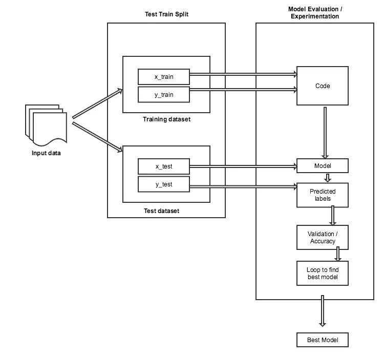
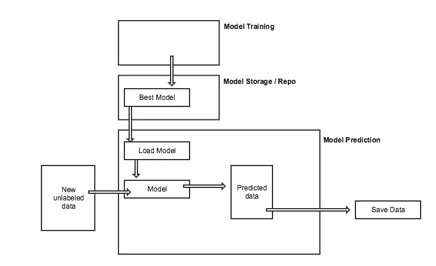
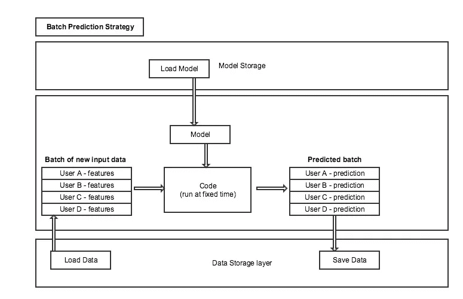
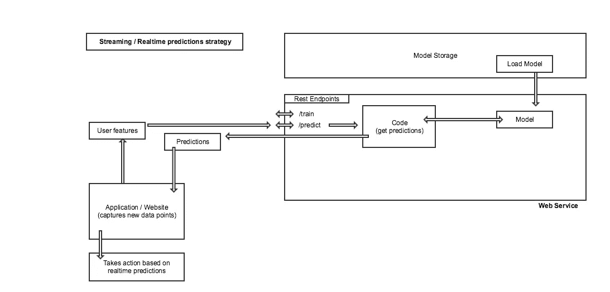
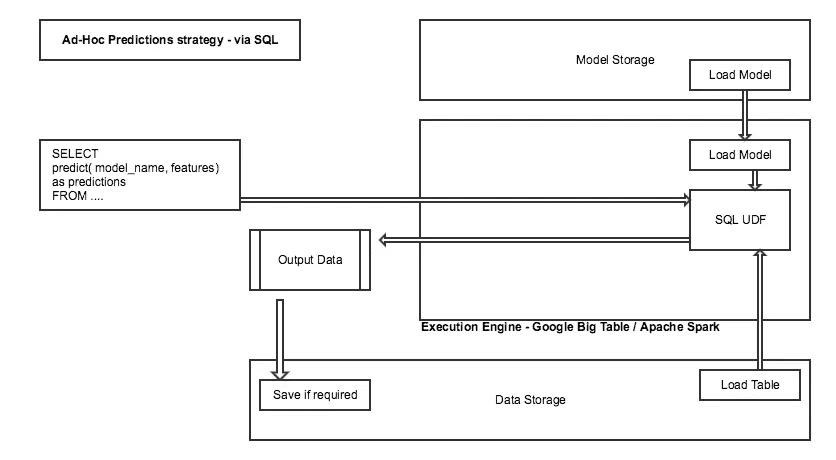
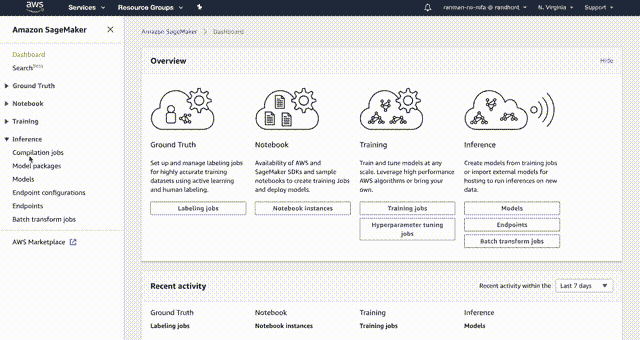
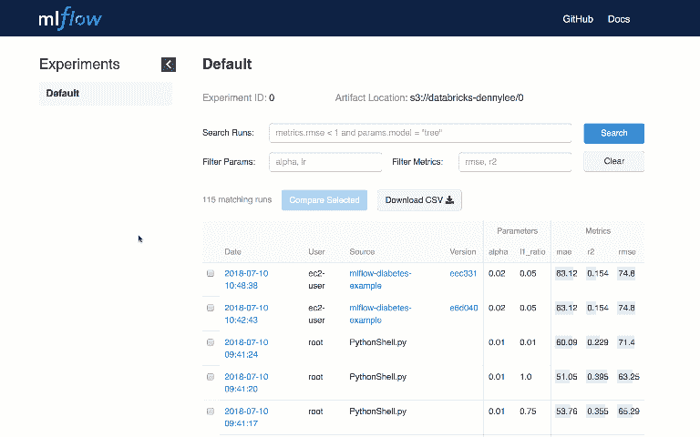

# 生产机器学习模型的策略

> 原文：<https://towardsdatascience.com/strategies-for-productionizing-our-machine-learning-models-53399a3199da?source=collection_archive---------22----------------------->

## 让我们的最佳模式更快见天日，帮助企业更好地做出决策

Photo by [ian dooley](https://unsplash.com/@sadswim?utm_source=unsplash&utm_medium=referral&utm_content=creditCopyText) on [Unsplash](/s/photos/launch?utm_source=unsplash&utm_medium=referral&utm_content=creditCopyText)

因此，您已经编写了您最好的机器学习代码，并且现在已经将模型调至最佳精度。

**现在怎么办？**

您将如何部署您的模型，以便业务能够真正利用该模型并做出更好的决策？

这是我上一篇讨论[生产大数据 ETL](https://medium.com/@nikkisharma536/data-engineering-part-2-productionizing-big-data-etl-with-apache-airflow-4104a9178aea) 的文章的后续。在这篇文章中，我将讨论生产我们的机器学习模型的不同策略。

# 典型的培训工作流程

我们都熟悉机器学习，以及如何找到最佳模型。这是我们工作流程的样子-

Typical EDA and Training workflow

作为一名数据科学家，我们通常将数据分为训练和测试数据，并用训练数据训练模型，然后我们预测测试数据，并根据误差指标或准确性微调我们的模型。

在此活动结束时，我们将获得具有最佳准确度分数的最佳模型。

# 典型部署工作流

通常，一旦我们找到了最佳模型，我们会想把它保存在某个地方。保存模型很重要，因为我们在训练阶段经过大量努力和时间后实现了这一模型。我们希望重用该模型，并为新数据的预测阶段加载该模型。

这是典型部署工作流的样子——

Typical Prediction workflow

在这个工作流中，我们需要一些机制来加载我们保存的模型，并通过新到达的数据运行它。此阶段的输出是输入数据的预测数据/标签。

企业可能希望将这些数据保存在某个地方，或者根据实时预测数据采取一些措施。

# 部署策略

有各种策略来部署我们的机器学习模型。策略的选择完全取决于我们计划如何消耗输出预测的业务需求。

## 批量预测

这种预测策略通常在一天中的特定时间运行预测，或者以固定的时间间隔在一天中运行多次。当我们不需要等待实时决策并且可以按时间批量输入数据时，这种策略非常有用。

Batch Prediction strategy

主要步骤如下

*   代码以固定的时间/间隔运行
*   代码从保存的位置加载模型
*   代码读取一批输入数据
*   输入数据是我们想要预测的新的和未标记的数据
*   输入数据可能包含分组在一起的多个用户/实体的数据
*   代码对*输入批次*运行模型预测，并产生一个*预测批次*
*   预测批次包含输入数据中每条记录的预测标签
*   预测的数据然后被保存在一些新的位置

随着批预测管道继续运行，新的预测数据将继续追加到该位置。这些数据可用于分析和决策。

## 流式/实时预测

当必须立即做出决定时，这种策略非常有用。通常有一个应用程序需要根据用户的交互/行为/属性动态地做出一些决定。

Streaming / Realtime prediction strategy

主要步骤如下

*   我们有一个包装代码的 web 服务
*   web 服务公开 Rest 端点以获取预测
*   消费者应用程序进行 web 服务调用，并以 Json 格式发送输入数据
*   输入数据包含预测所需的所有特征。它通常只有一条记录，而不是一批
*   代码从保存的位置加载模型
*   当调用 web 服务端点时，代码获取输入数据
*   代码对*输入数据*运行模型预测，并产生*预测数据*
*   预测数据被返回给消费者应用程序
*   消费者应用程序可以决定如何使用预测数据来获得更好的用户体验

## 通过 SQL 进行即席预测

这是最近在业内流行的一种新趋势。这种方法将 ML 模型公开为 SQL 函数。这种方法将新的输入数据视为表格，并允许通过将 ML 模型作为函数运行来对数据进行特别分析。输出也以表格形式显示，如果需要，可以保存下来供将来使用。

Ad-hoc / SQL based prediction strategy

主要步骤如下

*   ML 模型被包装在 SQL UDF 中
*   有一个理解 UDF 的 SQL 执行引擎(如 Spark 或 Google Big Table)
*   SQL 执行引擎在 UDF 中加载代码
*   用户向执行引擎发出 SQL 查询，在 SQL 查询中选择特征表
*   执行引擎通过 UDF 运行输入要素来计算预测
*   预测数据被返回给用户
*   用户可以将预测数据保存为新表

# 实施思路

业内有各种方法解决这个问题。

## 气流调度程序

气流调度程序非常适合*批量预测策略。*它可以将最大似然训练和最大似然预测作为独立的作业在不同的时间间隔运行。气流还提供了过去所有跑步的可视性。所有预测运行都可以记录预测详细信息，以供将来分析。

## 码头集装箱

这是 Kaggle 在比赛中采用的方法之一。我们可以为训练和预测工作旋转 Docker 容器。容器可用于批量和实时预测策略。

## 亚马逊 SageMaker

这是最流行的部署策略之一。最好的部分是它由亚马逊管理，我们不需要模型部署的基础设施。

我们可以在 Jupyter 笔记本中提供我们的 ML 代码。部署在 sagemaker 上的每个 ML 模型都有一个惟一的部署端点，可以用于预测。

> 这里有一个关于 SageMaker 入门的很棒的教程

Amazon Sage maker — Web Interface

## 谷歌大查询 ML

谷歌已经开始在 BigQuery 之上提供机器学习功能。它允许我们在现有的 BigQuery 表之上使用 ML 模型作为 SQL 函数。

> 这里有一个关于[开始使用 BigQuery ML](https://cloud.google.com/bigquery/docs/bigqueryml) 的很棒的教程

Big Query ML — SQL predictions

## 毫升流量

ML flow 是 Databricks 的一项新举措。ML flow 是开源，并为用户提供模型跟踪和服务的能力。ML flow 对于培训生命周期来说也是很棒的，因为它提供了一个 web 界面来显示模型在多次运行中的性能和准确性。ML flow 还允许我们将多次运行作为单个实验的一部分进行分组。

ML Flow — Model tracking and serving

ML flow 的伟大之处在于，我们不必为保存和加载模型而编码。ML flow 为我们提供了 Python 库来加载和保存模型。

ML flow 的另一个优点是，一旦模型与 ML flow 一起保存，就可以通过上面提到的三种策略中的任何一种进行部署。

> 这里有一个关于[开始使用 ML flow](https://www.mlflow.org/docs/latest/tutorial.html) 的很棒的教程

这个帖子到此为止。在下一篇文章中，我计划写一篇关于 ML flow 或 SageMaker 的深度文章。敬请关注。

*原载于 2019 年 3 月 4 日*[*confusedcoders.com*](https://confusedcoders.com/data-science/machine-learning/strategies-for-productionizing-our-machine-learning-models)*。*