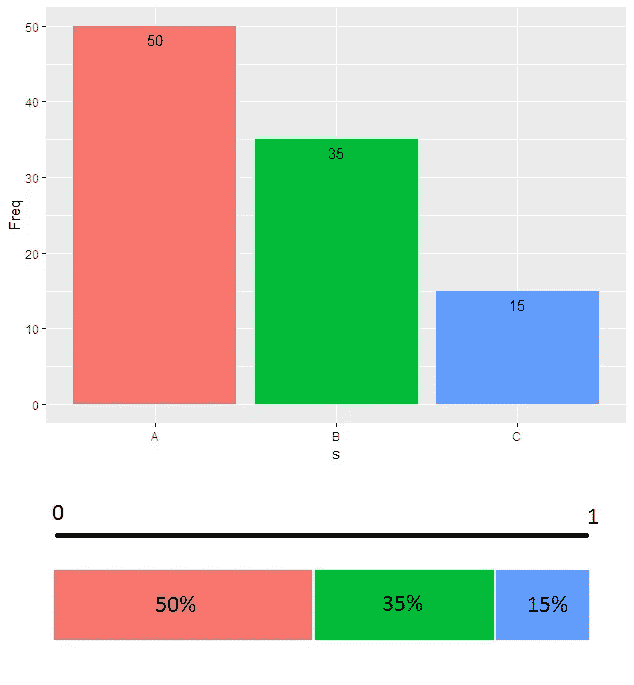
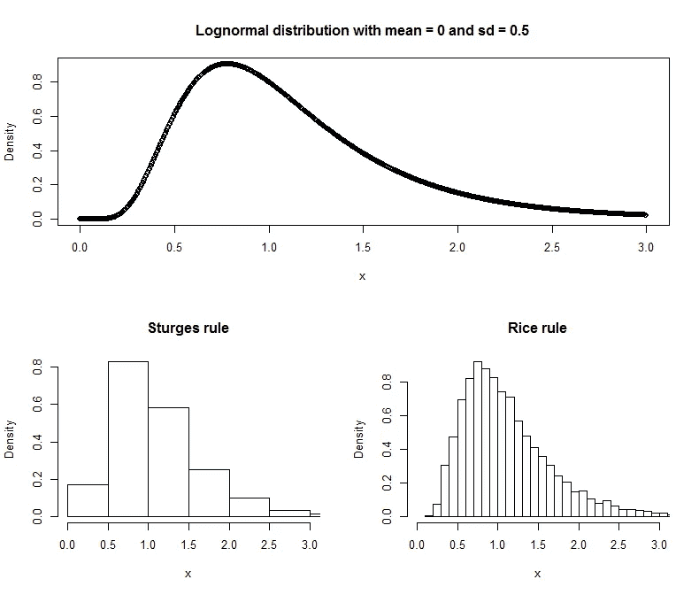

# 分层抽样以及如何在 R

> 原文：<https://towardsdatascience.com/stratified-sampling-and-how-to-perform-it-in-r-8b753efde1ef?source=collection_archive---------6----------------------->

## 对大型数据集进行采样的正确方法


Photo by [Giorgio Tomassetti](https://unsplash.com/@gtomassetti?utm_source=medium&utm_medium=referral) on [Unsplash](https://unsplash.com?utm_source=medium&utm_medium=referral)

在[之前的一篇文章](https://medium.com/data-science-journal/how-to-correctly-select-a-sample-from-a-huge-dataset-in-machine-learning-24327650372c)中，我写了关于**以适当的方式从人群中选择样本**的重要性。今天我将向大家展示一种叫做**分层抽样**的技术，它可以帮助我们从一个庞大的数据集中创建一个**具有统计显著性的**样本。

# 对大量人口进行抽样的正确方法

当我们从总体中执行一个样本时，我们想要实现的是一个更小的数据集，它保持总体的**相同的统计信息**。

产生一个相当好的样本的最好方法是统一收集人口记录，但是这种工作方式并不是完美的。事实上，虽然平均来说效果很好，但单个样本与总体差异太大的概率仍然很低，有限。这种概率非常小，但它会在我们的样本中引入偏差，这将**破坏**我们在其上训练的任何机器学习模型的预测能力。

真正的要点是，我们不想要一个理论上正确的方法，这个方法适用于大数；我们想要提取一个正确的样本，并尽可能具有最高的统计显著性。

在这一点上，统一的抽样已经不够了，我们需要一个更强的方法。

# 分层抽样

分层抽样是为了从一个人口记录**到另一个记录**构建样本，尽可能忠实地保持原始**多元**直方图而创建的一种方法。

它是如何工作的？好吧，让我们从一个单一的，**单变量直方图**开始。对这种直方图进行采样的最佳方式是将 0–1 区间分割成子区间，子区间的宽度与直方图条的**概率**相同。然后，我们从 0 和 1 之间的均匀分布生成一个伪随机数。我们将根据随机数的位置从直方图中选择一个值。然后我们想重复多少次就重复多少次。

下图让一切都变得更加清晰。



这张图表是由以下代码制成的:

```
library(“ggplot2”)s = c(rep(“A”,50),rep(“B”,35),rep(“C”,15))d = as.data.frame(table(s))p = ggplot(d,aes(x=s,y=Freq,fill=s)) + geom_bar(stat=”identity”)+
 geom_text(aes(label=Freq),vjust=1.6) +
 theme(legend.position = “none”)

p
```

如何在 R 中进行采样？强大的**样本**功能可以指定赋予每个值的**权重**，即概率。

因此，如果我们想要该数据的 10 个样本观察值，我们可以简单地使用这一行代码:

```
sample(d$s,replace = TRUE,prob = d$Freq,10)
```

通过这种方式，我们能够创建具有高置信度的直方图，**迫使样本**遵循相同的总体分布。

# 多元方法

多元直方图怎么样？嗯，多元直方图只是许多直方图的**层次结构**，通过**条件概率**的**贝叶斯公式**粘合在一起。我们可以轻松地将多变量直方图转换为单变量直方图**来标记**每个聚类组合，但是如果我们有太多的列，那么在计算上**很难**将它们全部聚集起来。当我试图在 200 列上聚合 3000 万条记录的数据集时，我亲眼目睹了强大的 RDBMS 的失败。

通过下面的过程，我们可以独立地管理每一列**，而不用关心它们的数量，也不会让我们的 CPU 遭受太多的痛苦。**

**程序如下:**

*   ****根据第一个变量聚集整个数据集(即根据第一个变量创建数据集的直方图)。****
*   ****根据用于单变量直方图的相同技术，选择**该变量的一个值。**
*   ****过滤**整个数据集，仅考虑那些在所选变量上具有该值的记录。**
*   **继续处理第二个变量(聚合并选择一个值)等等，直到最后一个变量。由于过滤器的作用，每一步都会产生一个**更小的**数据集。**
*   **最后，您有一个非常小的数据集，但没有变量留给切片。此时，您可以从该数据集中选择一个**随机**记录**统一**并重复整个过程，直到您得到想要的样本大小。**

****

**Stratified sampling procedure**

# **连续值和分类值**

**会发生什么呢？有些变量是连续的，有些是分类的？嗯，问题现在变得非常困难。我能给你的唯一答案是**用直方图标准(如斯特奇斯或赖斯的)离散化**连续变量。**

**给定数据集中的 *n* 点，用于直方图的仓的数量 *k* 通过以下公式从两个规则中导出:**

****

**Sturges’ rule**

****

**Rice rule**

**让我们看看他们的行动。使用下面的代码，我们将从对数正态分布(本质上是偏斜的)中创建 10000 个随机数，绘制原始密度函数和由这两个规则生成的直方图。**

```
x = rlnorm(10000,0,0.5)
windows()
layout(matrix(c(1,1,2,3), 2, 2, byrow = TRUE))plot(seq(0,3,length.out=1000),dlnorm(seq(0,3,length.out=1000),0,0.5),xlab="x",ylab="Density",main="Lognormal distribution with mean = 0 and sd = 0.5")hist(x,probability = TRUE,main="Sturges rule",xlim=c(0,3))hist(x,breaks=2*length(x)**(1/3),probability = TRUE,main="Rice rule",xlim=c(0,3))
```

****

**如你所见，莱斯法则能够非常有效地再现原始概率分布形状**。这就是为什么它是我个人最喜欢的直方图标准，我总是用它来离散数值变量。****

# ****R 中的一个例子****

****现在是时候让所有的理论在 r 变成实践了。****

****首先，我们将模拟一些数据，确定维度和所需的样本大小:****

```
**# Generate a random 10000 records data frame
set.seed(1)
n = 1000
d = data.frame(
    a = sample(c(1,NA),replace=TRUE,n),
    b = sample(c("a 1","b 2","c 3"),replace=TRUE,n),
    c = c(runif(n-100,0,1),rep(NA,100)),
    id = 1:n
  )# Remove the useless "id" column
dimensions = setdiff(names(d),"id")# Desired sample size
n_sample = 100**
```

****然后，我们执行分层采样，目标是用样本**填充**生成的**数据帧，而不重复**。为了应用最后一条规则，我们将使用强大的 **sqldf** 库。****

**现在“生成”的数据帧包含了我们想要的样本。**

# **结论**

**在本文中，我介绍了数据科学家应该知道的最重要的**采样技术。记住:一个生成良好的样本真的可以**在机器学习中发挥作用**，因为它可以让我们用更少的数据工作，而不会失去统计意义。****

****Gianluca Malato 是意大利的一名小说作家和数据科学家。他的书可以在** [**亚马逊**](https://www.amazon.it/Gianluca-Malato/e/B076CHTG3W?_encoding=UTF8&pd_rd_i=B07D7HG8V8&pd_rd_r=d34f8c07-0ef6-11e9-8c18-03e9e1f87d64&pd_rd_w=PjgeY&pd_rd_wg=3XHRC&pf_rd_p=466c5af4-0171-4b17-9b3f-b4036a90f75d&pf_rd_r=VYXNVD02NTB20Y1QS4JG) **上找到，他的文章可以在** [**中型**](https://medium.com/@gianlucamalato) **上找到。****