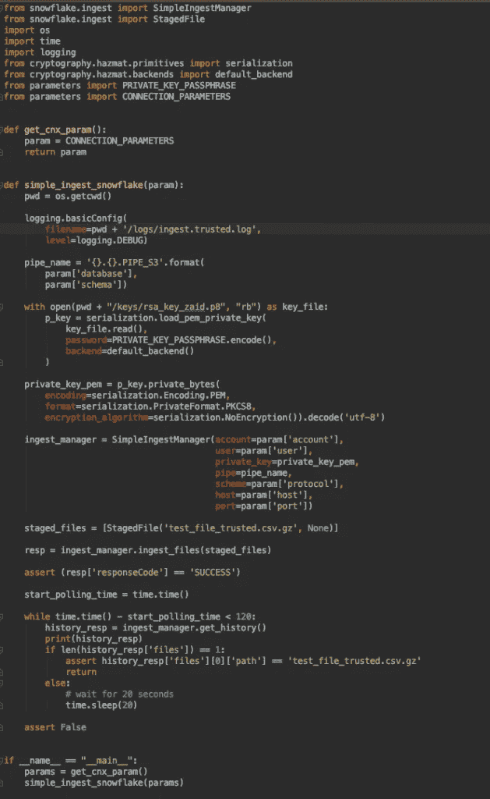
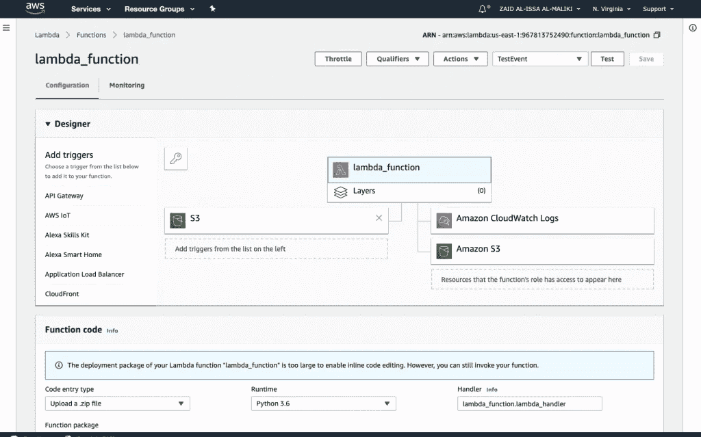

# 面向数据工程师的从 S3 存储桶到雪花数据库的数据流

> 原文：<https://towardsdatascience.com/streaming-from-s3-buckets-to-snowflake-db-for-data-engineers-8e4827b81b16?source=collection_archive---------7----------------------->

如何使用 Snowpipe REST API 调用将文件加载到表中的工作示例。这是一个关于如何连接雪花以及如何使用 Snowpipe 将文件摄取到雪花表中的小教程。因此，为了向我们亲爱的读者提供本教程，我们在雪花开设了一个免费试用账户。本课包含三个步骤，第一步是将数据从您的计算机加载到内部阶段，第二步是将数据从 S3 存储桶手动加载到外部阶段，最后一步是使用 AWS Lambda 函数将数据加载到外部阶段。

我们为什么要这么做？为什么我们不把它从 S3 桶自动加载到雪花表呢？

这个过程背后的原因是为了更好地理解 S3 桶和雪花表如何和谐地一起工作。所以你可以用更少的工作，最少的努力享受更多的满足感。但是在我们开始玩雪花和 S3 之前，让我们检查一下需求。

# 要求

1.  通过 AWS 帐户访问 S3 时段。
2.  通过雪花帐户访问雪花控制台。
3.  通过 AWS 帐户访问 EC2 实例。

# 第一步:从内部阶段加载数据

在本文档的这一部分中，您将在 Snowflake 中准备好创建表、阶段和管道的环境，通过遵循以下语句，您将能够实现这一点:

*   在文件~/中定义与您的用户、帐户和密码的连接。snowsql/config，连接的名称是 zaid_connection
*   在您终端和雪花工作表中运行这些命令

```
snowsql -c zaid_connection -o log_level=DEBUGalter user almalikz set RSA_PUBLIC_KEY="your_public_key"desc user almalikzcreate user zaid_user password='your_password';alter user zaid_user set rsa_public_key='your_public_key';use role securityadmin; create or replace role snowpipe_s3; grant usage on warehouse compute_wh to role snowpipe_s3; grant usage on database demo_db to role snowpipe_s3; grant usage on schema demo_db.public to role snowpipe_s3; grant insert, select on demo_db.public.TABLE_S3 to role snowpipe_s3; grant read on stage demo_db.public.STAGE_S3 to role snowpipe_s3; grant ownership on pipe demo_db.public.PIPE_S3 to role snowpipe_s3; grant role snowpipe_s3 to user zaid_user; alter user zaid_user set default_role = snowpipe_s3;create or replace table TABLE_S3(c1 number, c2 string); 
create or replace stage STAGE_S3; 
put file:///data/test_file.csv @STAGE_S3; 
create or replace pipe demo_db.public.PIPE_S3 as copy into TABLE_S3 from @STAGE_S3;
```

所以我们创建了这个程序*simple _ ingest _ snow flake . py*来访问雪花，使用用户、帐户、主机、端口、管道名、pem 格式的私钥，在下面的文件中检查这些参数:



```
ingest_manager = SimpleIngestManager(account='by16910',
 user='almalikz',
 private_key=private_key_pem, 
 pipe=pipe_name,
 scheme='https',
 host='by16910.eu-west-1.snowflakecomputing.com',
 port=443)
```

在上面提到的 python 程序中，我们使用这些参数来构建 JWT。让我们从一个抽象的定义开始。

> JSON Web 令牌(JWT)是一个 [JSON 对象](https://json.org/)，它在[*RFC 7519*](https://tools.ietf.org/html/rfc7519)*中被定义为一种安全的方式来表示双方之间的一组信息。令牌由报头、有效载荷和签名组成。*
> 
> **米奇·斯泰基-埃凡蒂斯**

*在 Snowflake 中，jwt 的生成是预先构建到 Snowflake API 提供的 python 库中的(并且记录在 Snowflake 文档中)，所以理想情况下，我们只需编写一个简单的脚本，使用这些库来为我们自动处理 jwt。通过包装器的 python 代码 [*简单-摄取-雪花*](https://github.com/snowflakedb/snowflake-ingest-python)*

*在我们运行程序几秒钟后，我们成功地将文件从内部暂存区摄取到雪花的表区，您可以检查接下来的日志，一切都很顺利。*

```
*DEBUG:botocore.vendored.requests.packages.urllib3.connectionpool:"POST/v1/data/pipes/demo_db.public.PIPE_S3/insertFiles?requestId=b9f27491-6434-4c5f-93b6-c6831afae12d HTTP/1.1" 200 88 DEBUG:snowflake.ingest.simple_ingest_manager:Ingest response: {'requestId': 'b9f27491-6434-4c5f-93b6-c6831afae12d', 'responseCode': 'SUCCESS'}*
```

*如果您检查上面的日志，您可以看到，首先是 POST 操作，其次是响应代码成功，这是积极的反馈。*

```
*'pipe': 'DEMO_DB.PUBLIC.PIPE_S3', 'completeResult': True, 'nextBeginMark': '1_0', 'files': [ {'path': test_file.csv.gz', 'stageLocation': 'stages/b3767d50-e0f8-4bb2-a52a-6677122c8223/', 'fileSize': 64, 'timeReceived': '2019-05-14T13:48:30.725Z', 'lastInsertTime': '2019-05-14T13:49:00.579Z', 'rowsInserted': 4, 'rowsParsed': 4, 'errorsSeen': 0, 'errorLimit': 1, 'complete': True, 'status': 'LOADED'}*
```

*然而，第二个日志是一个 GET 操作，由我们代码中的表达式调用，用于检查文件大小、接收时间、看到的错误、是否完成以及状态类型(在我们的例子中是 loaded)。*

# *第二步:从 S3 外部阶段加载数据*

*在本节中，我们将讨论如何使用雪花和通知事件的自动摄取新功能来摄取数据，我们成功地将数据从 S3 存储桶传输到雪花表，但我们是手动完成的，为什么要手动呢？因为我们的免费帐户没有自动摄取激活选项，这就是为什么我们没有通知和自动摄取。我们通过执行以下任务来完成这一步:*

## *第一项任务:设置你的 AWS 账户。*

*对于此任务，您必须遵循 AWS 安全的良好实践，并考虑以下规则:*

1.  *删除 root 密码。*
2.  *创建一个 IAM 用户。*
3.  *创建一个新组。*
4.  *定义新的 IAM 密码策略。*

## *第二项任务:更改仓库以支持自动恢复模式*

*我们有两种类型的用户，一种是管理员用户 *almalikz* ，另一种是普通用户 *zaid_user* ，因此该任务只能使用管理员用户激活:*

```
**alter warehouse compute_wh resume;**
```

## *第三个任务:将数据加载到雪花表中*

*在此任务中，我们使用普通用户帐户 zaid_user，而不是管理员用户。*

```
**create or replace stage s3_stage*
 *url= 's3://outputzaid/'*
 *credentials = (AWS_KEY_ID = 'your_key' AWS_SECRET_KEY='your_secret');
create or replace table s3_table(c1 number, c2 string);
copy into s3_table*
 *from s3://outputzaid/test_file_trusted.csv credentials=(AWS_KEY_ID = 'your_key' AWS_SECRET_KEY='your_secret')*
 *file_format = (type = csv field_delimiter = ',' );**
```

# *第三步:使用 Lambda 函数从 S3 阶段加载数据*

*在这一节中，我们将引导您完成使用 AWS Lambda 函数自动化 Snowpipe 的过程。*

*AWS Lambda 是一个事件驱动的无服务器计算平台，由 Amazon 作为 Amazon Web Service 的一部分提供。它在被事件触发时运行，并执行已经加载到系统中的代码。您可以修改本主题中提供的示例 python 代码，并创建一个 Lambda 函数，该函数调用 Snowpipe REST API 从外部阶段 S3 加载数据。该功能部署到您的 AWS 帐户中，在那里托管它。您在 Lambda 中定义的事件(例如，当您的 S3 存储桶中的文件被更新时)调用 Lambda 函数并运行 python 代码。*

*本节描述了配置 Lambda 函数以使用 Snowpipe 连续地以微批处理方式自动加载数据的必要步骤。因此，让我们开始遵循以下步骤:*

## *第一项任务:访问 AWS 实例*

1.  *访问您的 EC2 微实例，并检查关于 your-ssh-key-name 的信息。*
2.  *使用 AWS 控制台的 web 向导创建并运行 EC2 的实例。*
3.  *下载 ssh-key。*
4.  *使用 ssh 命令选项连接实例。*

```
**ssh -i "zaid_key.pem" ubuntu@ec2-3-91-26-48.compute-1.amazonaws.com**
```

## *第二个任务:创建 Lambda 执行环境*

*为了完成本指南，您需要首先创建一个包含您的代码及其依赖项的部署包。一种简单的方法是获取一个 [t2.micro](https://aws.amazon.com/ec2/instance-types/t2/) 实例，并建立一个模拟 python Lambda 运行环境的执行环境。这是您必须在 EC2 微实例中执行的步骤，遵循以下命令:*

```
**sudo apt-get install gcc make zip awscli libffi-dev openssl libssl-dev zlib1g-dev
wget* [*https://www.python.org/ftp/python/3.6.1/Python-3.6.1.tgz*](https://www.python.org/ftp/python/3.6.1/Python-3.6.1.tgz) *tar -xzvf Python-3.6.1.tgz
cd Python-3.6.1 && ./configure && make
sudo make install
sudo pip3 install --upgrade pip 
/usr/local/bin/virtualenv ~/zaid_venv* 
s*ource zaid_venv/bin/activate
pip install Pillow
pip install boto3
pip install requests
pip install snowflake-ingest**
```

## *第三个任务:创建 Python 部署包*

1.  ***编辑 lambda 处理函数** 为一个基本的 Lambda 处理函数创建文件[*【Lambda _ Function . py*](https://github.com/snowflakedb/examples/blob/master/lambda_function/lambda_function.py)，该函数使用 python 的雪花连接器。调整连接变量、表名和 S3 存储桶，以匹配您的环境。*
2.  ***创建并打包 python 虚拟环境** 脚本[*Package _ lambda _ function . sh*](https://github.com/snowflakedb/examples/blob/master/lambda_function/package-lambda-function.sh)包含为您的 Lambda 函数创建并打包 Python 环境的命令。这里要小心，因为如果你改变包含 Lambda 处理程序的文件名，你也必须修改这个脚本。*
3.  ***使用** 将代码复制到 AWS EC2 实例运行[*package _ Lambda _ function . sh*](https://github.com/snowflakedb/examples/blob/master/lambda_function/package-lambda-function.sh)后，将生成文件 *lambda_function.zip* 包含您的 python Lambda 处理程序代码/文件以及在 AWS Lambda 环境中运行所需的 python 依赖项。*
4.  ***在雪花中创建阶段、表格和管道***

```
**create or replace stage s3_stage url= 's3://outputzaid/' credentials = (AWS_KEY_ID = 'your_key' AWS_SECRET_KEY='your_secret');create or replace table s3_table(c1 number, c2 string);create or replace pipe s3_pipe as copy into s3_table from @s3_stage file_format = (type = 'CSV');create or replace pipe s3_pipe as copy into s3_table from @s3_stage file_format = (type = 'CSV');**
```

## *第四项任务:创建和配置 AWS Lambda 权限*

1.  *运行 *aws configure* 并编写您的凭证和您的默认区域*
2.  *为了执行 Lambda，您需要使用 aws 命令为角色和策略创建和设置适当的权限，然后上传包含我们的 python 环境的 zip 存档。这些命令可以在文件[*AWS _ lambda _ setup . sh*](https://github.com/snowflakedb/examples/blob/master/lambda_function/aws-lambda-setup.sh)中找到*

## *第五项任务:使用测试文件测试 Lambda 函数*

*此时，您可以测试启动 Lambda，并在 AWS Web 控制台 UI 中查看输出。导航至λ>函数>λ_ 函数。*

**

*您现在应该看到右上方的列表框，因此您需要在这里配置一个测试，您选择一个名称，并将以下语句放入测试框中*

```
*{ "Records": [ { "eventVersion": "2.0", "eventSource": "aws:s3", "awsRegion": "us-east-1", "eventTime": "1970-01-01T00:00:00.000Z", "eventName": "ObjectCreated:Put", "userIdentity": { "principalId": "AIDAJDPLRKLG7UEXAMPLE" }, "s3": { "s3SchemaVersion": "1.0", "configurationId": "testConfigRule", "bucket": { "name": "outputzaid", "ownerIdentity": { "principalId": "A3NL1KOZZKExample" }, "arn": "arn:aws:s3:::sourcebucket" }, "object": { "key": "test_file_lambda.csv", "size": 1024, "eTag": "d41d8cd98f00b204e9800998ecf8427e", "versionId": "096fKKXTRTtl3on89fVO.nfljtsv6qko" } } } ] }*
```

# *结论*

*你完成了任务，我亲爱的朋友，干得好！
**您已经创建了一个 Lambda 函数，将数据从 S3 桶传输到雪花表，这是您成为数据工程师的第一步！**
我已经创建了相当多的教程来告诉你如何做流数据。所有这些都是从最基本的开始。我们将在接下来的几周开始放更多的文章。因此，请与我们保持联系，并探索一种学习流式数据的简单方法。*

*干杯，
**扎伊德·阿利萨·阿尔马利基***

*或者，你可以[获得 5 美元/月的中等订阅。如果你使用这个链接，它会支持我。](https://medium.com/@dataakkadian/membership)*