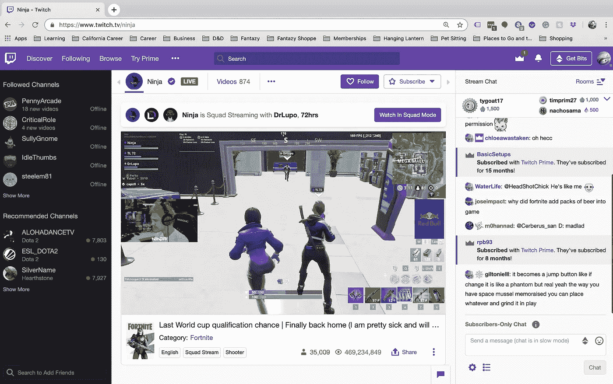
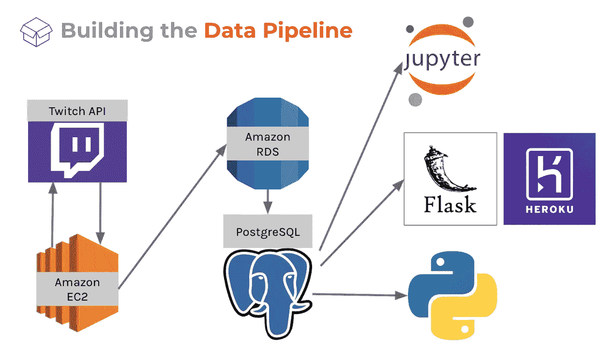
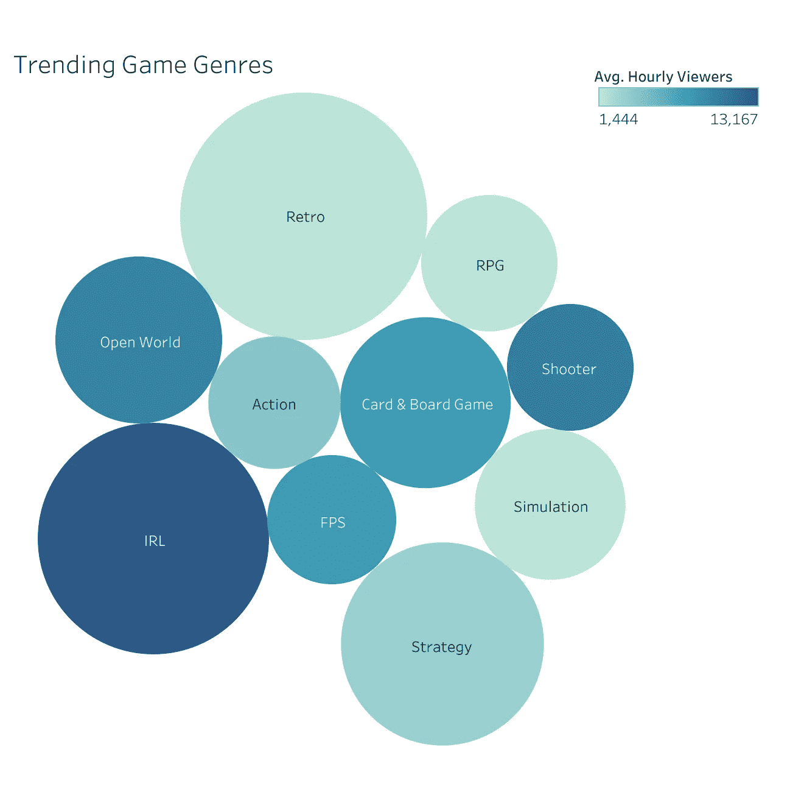
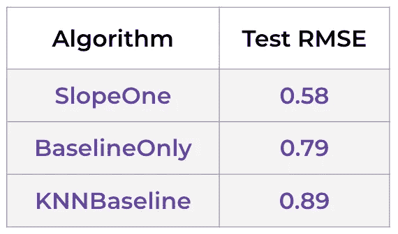

# 在 Twitch 上寻找成功

> 原文：<https://towardsdatascience.com/streaming-recommender-twitch-e40d4a45e4ee?source=collection_archive---------8----------------------->


Photo by [Caspar Camille Rubin](https://unsplash.com/@casparrubin?utm_source=unsplash&utm_medium=referral&utm_content=creditCopyText) on [Unsplash](https://unsplash.com/search/photos/twitch?utm_source=unsplash&utm_medium=referral&utm_content=creditCopyText)

## 介绍

似乎就在几周前，我在 Metis 开始了我的旅程，这是一个位于旧金山的沉浸式和挑战性的数据科学项目，十二周后，我们在这里进行我们的最终项目。在这篇博客文章中，我们将介绍我们如何为 Twitch 构建流媒体推荐器，以及我们用来制作应用程序的各种工具，现在可以在 [Heroku](https://twitch-streamer-recommender.herokuapp.com/) 上使用。这个项目的代码可以在[这里](https://github.com/natashaborders/Twitch_Streamers_Recommender)找到。

这一切都始于一个想法。在我的沉浸式活动工作室[挂灯笼](https://www.hanginglantern.com/)工作两年后，我加入了创意内容创作者的行列，与他们非常熟悉。不断努力向观众或参与者提供愉快的体验是一个艰难但令人兴奋的挑战，所以我在 Metis 工作期间，通过研究 [Kickstarter 活动](/https-medium-com-natashaborders-predicting-campaign-outcome-on-kickstarter-17e71b5e7ac9)的过程和[公众对《权力的游戏》的看法](/game-of-thrones-sentiment-analysis-1d3e158704cc)，探索了它的各个方面。

当选择最终项目的时候，我正在考虑为流行的流媒体网站 Twitch 上的内容创作者制作一个推荐系统，以表达我对视频游戏的热爱和帮助内容创作者的热情。当时看起来好像没有这样的推荐者，尽管有很多文章对流媒体内容提供建议，还有几个网站致力于 Twitch running stats。这似乎是一个完美而过于雄心勃勃的最终项目，我不是我们团队中唯一一个对视频游戏和 Twitch 充满热情的人。与 [**Jeremy Chow**](https://www.linkedin.com/in/jeremy-chow/) 和[**Randy Macaraeg**](https://www.linkedin.com/in/randysm/)**，**一起，我们开始了**Metis 有史以来第一个三人最终项目工作，我们着手为 Streamers 制作一个全功能的 Twitch 推荐器。**

## **[抽动](https://www.twitch.tv/)是怎么工作的？**

****

**Ninja’s channel page on Twitch**

**对于那些不熟悉它的人来说，Twitch 是一个流媒体视频网站，内容创作者通过播放流行的视频游戏或其他娱乐内容来吸引大量观众和订户。仅在 2018 年，Twitch 上就消费了超过**100 万年**的内容，每月有超过 400 万条独特的流媒体提供这些内容。正如你所想象的，有这么多的选择看什么，流光是相互竞争的观众和专门的订户。**

> **选择一个游戏(或类别)在 Twitch 上播放是**最难做出的**选择之一，也是**最能影响你成功的一个选择**。(作者《涌现》的马克·朗赫斯特(Mark Longhurst)在《如何选择流媒体游戏》一书中写道)**

**这正是我们的推荐者要解决的问题，这样的问题不是 Twitch 独有的，许多公司将内容、商品或服务的提供商与这些产品的消费者联系起来，因此消费者可以获得的产品的多样性和质量对公司的福利有直接影响。**

**特别是对于 Twitch 来说，我们的目标是帮助流媒体公司选择最佳的增长游戏，吸引观众和订户，发展他们的频道并分享他们喜欢的内容。**

**让我们来看看两条假设的抽动彩带:**

****

**Photo by [KAL VISUALS](https://unsplash.com/@kalvisuals?utm_source=unsplash&utm_medium=referral&utm_content=creditCopyText) on [Unsplash](https://unsplash.com/search/photos/woman?utm_source=unsplash&utm_medium=referral&utm_content=creditCopyText)**

*****Melany*** 是一个全新的流人，她知道她喜欢**玩**什么，但不确定她喜欢的流派和游戏是否会给她带来**观众**和**订户**。**

**如果我们知道她喜欢**角色扮演**和**冒险**游戏，并且她最喜欢的游戏是**巫师 3:疯狂狩猎**和**龙腾世纪:起源**，我们可以向她展示这些类型和游戏目前在 Twitch 上的表现，这样她就可以决定她是否想要继续玩下去。我们还可以展示当前的流媒体趋势，以帮助她了解市场，确定她可以填补的供应缺口，并确保她可以专注于她已经熟悉的游戏类型。**

**她需要知道:**

**她应该把她最喜欢的视频串流吗？**

****哪些内容会产生更多的浏览量？****

****

**[Unsplash](https://images.unsplash.com/photo-1517299151253-d0449b733f57?ixlib=rb-1.2.1&ixid=eyJhcHBfaWQiOjEyMDd9&auto=format&fit=crop&w=2100&q=80)**

**亚历克斯，另一方面，是一个现有的流光。她的**堡垒之夜**和**马登 NFL** 游戏已经有了观众，她希望探索增长选项，带来现有的粉丝，进一步扩大她的观众群，探索她最喜欢的**射手**和**体育**游戏类型。**

**她需要知道:**

**她现有的观众会喜欢的下一个大型游戏是什么？**

**她还应该尝试哪些游戏来保持势头？**

## **让我们建立一个数据管道**

**记住这两个 streamer 案例，让我们浏览一下我们的数据收集过程。**

**只有三周的时间来实现我们脑海中的复杂愿景，我们投入到数据收集中。在研究了几个 Twitch 分析网站后，我给 [SullyGnome](https://sullygnome.com/) 的所有者发了一条 Twitter 消息，他慷慨地向我们提供了 40 天的 Twitch 汇总数据，为我们提供了收视率和频道流信息**

**为了提取恒定的流数据，我们构建了一个查询 API 的管道，通过 Amazon EC2 实例将数据传输到我们使用 Amazon 关系数据库服务创建的 PostgreSQL 数据库中，并保存在那里供我们使用。然后，我们获取这些数据进行数据分析和开发，并使用 Heroku 推出我们的应用程序。**

****

**这个管道的架构确保我们在任何时候都可以访问相同的信息流，Python 脚本每小时收集一次 Twitch 数据，将结果存放到我们为接收信息而设置的三个 PostgreSQL 表中。**

```
 **Our PostgreSQL Tables Schema****stream_data                              game_information**stream_id text                           game_id text
 user_id text                             game_name text
 user_name text                           pic_url
 game_id text                            
 stream_type text
 title text                              **game_genres**
 viewer_count int                         
 started_at timestamp                     game_name text
 language text                            game_genres text
 time_logged timestamp
```

**表格完成后，我们直接查询数据并开始探索性的数据分析。这种分析的精华可以在推荐应用程序的第一个标签和我们的 Tableau 仪表盘中找到。例如，我们通过观察观众与频道的比率变化，检查了哪些类型的内容正在增长，并找到了那些有流媒体增长和进入空间的类型。**

****

**Taste of our Tableau graphs, the entire selection is linked below.**

**[](https://public.tableau.com/views/TwitchVisualizations/PickYourGame?:embed=y&:display_count=yes&:origin=viz_share_link) [## 随着时间的推移，Twitch 的游戏、类型、频道和收视率的趋势。GitHub…

### 随着时间的推移，Twitch 的游戏、类型、频道和收视率的趋势。GitHub…

随着时间的推移，Twitch 的游戏、类型、频道和收视率的趋势。GitHub…public.tableau.com](https://public.tableau.com/views/TwitchVisualizations/PickYourGame?:embed=y&:display_count=yes&:origin=viz_share_link) 

## 惊喜！我们的推荐创建流程

我们使用了[惊奇 Python 库](https://surprise.readthedocs.io/en/stable/index.html)，它是开发推荐系统的一个很好的工具。对于这个框架，我们所需要的是关于我们的流媒体工具、他们喜欢的类型和游戏或者已经流媒体化的信息，以及我们开发的自定义游戏成功指标，该指标的范围从 1 到 5，并作为每个流媒体工具-游戏关系的评级。

我们的算法选择侧重于准确性和速度——较低的测试均方根误差意味着这些算法在处理未知数据时表现最佳，并且工作速度快，这意味着当可用的流数据量不断增加时，可以轻松地重新训练和部署。



这三者协同工作，根据流媒体工具的偏好、他们现有的体验(如果有的话)以及具有类似内容的其他流媒体工具的相对成功来确定最合适的游戏和流派。我们将它们融合在一起，为每个流媒体工具生成一个单一的推荐列表，提供各种类型和游戏进行流媒体播放，所有这些都有可能提高他们的收视率并留住订户。你可以在 [Heroku](https://twitch-streamer-recommender.herokuapp.com/) 上亲自试用推荐者。目前，推荐应用程序中使用的模型是我们测试过的更简单、更快的模型，但如果服务器能够处理大量的流媒体数据，我们可以利用我们开发的更强大的算法。** 

## **时机就是一切**

**除了推荐飘带**和什么**可以传送，我们还希望能够告诉他们**什么时候**是传送的好时机。考虑到 Twitch 的收视率在本质上是周期性的，通常收视率的峰值出现在晚上，识别一天或一周内的供应缺口变得非常重要。我们使用长短期记忆(LSTM)网络模型来研究观众和频道随时间的波动，旨在预测预期的变化。**

**LSTM 使用长期记忆来量化一段时间内的增长并检查季节性趋势，使用短期记忆来考虑最近/每天的趋势，其遗忘能力允许其进一步回顾，而没有其他网络如递归神经网络(RNNs)的速度损失。**

****

**我们查看了整个上周的数据(168 小时)，检查了 24 个最后的模型状态，并预测了接下来的一周(168 小时)。**

**当样本内和测试 RMSE 为 10%时，我们能够很好地预测流媒体频道随时间的波动。**

## ****成长得分****

**除了提供推荐和指定何时进行流媒体播放，我们还希望能够根据一个通用指标对我们推荐的游戏进行排名，该指标不仅包括我们之前讨论过的推荐评级，还包括作为前 8 大流媒体市场份额函数的增长潜力。这种方法可以防止流媒体工具试图闯入一个已经被少数人垄断、没有扩张空间的游戏。**

****

**Doesn’t this look clear and uncomplicated?**

**它真正的意思是:**

****

**Ah, much better!**

**第一项，**流媒体亲和力**，来自推荐者本身，并且针对每个流媒体游戏的成功潜力而言是个人的，**游戏增长**和**游戏受欢迎程度**随着时间而变化，并且可以从输入的数据流中推断出来，**市场渗透性**源自每个游戏被其顶级流媒体所垄断的程度。作为一个整体，成长分数反映了每个游戏的每个流的全部潜力。它目前正在开发中，我们希望将来在我们的建模中实现它。**

**总的来说，我们的推荐系统完成了几件重要的事情:它改善了流媒体体验和保留，它鼓励了频道的增长和内容的多样性，并增加了 Twitch 的收入。这种内容创建者推荐系统可以适用于其他公司和类型的内容创建。这个项目一直是一个令人惊叹的挑战，我们希望扩展我们的模型，以用于 Twitch 实时流数据，收集所有实时数据，并不断训练我们的推荐模型以提高其准确性，并将其完全集成到 Twitch 上的流媒体体验中。**

**你可以在 Heroku 上找到我们的应用程序。该推荐器的代码可在 [GibHub](https://github.com/natashaborders/Twitch_Streamers_Recommender) 上找到。**

**感谢您的阅读。如果你想联系我，可以在 [Github](https://github.com/natashaborders/) 、 [LinkedIn](https://www.linkedin.com/in/natashaborders/) 和 [Twitter](https://twitter.com/natalissaelil) 上找到我。**

**[](https://www.natashaborders.com/) [## 娜塔莎·鲍德斯

### 具有市场研究和品牌管理、CPG、宠物和沉浸式活动行业背景的数据科学家…

www.natashaborders.com](https://www.natashaborders.com/)**