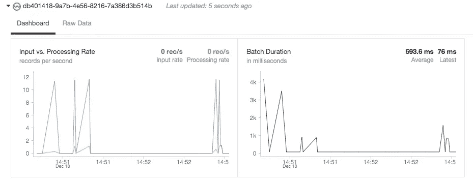

# 流式 scikit-通过 PySpark 学习

> 原文：<https://towardsdatascience.com/streaming-scikit-learn-with-pyspark-c4806116a453?source=collection_archive---------8----------------------->


Source: [https://www.maxpixels.net/Water-Creek-Stream-River-Cascade-Nationalpark-4324529](https://www.maxpixels.net/Water-Creek-Stream-River-Cascade-Nationalpark-4324529)

## **第八章《生产中的数据科学》节选**

*本章探索了模型管道，当记录到达一个流式 ML 框架时，在管道中对它们进行评估。这本书涵盖了 AWS 上的 Spark 和 Kafka 以及 GCP 上的 PubSub 和 Dataflow 的流工作流，而这篇博客文章则涵盖了前者。本章中所有例子的源代码都可以在* [*GitHub*](https://github.com/bgweber/DS_Production/blob/master/DSP-Ch8.ipynb) *上找到。*

[](https://leanpub.com/ProductionDataScience) [## 生产中的数据科学

### 从初创公司到数万亿美元的公司，数据科学在帮助组织最大化…

leanpub.com](https://leanpub.com/ProductionDataScience) 

# 第 8 章流模型工作流

许多组织现在都在使用流平台来构建实时数据管道，以转换数据流并在云环境中的不同组件之间移动数据。这些平台通常是分布式的，并为流数据提供容错。除了将不同的系统连接在一起，这些工具还提供了存储记录和创建事件队列的能力。

最受欢迎的流平台之一是 Apache Kafka，这是一个开源解决方案，用于跨公共云和私有云提供消息流。Kafka 是一个托管解决方案，需要供应和管理一个机器集群以便扩展。GCP 提供了一个名为 PubSub 的全托管流媒体平台，AWS 提供了一个名为 Kinesis 的托管解决方案。最佳选择取决于您的云平台、吞吐量和延迟要求以及开发运维问题。

借助流媒体平台，您可以在云环境中的不同组件之间以及外部系统之间传递数据。比如，现在很多游戏公司都在使用这些平台从手机游戏中收集游戏性事件，其中一个事件从游戏客户端传输到游戏服务器，然后以流的形式传递到数据平台。在这种情况下，消息生产者是将消息传递给消费者的游戏服务器，消费者是转换和存储事件的数据平台。

与生产中的数据科学的联系是，流平台可用于应用 ML 模型，作为流管道中的转换步骤。例如，您可以设置一个 Python 流程，该流程从一个主题读入消息，应用 sklearn 模型，并将预测输出到一个新主题。该过程可以是为用户提供实时 ML 预测的更大工作流的一部分，例如移动游戏中的物品推荐。对于扩展到大量消息的模型应用步骤，我们需要使用 Spark 和 Cloud Dataflow 等分布式系统，而不是单一的 Python 流程。

虽然流模型管道中的模型应用步骤类似于设置 Lambda 或 Cloud 函数，这已经提供了接近实时的预测，但一个关键的区别是易于与云平台中的其他组件集成。例如，使用 Cloud Dataflow，您可以将事件路由到 BigQuery 进行存储以及模型应用程序步骤，这可能会将输出推送给新的消息消费者。另一个好处是，它支持使用分布式工具(如 PySpark)来处理模型应用程序的请求，而不是使用基于端点的方法来孤立地处理请求。

在云平台中使用消息传递系统的好处之一是，它允许不同的工具和不同的编程语言使用标准化的接口进行通信。在本书中，我们将重点介绍 Python 和 PySpark，但是这些平台也支持 Java、Go 和许多其他语言。在本章中，我们将首先使用 Apache Kafka 在不同的 Python 进程之间传递消息，然后使用 PySpark 流来消费、转换和生成新消息。接下来，我们将使用 GCP 上的 PubSub，在流模式下使用云数据流提供近乎实时的模型预测。

# 8.1 火花流

Spark 从 0.7 版本开始就支持流数据集，但直到 2.3 版本才发布了一种称为结构化流的低延迟模式。借助结构化流，当扩展到高容量工作负载时，可以使用连续处理来实现毫秒级延迟。结构化流的一般流程是从输入流(如 Kafka)读取数据，使用 Spark SQL、Dataframe APIs 或 UDF 应用转换，并将结果写入输出流。Spark Streaming 还可以与包括 PubSub 和 Kinesis 在内的托管流平台以及包括 Flume 在内的 Apache 生态系统中的其他框架协同工作。

在这一节中，我们将首先设置一个 Kafka 实例，然后在同一台机器上使用 Kafka 生成和使用消息。接下来，我们将展示如何使用 PySpark 中的`readStream`函数消费来自 Kafka 的消息，然后构建一个应用 sklearn 模型的流管道。

# 8.1.1 阿帕奇卡夫卡

Kafka 是在 LinkedIn 孵化的开源流媒体平台。它旨在处理高吞吐量和低延迟的实时数据流。它是用 Java 和 Scala 编写的，但是支持一系列编程语言，用于通过标准化的 API 产生和消费流。通过使用水平扩展和分区将工作负载分布在称为代理的服务器集群上，该平台可以扩展到大型数据集。虽然开源的 Kafka 是一个托管的消息流解决方案，但一些云提供商现在提供完全托管版本的 Kafka，如 Amanon 的 MSK 产品。

为了展示 Kafka 如何集成到流工作流中，我们将使用单节点设置来启动和运行。对于生产环境，您会希望设置一个多节点集群来实现冗余和改进延迟。由于本章的重点是模型应用程序，因此我们不会深入探讨为高可用性设置 Kafka 的细节，而是为小团队的入门者推荐托管解决方案。要安装 Kafka，浏览到[网站](https://kafka.apache.org/quickstart)并找到最新版本是很有用的。为了安装 Kafka，我们首先需要安装 Java，然后下载并解压 Kafka 版本。在 EC2 机器上设置单节点 Kafka 实例所需的步骤如下面的代码片段所示。我们还将安装一个用于在 Python 中使用 Kafka 的库，名为`kafka-python`。

```
sudo yum install -y java
pip install --user kafka-python
wget http:**//**mirror.reverse.net/pub/apache/kafka/2.4.0/
                                               kafka_2.12-2.4.0.tgz
tar -xzf kafka_2.12-2.4.0.tgz
cd kafka_2.12-2.4.0
bin/zookeeper-server-start.sh config/zookeeper.properties

***# new terminal*** bin/kafka-server-start.sh config/server.properties

***# new terminal*** bin/kafka-topics.sh --create --bootstrap-server localhost:9092 
                 --replication-factor 1 --partitions 1 --topic dsp

***# output*** [2019-12-18 10:50:25] INFO Log partition=dsp-0, dir=**/**tmp/kafka-logs 
    Completed load of log with 1 segments, log start offset 0 and 
    log end offset 0 **in** 56 **ms** (kafka.log.Log)
```

在设置 Kafka 时，我们需要生成三个独立的进程来运行依赖项，启动 Kafka 服务，并为发布消息创建一个新主题。上面的代码片段运行以下流程:

*   Zookeeper: 为分布式系统提供配置和服务发现的 Apache 项目。
*   **Kafka** 推出启动服务，支持设置 Kafka 主题和使用流式 API。
*   **主题:**创建一个名为“dsp”的新主题。

`Zookeeper`和`Kafka`任务是长期运行的进程，将继续执行直到终止，而`Topics`进程将在新的 Kafka 主题建立后关闭。代码片段底部的输出显示了运行该命令的输出，它将显示在运行`Kafka`流程的终端中。在这个配置中，我们为主题设置了一个单独的分区，没有复制。我们现在有了一个用于测试消息流的单节点 Kafka 集群。

我们将探索的第一个 API 是`Producer` API，它使流程能够向主题发布消息。为了向我们的 Kafka 服务器发布消息，我们通过传入一个地址和一个序列化函数来创建一个 producer 对象，该函数指定如何将 Python 对象编码成可以传递给 Kafka 服务器的字符串。下面的 Python 代码片段展示了如何创建生产者，如何将 dictionary 对象作为消息发送给服务器，并将消息发布到`dsp`主题。`dict`对象包含`hello`和`time`键。如果我们运行这段代码，消息应该会成功地传输到服务器，但是还没有消费者来处理消息。

```
from kafka import KafkaProducer
from json import dumps
import time

producer = **KafkaProducer**(bootstrap_servers=['localhost:9092'],
          value_serializer=lambda x: **dumps**(x)**.encode**('utf-8'))

data = {'hello' : 'world', 'time': **time.time**()}
**producer.send**('dsp', data)
```

为了建立一个消费消息的流程，我们将探索“消费者”API，它用于读入数据流。下面的 Python 片段展示了如何创建一个连接到 Kafka 服务器的消费者对象并订阅`dsp`主题。返回的`consumer`对象是可迭代的，可以与 for 循环结合使用来处理消息。在下面的例子中，for 循环将暂停执行，直到下一条消息到达，并继续迭代，直到进程终止。`value`对象将是我们从生产者那里传递过来的 Python 字典，而`deserializer`函数定义了如何将字符串转换成 Python 对象。这种方法适用于小规模的流，但是对于较大的数据量，我们还希望分布消息处理逻辑，我们将在下一节用 PySpark 演示这一点。

```
from kafka import KafkaConsumer
from json import loads

consumer = **KafkaConsumer**('dsp',
     bootstrap_servers=['localhost:9092'],
     value_deserializer=lambda x: **loads**(**x.decode**('utf-8')))

**for** x **in** consumer:
    **print**(x.value)
```

现在我们有了用于生成和消费消息的 Python 脚本，我们可以用 Kafka 测试消息流。首先，在 Jupyter 笔记本中运行`Consumer`脚本，然后在单独的笔记本中运行`Producer`脚本。在多次运行生产者单元之后，您应该看到来自消费者单元的输出，类似于下面显示的结果。

```
{'hello': 'world', 'time': 1576696313.876075}
{'hello': 'world', 'time': 1576696317.435035}
{'hello': 'world', 'time': 1576696318.219239}
```

我们现在可以使用 Kafka 在云部署中的不同组件之间可靠地传递消息。虽然本节使用了一个测试配置来启动 Kafka 服务，但是我们探讨的 API 适用于数据量大得多的生产环境。在下一节中，我们将探索用于处理流数据的`Streams` API，比如应用 ML 模型。

# 8.1.2 Sklearn 流

为了使用 Kafka 构建端到端的流管道，我们将利用 Spark 流来处理和转换到达的数据。Spark 2.3 中引入的结构化流增强支持使用数据帧和 Spark SQL，同时抽象出处理批处理和数据集的许多复杂性。在这一节中，我们将建立一个 PySpark 流管道，从 Kafka 主题中获取数据，应用 sklearn 模型，并将输出写入一个新主题。整个工作流是一个连续运行和处理来自 Kafka 服务的消息的 DAG。

为了让 Kafka 与 Databricks 一起工作，我们需要编辑 Kafka 配置以与外部连接一起工作，因为 data bricks 运行在独立的 VPC 上，并且可能与 Kafka 服务分开。此外，我们之前使用 bootstrap 方法来指代使用`localhost`作为 IP 的经纪人。在 AWS 上，Kafka 启动脚本将使用内部 IP 监听连接，为了启用来自远程机器的连接，我们需要更新配置以使用外部 IP，如下所示。

```
vi config/server.properties 
advertised.listeners=PLAINTEXT:**//**{external_ip}:9092
```

在进行了这个配置更改之后，您需要重新启动 Kafka 进程，以便从 Databricks 接收入站连接。您还需要通过修改安全组来启用来自远程机器的入站连接，这将在第 1.4.1 节中介绍。端口 9092 需要为将连接到 Kafka 服务的 Spark 节点打开。

我们还将设置第二个主题，用于发布模型应用步骤的结果。我们将建立的 PySpark 工作流将使用来自一个主题的消息，应用一个 sklearn 模型，然后将结果写入一个单独的主题，称为`preds`。这个工作流程的一个主要好处是，您可以替换掉进行预测的管道，而不会影响系统中的其他组件。这类似于云工作流中的组件调用端点进行预测，但我们可以无缝地交换新的后端逻辑，而不会影响工作流中的其他组件，而不是更改调用端点的组件的配置以指向新的端点。

```
bin/kafka-topics.sh --create --bootstrap-server localhost:9092 
                --replication-factor 1 --partitions 1 --topic preds
```

在考虑如何构建预测性建模管道之前，从简单地使用消息的基本工作流开始是一个很好的实践，尤其是在处理流数据时。为了确保我们已经正确地设置了 Kafka 与 Databricks 的远程连接，我们可以编写一个最小的脚本来使用流中的消息并输出结果，如下面的 PySpark 片段所示。Databricks 将定期刷新输出，并在新数据到达时在输出表中显示新数据。将`startingOffsets`值设置为`earliest`意味着我们将从最后一个 Kafka 检查点加载数据。移除此设置将意味着只有新消息显示在可视化表格中。

```
df = spark **.readStream.format**("kafka")
  **.option**("kafka.bootstrap.servers", "{external_ip}:9092")
  **.option**("subscribe", "dsp") 
  **.option**("startingOffsets", "earliest")**.load**()
**display**(df)
```

让 Databricks 与 Kafka 服务通信可能是让这个示例管道工作的主要挑战之一，这就是为什么我建议从最简单的 PySpark 脚本开始。编写简单的 UDF 来处理接收到的消息的`value`字段也很有用，这样可以确保 PySpark 中解码的消息与 Python 进程中编码的数据相匹配。一旦我们可以消费消息，我们将使用 UDF 来应用 sklearn 模型，其中 UDF 指的是 Python 函数，而不是熊猫 UDF。作为一般实践，向 Spark 工作流添加检查点是很好的，上面的代码片段是检查接收的数据是否与传输的数据匹配的一个很好的例子。

对于 Spark 流示例，我们将再次使用游戏数据集，它有十个属性和一个标签列。在这个工作流中，我们将把特征向量作为输入发送到流管道，并输出一个额外的预测列作为输出。我们还将添加一个惟一的标识符，如下面的 Python 片段所示，以便跟踪管道中的模型应用程序。下面的代码片段展示了如何用模型所需的 10 个属性创建一个 Python `dict`，将一个 GUID 附加到字典，并将对象发送到流模型主题。

```
from kafka import KafkaProducer
from json import dumps
import time
import uuidproducer = **KafkaProducer**(bootstrap_servers= ['{external_ip}:9092'],
          value_serializer=lambda x: **dumps**(x)**.encode**('utf-8'))data = { 'G1': 1, 'G2': 0, 'G3': 0, 'G4': 0, 'G5': 0, 
         'G6': 0, 'G7': 0, 'G8': 0, 'G9': 0, 'G10': 0, 
        'User_ID': **str**(**uuid.uuid1**())}
result = **producer.send**('dsp', data)
**result.get**()
```

为了实现流模型管道，我们将使用 PySpark 和 Python UDF 来在新元素到达时应用模型预测。Python UDF 对单行进行操作，而熊猫 UDF 对行的分区进行操作。下面的 PySpark 片段显示了该管道的代码，它首先在 driver 节点上训练一个模型，为 Kafka 流设置一个数据接收器，为应用 ML 模型定义一个 UDF，然后将分数作为管道输出发布到一个新主题。

```
from pyspark.sql.types import StringType
import json 
import pandas as pd
from sklearn.linear_model import LogisticRegression***# build a logistic regression model*** gamesDF = pd.read_csv("https://github.com/bgweber/Twitch/raw/
                       master/Recommendations/games-expand.csv")
model = LogisticRegression() 
model.fit(gamesDF.iloc[:,0:10], gamesDF['label'])***# define the UDF for scoring users*** def score(row):
    d = json.loads(row)
    p = pd.DataFrame.from_dict(d, orient = "index").transpose()   
    pred = model.predict_proba(p.iloc[:,0:10])[0][0]
    result = {'User_ID': d['User_ID'], 'pred': pred }
    return str(json.dumps(result))***# read from Kafka*** df = spark.readStream.format("kafka") 
  .option("kafka.bootstrap.servers", "{external_ip}:9092") 
  .option("subscribe", "dsp").load() ***# select the value field and apply the UDF*** df = df.selectExpr("CAST(value AS STRING)")
score_udf = udf(score, StringType())    
df = df.select( score_udf("value").alias("value"))***# Write results to Kafka*** query = df.writeStream.format("kafka") 
  .option("kafka.bootstrap.servers", "{external_ip}:9092") 
  .option("topic", "preds") 
  .option("checkpointLocation", "/temp").start()
```

该脚本首先使用从 GitHub 获取的数据训练一个逻辑回归模型。模型对象是在驱动程序节点上创建的，但在 UDF 使用时会被复制到工作节点。下一步是定义一个 UDF，我们将应用于管道中的流记录。Python UDF 将一个字符串作为输入，使用`json`库将字符串转换成字典，然后将字典转换成 Pandas 数据帧。dataframe 被传递给 model 对象，UDF 返回带有`User_ID`和`pred`键的 dictionary 对象的字符串表示，其中预测值是用户购买特定游戏的倾向。

管道中的下三个步骤定义了 PySpark 流工作流。`readStream`调用建立了与 Kafka 代理的连接，并订阅了`dsp`主题。接下来，在将值传递给 UDF 之前，使用 select 语句将流记录的`value`列转换为字符串，然后使用 Python UDF 的结果创建一个新的数据帧。最后一步将输出数据帧写入`preds`主题，使用本地目录作为 Kafka 的检查点位置。这三个步骤作为连续处理工作流的一部分运行，其中这些步骤没有完成，而是暂停执行，直到新数据到达。结果是操作的流 DAG 在数据到达时对其进行处理。

运行流式管道时，Databricks 将在单元下方显示有关工作流的详细信息，如图 [8.1](/8-1-spark-streaming.html#fig:8-db) 所示。绿色图标表示这是一个将继续执行直到终止的流式操作。还有一些图表可以直观显示数据吞吐量和延迟。对于生产管道，使用流程编排工具(如带有 Databricks 操作符的气流)来运行代码很有用，但笔记本环境确实提供了一个运行和调试流管道的有用环境。



FIGURE 8.1: Visualizing stream processing in Databricks.

既然我们正在将模型预测流式传输到一个新的主题，我们需要为这些消息创建一个新的消费者。下面的 Python 代码片段显示了如何为新的预测主题使用来自代理的消息。与以前的消费者相比，唯一的变化是 IP 地址和`deserializer`函数，它不再在将字符串转换为字典之前应用编码。

```
from kafka import KafkaConsumer
from json import loadsconsumer = **KafkaConsumer**('preds',
     bootstrap_servers=['{external_ip}:9092'],
     value_deserializer=lambda x: **loads**(x))**for** x **in** consumer:
    **print**(x.value)
```

我们现在一切就绪，可以用 Spark streaming 和 Kafka 测试流媒体管道了。首先，在 Databricks 单元格中运行 PySpark 管道。接下来，在 Jupyter 笔记本中运行消费者脚本。要完成工作流，请在单独的 Jupyter 笔记本中运行生产者脚本，以向管道传递消息。结果应该是打印到消费者笔记本控制台的预测字典，如下所示。

```
{'User_ID': '4be94cd4-21e7-11ea-ae04-8c8590b3eee6', 
 'pred': 0.9325488640736544}
```

我们现在有一个 PySpark 流管道，它以接近实时的性能应用模型预测。我们可以执行额外的调整，将延迟控制在 1 毫秒以内，这对各种模型和 web 应用程序都很有用。使用 Spark 执行模型应用程序的好处是，我们可以扩展集群以满足需求，并且可以根据需要换入新的管道来提供模型更新。Spark streaming 最初的启动和运行有点棘手，但是最近的增强使得使用模型应用程序管道变得容易多了。在这个管道中，我们使用了一个简单的回归模型，但流式工作流也可以用于深度学习任务，如[图像分类](https://www.youtube.com/watch?v=xwQwKW-cerE)。

# 8.3 结论

流式模型管道对于需要实时应用 ML 模型的系统非常有用。为了构建这些类型的管道，我们开发了两个消息代理，它们可以扩展到大量事件，并为这些管道提供数据源和数据接收器。由于延迟要求，流管道通常会限制您可以执行的操作类型。例如，构建对用户数据执行特征生成的流管道将是一项挑战，因为需要检索历史数据并将其与流数据相结合，同时保持低延迟。有一些模式可以实现这种类型的结果，例如为用户预先计算聚合并将数据存储在应用程序数据库中，但是与批处理模式相比，让这种类型的管道在流模式下工作可能需要更多的工作。

我们首先探索了 Kafka 作为一个流消息平台，并使用 structure streaming 和 PySpark 构建了一个实时管道。接下来，我们构建了一个数据流管道，重用了上一章中的组件，这些组件现在与 PubSub 流服务接口。Kafka 通常会在这两个消息代理之间的延迟方面提供最佳性能，但是与使用托管解决方案相比，维护这种类型的基础设施需要更多的资源。对于刚入门的小团队，PubSub 或 Kinesis 提供了很好的扩展选项来满足需求，同时减少了 DevOps 支持。

本·韦伯是 Zynga 的一名杰出的数据科学家。我们正在[招聘](https://www.zynga.com/job-listing-category/data-analytics-user-research/)！