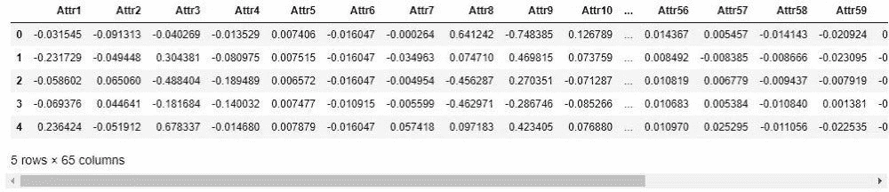
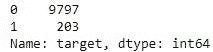
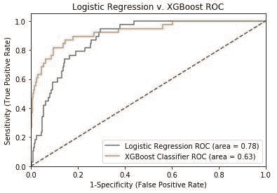
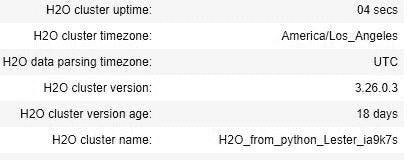
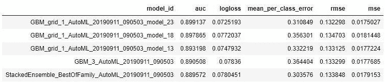
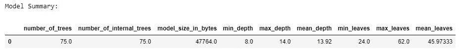
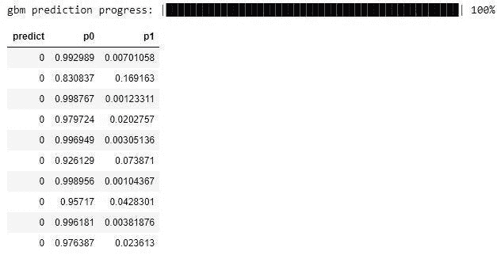
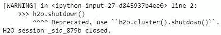

# 破产预测的简化模型调整

> 原文：<https://towardsdatascience.com/streamline-model-tuning-on-bankruptcy-predictions-aabbc2fe62c0?source=collection_archive---------21----------------------->


大家好，今天的主题是关于使用 sklearn、xgboost 和 h2o 软件包简化机器学习模型。特别是，我们将检查预测破产的波兰公司使用他们的财务报表。在我早期的机器学习建模中，我总是想知道是否有更简单的方法来调整模型。从这个问题开始，我偶然发现了自动化机器学习，我们可以通过 h2o 包访问它。这是我们要复习的内容的大纲:

1.  **为什么预测破产很重要**
2.  **为建模设置数据**
3.  **用逻辑回归和 xgboost 预测破产**
4.  **用 h2o 预测破产**
5.  **结论**

> 这篇文章的数据来自这里:[https://www.kaggle.com/c/companies-bankruptcy-forecast/data](https://www.kaggle.com/c/companies-bankruptcy-forecast/data)

# 为什么预测破产很重要

在信贷或借贷领域，破产相当重要。例如，银行贷款给企业获取利息，并期望在一定时间后得到回报。如果银行有业务没有偿还(如破产)，那么银行本身将不会盈利，必须关闭。这个小例子也有助于解释为什么不同的企业在衰退期间会合并。一旦一家公司倒下，另一家公司通常会受到影响——引起连锁反应。

在更个人的层面上，人们可以应用破产预测来更好地保护他们的股票投资组合。例如，你知道你有高风险的股票，并想知道这些公司破产的可能性？不要再看了！你可以有自己的破产预测来卖出可能变坏的股票。对于那些愿意承担更多风险的人，你也可以开发一个短期策略模型。基本上，做空是指你押注一只股票的价格将会下跌，但这被视为比押注一只股票上涨风险更大。

# 为建模设置数据

像其他 Python 代码一样，我们需要首先加载包:

```
# Load up packages
import pandas as pd
import numpy as np
import matplotlib.pyplot as plt
%matplotlib inline
from sklearn.linear_model import LogisticRegression
from xgboost import XGBClassifier
from sklearn.model_selection import train_test_split
from sklearn.metrics import roc_curve, auc, roc_auc_score
import h2o
from h2o.automl import H2OAutoML
```

接下来，我们将加载名为变量 data 的数据:

```
# Load data
data = pd.read_csv('bankruptcy_Train.csv')
```

就我个人而言，我知道这个数据集非常干净，但我们将经历一些动作:

```
# Seeing how big the dataset is
data.shape
```

(10000, 65)

上面显示了 10，000 行 65 列。这里会看到一个表格:

```
# Glancing at what some of the values are
data.head()
```



为了便于机器学习预测，一切看起来都包含在一个规范化的形式中，但是让我们检查任何空值:

```
# Checking for null values
data.isnull().values.any()
```

错误的

很好，不用担心 Nan 值。在这个数据集中，我们期望的破产输出被称为“类”我不喜欢它，所以我打算把它改名为“目标”，如下图所示:

```
data.rename(columns={'class':'target'}, inplace=True)
```

现在，我们可以为我们的模型拆分特性和输出:

```
# For features in h2o model
cont_names = data.columns[:-1]

#Setting up desired output and features for logistic regression and xgboost models
output = data[data.columns[-1]]
features = data[data.columns[:(data.shape[1]-1)]]
```

出于好奇，我们来看看数据集有多不平衡。

```
#Check the balance of outputs
output.value_counts()
```



0 表示非破产公司，1 表示破产公司。这里没有那么多破产就不足为奇了。这导致了一些棘手的情况，比如如何预测逻辑回归的数据不平衡，但由于算法的工作方式，xgboost 对它没有太大影响。幸运的是，对于逻辑回归来说，该模型有一个参数来调整阶级不平衡，我们很快就会看到！

# 用逻辑回归和 xgboost 预测破产

在所有的数据建立之后，我们终于可以开始建立破产预测的模型了。在预测模型中，标准做法是将数据分成定型集和测试集。模型将从训练集中学习，我们将看到它如何从测试集中学习。

```
#splits data into X (features) and y (predictions)
X_train, X_test, y_train, y_test = train_test_split(features, output, test_size=0.2, random_state=42)
train = pd.concat([X_train, y_train], 1)
test = pd.concat([X_test, y_test], 1)
```

因为我们想要查看两个模型(logistic 和 xgboost)，所以我设置了下面的代码来运行这两个模型，并进入相同的接收器操作特性(ROC)曲线。

```
plt.figure()# Add the models to the list that you want to view on the ROC plot
models = [
{
    'label': 'Logistic Regression',
    'model': LogisticRegression(class_weight='balanced'),
},
{
    'label': 'XGBoost Classifier',
    'model': XGBClassifier(max_depth=10, n_estimators=300),
}
]# Below for loop iterates through your models list
for m in models:
    model = m['model'] # select the model
    model.fit(X_train, y_train) # train the model
    y_pred=model.predict(X_test) # predict the test data
# Compute False postive rate, and True positive rate
    fpr, tpr, thresholds = roc_curve(y_test, model.predict_proba(X_test)[:,1])
# Calculate Area under the curve to display on the plot
    auc = roc_auc_score(y_test,model.predict(X_test))
# Now, plot the computed values
    plt.plot(fpr, tpr, label='%s ROC (area = %0.2f)' % (m['label'], auc))
# Custom settings for the plot 
plt.plot([0, 1], [0, 1],'r--')
plt.xlim([0.0, 1.0])
plt.ylim([0.0, 1.05])
plt.xlabel('1-Specificity (False Positive Rate)')
plt.ylabel('Sensitivity (True Positive Rate)')
plt.title('Logistic Regression v. XGBoost ROC')
plt.legend(loc="lower right")
plt.show()
```

对于 ROC 曲线，数值越高，模型越好。把 ROC 曲线想象成一种更好的衡量分类问题准确性的形式。它将真阳性(实际预测为目标变量)和假阳性(预测但不是实际目标变量)比率绘制到一个模型性能统计数据中。



在我们的例子中，在给定的设置下，逻辑回归比 xgboost 更好。但是鉴于 xgboost 像几乎所有 Kaggle 比赛一样获胜的历史，我们知道 xgboost 可以做得更好。对于模型调整来说，这也是一种更简单的方法。

# 用 h2o 预测破产

这就是 h2o 的乐趣所在——为我们的机器学习模型增加自动化！

```
# starting up h20
h2o.init()
```



您将看到类似上面列表的内容，只是时间更长。这只是意味着你的 h2o 的东西工作。有些人可能需要安装 Java，但是 h2o 会告诉你。现在我们可以开始训练了(在训练一小时的时候喝杯茶):

```
# Training phase set up
data = h2o.H2OFrame(train)

# Setting up features and output for h2o models
data['target'] = data['target'].asfactor()
y = "target"
cont_names = cont_names.tolist()
x = cont_names

# Setting up max time of model training
aml = H2OAutoML(max_runtime_secs= 3600, max_models=60, sort_metric='AUC')
aml.train(x = x, y = y, training_frame = data)

# Displaying best models built
lb = aml.leaderboard
lb.head(rows=lb.nrows)
```



上表向我们展示了 h2o 为我们打造的前 5 款产品。前 4 名显示了所有的梯度增强模型(xgboost 属于该类型的模型)，第五名是堆叠集成模型。堆叠集成基本上是一堆用来一起预测的机器学习模型。相比之下，我们的 GBM 模型只是一种单一类型的机器学习模型。

不管怎样，让我们用我们最好的 GBM 模型做一些预测，看看 ROC 分数。

```
# Creating Predictions of best model
hf = h2o.H2OFrame(test)
preds = aml.predict(hf)
preds = preds.as_data_frame()
preds['p_p0'] = np.exp(preds['p0'])
preds['p_p1'] = np.exp(preds['p1'])
preds['sm'] = preds['p_p1'] / (preds['p_p0'] + preds['p_p1'])

# ROC score of best model
roc_auc_score(y_test, preds['sm'])
```

0.887

好吧，ROC 得分 0.89 击败了我们上面的逻辑模型 0.78——耶！对于那些对 h2o 模型的设置感兴趣的人，我们可以这样看它:

```
# Settings of best model
aml.leader.summary()
```



最酷的是，如果你的工作不允许 h2o 包，但允许底层模型，那么你可以复制设置！另一件要注意的事情是，你可以保存你的模型，以后再加载它，以节省训练时间。

```
# Saving model for future use
h2o.save_model(aml.leader, path = "/model_bankrupt", force=True)
```

' c:\ \ model _ 破产\ \ GBM _ grid _ 1 _ AutoML _ 2019 09 11 _ 090503 _ model _ 23 '

```
# Loading model to avoid training time again
saved_model = h2o.load_model('C:\\model_bankrupt\\GBM_grid_1_AutoML_20190911_090503_model_23')
```

一旦加载了模型，您就可以使用它进行预测，如下面的代码所示:

```
# Examlple on how to predict with loaded model
saved_model.predict(hf)
```



让我们回顾一下如何读取上面的输出。到达行是来自测试集的预测。第一列“预测”显示模型预测的内容。在我们的例子中，0 表示没有破产。p0 是模型认为预测应该为 0 的概率，而 p1 是模型认为第一行应该破产的概率。所以，我们的 GBM 模型认为第一家测试公司 99%不会破产。很酷，对吧？

最后，不要忘记关闭你的 h2o 会话:

```
# Closing an h2o session after use
h2o.shutdown()
```



# 结论

太棒了，我们在这篇文章中做了很多事情！首先，我们讨论了破产的重要性，以及如何将这个模型应用到我们自己的个人投资组合中。接下来，我们从 Kaggle 加载了破产的波兰公司的数据集。第三，我们应用了逻辑回归和 xgboost 来获得一些模型表现的基线。最后，我们通过引导 h2o 的流线型力量，自动化了一个更好的预测模型！

希望你喜欢这个小教程，下次再见！

免责声明:本文陈述的所有内容均为我个人观点，不代表任何雇主。投资带有严重的风险，在采取任何投资行动之前，请咨询您的投资顾问。