# Streamlit 101:深入介绍

> 原文：<https://towardsdatascience.com/streamlit-101-an-in-depth-introduction-fc8aad9492f2?source=collection_archive---------3----------------------->


Streamlit app with code

## 使用 Airbnb 纽约数据深入了解 Streamlit

[Streamlit 是一个令人敬畏的新工具](https://streamlit.io/)，它允许工程师围绕他们的数据、机器学习模型和几乎任何东西快速构建高度交互式的网络应用。

Streamlit 最大的优点是它不需要任何 web 开发知识。如果你懂 Python，你就可以开始了！

[这是本教程的完整代码](https://github.com/shaildeliwala/experiments/blob/master/streamlit.py)，如果你想继续学习本教程的话。

# 为什么细流是超级酷的

一句话:它给了你一个*惊人的*快速、迭代和交互式的开发循环。

分割你的屏幕，使你的代码编辑工具在一半，你的浏览器在另一半，编辑你的代码，并看到你的应用程序即时更新！关于 Streamlit，我最喜欢的部分是它如何在几个小时内让您从 Jupyter 笔记本变成一个值得向客户展示的时尚 web 应用程序。

# 设置它

安装步骤:

```
$ pip install streamlit
$ streamlit hello
```

进口:

```
import pandas as pd
import streamlit as st
import plotly.express as px
```

要运行您的 Streamlit 应用程序:

```
$ streamlit run app.py
```

# 获取 Airbnb 纽约房源数据

Airbnb 没有正式发布任何数据。Airbnb 内部的另一个名为[的小组](http://insideairbnb.com/)定期发布 Airbnb 房源并审核数据。

```
**@st.cache**
defget_data():
    url = "http://data.insideairbnb.com/united-states/ny/new-york-city/2019-09-12/visualisations/listings.csv"
    return pd.read_csv(url)df = get_data()
```

## 数据缓存

`st.cache` decorator 表示 Streamlit 将执行内部魔术，这样数据将只下载一次并缓存以备将来使用。

在幕后，Streamlit 跟踪函数名、函数体中的代码以及我们在函数调用中传递的输入参数。在第一次调用时，它将函数的返回值存储在本地缓存中。在随后使用完全相同的参数调用该函数时，Streamlit 从本地缓存返回结果。

Streamlit 数据缓存的主要限制是它不能跟踪函数体外部发生的数据更改。

# 以标题(和引用)开始

```
**st.title**("Streamlit 101: An in-depth introduction")
**st.markdown**("Welcome to this in-depth introduction to [...].")**st.header**("Customary quote")
**st.markdown**("> I just love to go home, no matter where I am [...]")
```

上面的代码呈现了以下内容。


Title, section header, and Markdown content rendered by Streamlit

[st.title](https://streamlit.io/docs/api.html#streamlit.title) 适合主标题。对于章节标题，使用[第一标题](https://streamlit.io/docs/api.html#streamlit.header)或[第二标题](https://streamlit.io/docs/api.html#streamlit.subheader)。

[st.markdown](https://streamlit.io/docs/api.html#streamlit.markdown) 呈现使用 [Github 风格的 Markdown](https://github.github.com/gfm) 编写的任何字符串。它也支持 HTML，但 Streamlit 建议不要允许，因为存在潜在的用户安全问题。

# 数据一览

这是我们开始探索性分析时通常做的第一件事。 [st.dataframe](https://streamlit.io/docs/api.html#streamlit.dataframe) 渲染熊猫数据帧。

```
**st.dataframe**(df.head())
```

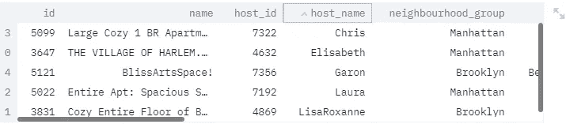

Pandas dataframe rendered using [streamlit.dataframe](https://streamlit.io/docs/api.html#streamlit.dataframe)

我喜欢它允许在点击任何列标题时对数据帧进行排序(注意 *host_name* 标题中的小 v 形符号)。

右上角有一个方便的小按钮，可以切换到全屏视图。非常适合查看较大的数据框，无需过多滚动。

它还支持[样式的](https://pandas.pydata.org/pandas-docs/stable/user_guide/style.html)数据帧。

# 代码块

[st.code](https://streamlit.io/docs/api.html#streamlit.code) 渲染单行和多行代码块。还有一个指定编程语言的选项。

```
st.code("""
@st.cache
def get_data():
    url = "http://data.insideairbnb.com/[...]"
    return pd.read_csv(url)
""", language="python")
```

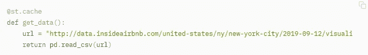

Code rendered using [*streamlit.code*](https://streamlit.io/docs/api.html#streamlit.code)

或者，使用一个`with [st.echo](https://streamlit.io/docs/api.html#streamlit.echo)`块执行其中的代码，并将其作为应用程序中的一个代码段。

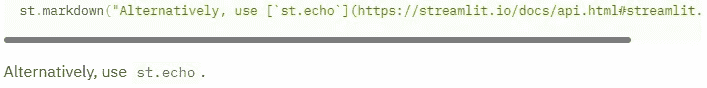

Code rendered using [streamlit.echo](https://streamlit.io/docs/api.html#streamlit.echo)

# 纽约最贵的 Airbnb 房源

Airbnb 最贵的房产都在哪里？

## 在地图上

[st.map](https://streamlit.io/docs/api.html#streamlit.map) 在地图上显示位置，无需编写一行样板代码来准备地图对象。唯一的要求是 dataframe 必须包含名为 *lat* / *latitude* 或*lon*/*longitude*的列。

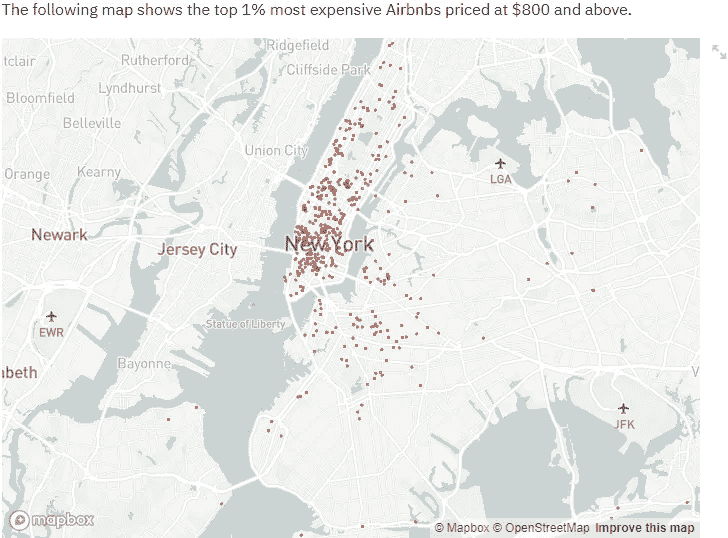

[Streamlit map](https://streamlit.io/docs/api.html#streamlit.map) with markers based on latitude and longitude

不出所料，曼哈顿岛是昂贵的航空公司最集中的地方。一些分散在布鲁克林。最贵的标价是 10000 美元。

[st.deck_gl_chart](https://streamlit.io/docs/api.html#streamlit.deck_gl_chart) 允许更多参数创建更有趣的定制地图。

# 选择列的子集

Streamlit 有一个 [multiselect](https://streamlit.io/docs/api.html#streamlit.multiselect) 小部件，允许从项目列表中选择或删除项目。这让我们可以为 dataframe 构建一个列选择器小部件。

```
cols = ["name", "host_name", "neighbourhood", "room_type", "price"]
st_ms = st.multiselect("Columns", df.columns.tolist(), default=cols)
```

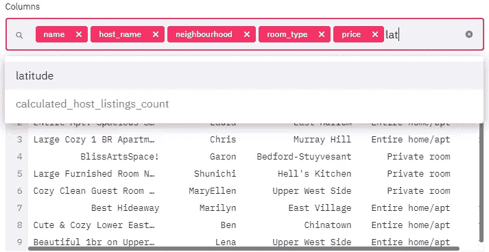

[Streamlit multi-select](https://streamlit.io/docs/api.html#streamlit.multiselect) widget with auto-completion

multiselect 小部件是 Streamlit 中最强大、最方便的工具之一。除了列选择之外，还有一个用途是基于列的一个或多个值来过滤数据帧。另一种方法是根据不同模型的预测，为并排比较 ROC 曲线选择支线图。

# 按房间类型划分的平均价格

哪种房型平均最贵？

## 在静态表中

[st.table](https://streamlit.io/docs/api.html#streamlit.table) 显示一个静态表。但是，您不能通过单击列标题对其进行排序。

```
**st.table**(df.groupby("room_type").price.mean().reset_index()\
.round(2).sort_values("price", ascending=False)\
.assign(avg_price=lambda x: x.pop("price").apply(lambda y: "%.2f" % y)))
```

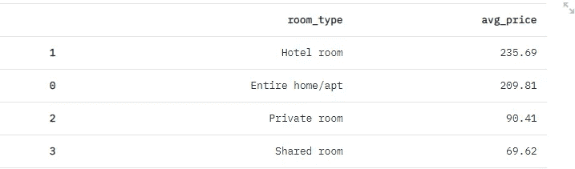

[Static table](https://streamlit.io/docs/api.html#streamlit.table) rendered by Streamlit

# 哪些主机列出的属性最多？

Sonder (NYC) 以 387 个房产列表位居榜首。Blueground 排名第二，有 240 个条目。下面是从使用`[st.json](https://streamlit.io/docs/api.html#streamlit.json)`呈现为 JSON 的两个清单中随机选择的清单。

Streamlit 呈现完全交互式的 JSON 部分，支持折叠/展开对象和数组，以及复制到剪贴板功能。

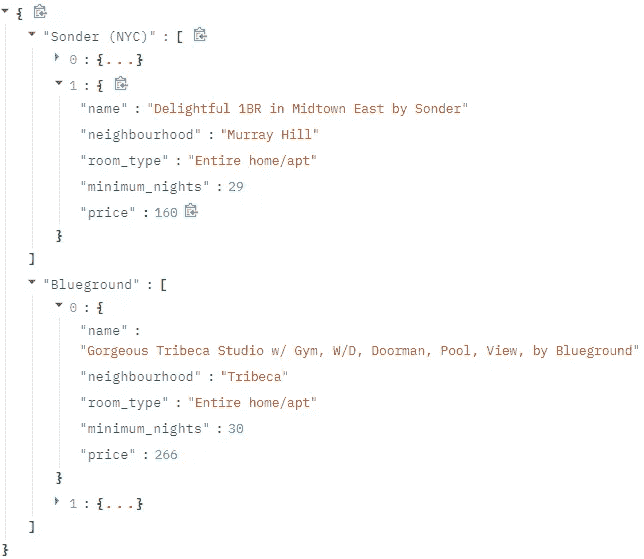

[JSON section](https://streamlit.io/docs/api.html#streamlit.json) rendered by Streamlit

# 房产价格分布是怎样的？

我们使用 [st.plotly_chart](https://streamlit.io/docs/api.html#streamlit.plotly_chart) 将房地产价格直方图显示为 Plotly 图表。

## 边栏和价格范围滑块

我们使用 [st.slider](https://streamlit.io/docs/api.html#streamlit.slider) 来提供一个滑块，允许选择直方图的自定义范围。我们把它藏在一个侧边栏里。

```
values = **st.sidebar.slider**(“Price range”, float(df.price.min()), 1000., (50., 300.))
f = px.histogram(df.query(f”price.between{values}”), x=”price”, nbins=15, title=”Price distribution”)
f.update_xaxes(title=”Price”)
f.update_yaxes(title=”No. of listings”)
**st.plotly_chart**(f)
```

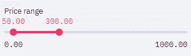

In the sidebar

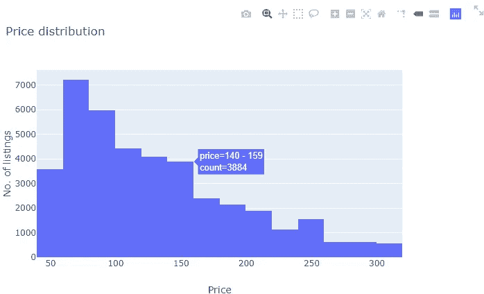

On the main page

最高的条形对应于 60-79 美元的价格范围，有 7229 个列表。

*注意:在本教程中，我将滑块的最大值限制为 1000，这样范围选择就会清晰可见。*

# 不同社区的可用性分布

`availability_365`表示酒店全年可用的天数。我们按邻居组检查`availability_365`的汇总统计数据。

使用 [st.radio](https://streamlit.io/docs/api.html#streamlit.radio) ，我们显示一个可供选择的邻居组列表。默认情况下，我们排除价格≥200 美元的物品，并使用 [st.checkbox](https://streamlit.io/docs/api.html#streamlit.checkbox) 提供一个*包含昂贵物品*复选框。

st.write 是一种伞状函数，接受字符串、数据帧、字典、绘图、地图等等(文档中的完整列表)。它允许传入多个参数，其行为取决于它们的类型。

```
**st.write**("Using a radio button restricts selection to only one option at a time.")
neighborhood = **st.radio**("Neighborhood", df.neighbourhood_group.unique())
show_exp = **st.checkbox**("Include expensive listings")
```


[Radio group](https://streamlit.io/docs/api.html#streamlit.radio) and [checkbox](https://streamlit.io/docs/api.html#streamlit.checkbox) rendered by Streamlit

169 天，布鲁克林的平均可用性最低。斯塔滕岛的平均可用性最高，为 226。如果我们包括昂贵的清单(价格> = 200 美元)，这个数字分别是 171 和 230。

***注意:*** *有 18431 条记录带有* `*availability_365*` *0(零)，我已经忽略了。*

## 按邻居组列出的平均可用性

[st.pyplot](https://streamlit.io/docs/api.html#streamlit.checkbox) 渲染使用 matplotlib 构建的地块，如下图所示。

```
df.query("availability_365>0")\
.groupby("neighbourhood_group")\
.availability_365.mean()\
.plot.bar(rot=0)\
.set(title="Average availability by neighborhood group",
xlabel="Neighborhood group", ylabel="Avg. availability (in no. of days)")
**st.pyplot**()
```

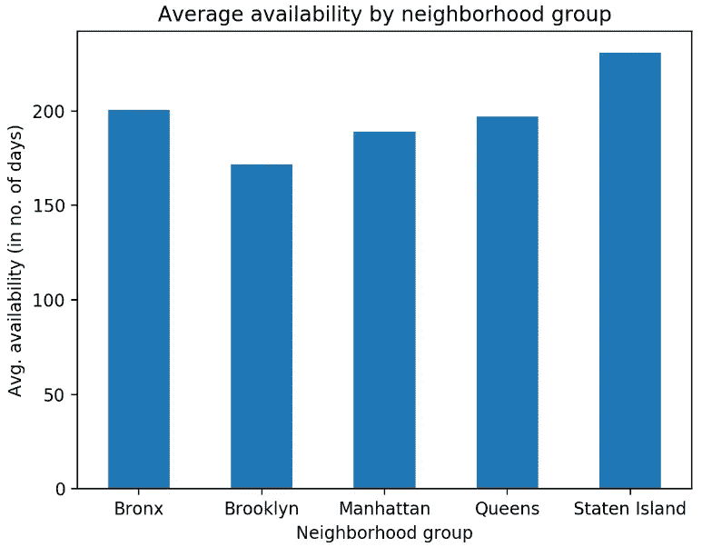

Created with pandas (matplotlib)

# 评论数量

我们希望查看评论数量在我们可以自定义的范围内的属性。

在侧栏中，我们使用 [st.number_input](https://streamlit.io/docs/api.html#streamlit.number_input) 提供了一个数字范围选择器。如果`minimum` > `maximum`，我们使用 [st.error](https://streamlit.io/docs/api.html#streamlit.number_input) 显示错误信息。

```
minimum = **st.sidebar.number_input**("Minimum", min_value=0)
maximum = **st.sidebar.number_input**("Maximum", min_value=0, value=5)
if minimum > maximum:
    **st.error**("Please enter a valid range")
else:
    df.query("@minimum<=number_of_reviews<=@maximum")
```

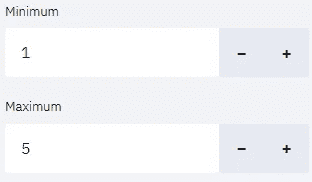

486 是最高评论数。两个列表有这么多评论。两家都在东埃尔姆赫斯特街区，都是价格分别为 65 美元和 45 美元的私人房间。一般来说，超过 400 条评论的列表价格低于 100 美元。有几款在 100 美元到 200 美元之间，只有一款定价在 200 美元以上。

# 图像和下拉菜单

使用 [st.image](https://streamlit.io/docs/api.html#streamlit.image) 显示猫、小狗、特征重要性图、标记视频帧等的图像。

现在来点好玩的。

```
pics = {
    "Cat": "https://cdn.pixabay.com/photo/2016/09/24/22/20/cat-1692702_960_720.jpg",
    "Puppy": "https://cdn.pixabay.com/photo/2019/03/15/19/19/puppy-4057786_960_720.jpg",
    "Sci-fi city": "https://storage.needpix.com/rsynced_images/science-fiction-2971848_1280.jpg"
}
pic = **st.selectbox**("Picture choices", list(pics.keys()), 0)
**st.image**(pics[pic], use_column_width=True, caption=pics[pic])
```

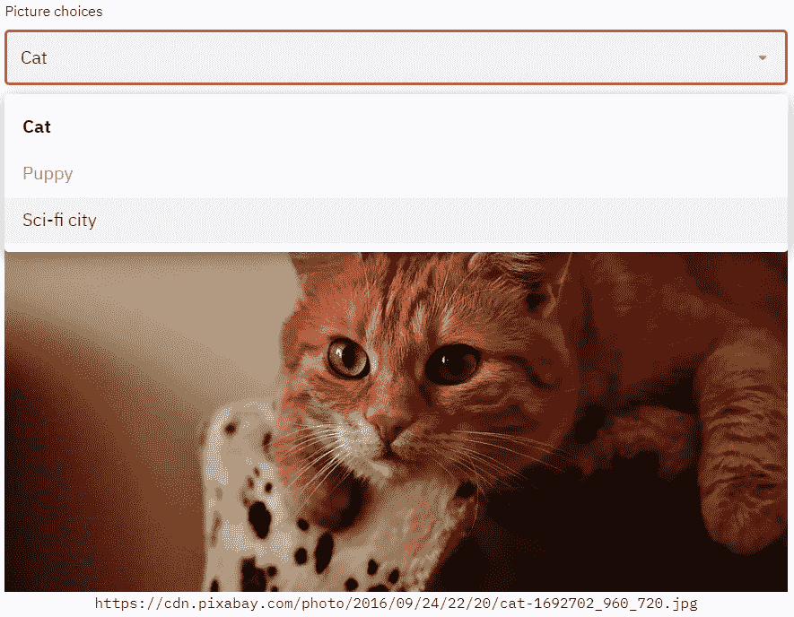

Cat image source: [https://cdn.pixabay.com/photo/2016/09/24/22/20/cat-1692702_960_720.jpg](https://cdn.pixabay.com/photo/2016/09/24/22/20/cat-1692702_960_720.jpg)

# 魔法

请注意，在上面的评论数量部分，我们将`df.query("@minimum<=number_of_reviews<=@maximum")`写在了它自己的一行上，而没有将其包装在对`st.dataframe`的调用中。这仍然呈现了一个数据帧，因为 [Streamlit 在其自己的行上检测到](https://streamlit.io/docs/api.html#magic-commands)一个变量或文字，并使用`st.write`来呈现它。

# 结论

我们已经讨论了交互式小部件、数据框、表格、图像、降价、绘图渲染、地图和文本内容。Streamlit 允许对现有元素和显示进度的[进行](https://streamlit.io/docs/getting_started.html#show-progress)[修改，这在本教程中没有涉及。例如，您可以向现有表格中添加行，或者向图表中添加新数据。您还可以显示长时间运行的进程的进度条。](https://streamlit.io/docs/api.html#mutate-data)

恭喜，您已经准备好开始构建自己的 Streamlit 应用程序。

# 派对时间！

当你运行为这个教程创建的[应用时，点击 ***庆祝！*** 按钮由下面的代码呈现。](https://github.com/shaildeliwala/experiments/blob/master/streamlit.py)

```
**st.markdown**("## Party time!")
**st.write**("Yay! You're done with this tutorial of Streamlit. Click below to celebrate.")
btn = **st.button**("Celebrate!")
if btn:
    **st.balloons**()
```

# 下一步是什么？

我的下一篇文章将是关于我在 Kaggle 上的沃尔玛购物旅行类型分类竞赛中获得银牌(排名 35 /前 4%)的解决方案。

# 参考和链接

*   为本教程创建的 Streamlit 应用的完整代码:[https://github . com/shaildeliwala/experiments/blob/master/Streamlit . py](https://github.com/shaildeliwala/experiments/blob/master/streamlit.py)
*   出自[Streamlit 联合创始人 Adrien Treuille](https://medium.com/u/39dfc90d7a34?source=post_page-----fc8aad9492f2--------------------------------):[https://towardsdatascience . com/coding-ml-tools-like-you-code-ml-models-ddba 3357 eace](/coding-ml-tools-like-you-code-ml-models-ddba3357eace)
*   Streamlit API 文档:[https://streamlit.io/docs/api.html](https://streamlit.io/docs/api.html#streamlit.slider)
*   Streamlit 教程:[https://streamlit.io/docs/tutorial2/](https://streamlit.io/docs/tutorial2/)
*   Streamlit 演示视频:[https://youtu.be/B2iAodr0fOo](https://youtu.be/B2iAodr0fOo)
*   Airbnb 纽约房源数据(非官方):[http://data . inside Airbnb . com/United-States/ny/new-York-city/2019-09-12/visualizations/listings . CSV](http://data.insideairbnb.com/united-states/ny/new-york-city/2019-09-12/visualisations/listings.csv)
*   Plotly 直方图文档:[https://plot.ly/python/histograms/](https://plot.ly/python/histograms/)