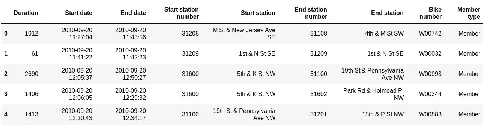
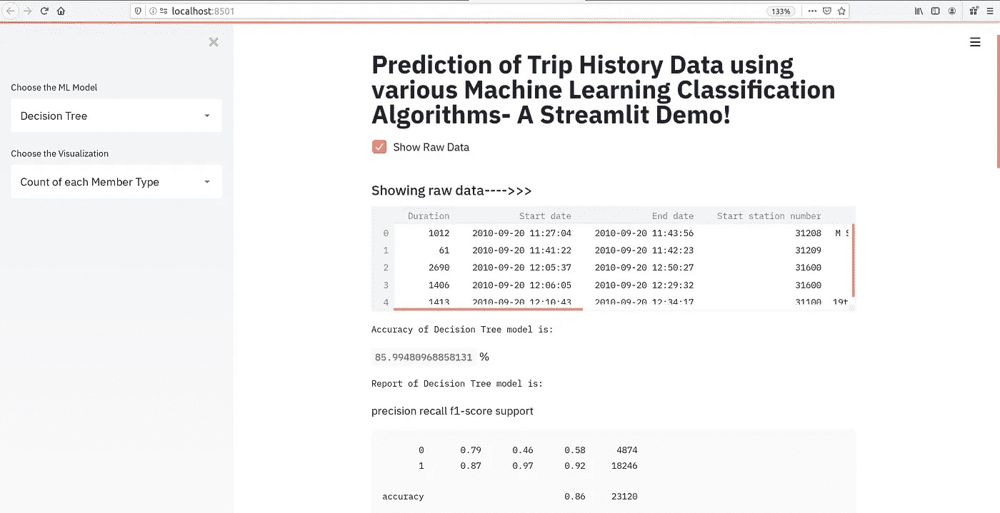
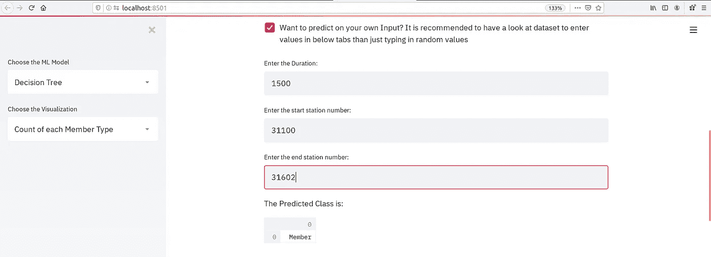
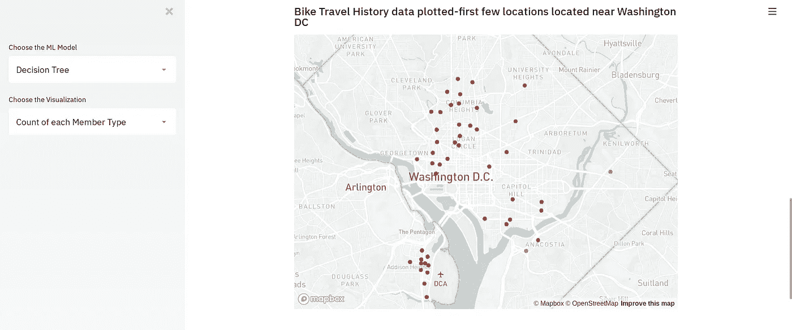
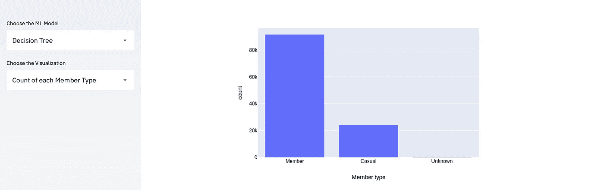

# Streamlit-部署机器学习模型，无需学习任何 web 框架。

> 原文：<https://towardsdatascience.com/streamlit-deploy-a-machine-learning-model-without-learning-any-web-framework-e8fb86079c61?source=collection_archive---------13----------------------->

# 用一个演示项目来解释-

对于许多人来说，从事一个实际的数据科学项目，然后花更多的时间在 web 框架、后端和前端上工作是非常令人厌倦的。对于数据科学家或机器学习工程师来说，研究这些技术是次要任务。所以问题是，在没有学习 flask(一个非常著名的最小 python 框架)的情况下，如何部署 ML 模型呢？在这篇博客中，我将向您展示最有用的工具，即 Streamlit，它可以帮助您专注于数据科学家的工作。但是，它将负责您的模型的部署，您的模型可以作为工作的 web 应用程序发布。

让我们了解一下 streamlit 工具对于像你我这样的 ML/数据科学从业者部署我们的模型是如何有用的。我们将使用著名的 [**首都自行车共享数据集**](https://www.capitalbikeshare.com/system-data) ，并实现各种分类算法来确定用户的会员类型，无论他/她是**会员、临时会员还是未知的**。在开始之前，让我告诉你们，我是一个博客新手，因为我没有写太多的习惯，这也是我的第一个博客。所以，请原谅我可能犯的任何错误。我会尽可能简单地解释，所以在阅读这篇文章时请耐心等待。您应该了解基本的 python 编程语言，并且通过 scikit-learn 库了解一点实现 ML 算法的工作知识就足以理解这个项目。

要开始使用 Streamlit，您需要使用 **pip 在您的系统上安装它。在您的终端/cmd 上键入" $ **pip install streamlit"** 。对于 Linux 和 Windows 用户，该命令是相同的。**

让我们从导入几个**库**和 streamlit 开始，如下所示:

**Import Libraries**

我们将训练决策树、神经网络和 KNN 分类器模型来预测用户的成员类型。看看我们数据集的一个实例:

**Capital Bike Share Dataset**

现在，让我们从定义我们的 **main()** 函数开始，在这里我们将调用其他函数来对我们的数据集执行预处理并调用我们的 ML 模型。

**Main function beginning**

在上面的代码片段中， **st.title()** 是一个 streamlit 函数，它帮助显示我们项目的标题。它将在您的 web 应用程序上显示为标题，一旦您在本地系统上运行此 streamlit 代码，它将自动部署在本地主机上。要运行 Streamlit 代码，移动到您的代码所在的目录，并在您的终端或 cmd 上键入**Streamlit run your _ file _ name . py**，它将在 localhost:8501 上运行您的 web 应用程序。

现在，我们必须通过调用我们的用户定义函数 **loadData()** 来加载数据集。然后我们会进行预处理，通过调用**预处理()**函数(loadData()和预处理()函数的片段如下所示)将数据拆分成训练和测试数据。函数 **st.checkbox()** 也是一个 streamlit 函数，有助于在 web 应用程序上启用复选框小部件。因此，当用户单击复选框时，将调用 **st.write()** 函数，从而在我们的应用程序中弹出数据集的一个实例。

看看函数 **loadData()** 和**预处理()**:

**Loading and Preprocessing Dataset**

streamlit 最有趣也是最有用的功能在上面的代码中有介绍，即 **@st.cache** 。它有助于缓存在相应函数中执行的每个任务。在这里，数据集被缓存，所以下次加载时不会有延迟。现在，我们已经将独立和从属特征分别指定为 X 和 y。我们考虑的独立特征是持续时间、起点站号和终点站号。依赖特性是数据集的成员类型列，但它需要编码，因为它由分类数据组成。这里，我使用了 scikit-learn**label encoder()**，但是您可以使用您选择的任何编码器。最后，我们将使用 scikit-learn 库的 **train_test_split()** 方法将数据分成训练和测试数据集。

现在我们已经准备好了训练和测试数据，让我们实现 ML 算法，并在我们的 web 应用程序上显示结果。

首先，我们将让用户使用 Streamlit 的 **st.sidebar.selectbox()** 方法从侧边栏的选择框中选择所需的 ML 模型，如下所示。

**The function call to Decision Tree Classifier**

由于这是一个带有动手项目的 streamlit 工具演示，解释 ML 算法超出了范围。所以，我希望你们有一些用 python 实现 ML 算法的知识。好吧！让我们回到上面显示的代码。如果用户选择我们的第一个模型，这是一个决策树分类器，那么 **decisionTree()** 函数(如下所示)将被调用，返回混淆矩阵和训练模型的准确性。再次使用 **st.write()** ，我们可以在我们的 web 应用程序上显示混淆矩阵和分数。

此外，如果用户想要将他的测试样本输入到模型中并得到预测，该怎么办呢？为此，我们可以在应用程序中使用复选框。如果用户点击复选框，则 **accept_user_data()** 函数(accept_user_data()函数代码如下所示)被调用，用户可以手动填充三个独立的特性。因此，模型将预测相同的成员类型。

**accept_user_data()** 函数的代码:

**Code for accepting user data needed for performing prediction on user data**

此外，我们可以通过调用构建 KNN 分类器和神经网络分类器的函数来重复同样的事情。请注意，我们刚刚讨论了对这些模型的函数调用，我们还没有看到实际模型被训练的那些函数定义。看看这些函数调用的代码片段:

**The function call to Neural Network and KNN Classifier**

其次，ML 算法将使用[***scikit-learn***](https://scikit-learn.org/stable/)库来编写，这是 python 中一个众所周知且广泛使用的机器学习库。

**决策树分类器**编写如下:

**Decision Tree Classifier Model**

在 scikit-learn 中使用 MLPClassifier 也以有点类似的方式编写了神经网络。这里，我们必须在训练模型之前缩放数据，因为这样，它会给出更准确的结果。请注意，我们已经使用 streamlit 缓存了模型，如上所述。这将有助于立即加载模型，从而减少执行中的延迟。

参见下面的**神经网络**实现:

**Neural Network Classifier Model**

类似地， **KNN 分类器模型**是使用 scikit-learn 库中的 KNeighborsClassifier 编写的:

**KNN Classifier Model**

就数据科学和机器学习领域而言，我们都知道数据可视化的重要性。

最后，让我们探索如何使用 Streamlit 在我们的 web 应用程序上展示漂亮的交互式可视化效果。

出于演示目的，我们将基于这些数据开发两个可视化工具。第一个是来自数据集的车辆的几个开始位置的可视化。Streamlit 无法在地图上直接显示地理空间点的散点图；但是，它需要数据集中的纬度和经度列。因此，我个人更喜欢使用 [***地理库***](https://geopy.readthedocs.io/en/stable/) 来解码数据集的起始位置列中存在的 1000 个地址的纬度和经度。如果你有兴趣知道我是如何解码的，那么请访问我的 [***GitHub 库***](https://github.com/ShivamBhirud/Geopy-Decoding-Address-to-fetch-Latitude-and-Longitude) 。否则，您可以从我的 GitHub 存储库中为这个项目*下载带有和不带有坐标的数据集。*

*此外， **st.map()** 函数会根据纬度和经度自动绘制世界地图以及数据点。请参见下面的示例:*

***Plotting Scatter Plot on the World Map***

*对于最后一个可视化，我们将绘制直方图来确定特定特征中每个元素的计数。例如，根据我们的数据集，有三种类型的成员。所以，我们将使用 [***plotly 库***](https://plot.ly/python/histograms/) 绘制一个直方图来查看每种类型的大概计数。让我们使用三个特征的直方图来可视化计数，即起点桩号、终点桩号和构件类型。此外，让用户使用 streamlit 选择框功能选择要查看的可视化。*

*参见下面的代码:*

***Plotly Histogram using Streamlit***

*下面是一些使用 **streamlit web 应用程序获得的惊人结果的快照:***

**

***ML Model Running***

**

***Prediction on User Input***

**

***Streamlit Map Plot***

**

***Plotly Histogram Plot***

*那可是相当可观的教程，我知道！但是，最令人兴奋的事实是，您已经学会了如何部署机器学习 web 应用程序，而无需学习 Flask 或 Django。此外，streamlit 非常容易使用，因为在这个项目中，我们刚刚进行了 33 次 streamlit 调用，其中很多都是相同类型的函数调用。我希望你喜欢这篇文章，并发现它很有帮助。如果是的话，请与你的朋友和同事分享。*

***注意:**请**不要**复制并运行代码片段，因为这可能会导致缩进错误。因此，为了节省您的时间，我将我的 GitHub 链接添加到这段代码— [***点击这里***](https://github.com/ShivamBhirud/Capital-Bike-Share-Data-Streamlit-Web-Application) ***。****

*你可以用 Streamlit 做很多很酷的事情。所以，查阅一下[***Streamlit***](https://streamlit.io/)的官方文档。*