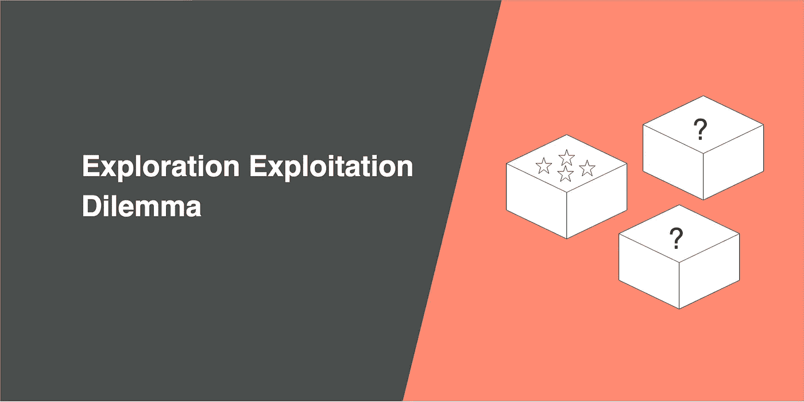
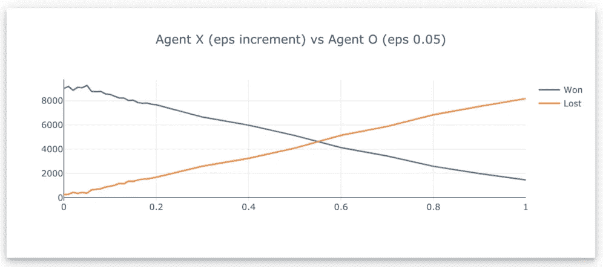
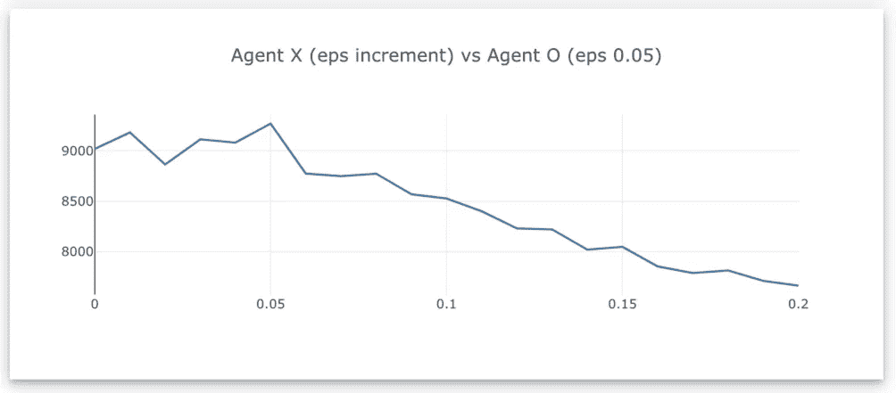
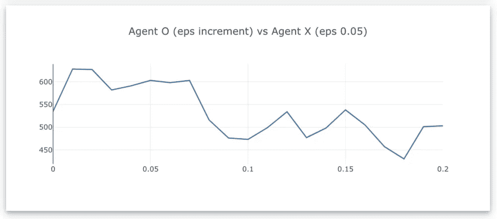
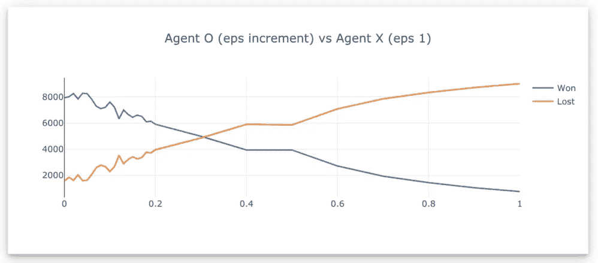
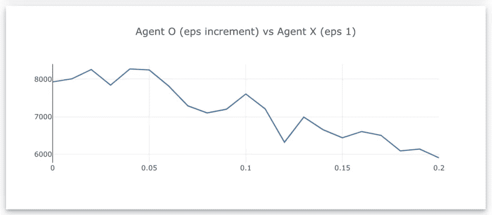
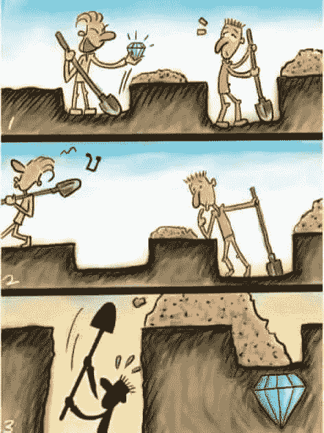

# 在探索和开发之间取得平衡

> 原文：<https://towardsdatascience.com/striking-a-balance-between-exploring-and-exploiting-5475d9c1e66e?source=collection_archive---------24----------------------->

## 强化学习中探索与利用的困境

我们的代理在学习玩井字游戏[ [Medium article](/reinforcement-learning-value-function-57b04e911152) ]时面临的探索-开发困境。这种困境是强化学习以及现实生活中的一个基本问题，当我们在选项之间做出选择时，你会选择:

*   挑选你熟悉的东西，以最大化获得你想要的东西的机会
*   或者选择一些你没有尝试过的东西，可能会学到更多，这可能会(也可能不会)让你在未来做出更好的决定

这种权衡将会影响你是尽快获得奖励，还是先了解环境再获得奖励。

# 直觉

假设你搬到了一个新城镇，你正在考虑从你的办公室到你的新家该走哪条路。你快速搜索了一下，发现有几种方法:

1.  坐地铁 A 线，跟着 B 线
2.  乘地铁 A 线，然后乘 123 路公共汽车
3.  步行到地铁 C 线，然后是 B 线

最初，您不知道哪种方式是最好的，但是您信任技术，所以选择了选项 1，因为它的持续时间最短。你设法在第一天到家，所以你决定选择 1 作为你的回家路线。你继续*利用*你所知道的有用的东西，并通过选项 1 旅行。

也许有一天，你决定去*探索*，认为从办公室回家可能有更好的方式，所以你决定尝试选项 2。结果可能是你设法在更短的时间内回到家，或者花了你更多的时间(也许还会花更多的钱)。在尝试了选项 2 之后，确实比选项 1 花了更长的时间。可能是因为在高峰时段，交通对 123 路公交车不好。所以你决定选择 2 不好。但这是否意味着你再也不会尝试第二种选择了呢？在非高峰时间，这可能是一个更好的选择。

如果选项 3 实际上是回家的最佳方式，但决定不再探索而坚持选项 1，该怎么办？那么你将永远不会意识到选项 3 比选项 1 更好。

# 取得平衡

学习做出这些选择是强化学习的一部分。这意味着有时你不得不故意决定不选择你认为最有回报的行动，以便获得新的信息，但有时在探索的过程中最终会做出一些糟糕的决定。但与此同时，你想通过*利用*你知道最有效的方法来最大化你的回报。

那么，我们如何在充分探索未知和利用最佳行动之间取得平衡呢？

*   充分的初步探索，以便确定最佳方案
*   利用最佳选择以最大化总回报
*   继续留出一个小概率来试验次优和未开发的选项，以防它们在未来提供更好的回报
*   如果这些实验选项表现良好，算法必须更新并开始选择这个选项

# ε贪婪

在强化学习中，我们可以决定要做多少探索。这是ε贪婪参数，范围从 0 到 1，它是探测的概率，通常在 5%到 10%之间。如果我们设置 0.1ε-greedy，该算法将在 10%的时间里探索随机选项，在 90%的时间里利用最佳选项。

# 评估不同的ε贪婪

我已经创建了一个[井字游戏](https://jinglescode.github.io/reinforcement-learning-tic-tac-toe/)，代理可以通过相互对抗来学习游戏。首先，让我向你介绍我们的代理人，他们是代理人 X 和代理人 o。代理人 X 总是先走，实际上比代理人 o 更有优势赢得更多的机会。

为了找出最适合这个游戏中每个代理的ε贪婪值，我将测试不同的ε贪婪值。首先，用ε贪婪值 0.01 初始化代理 X，意味着有 1%的概率代理 X 会选择*探索*而不是*利用*。然后，特工们互相对战 10000 场，我记录下 X 特工获胜的次数。在 10，000 场游戏之后，我将ε-greedy 值增加到 0.02，代理将再玩 10，000 场游戏。

代理 X (eps 增量)vs 代理 O (eps 0.05)，结果如下:

Number of games (out of 10,000) won by agent X on different epsilon-greedy value

蓝线是代理 X 赢代理 o 的次数。胜率随着ε-贪婪值的增加而降低，并在ε-贪婪值为 0.05 时达到赢得 9268 场游戏的峰值(代理 X 探索 5%的时间)。特工 O 开始赢得更多的游戏，因为特工 X 有超过 50%的时间在探索。

让我们尝试一下，代理 O 用最优的 5%ε贪婪挑战代理 X，让我们看看代理 O 在不同ε贪婪值下的表现。

Number of games won by agent O on different epsilon-greedy value

给定代理 X 具有最优ε贪婪并且在游戏中首先开始的优势，代理 O 在它能够学习游戏之前输掉了大部分游戏。

让我们把代理人 X 的 epsilon greedy 调整到 100%，代理人 X 将一直玩随机动作。

Number of games won by agent O on different epsilon-greedy value, where agent X play randomly

代理人 O 能够学习这个游戏并战胜代理人 X，在 4% epsilon greedy 时达到顶峰，在 30%时开始失败。

# 最后

探索在线演示并在井字游戏中挑战我们的代理。

只想以这张图结束。

 [## 数据科学家:21 世纪最肮脏的工作

### 40%的吸尘器，40%的看门人，20%的算命师。

towardsdatascience.com](/data-scientist-the-dirtiest-job-of-the-21st-century-7f0c8215e845) 

嗨！，我是叮当。我喜欢构建机器学习项目/产品，我在[向数据科学](https://towardsdatascience.com/@jinglesnote)写关于它们的文章。在[媒体](https://medium.com/@jinglesnote)上关注我或者在 [LinkedIn](https://www.linkedin.com/in/jingles/) 上联系我。

