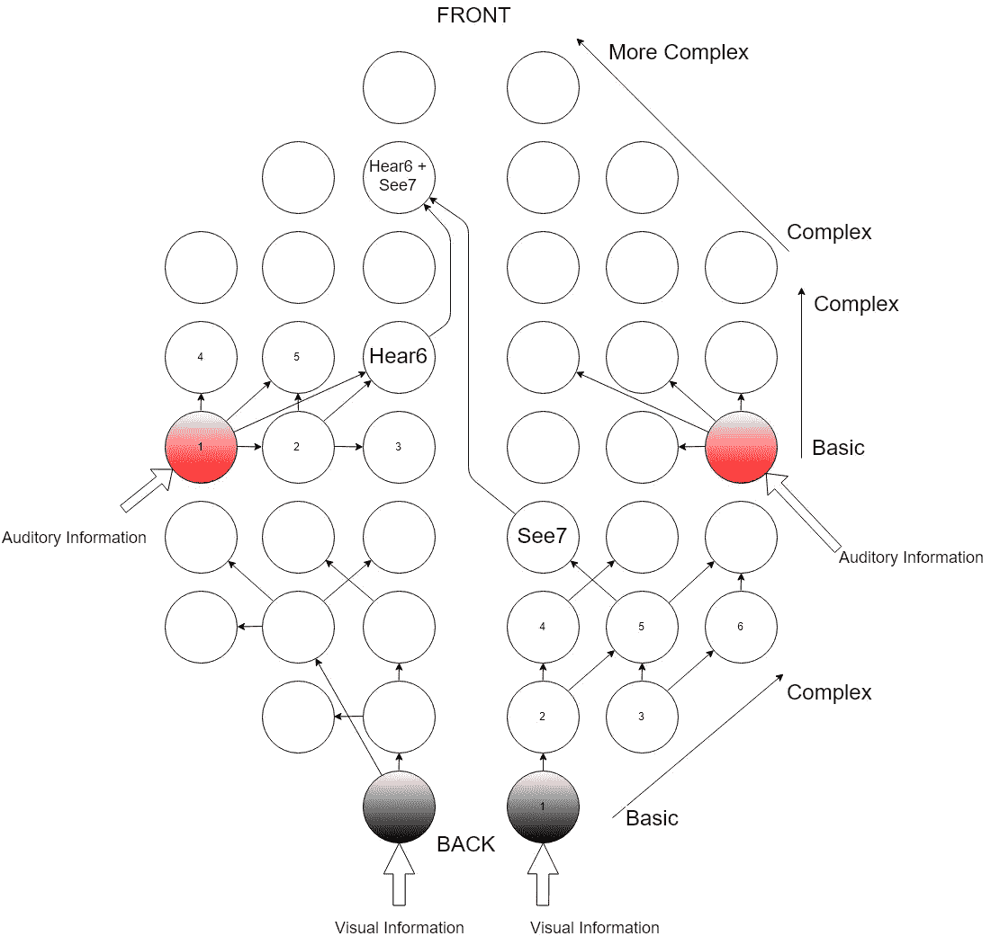
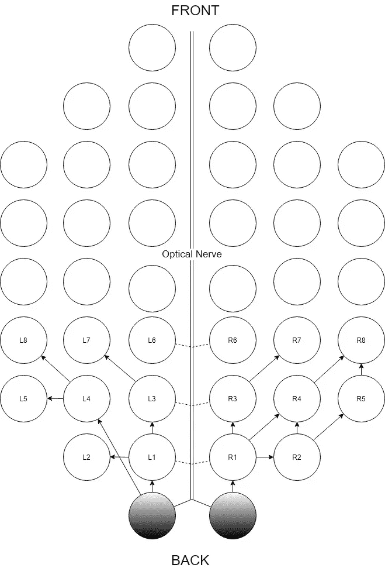
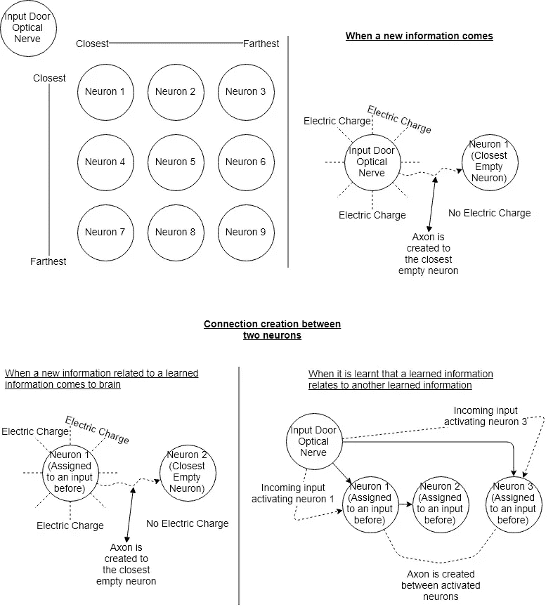

# 大脑和神经元的结构。

> 原文：<https://towardsdatascience.com/structure-of-brain-and-neurons-examination-of-rewiring-in-brain-38f5a7c0d850?source=collection_archive---------31----------------------->

## 用建议的大脑和神经元结构检查脑瘤切除。

当我们谈论大脑时，我们首先说什么？我们说它太复杂了，以至于我们仍然不能完全理解它。我将对大脑的结构做一个假设，并且，我将检验“[大脑重塑自身](https://onezero.medium.com/the-brain-that-remade-itself-bcc7b3a43cff)”中提到的情况。

Photo by [Daniel Hjalmarsson](https://unsplash.com/@artic_studios?utm_source=medium&utm_medium=referral) on [Unsplash](https://unsplash.com?utm_source=medium&utm_medium=referral)

## 神经的结构是什么？

神经只是二元开关。当它们用于一个信息时，它们是 1。不使用时为 0。它是如何发生的？当一个信息到来时，该信息被连接到离输入门最近的空神经元(0)。举一个基本的例子，让我们假设当我们看到一只狗时，一个连接并靠近视觉输入门的神经元被激活。我们看到的狗的图像被分配给那个神经元。当我们看到同一只狗处于与我们之前看到的完全相同的状态时，神经元被激活，这样我们就知道它是同一只狗。如果我们很长时间看不到那只狗会怎么样？那只狗的图像到神经元的分配被删除，这意味着我们忘记了那只狗。那么，我们如何忘记呢？

大脑中有一个遗忘规则。如果分配给一个信息的神经元长时间或以必要的频率不被激活(如果任何电流不通过该神经元)，则分配给该神经元的信息被擦除。

## 大脑的结构是什么？

首先，正如大家所说，我们有神经元和轴突。大脑只由神经元和轴突组成。在大脑的所有区域，神经元的类型完全相同。在大脑中，没有为执行特定任务而保留的特殊区域。这些场是由大脑的一般工作原理创建的，在我解释了它的结构之后，我也会解释。由于学习时间的原因，这些区域用于特定的任务。我这么说是什么意思？

第一个获得输入并将其处理到大脑的地方是传感器首次连接的地方。所以，当一个输入来临时，它首先会被放置在大脑中与输入相连的最近的空神经。

当一个婴儿出生时，它实际上感觉到的第一件事是光(婴儿不能像正常人一样看东西，它只能感觉到光)。所以，大脑的第一个输入来自眼睛。眼睛首先与大脑的后场相连。因此，婴儿获得的视觉输入开始被放置在最靠近视神经连接区域的空神经元中。

这个条件适用于人体内所有的传感器活动。听觉信息开始被放置在最靠近听觉输入门的神经元中。

## 包含复杂认知行为、决策、社会行为和个性的区域是什么？

要回答这个问题，我们先来看看哪个地方离听觉、视觉等输入门最远……答案是额叶。我们分配给神经元的第一个信息来自我们的传感器(输入门)。大脑中离这些区域最远的地方包含了负责最复杂信息的神经元。我们通过传感器获得并分配给神经元的信息是更复杂信息的基础。首先分配的神经元代表最基本的信息，而最后分配的神经元代表我们学习的最复杂的信息。

在图 1 中，大脑的结构以简化的结构示出。圆圈表示神经元，神经元之间的箭头表示轴突，用红色绘制的神经元表示被分配给第一听觉信息的第一神经元，用黑色绘制的神经元表示被分配给第一视觉信息的第一神经元，Hear6 表示包含听觉信息的神经元之一，See7 表示包含视觉信息的神经元之一，Hear6+See7 表示被分配给与 Hear6 和 See7 中的信息相关的复杂信息的神经元。

Figure 1 - An Example of Brain Structure

## 对“[再造自身的大脑](https://onezero.medium.com/the-brain-that-remade-itself-bcc7b3a43cff)中讲述的案例的检验

这个案子是关于一个男孩的。这个男孩的大脑后部有一个肿瘤。医生切除了肿瘤，切除了他大脑右半球的 1/3。手术后他可能会失明，因为被切除的区域被分配给了视力，但他没有失明。

我将从文章中提取部分内容，并通过将案例与我上面解释的大脑和神经的结构联系起来进行解释。我不会用男孩的名字，因为他的父母可能不想要。我就写“男孩”来表达他吧。

> 外科医生切除了对处理通过我们眼睛的视神经传递的信息很重要的脑叶，使我们能够看到，同时它们对识别面孔和物体以及贴上相应的名字也很关键。没有办法确定这个男孩手术后是否能再次看见，认出他的父母，甚至正常发育。

*   1)根据我的大脑结构模型，大脑被切除部分的神经会导致男孩失去信息。如果基础神经元(首先连接到输入门的神经元)被移除，男孩将在第一时间看到问题。但是过一段时间后，他的视力会在大脑的另一边发育，就像新生儿一样。分配给视觉信息的新区域将是大脑中最靠近视神经的地方。如果分配给更复杂视觉信息的神经元被移除，那么男孩的视觉不会受到显著影响，但他拥有的更复杂的视觉信息将受到影响。他可能无法识别和命名周围的物体和人。一段时间后，男孩将能够认出他的父母和物品，同时他也能正确地说出他们的名字。因为连接到分配复杂视觉信息的被移除神经元的基础视觉神经元仍然存在，男孩的大脑将使用与具有基础信息的神经元最接近(剩余)的神经元来分配复杂视觉信息。

Figure 2 — Closest Neurons to Optical Nerve (L1, L3, L6, R1, R3, R6)

> 尽管失去了超过 15%的大脑，这个男孩还是很好。
> 
> 唯一的例外是他的左眼失去了周边视觉。
> 
> “它不像是模糊的或者只是那里黑。就像，都是混合的，”男孩说。

*   2)正如我上面解释的，这个男孩会没事的。首先认识到的问题是他留下了他的周边视觉。但是周边视觉的问题并不像他说的那样是一片漆黑或者模糊。所以，他实际上没有失去视力，他的大脑只是忘记了，因为分配给这些部分的神经元被移除了。基本上，他的周边视觉就像一个新生儿的视觉。他只能从他周围的景象看到原始的视觉输入。

> 他的左脑承担了他现在基本缺失的右脑的所有责任和任务。

*   3)如上所述，被去除的神经元被分配给视觉信息。当它们被移除时，新的神经元将被用来分配这些信息。他大脑的哪一侧会被使用并不重要。大脑中最靠近视神经的神经元将被用于此。

> 大脑具有可塑性(可伪造的)改变自身的能力这一事实并不新鲜。较少了解的是大脑究竟是如何做到的。

据说大脑锻造自己的方式是未知的。按照我的大脑结构模型是怎么做到的，在第一篇里讲了。

> 男孩大脑的剩余结构能在多大程度上接管他被移除的那部分大脑的功能？

答案是肯定的。男孩大脑的剩余结构可以接管他大脑被移除部分的功能。他将和任何人一样正常。

> 科学能描述大脑如何进行这些变化，一直到细胞水平吗？

下面的图 1 解释了这些变化。

Figure 2 - How information is received and assigned to neurons

> 当男孩癫痫发作时:“我的大脑就像冻僵了一样，”他说。“我真的很困惑，然后我真的感到恶心，呕吐，然后我又会表现得很正常。”

大脑中的电活动紊乱会导致癫痫发作。神经元在没有任何输入的情况下开始随机传递电流。原因是他得了肿瘤。肿瘤细胞在大脑中产生了无计划的电活动。这就像给你的神经元一个随机输入。因此，他会感到困惑和恶心。当随机输入结束时，癫痫发作结束，他又感觉正常了。但长时间癫痫发作会导致他的神经元结构紊乱，这可能会导致永久性记忆丧失或神经元功能丧失。这就是为什么手术对他来说至关重要。

> “我们知道儿童的大脑具有可塑性，我们不断在大脑中创造新的算法来生活。但除此之外，当你癫痫发作时，这些被破坏的电网络会阻止任何有意义的重新映射。”克里斯蒂娜·帕特森说。

意义重映射有问题的原因是不平衡的电活动。如图 2 所示，就神经元的电荷而言，在神经元之间产生了新的连接。

> 手术后，男孩认出了他的父母，但他无法将他们的脸和名字对应起来。这个问题几天后就自行解决了。

看起来，这个男孩也失去了一些连接他父母名字和面孔的轴突和神经元。在图 2 中可以看到之前分配了信息的两个神经元之间的连接创建的例子。手术后，男孩失去了大脑中的这种联系。所以，他不能匹配他父母的脸和名字。

> 儿童的大脑年轻，仍在发育，因此最有可能发生神经可塑性变化。

神经元是按顺序分配的。我告诉他们，离输入门最近的神经元开始给他们分配信息。当我们变老时，我们学到的信息变得更加复杂。正因为如此，失去负责基本信息的神经元对成年人的影响可能比男孩更大。但是，如果成年人失去了分配给复杂信息的神经元(例如从额叶移除一部分)，则更容易恢复丢失的信息，同时对成年人的生活影响较小。

> 20 世纪 60 年代，科学家 David Hubel 和 Torsten Wiesel 绘制了小猫的视觉皮层，以了解视觉是如何处理的。然后，在一个公认的可怕的过程中，科学家们合上(缝合)了研究中一只小猫的眼睑。打开眼睑后，他们发现小猫大脑中负责处理来自那只眼睛的图像的视觉区域没有发育，导致小猫的那只眼睛失明，尽管这只眼睛在生物学上没有任何问题。研究人员发现，如果小猫的大脑正常发育，它们必须在出生后的第三周到第八周之间能够看到周围的世界。

正如我们所见，被缝了一只眼睛的小猫用被缝的眼睛看不清楚，但它可以很好地使用另一只眼睛。David Hubel 和 Torsten Wiesel 关闭了眼睛到大脑的输入门。因为没有输入，所以在输入门附近没有分配给视觉信息的神经元。

> 但是这项研究的另一个发现被证明更加重要——并为胡贝尔和威塞尔赢得了诺贝尔奖。“小猫的大脑中被剥夺了闭眼输入的那部分没有保持空闲，”Doidge 写道。“它已经开始处理来自睁着的眼睛的视觉输入，就好像大脑不想浪费任何‘皮质不动产’，并且已经找到了自我重组的方法。”

一段时间后，即使没有来自闭眼的输入，也需要更多的神经元来分配来自睁眼的视觉信息。最近的地方是另一个未使用的一侧，靠近闭眼的视神经。因此，他们继续从那里接受信息。

> 在男孩的案例中，问题是完整无损的左半球是否会恢复缺失的三分之一大脑的功能，特别是面部识别任务，这通常是由右半球执行的。
> 
> 通过使用被称为扩散张量成像的神经成像技术分析大脑扫描，Behrmann 发现大脑的白质(强调多个神经区域之间通信的电线)实际上发生了变化，扩散张量成像显示了水如何沿着大脑的白质束流动。之前没有连接的大脑区域产生了新的连接，这是一个神经可塑性的例子，可以保护大脑功能。但是科学家仍然不知道是什么引发了白质细胞的这种行为。

上面的段落保证了我在图 2 中展示的结构和功能。

> 在玛琳·贝尔曼对这个男孩和其他九个孩子(他们都失去了左半球或右半球的部分区域)进行的后续研究中，包括男孩在内的八个孩子显示出绝对正常的视觉功能。两个没有死的孩子在手术前由于癫痫发作造成的脑损伤更严重。

正如我上面所说，癫痫发作可能会导致永久性记忆丧失或神经元功能丧失。在无功能神经元的情况下，如果在大脑中有足够数量的健康神经元留在足够靠近输入门的地方以进行连接，则视觉信息仍然可以分配给那些健康神经元。如果不再有健康的神经元留下，或者如果剩余的健康神经元没有足够近以在神经元之间形成极性从而使它们连接，那么被剥夺的视觉信息不能被分配给新的神经元。

> 泰勒·阿贝尔和贝尔曼指出，甚至可能是这样，男孩大脑中发生的一些重组在他预定的手术之前就开始了。这不是贝尔曼能证明的，因为所有对男孩的研究都是在手术后进行的。
> 
> “当你的大脑出现异常导致癫痫发作时，这种异常实际上会导致大脑重组，或者在手术实际发生前就开始重组，”Abel 说。“但有时会发生的另一件事是，癫痫发作会影响大脑的功能，大脑不会重组。”

根据提出的神经元和大脑的结构，如果癫痫发作是局部的并且不影响整个大脑，那么靠近受癫痫发作影响的神经元的未使用的神经元可以连接到受影响神经元的基底神经元来分配信息。由此，信息被检索。

## 所有哺乳动物的大脑结构都一样吗？

答案是肯定的。结构相同，但神经元的数量与输入门结构和输出门结构(手臂、舌头、嘴、腿等)相同。)都不一样。神经元的数量只能影响分配给神经元的信息量。但是输入结构和输出结构是人类和所有其他哺乳动物的唯一区别。如果我们能够将狗的输入门改造成与人类完全相同的输入门，我们将会看到狗能够像人类一样说话。我们还需要记住，哺乳动物的输入门已经足够发达，可以像我们一样感受到痛苦和悲伤。所以，当我们想起对动物的不良行为时，会变得更加悲伤。因为对人和对动物做出那些不好的行为没有任何区别。

> 泰京·埃夫林·奥兹默默