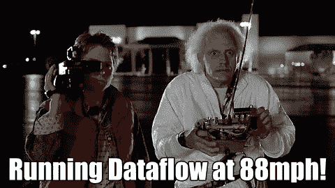

# 结构化数据预测未来，又名项目通量电容器

> 原文：<https://towardsdatascience.com/structuring-data-to-predict-the-future-aka-project-flux-capacitor-7133715d7e57?source=collection_archive---------26----------------------->

## 数据准备是一个好的机器学习(ML)模型的核心，但获得正确的数据需要时间。很多时间！不要害怕。

为了帮助传递一些知识并使您的过程更容易，我和我的团队发布了代码来支持、加速甚至改进您构建 ML 模型的方式，如倾向模型、客户生命周期价值模型、推荐系统等。

大卫、[凯西](https://www.linkedin.com/in/kathrina-rose-ondap-7842b64b)和[鲁克山](https://www.linkedin.com/in/rukshan-batuwita-3881a526/?originalSubdomain=au)为开发这一解决方案并使之成为可能而付出的努力让他们感到无比自豪。

**我们走吧！**

在幕后，代码利用[谷歌云数据流](https://cloud.google.com/dataflow/)来运行 Apache Beam 管道，并利用[谷歌云 BigQuery](https://cloud.google.com/bigquery/) 来读取和保存。将大量数据转换成 ML ready 格式的强大而快速的方法。

我们已经优化了代码，可以插入到一个 [Google Analytics BigQuery 表](https://support.google.com/analytics/answer/3437618?hl=en)中，但是如果有用的话，也可以插入到其他 BigQuery 数据源中。输入您的 BigQuery 表，运行管道，然后——瞧——输出带有结构化特征和标签的新 BigQuery 表。准备好使用你最喜欢的 ML 工具来训练一个 ML 模型，比如 AutoML-Tables，BigQuery ML，Tensorflow，Python sklearn…等等。

渴望一头扎进去？去吧…

*   在[Google cloud platform/cloud-for-marketing/…GitHub Repo](https://github.com/GoogleCloudPlatform/cloud-for-marketing/tree/master/marketing-analytics/predicting/ml-data-windowing-pipeline)中检查 ML 数据窗口管道代码。
*   说明如何使用的[自述文件](https://github.com/GoogleCloudPlatform/cloud-for-marketing/blob/master/marketing-analytics/predicting/ml-data-windowing-pipeline/README.md)的直接链接。
*   我们还发布了一个关于[为个性化准备 ML 就绪数据的 Google Cloud 教程](https://cloud.google.com/solutions/preparing-ml-ready-data-for-personalization)。

或者，**如果你能坚持听我说几分钟**，了解通量电容管道如何构建数据对于理解其价值非常重要。我试图向我的非技术伙伴(yikes)解释这种技术，所以决定在这里发表我的想法，作为一个更非官方的——希望更有趣的——解释。

**为什么要通量电容器？**

我们的正式项目名称是 ML 数据窗口管道。尽管如此，一切都需要一个有趣的名字，当我们根据过去发生的事情构建数据来预测未来时，Flux Capacitor 似乎很合适。正是这些数据让“时间旅行”成为可能，🧀。好了，先把这些劣质的东西放在一边，让我来解释一下它是做什么的。

**“医生”布朗想买辆车**

让我们考虑一个随机的人，称他为医生。在这个例子中，Doc 从我们的网站上购买了一辆新车。

Image Christopher Lloyd as Dr. Emmett Brown — Back to the Future

我们的汽车网站上有谷歌分析设置，让我们记录和查看文件的浏览活动。让我们记住，实际上我们只查看匿名指标(我们只是为了好玩才使用文档参考)。

Image made by author — User timeline of events

这是代表活动的时间线，蓝色方框表示导致购买事件的交互。每次互动都有一些我们可以从谷歌分析中获得的指标，例如浏览器、一天中的时间、访问的页面、点击量等。

让我们从一个时间快照来看这个时间线中的细节，并将该快照称为日期 d 。

Image made by author — User timeline of events from Date d

现在，关于*日期 d* ，我们可以开始回顾过去一段时间，并将文档的会话信息汇总在一起。这个定义的时间段被称为*回顾窗口*。

Image made by author — User timeline of events with Features

在这个例子中，Google Analytics 交互被聚合以创建新的指标，例如最频繁的页面、浏览器、活跃天数、总点击数等。它们代表了我们将用来训练 ML 模型的特征。

接下来，从我们的*日期 d* 开始，我们通过指定的时间量来预测未来，并将此称为*预测窗口*。

Image made by author — User timeline of events with Features and Label

因此，就数据而言，如果购买发生在相对于日期 d *和日期 d* 的*预测窗口*内，那么它发生在日期 d *和日期 d* 。换句话说，该标签基于在*预测窗口*期间是否发生了购买事件。

这是这里的关键，所以我们的模型是根据未来会发生什么以及如何预测来训练的。

Image made by author — User timeline of events with Features and Label

这代表了我们将用来训练 ML 模型的标签。

一旦我们为文档——我们的匿名用户——提取了与 d *ate d* 相关的特征和标签，我们就会在表中看到一行，如下所示:

Image made by author — User Features and Label for Date d

然后，我们为网站上的所有用户在日期*和*拍摄这些快照。

Image made by author — Users timeline of events with Features and Label

生成的表格看起来像这样:

Image made by author — Users Features and Label for Date d

然后，我们以*间隔 w* (例如，一天、一周…等)将*日期 d* 移动一个设定的滑动窗口，以针对 d + w、d + 2w…等为所有用户及时创建更多快照。

Image made by author — Users snapshots over time

随着时间的推移，通过多个快照，我们的数据集可以了解数据如何变化以适应季节性(最近和频率信息)。

**“伟大的斯科特！”**

结果。一个强大(大)的数据集，准备好训练你的 ML 模型。

最后要记住的是成本。简单运行 ML 数据窗口管道代码，比如使用 Google Analytics 样本数据集，应该是最少的。然而，生产成本将取决于您的数据大小。管道被设计为尽可能高效，但请注意[谷歌云数据流定价指南](https://cloud.google.com/dataflow/pricing)和[谷歌云平台定价计算器](https://cloud.google.com/products/calculator/)，以确保没有意外。

我希望这是有用的，我们很乐意在评论区看到你是如何应用它的。

PS。如果你从未看过电影《回到未来》，我向你道歉！因为许多这些类比/图片可能看起来有点随机。

Image Meme — Made at imgflip