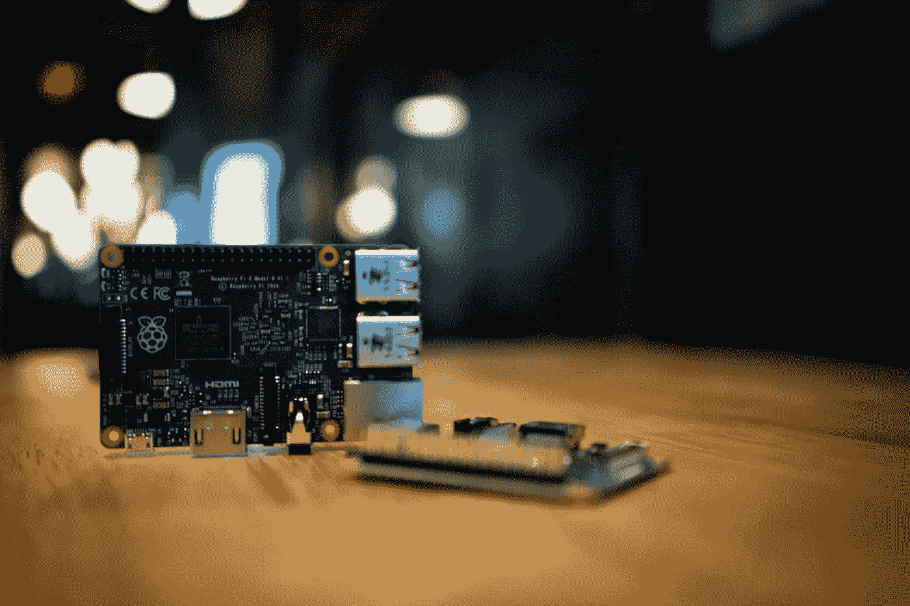

# 在 Raspberry Pi 上运行对象检测的困难

> 原文：<https://towardsdatascience.com/struggles-of-running-object-detection-on-a-raspberry-pi-fa61b50a3b9f?source=collection_archive---------19----------------------->

## 斗争是真实的！

Frustrated man (Image by [Gerd Altmann](https://pixabay.com/users/geralt-9301/?utm_source=link-attribution&utm_medium=referral&utm_campaign=image&utm_content=513525) from [Pixabay](https://pixabay.com/?utm_source=link-attribution&utm_medium=referral&utm_campaign=image&utm_content=513525))

> 你是否曾经在阅读了操作指南或 github 自述文件后兴奋不已，却发现事情并不像他们说的那么简单？

我遇到过无数这样的例子，我发现我下载的一些解决方案或者我遵循的一个教程简单地工作了，这是一个罕见的时刻。不过那一刻！如果你对此有共鸣，也有自己的故事可以分享，我很高兴听到这些*(欢迎在下面留下评论)*。

现在，我将分享我在 Raspberry Pi 上运行对象检测的奋斗故事。

我喜欢尝试新技术，并看到它的工作情况。就在一年前，我接触到了 Raspberry Pi，这是一款小型、经济的设备，你可以在上面安装摄像头和其他传感器，部署你的 python 代码，并立即看到它的工作情况。多酷啊。我立刻从 [Raspberry pi Australia 的网站](https://raspberry.piaustralia.com.au)上为自己订购了一台，配有 Pi 相机、Raspberry Pi Sense 帽子和一个小外壳，迫不及待地想玩它。

当我在接下来的一周拿到 Raspberry Pi 3 Ultimate Kit 时，我已经准备好了对象检测 python 脚本，可以在 Pi 中复制并运行它。我打开包装，取出圆周率和圆周率相机，组装好，放入黑色外壳，并连接到电源。我没有鼠标，也没有键盘，我有一台电视和一根 HDMI 电缆，这些都在树莓 Pi 套件中，所以我的第一个挑战是将其连接到互联网。我的第二个想法是将我的 python 脚本复制到 Pi 中。几个小时的研究和尝试不同的东西，人们不得不说在线，让我的 Pi 连接到互联网和 VNC 浏览器，我现在能够从我的笔记本电脑远程连接到它，并复制我的 python 脚本。

*如果你正在努力使用 wifi 将你的 Pi 连接到互联网并远程访问它，使用这个教程“* [*直接连接到你的树莓派*](https://bigl.es/friday-fun-connecting-to-your-raspberry-pi/) *”，它非常有用，简单易懂，更重要的是，它很有效！*

Raspberry Pis (Photo by [Jeff Loucks](https://unsplash.com/@jeffloucks?utm_source=unsplash&utm_medium=referral&utm_content=creditCopyText) on [Unsplash](https://unsplash.com/?utm_source=unsplash&utm_medium=referral&utm_content=creditCopyText))

如果我的程序能马上工作，我会跳上跳下，可能会在我的阳台上大喊，告诉每个人它工作了。可悲的是，没有成功。它抱怨缺少库，甚至处理一个又一个库，似乎从未停止。不知何故，我甚至在 Pi 中破坏了 pip 安装。我认为这也是许多其他开发者面临的问题，缺少依赖性，版本不受支持，平台不兼容，这个列表永远不会结束。

Error (Image by [bartekhdd](https://pixabay.com/users/bartekhdd-2657534/?utm_source=link-attribution&utm_medium=referral&utm_campaign=image&utm_content=2215702) from [Pixabay](https://pixabay.com/?utm_source=link-attribution&utm_medium=referral&utm_campaign=image&utm_content=2215702))

> 如果有一个我可以运行的脚本或程序，它会为我安装所有需要的库和依赖项，这不是很好吗？
> 
> 一定要这么难吗？

第二天，我终于在一个 Raspberry Pi 上实现了对象检测代码，它可以检测不同的对象，并在其周围绘制一个边界框。我用的是当时最先进的物体检测模型 YOLOv3 ，非常快速准确。我很开心。Yeyy！终于！

我注意到带有边界框的输出视频滞后，就像当你的互联网连接不好，而你正试图在 YouTube 上观看视频时一样。很糟糕！我很兴奋它的工作，但同时也有点失望，最快的物体检测在 Pi 上不够快。我的意思是，给我的父母或朋友看，它甚至不能做一个好的演示。

> 所以我的下一个目标是让它在圆周率上跑得更快。

经过大量的研究，我发现我并不是唯一一个在这个问题上挣扎的人，这个问题也不容易解决。事实上，这是大多数希望在边缘设备上运行对象检测的开发人员讨论的挑战之一。

> “……我们能够达到每秒 **0.9 帧**，这还不足以构成实时检测。尽管如此，考虑到 Pi 的处理能力有限，0.9 帧/秒对于某些应用来说仍然是合理的。”—计算机视觉专家和博客作者 Adrian Rosebrock 在他的一篇[博客](https://www.pyimagesearch.com/2017/10/16/raspberry-pi-deep-learning-object-detection-with-opencv/)中提到。

有一些像 SqueezeNet 和 MobileNetSSD 这样的模型，开发人员正在讨论，它们针对 Raspberry Pi 进行了优化，可以获得更好的结果，但同样，这需要一个学习曲线。我很沮丧，我不得不经历这么多麻烦来做一个我想要的小实验。如果速度是问题所在，我怎么能指望用它来实现实时解决方案呢？可能有些情况下它不需要实时处理帧，每 10-20 秒处理一帧是可以接受的，但是需要更频繁地检测物体的解决方案呢？

最终，我将 YOLOv3 的 darknet 实现用于一个预先训练好的小型 YOLOv3 模型。推理速度比我所拥有的要好，但是我对解决方案的整体性能并不满意。我有很多问题和顾虑。

> 为什么它占了这么多空间？我不能并行运行任何其他代码。
> 
> *为什么圆周率这么热？感觉随时都会炸。*
> 
> *我的 Pi 经常死机，我不得不重启它。我不知道为什么会这样，也不知道如何解决。*
> 
> *这个 Pi 到底为什么一次次重启？*

我一直在寻找一种比 YOLOv3 在树莓 Pi 上表现更好的更快的物体检测方法，直到三个月前，我发现悉尼的初创公司 Xailient 的表现超过了 YOLOv3 和 Tiny YOLOv3，并树立了一个新的基准。这对我来说是一个好消息，我知道，无论如何我必须亲自接触他们的对象检测模型并进行测试。三个月后，我来到了 Xailient *(这是另一个时间的故事)*，在 Pi 上试验当前最先进的实时物体检测。

*在 Raspberry Pi 上运行对象检测时，你遇到过哪些挑战？在下面的评论中分享你的想法。*

原载于***。***